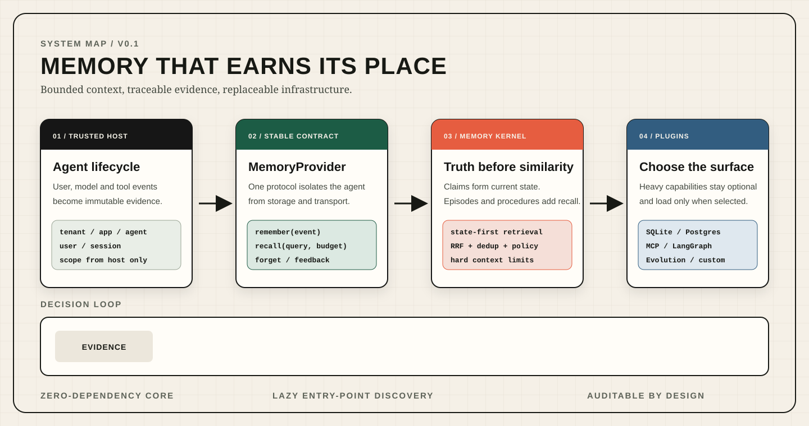
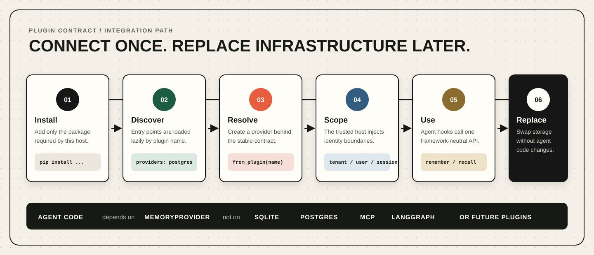

# Agent Memory

[English](README.md) | [简体中文](README.zh-CN.md)

  

一个轻量、可插拔、证据可追溯的 AI Agent 记忆层。

Agent Memory 将 Agent 运行过程中产生的原始事件，转换成有边界、可验证、可追溯的下一步决策上下文。系统明确区分当前事实、历史经验、可复用流程和实验性自进化能力，避免记忆无限膨胀、事实互相冲突或实验策略直接污染线上行为。

> 当前状态：**v0.1 MVP**。本地 SQLite 内核、插件协议、MCP 适配器、Python SDK、LangGraph 适配器和受控自进化基础能力已经实现。当前版本尚不建议直接用于生产环境。

## 为什么需要 Agent Memory

常见的 Agent 记忆方案通常从向量检索开始，也在向量检索结束：

~~~text
对话 -> 文本切块 -> 向量化 -> Top-K 上下文
~~~

这种方式适合寻找语义相似内容，但无法独立解决以下问题：

- Agent 当前应该相信哪个事实？
- 新事实出现后，旧事实如何失效？
- 一条记忆来自哪次用户输入或工具调用？
- 每次允许多少记忆进入模型上下文？
- 多租户、应用、Agent、用户和会话之间如何隔离？
- 新学到的行为如何经过评估、灰度和回滚后再启用？

Agent Memory 使用以当前状态为优先的记忆模型：

~~~text
Agent 原始事件
      |
      v
不可变证据日志
      |
      +--> 结构化声明 ------> 当前状态
      +--> 历史片段 --------> 情景记忆
      +--> 可复用流程 ------> 程序记忆
      |
      v
受预算约束的记忆包
      |
      v
下一次模型决策
~~~

每条返回内容都保留来源证据。新事实通过版本和替代关系使旧事实失效，而不是无声覆盖。实验性流程必须经过明确的评估阶段，不能直接修改线上行为。

## 设计原则

| 原则 | 含义 |
| --- | --- |
| 协议优先 | Agent 只依赖 MemoryProvider，不绑定 SQLite、PostgreSQL、MCP 或具体框架。 |
| 本地优先 | MVP 可在进程内使用 Python 和 SQLite 运行，核心包没有运行时第三方依赖。 |
| 证据优先 | 声明、摘要和流程保留原始事件引用。 |
| 状态优先 | 当前有效事实的检索优先级高于语义相似历史。 |
| 上下文有界 | 强制限制条目数、字符数、估算 Token 数和各通道配额。 |
| 隔离由宿主管理 | 租户和用户范围由可信宿主传入，不接受模型自行指定。 |
| 自进化可控 | 候选策略必须经过离线评估、影子运行和灰度验证。 |
| 可降级 | 可选检索通道失败时，不能破坏当前状态主链路。 |

## 五分钟开始使用

### 1. 安装本地 MVP

~~~bash
git clone https://github.com/your-org/agent-memory.git
cd agent-memory
./setup.sh
~~~

只安装可编辑的核心包：

~~~bash
python -m pip install -e .
~~~

### 2. 写入并读取记忆

~~~python
import asyncio

from agent_memory import AgentMemory, MemoryScope

async def main() -> None:
    scope = MemoryScope(
        tenant_id="demo",
        namespace="support-agent",
        agent_id="assistant",
        user_id="user-42",
        session_id="session-1",
    )

    async with AgentMemory.local(
        ".agent-memory/demo.sqlite3",
        scope=scope,
    ) as memory:
        await memory.remember(
            "请优先使用电子邮件联系我。",
            event_type="user.message",
            claims=(
                {
                    "key": "contact.preference",
                    "value": "email",
                    "text": "用户偏好使用电子邮件。",
                    "scope": "user",
                    "confidence": 0.98,
                },
            ),
        )

        bundle = await memory.recall(
            "应该如何联系这个用户？",
            limit=8,
            token_budget=1_200,
        )

        for claim in bundle.current_state:
            print(claim.key, claim.value, claim.provenance.source_event_ids)

asyncio.run(main())
~~~

**AgentMemory.local()** 会创建一个带保守资源限制的可用运行时，不需要向量数据库、外部服务、模型密钥或后台任务。

## 核心记忆模型

Agent Memory 不把所有内容都存成相同的文本块，而是区分不同职责的记忆对象。

| 对象 | 作用 | 变更规则 |
| --- | --- | --- |
| Event | 保存 Agent 生命周期中的原始证据 | 只追加并支持幂等写入 |
| Claim | 从证据中提取的结构化声明 | 版本化，可替代旧声明 |
| Current State | 某个作用域当前有效的事实集合 | 由有效声明构建 |
| Episode | 已完成交互的压缩记录 | 追加并保留引用 |
| Procedure | 可以复用的行为和操作流程 | 版本化并受策略管理 |
| Decision | Agent 某次决策的记录 | 关联上下文和策略版本 |
| Outcome | 决策产生的可观察结果 | 与决策关联 |
| Reward | 对结果的评价信号 | 与策略启用流程分离 |

MemoryBundle 是这些对象经过检索、过滤和预算裁剪后的投影，不是数据库内容的直接拼接，也不是一组缺少依据的相似文本。

## 检索机制

默认检索流程保持确定性和可解释性：

~~~text
查询 + 可信作用域
      |
      +--> 当前状态通道
      +--> 语义检索通道
      +--> 情景记忆通道
      +--> 程序记忆通道
      |
      v
倒数排名融合 RRF
      |
      v
去重 + 策略过滤
      |
      v
强制预算裁剪
      |
      v
MemoryBundle（条目、引用、Token 估算）
~~~

当前状态通道优先，是因为最新的有效事实不能因为文字相似度较低而输给过期历史。RRF 用排名融合多个通道，不要求不同通道的原始分数具有相同尺度。

本地 MVP 强制执行：

- 最大返回条目数；
- 最大字符数；
- Token 数量估算；
- 各检索通道配额；
- 租户、应用、Agent、用户和会话隔离；
- 确定性排序；
- 返回内容到原始证据的引用。

## 插件化架构

  

系统的公共边界是 **MemoryProvider** 协议。存储引擎、通信方式、Agent 框架和自进化引擎都可以替换。

~~~text
Agent / 宿主应用
       |
       v
 AgentMemory 门面
       |
       v
  MemoryProvider
       |
       +--> 本地 SQLite 内核
       +--> PostgreSQL Provider
       +--> 远程 MCP Provider
       +--> 第三方自定义 Provider
~~~

插件通过 Python Entry Points 延迟发现。仅导入核心包时，不会加载数据库驱动、MCP 运行时、Agent 框架或机器学习依赖。

| 插件入口组 | 职责 |
| --- | --- |
| agent_memory.providers | 存储和检索 Provider |
| agent_memory.adapters | Agent 框架生命周期适配器 |
| agent_memory.embedders | 可选向量化实现 |
| agent_memory.rerankers | 可选重排序实现 |
| agent_memory.evolution | 候选策略生成和评估引擎 |

更换 Provider 不需要修改 Agent 业务逻辑：

~~~python
from agent_memory import AgentMemory, MemoryScope

scope = MemoryScope(
    tenant_id="acme",
    namespace="research",
    agent_id="analyst",
)

memory = AgentMemory.from_plugin(
    "postgres",
    scope=scope,
    dsn="postgresql://memory@localhost/agent_memory",
)
~~~

第三方包只需要实现协议并注册入口，不需要修改本仓库。

## 包结构

| 包 | 作用 | 是否增加核心依赖 |
| --- | --- | --- |
| agent-memory | 领域模型、本地内核、SQLite、检索、策略和插件注册 | 无运行时第三方依赖 |
| agent-memory-postgres | PostgreSQL 和 pgvector Provider | 可选 |
| agent-memory-mcp-server | MCP stdio 和 HTTP 通信层 | 可选 |
| agent-memory-python-sdk | 面向客户端的 Python 门面 | 可选 |
| agent-memory-langgraph | LangGraph 生命周期适配器 | 可选 |
| agent-memory-evolution | 受控程序记忆自进化 | 可选 |

这种拆分确保默认安装保持轻量，部署方只安装真正需要的能力。

## MCP 集成

安装 MCP 包：

~~~bash
python -m pip install -e packages/mcp-server
~~~

启动本地 stdio 服务：

~~~bash
agent-memory-mcp --transport stdio --database .agent-memory/mcp.sqlite3
~~~

MCP 服务提供六个操作：

| 工具 | 作用 |
| --- | --- |
| memory_remember | 写入事件和可选结构化声明 |
| memory_recall | 返回受预算约束的记忆包 |
| memory_get_state | 读取当前有效状态 |
| memory_forget | 按作用域和策略删除记忆 |
| memory_feedback | 记录结果或评价反馈 |
| memory_health | 返回 Provider 和协议健康状态 |

stdio 集成由宿主通过可信配置提供作用域。远程 HTTP 部署必须使用签名网关或经过身份认证的反向代理，并根据已验证身份生成作用域。不能允许模型自行选择任意租户或用户标识。

## Agent 框架集成

框架适配器只负责把生命周期事件转换成 MemoryProvider 调用，不拥有记忆语义。

| 生命周期节点 | 记忆操作 |
| --- | --- |
| 会话开始 | 解析可信作用域并打开 Provider |
| 用户、模型或工具事件之后 | 追加原始证据 |
| 模型调用之前 | 获取有界记忆包 |
| 产生结果之后 | 记录结果和反馈 |
| 会话结束 | 完成情景记忆并关闭 Provider |

仓库中的 LangGraph 包展示了这一边界。同样的方式可以接入自定义 Agent、命令行 Agent、托管运行时和其他编排框架。

## 基于记忆的受控自进化

自进化不等于允许 Agent 随意重写提示词。Agent Memory 将程序记忆的升级视为一个受治理的发布流程：

~~~text
运行观察
   -> 候选流程
   -> 离线评估
   -> 影子运行
   -> 小流量灰度
   -> 正式启用
          |
          +-> 回滚
~~~

MVP 的安全约束包括：

- 自进化默认关闭；
- 候选流程不能直接进入启用状态；
- 评估证据必须持久化；
- 策略版本必须明确；
- 启用和回滚过程可审计；
- 确定性规则始终作为回退路径；
- 潜在表示或学习策略不能替代事实状态源。

这样可以形成从任务轨迹到行为改进的路径，同时避免实验记忆无声控制线上决策。

## 能力完成度

| 能力 | 状态 | 说明 |
| --- | --- | --- |
| 不可变事件写入 | 已实现 | 支持幂等事件键 |
| 结构化声明和当前状态 | 已实现 | 支持来源和替代关系 |
| 情景记忆 | 已实现 | 摘要保留证据引用 |
| 程序记忆 | 已实现 | 流程版本化 |
| 状态优先混合检索 | 已实现 | 多通道 RRF |
| 上下文硬限制 | 已实现 | 条目、字符和 Token 估算 |
| 按作用域遗忘 | 已实现 | 受策略控制的本地删除 |
| SQLite Provider | 已实现 | 默认零配置路径 |
| Python SDK | 已实现 | 可选包 |
| LangGraph 适配器 | 已实现 | 可选包 |
| MCP stdio 通信 | 已实现 | 已完成协议冒烟验证 |
| PostgreSQL Provider | 已实现但未完成部署认证 | 需要真实环境集成验证 |
| pgvector 检索 | 可选 | Provider 能力，不是核心必需项 |
| 受控程序自进化 | MVP 已实现 | 默认关闭 |
| 图记忆 | 计划中 | 必须保持可选 |
| 学习型潜在记忆 | 研究方向 | 不得成为事实状态源 |
| 在线自主策略训练 | 未实现 | 需要独立安全和评估设计 |

## 资源占用

项目面向小型本地 Agent 和插件宿主进行轻量化设计。

在本地 SQLite MVP 写入 100 个事件的一次开发环境测量中：

| 指标 | 观测值 |
| --- | ---: |
| 导入核心包后的堆内存 | 约 1.84 MiB |
| 最终堆内存 | 约 1.95 MiB |
| 峰值堆内存 | 约 2.17 MiB |
| SQLite 数据库 | 136 KiB |
| SQLite 共享内存文件 | 32 KiB |

以上数据是单一开发环境的方向性测量，不是跨平台性能承诺。只有实际安装并启用插件时，向量模型、远程客户端、框架运行时和数据库驱动才会进入进程。

## 安全模型

记忆会影响未来模型行为，因此必须被视为高权限子系统。

系统假设：

- 宿主应用负责调用方身份认证；
- 宿主根据可信身份生成作用域；
- 存储内容是不可信数据，而不是可执行指令；
- 密钥只在运行时提供，不写入仓库；
- Provider 强制执行租户边界；
- 删除和保留策略必须明确；
- 所有检索结果都可以追溯到证据。

远程部署前请阅读：

- [安全策略](SECURITY.md)
- [威胁模型](docs/THREAT_MODEL.md)
- [MVP 架构](docs/MVP.md)

发现安全漏洞时，请按照 SECURITY.md 中的私密报告流程处理，不要在公开 Issue 中提交利用方式或敏感信息。

## 开发与构建

创建完整开发环境：

~~~bash
./setup.sh --all
~~~

运行核心测试：

~~~bash
python -m pytest -q
~~~

构建包并检查发布元数据：

~~~bash
python -m build
python -m twine check dist/*
~~~

当前测试覆盖事件写入、幂等、事实替代、作用域检索、上下文预算、遗忘、插件发现和自进化状态门。

## 仓库目录

~~~text
agent-memory/
├── src/agent_memory/          # 零依赖核心
├── packages/
│   ├── postgres/              # PostgreSQL Provider
│   ├── mcp-server/            # MCP 通信层
│   ├── python-sdk/            # Python 客户端门面
│   ├── langgraph/             # 框架适配器
│   └── evolution/             # 受控自进化
├── tests/                     # 核心行为测试
├── examples/                  # 可运行示例
├── docs/                      # 架构、计划和安全文档
└── setup.sh                   # 本地安装入口
~~~

## 当前边界

MVP 不宣称已经提供以下能力：

- 托管式记忆云服务；
- 经过生产认证的多区域 PostgreSQL 部署；
- 由内置向量模型保证的语义检索质量；
- 通用图记忆引擎；
- 跨外部备份和副本的端到端删除；
- 缺少人工安全门的在线自主训练；
- 对所有 Agent 框架的兼容性认证。

这些属于部署或研究路线，不是轻量核心中的隐藏行为。

## 路线图

### v0.1：最小可靠记忆系统

- 本地 SQLite 运行时；
- Event、Claim、State、Episode 和 Procedure 模型；
- 带引用的有界检索；
- 插件协议和延迟发现；
- MCP、SDK、LangGraph、PostgreSQL 和 Evolution 包；
- 构建、安全和发布文档。

### v0.2：运行与发布加固

- PostgreSQL 真实环境集成测试；
- 签名 HTTP 网关参考实现；
- 数据保留和删除审计报告；
- 检索质量基准；
- Agent 框架兼容性矩阵；
- 包发布和可复现发布流程。

### v0.3：可选高级记忆

- 图记忆插件；
- 外部向量化和重排序插件；
- 冲突解决策略；
- 更完整的评估数据集；
- 灰度监控和自动回滚信号。

### 研究方向

- 任务轨迹压缩；
- 学习型检索策略；
- 潜在记忆表示；
- 程序记忆反事实评估；
- 感知记忆的 Agent 规划。

所有高级能力都必须保持可选、可测量、可回滚，并服从证据支持的当前状态。

## 参与贡献

贡献必须保持以下核心约束：默认占用小、框架中立、严格作用域隔离、证据可追溯、重量级依赖可选。

提交 Pull Request 前请阅读 [CONTRIBUTING.md](CONTRIBUTING.md)。架构变更应明确说明问题、协议影响、失败行为、迁移路径和资源成本。

## 许可证

本项目使用 [Apache License 2.0](LICENSE)。
