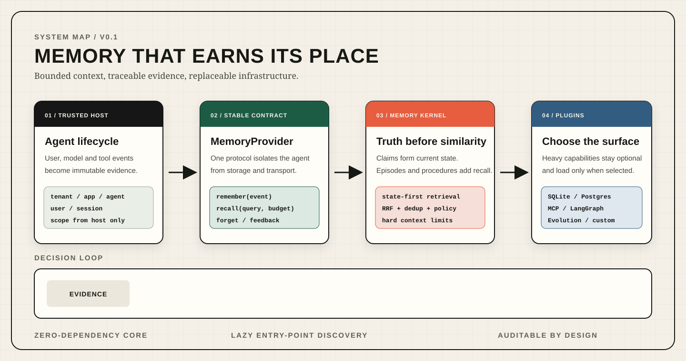

<h1 align="center">Agent Memory</h1>

<p align="center">
  <strong>让 Agent 的记忆有据可查、随变化更新、按预算使用。</strong>
</p>

<p align="center">
  轻量、可插拔的 AI Agent 记忆层。<br>
  从 Python + SQLite 本地运行开始，按需接入模型、存储与 Agent 框架。
</p>

<p align="center">
  <a href="pyproject.toml"></a>
  <a href="pyproject.toml"></a>
  <a href="LICENSE"></a>
  <a href="docs/design/v6.1.0/task.md"></a>
</p>

<p align="center">
  <a href="README.md">English</a> ·
  <a href="#快速开始">快速开始</a> ·
  <a href="#可运行示例">可运行示例</a> ·
  <a href="#集成方式">集成方式</a> ·
  <a href="#文档导航">文档导航</a> ·
  <a href="CONTRIBUTING.md">参与贡献</a>
</p>

Agent 需要记住用户偏好、跟进变化的项目约束，并复用有效经验。Agent Memory 将这些交互组织为**当前事实、带引用的历史和受控流程**，再为下一次模型调用返回有界的 `MemoryBundle`。

**基础写入与检索无需 API Key、向量数据库或后台服务。** 核心运行时没有第三方依赖；模型辅助抽取与其他集成按需启用。

> **Alpha · 软件版本 v0.1.0。** 本地运行时和可选集成包已提供。v6.1 是分阶段实施的架构设计版本，与软件包版本独立；M0/M1 整体里程碑及生产验收尚未完成。支持范围见[能力状态](#能力状态)。

## 为什么选择 Agent Memory？

实用的记忆层应帮助 Agent 回答两件事：**“现在适用什么？”**和**“依据是什么？”**

| Agent 的需求 | Agent Memory 提供的能力 |
| --- | --- |
| 跟进变化的偏好与决定 | 版本化声明与当前状态；显式事实接纳和更正接口 |
| 解释事实来源 | 来源事件 ID 与证据关联；Atom 接纳路径支持引文和字段检查 |
| 区分事实发生时间与系统获知时间 | 使用独立的 `valid_at` 和 `known_at` 查询 Claim |
| 控制上下文开销 | 条目数、字符数、估算 Token 数与检索通道配额 |
| 隔离用户与工作空间 | 由可信宿主定义租户、用户、Agent、工作空间和会话范围 |
| 更换框架或存储 | `MemoryProvider` 协议及 SQLite、PostgreSQL、SDK、MCP、LangGraph 集成 |
| 从任务结果积累经验 | 关联反馈与 Procedure 候选，经过评估、影子运行、灰度和回滚流程 |

**一个具体例子：**用户从杭州搬到上海。贡献接口可以记录变更、保留此前状态，并分别记录“旧状态结束”和“新城市成立”的依据。上海证据被擦除后，后续查询返回**未知**，不会无依据地重新认定用户仍在杭州。[运行示例 →](examples/contribution_memory.py)

## 快速开始

### 安装

需要 **Python 3.13+**。从本仓库安装到虚拟环境：

```bash
git clone https://github.com/agent-memory-lab/agent-memory.git
cd agent-memory
python3.13 -m venv .venv
source .venv/bin/activate  # Windows: .venv\Scripts\activate
python -m pip install -e .
```

开发环境可使用 `./setup.sh`；`./setup.sh --all` 同时安装可选包。通过 `PYTHON_BIN=/path/to/python3.13 ./setup.sh` 指定解释器。

### 写入 → 检索 → 查看来源

保存为 `demo.py`，执行 `python demo.py`：

```python
import asyncio
from agent_memory import AgentMemory, MemoryScope


async def main():
    # 身份和作用域由宿主应用提供。
    scope = MemoryScope(tenant_id="demo", user_id="alice", agent_id="assistant")
    async with AgentMemory.local("memory.sqlite3", scope=scope) as memory:
        await memory.remember(
            "我偏好简洁的回答。",
            event_type="user.message",
            actor="user",
            idempotency_key="alice-answer-style-1",
            claims=({
                "key": "answer.style",
                "value": "concise",
                "text": "Alice 偏好简洁的回答。",
                "scope": "user",
                "confidence": 0.98,
            },),
        )
        bundle = await memory.recall("应该如何回答 Alice？", token_budget=600)
        for claim in bundle.current_state:
            print(f"{claim.key}: {claim.value}")
            print("source events:", len(claim.provenance.source_event_ids))


asyncio.run(main())
```

新数据库中的输出：

```text
answer.style: concise
source events: 1
```

这里由宿主代码提供结构化声明，展示持久化与检索；自动抽取是独立的可选路径。`confidence` 是输入评分，不是真实性保证。返回的记忆包由宿主组装进模型请求，本例不会调用 LLM。

## 可运行示例

选择想体验的行为。以下本地示例无需模型密钥；持久接入示例还需执行 `python -m pip install -e packages/python-sdk`。

| 示例 | 可以观察的行为 |
| --- | --- |
| [基础记忆](examples/quickstart.py) | 写入偏好并读取当前状态 |
| [持久记忆](examples/durable_memory.py) | 保存来源和处理请求，再发布 L1 事实 |
| [条件记忆](examples/contextual_memory.py) | 基于字段与时间证据查询条件事实 |
| [贡献级更正](examples/contribution_memory.py) | 区分状态终止、更正和来源擦除 |
| [离线删除同步](examples/durable_purge.py) | 参与同步的 SDK 待发队列先清理旧内容，再投递新事件 |
| [插件契约](examples/plugin_contract.py) | 实现并验证插件生命周期 |

生命周期钩子的接入可参考[捕获集成模板](examples/capture_harness.py)，由宿主装配 Provider、认证上下文和队列；该模板需要 Python SDK 与宿主配置。

在仓库根目录运行独立示例，例如：

```bash
python examples/contribution_memory.py
```

## 工作方式

```text
宿主事件 → 来源证据 → 事实声明 / 历史片段 / 可复用流程
                                  ↓
                         当前状态 + 历史检索
                                  ↓
                         过滤 + 融合 + 上下文预算
                                  ↓
                             MemoryBundle
                                  ↓
                           下一次模型调用
```

- **Event：**保留来源活动，写入支持幂等；保留和擦除通过显式操作执行。
- **Claim：**表示版本化声明。Atom 接纳进一步提供类型化谓词、来源资格、待决/争议状态和证据检查。
- **Episode / Procedure：**组织任务历史和可复用行为。流程演化默认关闭，启用需经过宿主定义的门槛。
- **MemoryBundle：**返回带引用和预算记录的检索结果。当前已接纳状态优先，可选候选通道仍需通过范围与来源检查。

<p align="center">
  
</p>

模型可以通过 `ClaimGenerator`、`AtomGenerator`、`AtomReviewer` 等可注入协议生成候选。宿主控制身份、政策和接纳规则。使用方式与支持边界见[自动 Atom 抽取](docs/ATOM_EXTRACTION.md)、[Atom 接纳](docs/ATOM_ADMISSION.md)和[双时态记忆](docs/BITEMPORAL_MEMORY.md)。

## 集成方式

从核心包开始，只安装需要的集成：

| 包 | 用途 | 本地安装 |
| --- | --- | --- |
| `agent-memory` | 领域契约、SQLite 运行时、检索和插件加载 | `python -m pip install -e .` |
| [Python SDK](packages/python-sdk/README.md) | 嵌入式/远程门面与宿主持久待发队列 | `python -m pip install -e packages/python-sdk` |
| [MCP Server](packages/mcp-server/README.md) | stdio 与 Streamable HTTP 通信 | `python -m pip install -e packages/mcp-server` |
| [LangGraph](packages/langgraph/README.md) | 生命周期适配器 | `python -m pip install -e packages/langgraph` |
| [PostgreSQL](packages/postgres/README.md) | PostgreSQL Provider 与可选向量能力 | `python -m pip install -e packages/postgres` |
| [Evolution](packages/evolution/README.md) | 流程候选评估与受控晋升 | `python -m pip install -e packages/evolution` |

本地 MCP 宿主安装上表中的 MCP 包后，可以启动绑定作用域的 stdio 服务：

```bash
agent-memory-mcp --transport stdio --database memory.sqlite3 \
  --tenant-id demo --user-id alice --agent-id assistant --session-id session-1
```

远程 HTTP 使用[认证网关契约](packages/mcp-server/README.md#streamable-http)。身份来自可信宿主配置或经过验证的认证信息。

公共边界是 `MemoryProvider`。可选包延迟发现，导入核心不会加载数据库驱动、框架运行时或机器学习库。Plugin Protocol v1 提供 Manifest、能力协商、生命周期健康状态、资源限制和稳定错误。参考[插件示例](examples/plugin_manifest.py)与[架构说明](docs/ARCHITECTURE.md)。

## 适用场景

- **个人助手：**保存用户偏好，并查看偏好建立时的原始输入。
- **编程与研究 Agent：**在后续调用中按上下文预算携带项目约束和决定。
- **客服 Agent：**在宿主定义的用户范围内关联交互历史、决策与结果。
- **Agent 基础设施：**围绕公共协议实现存储或框架适配器，通过固定回放评估记忆策略。

宿主负责执行任务、认证调用方和定义结果含义；Agent Memory 提供证据、状态与检索层。

## 能力状态

| 领域 | 当前支持范围 |
| --- | --- |
| 本地记忆 | 已实现 SQLite、显式声明、当前状态、引用、预算与按范围遗忘 |
| 集成 | 提供 Python SDK、MCP、LangGraph、PostgreSQL 和 Evolution 包；部分 PostgreSQL 契约已在真实后端验证 |
| 事实接纳与抽取 | 支持文档规定的谓词/语法；参考适配器不自动核验现实世界真值 |
| 事实历史 | SQLite/PostgreSQL 支持 `valid_at` / `known_at`，以及规定范围内的更正与当前擦除守卫 |
| 持久处理 | 已验证原子接收/发布、producer 恢复、应用进程强杀恢复及显式启用的 SDK/MCP 删除同步切片 |
| 条件与贡献语义 | 已验证同范围单值事实/偏好及同槽普通贡献操作；复杂组合仍有限制 |
| 检索扩展 | 有界 lexical/hybrid 候选插件按需启用；高级编排与候选到记忆包的完整接入仍在实施计划中 |
| Observation 与 L2/L3 | 完整依赖生命周期、刷新与历史安全设计待实现；已有摘要/Block 基础能力不代表完整契约通过 |
| 外部模型治理 | 完整 v6.1 派发、权限、预算和最终交付契约尚未完成 |

[贡献操作记录](docs/design/v6.1.0/stage-03.md)、[恢复与删除同步记录](docs/design/v6.1.0/stage-04.md)及[资源基线](docs/RESOURCE_BASELINE.md)记录了验证范围与限制。这些属于工程验证，不代表领先基准成绩或生产认证。

Alpha 尚未完成整体生产验收、跨范围原子更正、外部备份/缓存的端到端擦除或在线自主训练。参与同步的待发队列支持删除同步；恢复备份时回放权威删除日志的完整能力仍待补齐。远程部署前阅读[安全策略](SECURITY.md)和[威胁模型](docs/THREAT_MODEL.md)。

## 路线图

开发遵循 [v6.1 实施计划](docs/design/v6.1.0/plan.md)与[任务台账](docs/design/v6.1.0/task.md)。软件、架构、协议和数据库版本独立演进。

| 里程碑 | 交付目标 |
| --- | --- |
| M0 · 可实施基线 | 固定契约、可信领域金标准、故障夹具和校准后的验收配置 |
| M1 · 可靠 L1 | 宿主捕获 → 持久处理 → 事实读取、更正、恢复与擦除 |
| M2 · 可维护知识 | 带依赖的 Observation 与可刷新的 L2/L3 视图 |
| M3 · 经验证的检索 | 证据追踪、按用途检索、冻结对照和可选只读 Reflect |
| M4 · 按需扩展 | 按实际需求增加规模、多模态、可移植导入导出与受控演化 |

**近期重点是补齐可靠 L1 的交付与恢复契约，同时推进真实领域质量校准。** 当前优先级和剩余切片见[后续步骤](docs/design/v6.1.0/next-steps.md)。可选扩展分别满足自己的验收要求。

## 文档导航

| 想了解什么 | 阅读入口 |
| --- | --- |
| 模块职责与代码边界 | [代码架构](docs/ARCHITECTURE.md) |
| 事实接纳与自动抽取 | [Atom 接纳](docs/ATOM_ADMISSION.md) · [自动抽取](docs/ATOM_EXTRACTION.md) |
| 历史事实查询 | [双时态记忆](docs/BITEMPORAL_MEMORY.md) |
| 任务结果反馈 | [反馈契约](docs/FEEDBACK_CONTRACT.md) |
| 部署配置与故障恢复 | [单机部署](docs/single-host-deployment.md) · [恢复操作](docs/recovery-operations.md) |
| 评测与资源测量 | [评测方法](docs/LOCAL_MEMORY_COMPARISON_EVAL.md) · [资源基线](docs/RESOURCE_BASELINE.md) |
| 当前开发进度 | [设计版本](docs/design/README.md) · [计划](docs/design/v6.1.0/plan.md) · [任务](docs/design/v6.1.0/task.md) |

## 参与贡献

欢迎贡献适配器、证据驱动的示例、故障恢复和评测数据集。先查看[任务台账](docs/design/v6.1.0/task.md)中的依赖和待办，再阅读 [CONTRIBUTING.md](CONTRIBUTING.md)。

```bash
./setup.sh --all
source .venv/bin/activate
python -m pytest -q
```

集成与真实 PostgreSQL 测试需要额外配置，参见 [CI](.github/workflows/ci.yml)。贡献应保持默认占用小、契约与框架无关、范围由宿主控制和证据可追溯这几项核心特性。

发现可复现的问题或集成缺口，可以[提交 Issue](https://github.com/agent-memory-lab/agent-memory/issues)。安全漏洞通过 [SECURITY.md](SECURITY.md) 中的私密流程报告。

## 许可证

[Apache License 2.0](LICENSE)。
