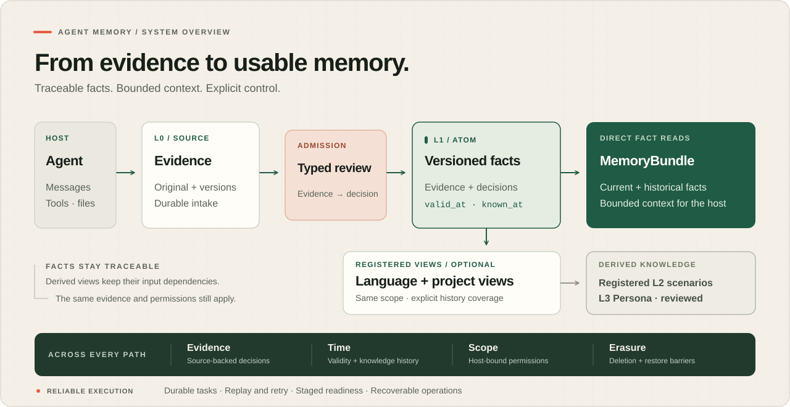

<h1 align="center">Agent Memory</h1>

<p align="center">
  <strong>让 Agent 记住变化，也保留依据。</strong>
</p>

<p align="center">
  可追溯、可更正、可遗忘的 Agent 记忆。<br>
  从 Python + SQLite 开始，按需接入模型、存储与 Agent 框架。
</p>

<p align="center">
  <a href="https://github.com/agent-memory-lab/agent-memory/actions/workflows/ci.yml"></a>
  <a href="pyproject.toml"></a>
  <a href="pyproject.toml"></a>
  <a href="LICENSE"></a>
  <a href="#能力状态与路线图"></a>
</p>

<p align="center">
  <a href="README.md">English</a> ·
  <a href="#快速开始">快速开始</a> ·
  <a href="#从原始证据到可用知识">架构</a> ·
  <a href="#可运行示例">可运行示例</a> ·
  <a href="#集成方式">集成方式</a> ·
  <a href="#文档导航">文档</a>
</p>

Agent Memory 为 Agent 保存来源、组织当前事实与历史，并返回带引用、受上下文预算约束的 `MemoryBundle`。用户更正偏好、项目条件变化或来源被擦除时，记忆也需要随之更新。

**基础写入与检索无需 API Key、向量数据库或后台服务。** 核心运行时默认零第三方依赖；模型辅助抽取和其他集成按需安装。

> **Alpha · v0.1.0。** 已有本地运行时和可选集成包；整体生产验收与真实领域质量校准尚未完成。当前范围见[能力状态与路线图](#能力状态与路线图)。

## 记忆会变化，依据要留下

| 遇到的变化 | Agent 可以如何处理 |
| --- | --- |
| **“我从杭州搬到上海了。”** | 记录变化的生效时间并保留此前历史。上海的来源被擦除后，搬家之后返回**未知**，独立的“已离开杭州”依据仍然有效。[运行示例 →](examples/contribution_memory.py) |
| **“项目 A 请用中文，节假日除外。”** | 保留项目条件、例外和字段证据；适用时输出带限定的语言偏好，可信上下文缺失时返回 `context_unknown`。[运行示例 →](examples/derived_contextual_observation.py) |
| **“忘掉这条来源，恢复备份后也一样。”** | 向隔离的旧数据库副本回放权威删除日志。保留其他来源，阻止已经擦除的内容重新出现。[运行示例 →](examples/purge_restore.py) |

这些示例使用可检查的本地规则和合成输入。它们展示记忆如何变化，以及变化后哪些内容仍可使用。

## 快速开始

### 安装

需要 **Python 3.13+**。从本仓库安装到虚拟环境。macOS 或 Linux：

```bash
git clone https://github.com/agent-memory-lab/agent-memory.git
cd agent-memory
python3.13 -m venv .venv
source .venv/bin/activate
python -m pip install -e .
```

<details>
<summary>Windows PowerShell</summary>

```powershell
git clone https://github.com/agent-memory-lab/agent-memory.git
cd agent-memory
py -3.13 -m venv .venv
.\.venv\Scripts\python.exe -m pip install -e .
.\.venv\Scripts\python.exe demo.py
```

执行最后一条命令前，先将下方示例保存为 `demo.py`。这里直接使用虚拟环境解释器，无需激活环境。

</details>

macOS 或 Linux 开发环境可使用 `./setup.sh`；`./setup.sh --all` 同时安装可选包。通过 `PYTHON_BIN=/path/to/python3.13 ./setup.sh` 指定解释器。

### 写入 → 检索 → 查看来源

保存为 `demo.py`，执行 `python demo.py`：

```python
import asyncio
from agent_memory import AgentMemory, MemoryScope


async def main():
    # 身份和作用域由宿主应用提供。
    scope = MemoryScope(tenant_id="demo", user_id="alice", agent_id="assistant")
    async with AgentMemory.local("memory.sqlite3", scope=scope) as memory:
        await memory.remember(
            "我偏好简洁的回答。",
            event_type="user.message",
            actor="user",
            idempotency_key="alice-answer-style-1",
            claims=({
                "key": "answer.style",
                "value": "concise",
                "text": "Alice 偏好简洁的回答。",
                "scope": "user",
                "confidence": 0.98,
            },),
        )
        bundle = await memory.recall("应该如何回答 Alice？", token_budget=600)
        for claim in bundle.current_state:
            print(f"{claim.key}: {claim.value}")
            print("source event:", claim.provenance.source_event_ids[0])


asyncio.run(main())
```

新数据库中的输出：

```text
answer.style: concise
source event: <event-id>
```

事件 ID 在运行时生成。同一输入使用同一个幂等键重复执行，会返回同一个来源事件；修改输入时需使用新键。

这里由宿主代码提供结构化声明，展示持久化与检索；自动抽取是独立的可选路径。`confidence` 是输入评分，不是真实性保证。返回的记忆包由宿主组装进模型请求，本例不会调用 LLM。

## 从原始证据到可用知识

<p align="center">
  
</p>

[v7 设计](docs/design/AGENT_MEMORY_DESIGN_V7.0.0.md) 分别组织原始来源、被接纳的解释和基于它们构建的视图：

| 内容 | 回答的问题 | 当前实现 / 设计目标 |
| --- | --- | --- |
| **L0 · 来源证据** | 原话是什么？何时发生、何时收到？ | 已实现来源保存、幂等接收、修订与删除屏障。 |
| **L1 · 原子记忆** | 当前适用什么？当时知道什么？ | 已实现声明与候选接纳、双时态查询，以及限定范围的条件、更正和撤回。 |
| **Observation · 派生视图** | 同一主题的证据支持什么？ | 已实现同 scope 语言模板、有界历史读取、当前非条件父视图和版本化宿主权限。 |
| **L2 · Scenario** | 如何组织版本化场景页面和块？ | 当前 `language-scenario/1` 页面支持基于固定的同 scope、非条件语言父完整重建；一般场景模板仍在路线图中。 |
| **L3 · Core / Persona** | 哪些长期偏好或跨场景模式值得保留？ | 路线图：区分明确指令与推断画像，单独验证依据、稳定性和反例。 |

Observation 是可供 L2/L3 使用的派生构件，L1 也直接参与检索。派生视图保留依赖与资格，其输出不会自动变成独立的 L1 事实；现有内容容器也不代表完整 L2/L3 生命周期已经交付。

- **两个时间：**`valid_at` 查询事实何时适用，`known_at` 查询系统在某一时刻知道什么。
- **可靠处理：**来源、任务、发布回执和索引覆盖都有明确的事务边界与恢复行为。
- **受控交付：**身份与权限由宿主提供；检索和派生读取检查其支持范围及当前擦除状态。
- **有界上下文：**`MemoryBundle` 按宿主配置的条目、字符和 Token 估算预算返回记忆与引用。

接口合同与模块边界见 [Atom 接纳](docs/ATOM_ADMISSION.md)、[双时态记忆](docs/BITEMPORAL_MEMORY.md)和[代码架构](docs/ARCHITECTURE.md)。

## 可运行示例

在仓库根目录运行。**Core** 指 `python -m pip install -e .`；**Core + SDK** 还需执行 `python -m pip install -e packages/python-sdk`。以下示例均在本地运行，无需模型密钥。

| 示例 | 可以观察的行为 | 依赖 |
| --- | --- | --- |
| [基础记忆](examples/quickstart.py) | 写入偏好、检索当前状态与来源 | Core |
| [贡献级更正](examples/contribution_memory.py) | 旧状态终止、新值成立与来源擦除分别生效 | Core |
| [条件 Observation](examples/derived_contextual_observation.py) | 项目 A 的中文偏好保留条件、例外与原话支持 | Core + SDK |
| [查询与控制权限](examples/derived_controls.py) | 显式查询定义、有期限本地授权和只读交付 | Core + SDK |
| [单请求分批发布](examples/publication_batches.py) | 一个来源分两次发布，独立闭合并核对索引覆盖 | Core + SDK |
| [备份删除回放](examples/purge_restore.py) | 离线旧备份回放权威删除日志，保留未删除来源 | Core |

```bash
python examples/contribution_memory.py
```

```text
October 2: ['Hangzhou']
October 6: unknown
```

<details>
<summary>更多持久接入、刷新与扩展示例</summary>

| 示例 | 可以观察的行为 | 依赖 |
| --- | --- | --- |
| [持久记忆](examples/durable_memory.py) | 来源接收、处理请求、L1 发布与来源修订 | Core + SDK |
| [条件事实](examples/contextual_memory.py) | 基于字段、时间证据和可信上下文查询 | Core |
| [派生父视图](examples/derived_parent_views.py) | 固定当前父版本、传递访问权限与撤销 | Core + SDK |
| [版本化 L2 页面](examples/derived_scenario_page.py) | 完整重建、稳定块身份和受守卫保护的当前页面就绪 | Core + SDK |
| [语言 Observation](examples/derived_observation.py) | 从闭合 L1 构建当前语言视图 | Core + SDK |
| [离线删除同步](examples/durable_purge.py) | 参与同步的待发队列清理旧内容，再投递新事件 | Core + SDK |
| [L1 就绪](examples/durable_readiness.py) | 等待固定请求集合，显式取消已删除的离线序列 | Core + SDK |
| [索引就绪](examples/index_readiness.py) | 区分 L1 已发布与候选索引可见 | Core + SDK |
| [重处理就绪](examples/reprocessing_readiness.py) | 指定新解释请求，等待固定处理目标 | Core + SDK |
| [索引恢复](examples/index_recovery.py) | 修复失败写入，显式切换绕过已删除来源的缺口 | Core + SDK |
| [资源刷新](examples/resource_refresh.py) | 合并刷新任务并原子提交 Block 与有限回执 | Core |
| [插件契约](examples/plugin_contract.py) | 验证插件生命周期 | Core |

[捕获集成模板](examples/capture_harness.py) 展示宿主生命周期接线，需要 Core + SDK，并由宿主配置 Provider、认证上下文和队列。

</details>

## 集成方式

从核心包开始，只安装需要的集成：

| 包 | 用途 | 本地安装 |
| --- | --- | --- |
| `agent-memory` | 领域契约、SQLite 运行时、检索和插件加载 | `python -m pip install -e .` |
| [Python SDK · `agent-memory-sdk`](packages/python-sdk/README.md) | 嵌入式/远程门面与宿主持久待发队列 | `python -m pip install -e packages/python-sdk` |
| [MCP Server · `agent-memory-mcp`](packages/mcp-server/README.md) | stdio 与 Streamable HTTP 通信 | `python -m pip install -e packages/mcp-server` |
| [LangGraph](packages/langgraph/README.md) | 生命周期适配器 | `python -m pip install -e packages/langgraph` |
| [PostgreSQL](packages/postgres/README.md) | PostgreSQL Provider 与可选向量能力 | `python -m pip install -e packages/postgres` |
| [Evolution](packages/evolution/README.md) | 流程候选评估与受控晋升 | `python -m pip install -e packages/evolution` |

安装 MCP 包后，启动绑定作用域的本地 stdio 服务：

```bash
agent-memory-mcp --transport stdio --database memory.sqlite3 \
  --tenant-id demo --user-id alice --agent-id assistant --session-id session-1
```

远程 HTTP 使用[认证网关契约](packages/mcp-server/README.md#streamable-http)。身份来自可信宿主配置或经过验证的认证信息；模型参数不能覆盖宿主身份或登记派生权限。

公共边界是 `MemoryProvider`。可选包延迟发现，导入核心不会加载数据库驱动、框架运行时或机器学习库。Plugin Protocol v1 提供 Manifest、能力协商、生命周期、资源限制和稳定错误，见[插件示例](examples/plugin_manifest.py)与[代码架构](docs/ARCHITECTURE.md)。

## 能力状态与路线图

当前文档交付基线为 **[V7-B4：确定性项目增量与不可变证明复用](docs/design/v7.0.0/batch-b4.md)**，建立在已有语言视图和 L1 生命周期之上。软件包仍为 **v0.1.0 / Alpha**；架构、协议和软件版本分别管理。

| 领域 | 已交付范围 | 实施证据 |
| --- | --- | --- |
| 可靠 L0 → L1 | 宿主持久待发队列、原子接收/发布、来源修订、显式重处理、同槽更正与双时态事实查询 | [持久交付](docs/design/v6.1.0/batch-03-05.md) · [贡献生命周期](docs/design/v6.1.0/stage-03.md) |
| 恢复与就绪 | 固定处理目标、有界等待、分批闭合、本地候选索引、显式修复与流切换 | [索引恢复](docs/design/v6.1.0/stage-09.md) · [分批发布](docs/design/v6.1.0/stage-11.md) |
| 擦除与备份回放 | 参与同步的待发队列删除同步，以及使用独立权威检查点的受控离线回放 | [删除同步](docs/design/v6.1.0/stage-04.md) · [备份回放](docs/design/v6.1.0/stage-10.md) |
| 当前 Observation | 同 scope 语言 facet、完整输入依赖、失效、全量重建及条件模板 | [生命周期](docs/design/v6.1.0/stage-12.md) · [条件语义](docs/design/v6.1.0/stage-13.md) |
| 历史 Observation | 冻结语言快照与上下文、独立认知/有效时间、覆盖证明及当前权限/擦除检查 | [历史读取](docs/design/v6.1.0/stage-14b3.md) |
| 派生父输入 | 固定当前语言修订、完整处理谱系、交付守卫及传递物理擦除 | [第十四阶段 C](docs/design/v6.1.0/stage-14c.md) |
| 查询与宿主权限 | 版本化当前查询、有期限本地授权、来源 grant 绑定和最终交付检查 | [第十四阶段 A](docs/design/v6.1.0/stage-14a.md) |
| 当前语言 L2 页面 | 类型化 Scenario/Page/Block 版本、稳定块身份、原子完整重建、固定就绪目标、交付守卫及传递擦除 | [第十五阶段](docs/design/v6.1.0/stage-15.md) |
| 可信项目问题 | 宿主审查的负责人、状态、承诺和风险；确定性 full/delta 答案与受守卫证明复用、共享持久刷新、精确路由及可选 SDK/MCP 读取 | [B3](docs/design/v7.0.0/batch-b3.md) · [B4](docs/design/v7.0.0/batch-b4.md) · [示例](examples/project_questions.py) |
| 资格保持当前父与项目 L2 页面 | 兼容可信上下文、保留条件/例外、稳定块和不可变谱系、整页交付守卫 | [B3](docs/design/v7.0.0/batch-b3.md) |
| 检索与反馈基础 | 受范围和预算约束的检索、可选 lexical/hybrid 候选、关联结果的 Episode/Procedure 与受控 Evolution 组件 | [代码架构](docs/ARCHITECTURE.md) · [反馈契约](docs/FEEDBACK_CONTRACT.md) |

Observation 只开放文档规定的语言模板。发布点和可证明稳定区间的历史保留冻结政策/上下文，并检查当前权限；覆盖缺口明确拒绝。当前 `locale-parents/1` 视图固定实际父版本及传递处理许可。当前 `language-scenario/1` 页面组合同一 exact scope 下 1–4 个非条件语言 Observation 父，要求主体、用途与 authority 兼容。

显式启用 `qualified_current=True` 后，`locale-qualified-parents/1` 与 `language-qualified-scenario/1` 保留可信条件和例外。`QuestionService` 另支持有限当前项目问题与宿主触发的项目页面 full 发布；向 SDK/MCP 适配器传入 `questions=service` 才开放该可选接口。历史父/页面、页面作父、旧 facet/page 的 delta 与自由部分块编辑、通用场景、跨 scope 合成、远端 ACL 同步、模型和 L3 仍关闭或待实现。有界页面交付不代表完整 L2/L3 生命周期完成。L1 已有的双时态查询可独立使用；`l1_decided` 只说明处理完成，不代表事实正确。

工程证据按被测版本和范围分别记录，不累计跨阶段测试成绩：

| 验证记录 | 证明的范围 |
| --- | --- |
| [第十二阶段全量验证](docs/design/v6.1.0/stage-12-full-test.md) | 提交 `9d4201c` 的核心与扩展包全量验证、构建安装和双后端恢复；这是旧基线 |
| [第十三阶段](docs/design/v6.1.0/stage-13.md) | 条件语言 facet 的专项与受影响回归；未重新运行全量 |
| 第十四阶段 [A](docs/design/v6.1.0/stage-14a.md) / [B.3](docs/design/v6.1.0/stage-14b3.md) / [C](docs/design/v6.1.0/stage-14c.md) | 查询/权限、历史与父图的专项及受影响回归；未运行全量 |
| [第十五阶段](docs/design/v6.1.0/stage-15.md) · [独立证据](docs/design/v6.1.0/validation-stage-15.json) | 对记录的代码基线执行仓库及扩展包全量测试、构建安装验证，覆盖双后端、跨连接竞争、真实 SIGKILL 和备份回放 |

这些记录验证协议、事务和恢复行为；合成输入不能代替真实对话 gold、抽取质量评测或生产验收。

**最新目标方案是 [v7.0.0](docs/design/AGENT_MEMORY_DESIGN_V7.0.0.md)。** B0 提供严格协议/领域及全成本合同；[B1](docs/design/v7.0.0/batch-b1.md)提供索引失效；[B2 调度器](docs/design/v7.0.0/batch-b2.md)提供持久合并、固定覆盖目标、共享预算和宿主执行。[B3](docs/design/v7.0.0/batch-b3.md)在这些基础上闭合有限当前项目问题读取/页面生命周期。[本批验证记录](docs/design/v7.0.0/validation-b3.json)列出实际来源指纹与逐次运行结果；旧阶段成绩单独记录，不能累计为本轮通过数。

[ProjectAdmission](src/agent_memory/consolidation/project_admission.py)要求可信来源 authority、已审查成员关系及字段/时间支持。缺少完成证据仍为未知，互斥负责人保留争议，无风险命中仅代表已知获准范围内的完整空集。支持 admitted-L1 与明确闭合的有限 publication manifest；正文前和交付前均检查当前权限、上下文和时间。擦除与旧备份回放也覆盖未发布注册和页面路由。

升级必须停止旧写进程。项目候选索引为加性迁移；新能力默认关闭，回滚时关闭新读者/worker 并保留权威删除日志。项目页面提供由宿主触发、消费已就绪父结果的有界投影。B4 增加持久待验证责任、公平有界宿主验证与安全证书复用；不宣告自动页面 worker 或自由部分编辑器。

[B4](docs/design/v7.0.0/batch-b4.md)增加完整分组确定性增量、旧贡献撤去/新贡献加入、连续日志检查与真实 full 回退，以及不可变生成谱系和当前验证证明的分离。同值公开证据不能洗掉旧私有输入。[验证记录](docs/design/v7.0.0/validation-b4.json)包含随机 full 等价、真实双后端生命周期/擦除与独立反例复核。运行/注册/worker 合同升至版本 2；升级须排空旧写进程后重新注册。

B2 的[独立生命周期证据](docs/design/v7.0.0/validation-b2.json)覆盖固定责任、公平共享限额、时钟守卫与实际进程强杀恢复。确定性资源限额不代表模型金额预算或已验证的生产收益。

后续按 [v7 计划](docs/design/v7.0.0/plan.md)与[任务台账](docs/design/v7.0.0/task.md)实施受治理模型缓存，再完成恢复、兼容与真实成本验收。保留全部 44 项旧任务状态。合成确定性测试不代表许可真实数据质量、生产收益或完整 M0/M1/M2 验收；这些门仍开放。

高级检索和可选的只读 Reflect 继续按[任务台账](docs/design/v6.1.0/task.md)推进。远程部署见[安全策略](SECURITY.md)和[威胁模型](docs/THREAT_MODEL.md)；外部缓存、远端 ACL 和供应商副本需要各自完成集成合同。

## 文档导航

| 想了解什么 | 阅读入口 |
| --- | --- |
| 设计与模块边界 | [v7 架构](docs/design/AGENT_MEMORY_DESIGN_V7.0.0.md) · [代码架构](docs/ARCHITECTURE.md) |
| 事实接纳与自动抽取 | [Atom 接纳](docs/ATOM_ADMISSION.md) · [自动抽取](docs/ATOM_EXTRACTION.md) |
| 历史事实查询 | [双时态记忆](docs/BITEMPORAL_MEMORY.md) |
| 当前派生记忆 | [Observation](docs/design/v6.1.0/stage-12.md) · [条件 facet](docs/design/v6.1.0/stage-13.md) · [查询与权限](docs/design/v6.1.0/stage-14a.md) |
| 历史视图与当前页面合成 | [有界历史](docs/design/v6.1.0/stage-14b3.md) · [父输入](docs/design/v6.1.0/stage-14c.md) · [当前 L2 页面](docs/design/v6.1.0/stage-15.md) |
| 任务结果反馈与演化 | [反馈契约](docs/FEEDBACK_CONTRACT.md) · [Evolution 包](packages/evolution/README.md) |
| 部署配置与故障恢复 | [单机部署](docs/single-host-deployment.md) · [恢复操作](docs/recovery-operations.md) |
| 评测与资源测量 | [评测方法](docs/LOCAL_MEMORY_COMPARISON_EVAL.md) · [资源基线](docs/RESOURCE_BASELINE.md) |
| 目标架构与当前进度 | [设计版本](docs/design/README.md) · [v7 实施计划](docs/design/v7.0.0/plan.md) · [v7 任务台账](docs/design/v7.0.0/task.md) |

## 参与贡献

欢迎贡献适配器、可运行示例、故障恢复用例和评测数据。先查看[任务台账](docs/design/v7.0.0/task.md)中的依赖和待办，再阅读 [CONTRIBUTING.md](CONTRIBUTING.md)。

macOS 或 Linux 开发环境：

```bash
./setup.sh --all
source .venv/bin/activate
python -m pytest -q
```

集成与真实 PostgreSQL 测试需要额外配置，参见 [CI](.github/workflows/ci.yml)。贡献应保持默认占用小、契约与框架无关、范围由宿主控制和证据可追溯。

可复现的问题或集成缺口请[提交 Issue](https://github.com/agent-memory-lab/agent-memory/issues)。安全漏洞通过 [SECURITY.md](SECURITY.md) 中的私密流程报告。

## 许可证

[Apache License 2.0](LICENSE)。
