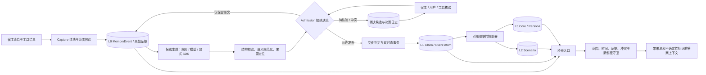
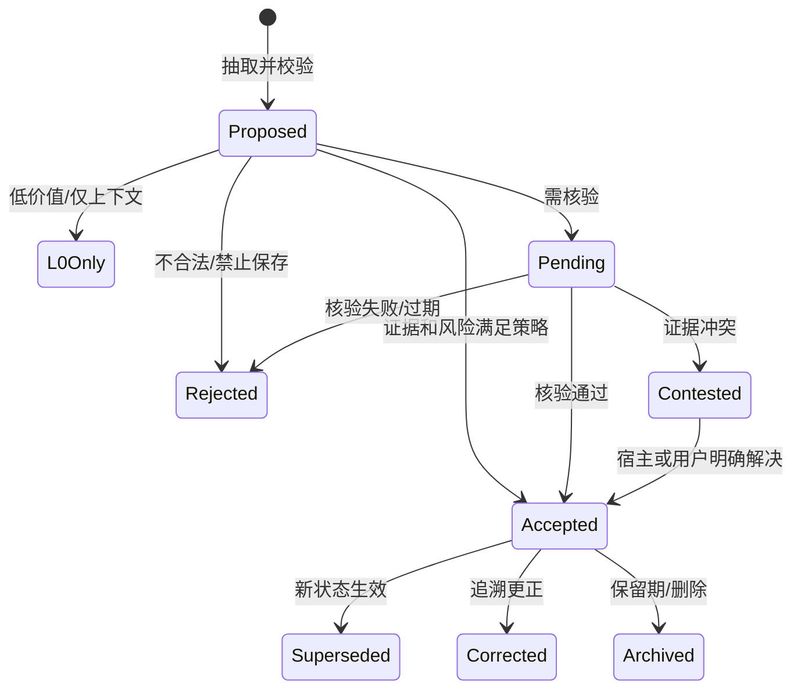

# Agent Memory 目标架构与实施方案（提案）

状态：**提案，尚未实现**。本文针对本仓库现有的模块化单体、SQLite/PostgreSQL、Claim 双时态、采集、归并、检索和评测能力设计。现状以仓库代码为准；本文中的新类型、表、接口和策略均是后续改造目标。

## 1. 要解决的核心问题

记忆的关键不是多做几层摘要，而是对每一条可能被长期使用的信息回答：**是否值得保存、是否得到来源支持、是否需要核验、能否进入当前状态、何时失效、如何更正、能否安全用于当前任务**。如果这个判定缺席，完整的双时态存储仍可能精确地保存错误事实。

当前项目已有：`MemoryEvent` 采集与来源字段、`ClaimDraft` / `Claim`、`valid_from` / `valid_to` 与 `system_from` / `system_to`、`corrects_id`、同值来源合并、`MemoryProposal`、Claim 归并、检索守卫、Episode / Procedure / MemoryBlock 和评测框架。主要缺口是：

| 现状 | 影响 | 目标 |
| --- | --- | --- |
| `TrustedMemoryPolicy` 默认提取所有事件，按 `confidence >= 0.5` 接纳 | 模型自评分数被当作事实依据 | 引入有原因码的接纳决策；置信度仅描述抽取质量 |
| 生成器缺省 `confidence` 会经 `MetadataClaimExtractor` 成为 `1.0` | 缺失评分反而容易自动写入 | 自动抽取必须显式输出必要字段；缺失值进入待审或仅保留 L0 |
| 内核对同一事件按 `(scope_level, key)` 去重 | 同槽的多值、相互矛盾候选被丢弃 | 保留全部候选，语义规范化后再判重和冲突 |
| 已接纳草稿立即写 `Claim`，可能替换同槽旧值 | 仅凭新文本就改写当前状态 | 核验、证据类型和变化类型通过后才发布 L1 |
| `EvidenceTrust` 可由事件 `metadata.trust_label` 给出 | 普通输入若可控制元数据，可能抬高来源信任级别 | 信任等级只能由宿主认证的来源适配器赋值；声明值只作原始数据 |
| 历史查询只覆盖 Claim；L2/L3 无统一依赖版本 | 高层摘要可能引用更正前的内容 | 派生视图保留依据版本，变更时失效；无历史版本时不参加历史回答 |

`confidence`、`importance`、来源可信度、事实核验状态、范围和记忆层级是彼此独立的维度；不能用任何一个字段替代其余判定。

## 2. 总体架构

**写入契约**：L0 是经过采集策略处理的可追溯证据；候选只是“待判定的断言”；L1 是已经通过接纳策略、可按来源和时间解释的原子记忆；L2/L3 是有依据列表和版本的派生视图。**读取契约**：默认当前状态只返回已接纳、当前有效且有可用来源的 L1；检索 L0 或待决候选时必须标记为原话/待核验，不得伪装成已确认事实。L2/L3 可用于快速恢复语境，但回答具体事实时应能回到 L1 或 L0。

### 四层的内容和晋升

| 层 | 内容与身份 | 写入条件 | 过期、更正与读取 |
| --- | --- | --- | --- |
| L0 Conversation | 原始消息、角色、顺序、宿主认证的来源、采集与发生时间、清洗后的文本和定位 | 通过敏感信息、大小和范围检查；保留策略由宿主决定 | 遵循归档/删除/保留期；检索结果标为原始证据 |
| L1 Atom | 状态断言、事件、偏好、约束；每条有来源片段、语气、范围和双时态 | 经过结构、价值、证据、风险、冲突和时间判断；核验可异步 | 状态类用 Claim 的现实/系统时间；事件类保留独立事件身份；更正保留知识历史 |
| L2 Scenario | 项目或任务的目标、决定、进度、阻塞和相关 Atom ID/版本 | 需求确实需要场景恢复，且所引用的依据已接纳 | 依据变化后失效或重算；可绕过 L2 直读 L1 |
| L3 Core / Persona | 跨场景稳定偏好、长期约束、工作模式和可审查的概括 | 多个独立依据、时间稳定、无未决冲突，且范围允许晋升 | 支持降级、撤回与重建；单次表达不形成全局画像 |

层级不代表真实性或权限。一个短期项目约束可以很重要但仍限于项目；一个长期个人偏好也可能只是自述。`Episode` 保存经历及结果，`Procedure` 保存有结果证据的可复用操作，`MemoryBlock` 承担简洁的恢复视图；它们可以分别映射到 L1/L2/L3 的用途，但无需被强行改名或塞入单一继承树。

当前 `MemoryEvent` 能承载单个采集事件；“完整对话”需要宿主按顺序提供全部相关消息，并标明缺失或裁剪。没有采到的上下文不能由模型补写为 L0 原话。来源片段定位针对实际保存的清洗后文本。

## 3. L0→L1 的判定流水线

每个判定都返回 `action + reason_codes + policy_version + source_refs + decided_at`，不能只返回布尔值。建议采用以下顺序，使昂贵的模型/外部核验只发生在必要处。

| 顺序 | 必须判断什么 | 典型处理 |
| --- | --- | --- |
| 1 采集 | 内容能否保存，属于谁，敏感性与保留期是什么 | 沿用 Capture 清洗；无授权范围或密钥类内容不进候选 |
| 2 值得提取 | 对未来任务是否有持续用途，还是闲聊、一次性信息或重复噪声 | 低价值内容仅 L0；显式“记住”可提高优先级，但仍需事实判定 |
| 3 可支持性 | 能否定位到原话、工具收据或明确来源片段 | 无来源定位的生成内容仅待审；自我推断不能冒充用户陈述 |
| 4 语义 | 主体、谓词、值、否定、引用、假设、计划、条件、单位与时态是否清楚 | “可能搬家”保存为计划/意向，不改写现居地 |
| 5 类型与槽 | 是持续状态、可重复事件、偏好还是约束；是否与既有槽同一语义 | 状态可更新 `Claim`；事件有独立身份；不同语义不共享 key |
| 6 范围与时间 | 用户/项目/会话边界是否正确；有效期是否有证据 | 不把项目约束扩大到用户全局；未知起点保留“未指定”，不凭空回填 |
| 7 风险与核验 | 事实是自述、外部可证事实、工具观察还是高风险推断；当前用途要求什么强度 | 低风险偏好可作为“用户自述”接纳；高风险或可执行事实走核验 |
| 8 变化与冲突 | 同值确认、真实状态变化、追溯更正，还是同时间相互矛盾 | 独立来源合并；显式更正有目标；冲突保留待决，不静默覆盖 |
| 9 发布 | 能否进入当前状态，发布哪个现实有效期与系统版本 | 同事务写决策、Claim/事件 Atom、来源及版本；失败回滚 |
| 10 晋升与读取 | 是否适合生成 L2/L3；使用时是否已过期或任务风险改变 | 依据版本变化即失效；行动前按风险和新鲜度再次检查 |

建议的输出动作：`L0_ONLY`（无长期原子记忆）、`PENDING_VERIFICATION`、`ACCEPT`、`CONTESTED`、`REJECT`。`REJECT` 用于无效或禁止保存的候选，清除候选正文，仅保留必要的原因码与来源引用；`L0_ONLY` 保留符合 L0 保留策略的原文。每个候选有确定性的身份和幂等键，重试不能重复发布。对同一事件中的多个候选，先逐条判定，不能先按 key 丢弃。

### 建议的决策规则（首版默认值）

| 情况 | 默认结果 | 理由 |
| --- | --- | --- |
| 用户明确说“我偏好本地部署”，范围清楚、低风险 | `ACCEPT` 为“用户自述的偏好” | 对用户意愿，直接自述是适当依据；保留原句及范围 |
| “我可能下月搬去上海” | `ACCEPT` 为意向事件，或 `L0_ONLY`（由用途策略定）；现居地槽不变 | 计划/可能不等于已发生 |
| 模型写“用户应该喜欢上海” | `PENDING_VERIFICATION` 或 `L0_ONLY` | 推断缺少用户直接确认 |
| 工具返回订单已付款，且有宿主认证收据 | 可接纳为“该工具在此时报告已付款”；执行退款等动作前重查 | 工具观察有来源，但外部状态可能变化 |
| 用户自述与宿主工具对同一时间的订单状态矛盾 | `CONTESTED`，保留双方证据 | 来源分歧需要明确解决；不得只比较置信度 |
| 同一用户重复相同自述 | 合并来源，不自动升级成多个独立证据 | 多次转述可能来自同一原始消息 |
| 证件号、密钥、无关第三方隐私 | `REJECT` 或按采集策略脱敏/仅 L0 | 最小化存储与范围隔离 |

规则阈值通过本项目评测集标定。第一版采用可解释的类别与决策表，模型负责提出候选和不确定性；是否发布由可复现的策略与宿主提供的可信来源信息控制。

## 4. 数据契约与状态机

建议增加 `AtomCandidate`，保留 `ClaimDraft` 作为兼容输入。核心字段：`candidate_id`、`kind`（state/event/preference/constraint）、`subject`、`predicate/key`、规范化 `value`、`polarity`、`modality`（asserted/planned/hypothetical/quoted/inferred）、限定条件、`scope`、`valid_from/to`、`source_event_id`、清洗后 L0 的 `source_span` 或稳定引用、`extractor_version`、`extraction_confidence`、`sensitivity`、`retention_class`。`extraction_confidence` 表示“抽取正确的概率估计”，不表示“事实为真”。缺失的语气、来源、范围和必要时间语义必须显式处理。

`AdmissionDecision` 保存 `candidate_id`、动作、原因码、策略版本、宿主认证来源等级、核验依据引用、决策时间及产生的 L1 ID。来源等级沿用现有 `EvidenceTrust` 概念，但由可信采集边界生成；用户文本、模型输出、普通 `metadata.trust_label` 不得自行升级信任。

核验状态与 Claim 生命周期分离：`REPORTED`（某来源如此声称）、`OBSERVED`（有宿主工具观察）、`CORROBORATED`（独立来源相互支持）、`CONTESTED`（相互矛盾）、`RETRACTED`（来源撤回）。这描述证据情况，不把个人偏好变成可由外部证实的客观真理。待决候选不出现在默认 `get_state` 或普通事实召回中；管理入口可显示待决、冲突、来源和原因。

更正或核验结果以追加的决策记录产生新的系统时间版本；旧版本保持“当时系统知道什么”的语义。`known_at` 只由服务端提交时刻确定。`valid_from/to` 可以由证据提供，但要记录是原话给出、工具给出、推断得出还是未知。当前 `Claim.valid_from` 必填：现实起点未知时只从被观察到的时刻起作为状态使用，并记录“真实起点未知”，不可据此断言更早时期的状态。当前 `occurred_at` 可由调用方传入，不能充当可信认知时间。

**存储目标**：现有 `events`、`claims`、`claim_observations`、`claim_versions` 继续承担 L0 和已接纳状态 Atom；增加待决 `atom_candidates` 和追加式 `admission_decisions`（包括核验记录和证据引用）。被拒绝候选不保留正文。已接纳的事件 Atom 需独立持久化身份，避免将每次事件写入一个会覆盖的状态槽。Claim 认知快照加入证据状态与接纳决策引用。SQLite 初始化迁移与 PostgreSQL 增量迁移保持等价。旧 Claim 标记为 `LEGACY_UNREVIEWED`，保留已存在的历史起点与原始来源；不能迁移时假装它们已被新策略核验。

所有 `source_event_id`、候选、决策、Claim 和派生视图受同一 scope 校验。删除 L0 来源时，同事务或可靠队列清除相应候选正文、历史来源与派生视图引用；没有可用依据的记忆不能继续用于答案。决策日志只保留最小必要元数据，并遵守同一删除策略。

## 5. 双时态、冲突与派生记忆

当前 `[valid_from, valid_to)` 和 `[system_from, system_to)` 的双时态模型继续作为 L1 状态事实的基础；`created_at` 保留原始对象创建时刻，不能代替系统版本。`known_at` 选择当时已发布的版本；待核验候选在核验通过前不可倒灌进更早的认知时间。例如 9 月 10 日收到“9 月 1 日起住杭州”，9 月 20 日核验通过：`valid_at=9月5日, known_at=9月15日` 不能返回已核验的杭州；`known_at=9月25日` 才能返回，并说明现实起点来自 9 月 1 日的证据。

同槽变化必须先分类：

| 类型 | 判定依据 | 写入效果 |
| --- | --- | --- |
| 同值确认 | 同一语义、同一范围、无矛盾，来源独立性清楚 | 增加来源并发布新的认知版本；不把重复转述计为独立证据 |
| 现实变化 | 新状态具有可信的新有效起点 | 新观察生效；旧有效区间按规则收束 |
| 迟到信息 | 后收到的证据指向较早现实时间 | 补足旧有效区间；不覆盖其后已生效状态 |
| 追溯更正 | 明确 `corrects_id`、同 scope / key，且有更正来源 | 重写该观察的现实解释，保留先前系统版本 |
| 冲突 | 同一主体、范围、现实时间存在互斥说法，尚无足够解决依据 | `CONTESTED`，当前答案标明不确定或按策略暂保留先前状态；禁止无声覆盖 |

现有 `consolidation/claims.py` 可作为归并算法基础，但它的 `EvidenceTrust` 需要认证来源；“来源排序 + 时间排序”只能在接纳策略允许的候选之间使用。现有 `MemoryProposal` 是对已存在记忆做乐观版本更新的提案，不承担初次抽取的待核验队列。

L2/L3 的最小依赖契约是：`derived_id`、类型与 scope、内容、`source_atom_ids`、每个依据的系统版本或修订 ID、生成器/策略版本、`built_at`、`status`。L1 更正、过期、争议、归档、删除时，使受影响的 L2/L3 失效并重建；删除传播优先于后台重算。对 `known_at` 的历史查询，只有当时已存在且依据版本在该时间可见的派生视图可用；第一阶段可以只返回 L1 历史，明确不提供 L2/L3 历史。

## 6. 检索与行动前核验

检索先确定精确 scope、`valid_at` / `known_at` 和任务风险，再从各通道取候选。最终守卫应统一检查：已接纳/待决、可见范围、有效期、系统认知时间、来源存活、冲突、派生依赖是否新鲜、敏感级别、token 预算。检索分数只排序通过守卫的候选。普通问答返回值时携带来源与 `REPORTED` / `OBSERVED` 等证据标签；待决和互斥信息以“不确定，需核验”的形式暴露。当前 `retrieval/guard.py` 的 `trusted` 布尔值可逐步扩展为明确的接纳状态和原因码，但最终检查必须覆盖 Claim、Block、L0 及所有融合通道。

高影响操作（付款、删除、发信、部署、权限修改等）发生前，用当下可用的权威工具或用户确认重查关键事实。行动前核验是使用策略，不改变历史事实的 `valid_at`。工具核验得到的新信息作为有来源的新 L0 进入相同接纳流水线；不可直接写“核验通过”并覆盖证据。

## 7. 在本仓库的落点

| 位置 | 改动职责 |
| --- | --- |
| `domain.py` | `AtomCandidate`、`AdmissionDecision`、类型/语气/证据状态；保持纯数据与校验 |
| `ports.py` | 决策策略、候选/决策仓储与可选 `VerificationProvider` 端口；显式兼容旧 `ClaimExtractor` |
| `capture/` | 沿用已有清洗、脱敏、范围和队列；宿主认证来源在此进入可信封装 |
| `providers.py` | 元数据和生成式抽取器产出完整候选；不再把缺失模型置信度默认为事实强度 |
| `consolidation/` | 新增一个内聚的接纳/变化判定模块；复用 Claim 冲突与来源合并逻辑，不另造总控 service |
| `kernel.py` | 编排 L0、候选、决策和发布；同一事务及幂等检查，不容许 pending 写入 Current State |
| `sqlite.py` 与 `packages/postgres/` | 等价迁移、事务、范围索引、认知版本和删除传播 |
| `retrieval/` | 在最终守卫接入接纳状态、冲突和派生有效性；历史查询仅返回当时已知内容 |
| `context/`、现有 Block/Episode/Procedure | 建立依赖索引和失效机制后承载 L2/L3；避免新建一套平行的大型记忆框架 |
| `evaluation/` | 对提取、接纳、核验、双时态、拒答、删除和成本建立固定回放数据集 |

内核维持编排职责，判定规则集中在 `consolidation` 的一处能力模块，事务细节留在仓储适配器。这样遵守 [代码组织与依赖边界](ARCHITECTURE.md) 的“按能力聚合、能力内部按职责分文件”原则。

## 8. 实施顺序与验收

1. **基线与观测。** 用现有 `evaluation/` 建立标注回放：每个候选是否应提取、类型/语气/范围/时间、应接纳还是核验、冲突归属、正确 `valid_at` / `known_at`。先记录当前默认策略的误接纳率、漏提取率、来源支持率、时间/范围错误率、平均 token 与延迟。
2. **接纳闸门最小闭环。** 定义候选和决策；先覆盖 SDK 显式 Claim 与生成式 Claim；修复缺失评分自动等于 1.0、同 key 过早去重和普通 metadata 抬高信任。L0、决策和已接纳 Claim 同事务；默认不让待决进入 Current State。保持旧 API 兼容。
3. **核验与冲突。** 加待决存储、可查询的原因码、宿主/用户/工具核验入口；明确来源认证、独立性、状态变化与追溯更正。SQLite/PostgreSQL 同步完成迁移和删除传播。
4. **L2/L3 派生。** 先做项目 Scenario 的依据索引和失效，再做保守的 Persona 晋升/撤回；不要在来源链和失效机制完成前自动生成全局画像。需要历史派生查询时再补对应版本。
5. **调优与发布。** 在固定集上比较旧策略、新策略和无记忆基线；以误接纳、冲突漏报、错误行动上下文为首要质量门槛，再优化召回、延迟和成本。按功能开关逐步启用，旧数据以 `LEGACY_UNREVIEWED` 可见并可回放重评估。

最低验收样例：计划不覆盖现实状态；同事件两个相反候选均留下决策轨迹；工具结果不能自行设置权威来源等级；待核验事实在核验前的 `known_at` 不可见；追溯更正保留旧认知视图；同值重复转述不当作独立验证；项目约束不扩展到用户；删除最后一个证据后 Claim 和 L2/L3 都不可召回；SQLite 与 PostgreSQL 的结果一致。所有判定可由 `candidate_id` 查到动作、原因、策略版本和依据。

发布门槛可先固定为：上述安全、范围、时间、删除与双后端契约用例全部通过；回放集相对旧策略不增加无依据接纳和冲突漏报；候选、核验与召回的 p50/p95 延迟及存储增长都进入报告。抽取召回率与误接纳率的目标数值应在标注基线完成后设定，避免用未经验证的百分比宣称质量。

## 9. 取舍与待验证假设

推荐的首版是**结构化原子候选 + 确定性接纳策略 + 按需核验 + 双时态发布 + 依据驱动的 L2/L3 派生**。它适合本项目已具备的 Claim 历史与模块边界，也便于解释为什么某条记忆出现或缺席。全量对话直接做摘要的实现成本较低，但缺少稳定的原子依据与更正传播；所有候选都调用外部核验会提高延迟与费用。图检索、动态笔记和额外向量索引应在固定评测显示具体失败后加入。

仍需通过真实数据标定：不同领域的高风险谓词列表、偏好晋升所需独立证据、待决候选保留期、核验来源优先级及行动前新鲜度窗口。默认策略应保守并允许租户/宿主配置；这些数值不是模型参数，也不应写死为通用真理。

相关研究提供设计与评测维度，并非本项目性能结论：[Mem0](https://arxiv.org/abs/2504.19413) 讨论对话信息的抽取、归并与检索；[LongMemEval](https://arxiv.org/abs/2410.10813) 将长期记忆评估拆为抽取、跨会话、时间、更新与拒答；[RAPTOR](https://arxiv.org/abs/2401.18059) 是层次摘要检索的参考。参见已有 [分层抽取分析](MEMORY_EXTRACTION_DESIGN.md) 与 [双时态说明](BITEMPORAL_MEMORY.md)。资料核对日期：2026-10-03。
