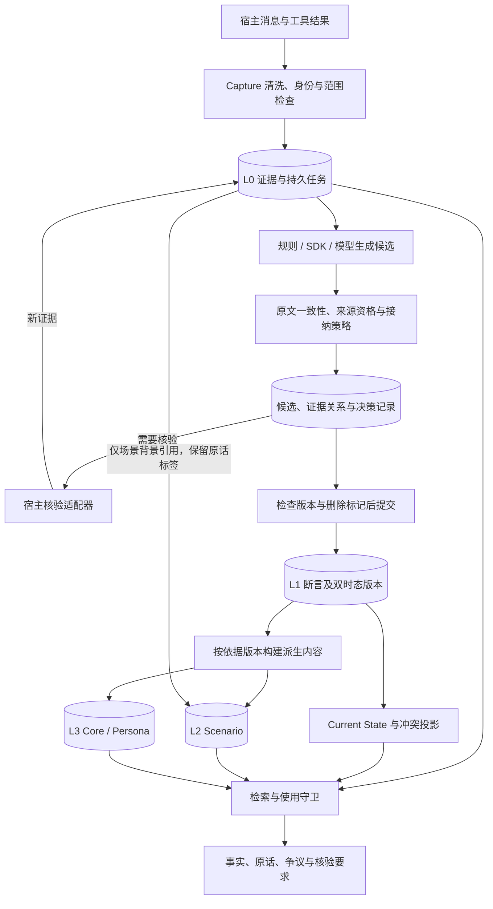
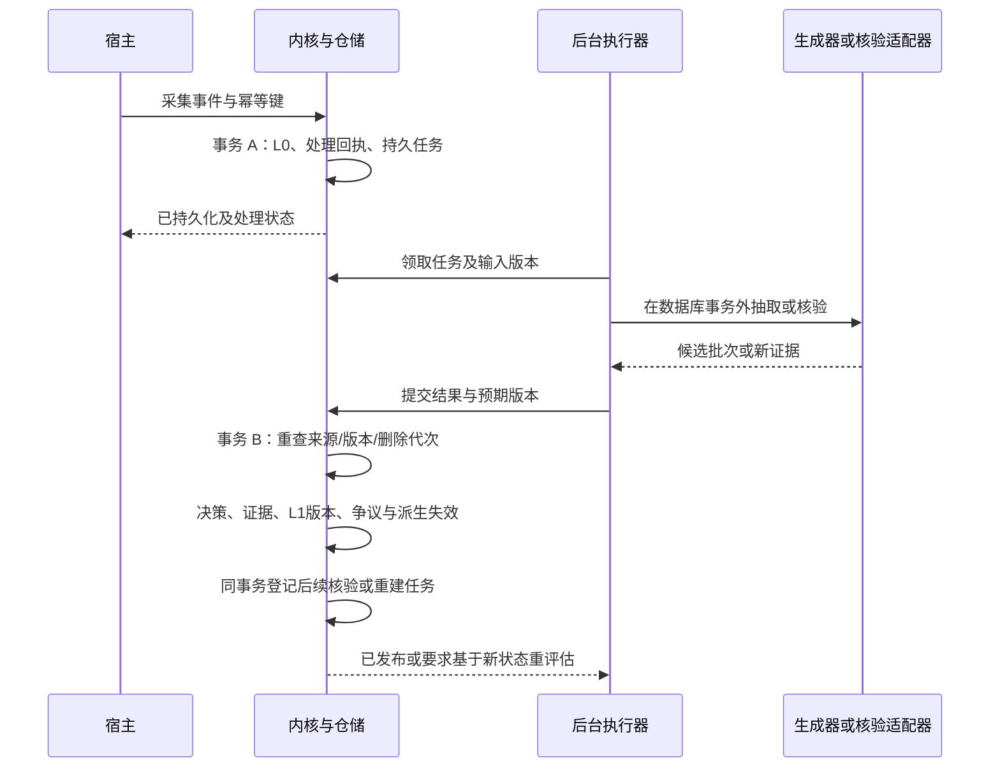

# Agent Memory 目标架构与实施方案（修订提案）

状态：**目标架构提案，首期部分实现**。修订日期：2026-10-05。本次修订补齐身份、证据适用时间、冲突与撤回、异步事务、删除屏障、迁移和验收契约；不代表代码已经具有全部目标行为。现有行为见 [代码架构](ARCHITECTURE.md) 和 [Claim 双时态](BITEMPORAL_MEMORY.md)。

实施进度（2026-10-06）：首期显式 L0→L1 接纳接口已落地，使用方式及实际边界见 [Atom 接纳接口](ATOM_ADMISSION.md)。本提案中的完整异步核验、任务队列、L2/L3 派生和质量预算校准仍是后续目标。

## 1. 目标、现状与边界

记忆系统要决定：什么值得记录、原文是否支持提取结果、哪些来源有资格支持该属性、信息何时有效、出现反证如何处理，以及当前任务能否使用这些信息。**接纳表示允许以指定身份、范围和证据条件使用一项断言，不表示系统证明了它是绝对真理。**

本项目继续采用模块化单体：共享领域契约、内核编排、SQLite/PostgreSQL 事务适配、可选抽取与检索插件。L0–L3 表示内容的组织和使用方式；语义记忆、情节记忆、程序记忆仍可通过现有 Claim、Episode、Procedure 和 MemoryBlock 承载。工作上下文恢复继续由 `context/` 管理。

| 当前实现 | 需要修订的契约 |
| --- | --- |
| `TrustedMemoryPolicy` 主要按置信度阈值接受草稿；生成器缺失评分会经元数据解析成为 `1.0` | 接纳必须给出原因和依据；模型分数不代表事实真实性，未校准分数也不称为概率 |
| 内核按 `(scope_level, key)` 提前去重，Claim ID 由事件、scope、key 生成 | 同时修正候选身份、断言身份和状态槽身份，不能只移除去重 |
| `EvidenceTrust` 可读取 `metadata.trust_label` 并用于排序 | 认证来源与属性级权威由宿主赋予；来源真实性和陈述正确性分别判定 |
| Claim 已有双时态及 `corrects_id`，同值来源合并仍按整条 Claim 处理 | 证据关联必须携带支持内容、现实时间范围和系统记录时间 |
| 时间物化器采用新起点优先，有限覆盖结束后可恢复旧值 | 新策略明确真实替换、临时覆盖、集合成员和事件的不同规则 |
| 提交后才调用后台入队接口 | 数据与待处理任务须原子落盘；重试、核验与删除需版本屏障 |
| 已有 Block、Episode、Procedure，但无统一 L2/L3 双时态依赖契约 | 首先实现依据索引和失效；历史摘要功能单独声明能力 |

记忆库负责保存证据、执行接纳策略、返回使用条件。宿主负责来源认证、领域工具权限和动作执行。记忆库可返回 `requires_verification`，不能宣称阻止了宿主绕过核验执行动作。

## 2. 总体架构与四层职责

L0 是实际采到并按策略清洗的证据；候选是待判定的断言；L1 保存有明确来源、语义和时间的原子记忆。`Current State` 是在指定双时态坐标、策略和权限下对 L1 的投影。L2/L3 通过依据引用构建，并可重建和撤回。

| 层 | 内容 | 使用与晋升条件 |
| --- | --- | --- |
| L0 Conversation | 消息、角色、顺序、来源、发生/接收时间、清洗后的文本与定位 | 宿主必须说明裁剪和缺失；模型不能补写不存在的原话；遵守保留期 |
| L1 Atom | 有主体的事实断言、偏好、约束、事件及意向；证据和时间独立记录 | 以自述、工具观察、文件记录或推断等来源性质呈现；互斥争议不能伪装成唯一状态 |
| L2 Scenario | 项目目标、决定、进展、阻塞、理由和开放问题 | 已接纳事实引用 L1；理由、备选项和未决问题可引用 L0，但保留“讨论/假设”标签 |
| L3 Core / Persona | 明确的长期指令与偏好，或跨场景归纳的稳定模式 | 明确长期指令一次有效表达即可引用；推断型画像需要独立依据、稳定性和反例检查 |

L3 的范围不能超过依据允许的范围。用户说“以后用中文回答”可形成明确偏好；“连续几次用中文”只能作为推断依据。Procedure 的可执行步骤仍需 Episode 的结果证据，不因进入高层视图就变得可靠。

## 3. 接纳流程：每一步判定什么

每项决策返回 `action + reason_codes + policy_version + evidence_refs + recorded_at`。来源缺失、核验超时和能力不支持均须显式表示；不能默认为通过。

| 顺序 | 判定 | 结果示例 |
| --- | --- | --- |
| 1 采集 | 能否保存、归属范围、敏感性、保留期 | 脱敏、拒绝采集或写入 L0 |
| 2 提取价值 | 是否值得后续复用、是否只是一次性上下文 | 仅 L0，或进入候选生成 |
| 3 原文一致性 | 原文是否实际支持主体、谓词、值、否定、语气和时间 | “可能搬家”只能支持意向，不能支持现居地变化 |
| 4 身份与类型 | 主体是否消歧、状态槽是否正确、单值/集合/事件如何表达 | 不同人的同名属性分别处理；无法消歧则待决 |
| 5 来源资格 | 谁说的、来源是否认证、是否对该属性有证明或指令权限 | 用户可直接表达自己的偏好；工具仅在其领域提供观察 |
| 6 范围与时间 | 场景边界、有效期、条件、时间精度是否清楚 | 项目约束保持项目范围；未知时间保留不确定性 |
| 7 证据与核验 | 是否达到该属性和用途的接纳要求，需要什么额外证据 | 自述接纳、领域核验或待决 |
| 8 变化与冲突 | 同值佐证、现实替换、临时覆盖、更正、撤回或争议 | 同批次按槽分组决策，避免候选顺序决定胜者 |
| 9 发布 | 候选/槽版本、依据与删除代次是否仍有效 | 同事务发布决策、证据、版本及失效任务 |
| 10 使用 | 读取权限、双时态、争议、依赖新鲜度与任务风险 | 返回可用事实、带标签的原话、未知或核验要求 |

候选动作保留 `L0_ONLY / PENDING_VERIFICATION / ACCEPT / CONTESTED / REJECT`。`CONTESTED` 必须关联一个争议记录；`ACCEPT` 必须明确接纳的是“来源作出该陈述”还是策略允许采用的领域状态。禁止保存的候选清除正文，拒绝原因只保留最小必要元数据；其他失败按保留策略保留可追溯的 L0。

### 三种核验的职责

| 核验 | 回答的问题 | 执行者与边界 |
| --- | --- | --- |
| 原文一致性 | 抽取有没有篡改原意或漏掉限定？ | 规则校验来源位置、字段与单位，必要时语义校验；模型校验本身也可能出错，不能作为唯一真值来源 |
| 领域证据核验 | 此来源能否支持这一属性、数值和时间？ | 属性策略指定用户确认、领域接口或文件依据；工具调用成功本身不证明命题为真 |
| 行动前核验 | 当前动作需要的信息是否足够新、足够可靠？ | 宿主按动作决定是否重查或确认；结果作为新证据返回记忆流水线 |

认证只证明信息来自哪个通道。属性级 `authority_scope` 说明该来源可支持什么，例如订单 API 的付款状态、用户的个人偏好。保留 `EvidenceTrust` 的兼容标签，但禁止将全局等级排序直接作为所有冲突的裁决规则。复制、引用和转发同一消息不构成独立佐证。

## 4. 身份、断言与证据契约

### 4.1 三种身份及修订身份

| 身份 | 定义与约束 |
| --- | --- |
| `candidate_id` | 一个已持久化抽取批次中的候选身份；包含区分值、语气、时间和来源片段所需的信息。相同批次的重试重用结果，不能重新生成并重复发布 |
| `slot_id` | `canonical(scope, subject_id, predicate_id, identity_qualifiers)`；标识要跟踪的属性，不包含当前值。主体由宿主 ID 或消歧规则确定，名称相似不能自动合并 |
| `assertion_id` | 一条来源支持的断言；状态类可映射到现有 `Claim.id`。同槽不同断言拥有不同 ID，不再仅以 `event_id + scope + key` 生成 |
| `revision_id` | 一次系统认知版本的身份；`corrects_id` 指向被更正的断言，并要求同槽、合法权限和预期版本 |

属性契约至少指定值类型、单位、槽限定条件、基数和更新语义：`single_state` 表示唯一状态，`set_membership` 分别记录成员的加入/退出，`occurrence` 表示独立事件。比如两个人的居住地属于不同槽；同一人的两种技能属于集合；两次付款是两个事件，不能覆盖为一个 `payment` 值。未注册的谓词先进入待决，不自动创造会覆盖既有值的新状态槽。

兼容旧 `ClaimDraft` 时，以旧 scope/key 构造 `legacy` 命名空间的槽，保留原意，不猜测旧 key 中的主体。新结构化接口使用明确的主体和谓词；跨命名空间合并须经过映射与回放验证。`key` 可继续作为显示/兼容字段，仓储唯一约束、查询、更正和历史物化统一依据 `slot_id`。

### 4.2 核心对象

| 对象 | 最少需要的数据 |
| --- | --- |
| `AtomCandidate` | 候选/批次 ID、源事件、主体与槽、`kind`（fact/preference/constraint/event）、值、否定、语气、条件、拟议有效期及精度、原文定位、抽取器版本、可选抽取分数、scope、保留策略、工作版本 |
| `EvidenceLink` | 来源、目标断言、`supports/refutes`、支持哪些字段、支持时间范围、来源性质、原始来源族、属性级资格、核验方法/版本、系统记录区间、撤回记录 |
| `AdmissionDecision` | 候选或断言 ID、动作与原因、`change_kind`、受影响断言 ID、所用证据及版本、策略版本、所见槽版本、服务端记录时间、发布的修订 ID、核验任务引用 |
| `ConflictRecord` | 争议 ID、槽、互斥断言与反证、重叠现实范围（时点或区间）、open/resolved 状态及系统历史、解决依据和决策 ID |

首次抽取的证据关系可先挂在候选上；发布时将关系与产生的断言在同一事务中绑定。同值来源不必生成第二个当前值，但仍须新增独立证据关系和决策。同值而现实区间、条件或语气不同的断言不可自动合并；归并须明确记录映射和依据。若有效区间不连续，或中间已发生真实替换，则创建新的断言：杭州→上海→杭州中的第三次不能延长第一次杭州的有效期。`source_span` 指向实际保存的清洗后内容及其版本/哈希；跨事件、多来源抽取可以关联多个片段。

`extraction_score` 只用于抽取质量诊断，缺失表示未知。自动抽取所需的主体、范围、语气和来源等字段缺失时进入待决或仅 L0；不因未给出一个分数就伪造 `1.0`，也不把必填分数当作事实核验。

### 4.3 证据的时间和支持范围

证据关联既有系统记录区间，也有它实际支持的现实时间。时间形态至少区分：某个时点的观察 `point(t)`、明确区间 `[a,b)`、未明确时间。点观察不强行编码成无限区间或零长度 Claim；不同字段可分别得到支持，例如只确认城市、没有确认搬家日期。

9 月 1 日用户自述住杭州，9 月 20 日接口只证明当时住杭州：9 月 20 日的观察不升级 9 月 1–19 日的证据强度。对持续状态，策略可以采用“持续到新变化”的推定，但必须标记为持续性推定，不能称为已观察整个未来区间。接纳、核验、冲突及画像计算均只能使用与目标时间和字段匹配的证据。

同一来源族的重复消息可以补充追溯引用，独立佐证计数不增加。撤回某项证据只撤回该关系；若仍有足够的独立依据，重新评估断言，而非必然判定断言为假。新的证据不能更新过去系统版本里的来源列表或证据强度。

## 5. 双时态、状态变化与争议

### 5.1 时间语义与读取视图

`valid_from/to` 描述断言被认为在现实中有效的区间；`system_from/to` 描述某一记录解释在系统中生效的区间，由可信写入端维护。`valid_at` 和 `known_at` 都是调用方选择的查询坐标。区间均为 `[start,end)`；同一原子发布使用一致的系统版本边界和事务次序。

接收到断言与接纳断言是不同事件：L0 的 `ingested_at` 保存接收时间，候选/决策记录保存后续判定历史。默认状态查询读取“截至 known_at 已接纳、且在 valid_at 可用的解释”；审计查询可读取当时已收到但尚未接纳的候选。核验通过不能把接纳时间倒填到接收时刻。系统仍以双时态记录这些不同对象，无须增加全局第三时间轴。

现实起点未知时保留 `valid_time_basis=unknown_start`，仅从有依据的观察时点推定状态，明确不回答更早时期；时间不清到无法建立这种推定时保持待决。`occurred_at` 可由外部提供，只是证据里的时间声明，不能替代服务端系统记录时间。

### 5.2 明确每种变化的规则

| 变化 | 新策略的规则 |
| --- | --- |
| 同值佐证 | 增加具有自身字段/时间范围的证据关系，仅更新相关区间的证据投影 |
| 真实替换 `replace` | 新值生效时在新系统版本中关闭旧值的持续区间；新值后来结束时默认为未知，不自动恢复旧值 |
| 临时覆盖 `temporary_override` | 仅当属性策略或明确证据允许时使用；决策保存 `base_assertion_id` 和覆盖区间。到期时重新读取该基础断言在目标时间和当前系统版本的解释，已被替换、撤回或有争议则不恢复；重叠覆盖仍须冲突判断 |
| 集合成员变更 | 对具体成员追加加入/退出，不删除集合内其他成员 |
| 事件与意向 | 独立身份；计划、尝试、发生、成功分别有语义，不能仅凭顺序相互转换 |
| 迟到信息 | 为过去增加解释，按显式变化类型重算，不能单凭到达较晚覆盖当前状态 |
| 追溯更正 | 校验目标断言、同槽、权限与版本，追加更正并保留先前系统解释 |
| 撤回与反证 | 撤回关系或追加反证；重新评估受影响断言、有效区间和所有派生依赖 |

现有时间物化器采用有限覆盖结束后恢复旧值的规则。旧兼容模式保留其行为；启用新接纳策略前必须在两个后端同步实现上述属性语义。测试应区分“临时代班结束恢复原负责人”和“搬离上海后所在地未知”，不能共用一个默认恢复规则。

### 5.3 生命周期与冲突分别记录

候选工作流使用待处理、待核验、已处理、失败/过期等状态；断言生命周期记录已接纳、被更正、被替代、撤回或归档；证据性质记录自述、工具观察、文件或推断；争议则由独立 `ConflictRecord` 表达。`OBSERVED` 与 `CONTESTED` 可以同时成立，不能放进一个互斥枚举。可使用、暂停或撤回的资格按现实范围和系统版本计算，整行生命周期标签不能抹掉其他时段的有效解释。

| 触发 | 必须发生的变化 |
| --- | --- |
| 新的合格反证与已接纳断言互斥 | 打开关联双方和重叠现实区间的争议；该区间从默认唯一状态中移除，返回冲突详情；相应 L2/L3 立即不可作为当前事实使用 |
| 核验失败或证据撤回 | 区分核验得出反驳与工具暂时失败；前者重评估，后者保持待决，不能直接当作事实为假 |
| 有资格的来源或宿主明确解决争议 | 追加解决决策，在新系统版本恢复可用解释；用户只能解决其有表达/裁决权限的事项 |
| 所有可用依据失去支持 | 当前投影返回未知并失效派生内容；历史是否保留按撤回/归档/擦除的不同语义处理 |

不合格或无法与原文对应的候选不直接使已有事实失效，避免任意输入制造争议。对合格反证则不得只隐藏新候选、继续把旧值返回为确定事实。现有 `MemoryProposal` 保持更新执行和乐观版本检查的作用，初次接纳与争议评估由接纳模块负责。

## 6. 持久化、异步核验与删除

### 6.1 数据和任务的原子提交

数据库中的待处理任务本身可承担 outbox 职责，复用现有 worker queue/jobs 的租约、重试和容量模型，增加接受同一工作单元连接的事务写入接口。首版不需要消息代理或额外服务。跨存储的队列只能由 outbox 转发，并按任务 ID 幂等消费。

候选需等待核验时，事务 B 持久化候选、已知证据、待决原因及核验任务，不写入唯一当前值。核验回执作为有认证来源的新 L0 再走发布事务。外部生成/核验调用不占用数据库事务；短小确定性 SDK 写入可以在一个事务中完成 L0 和接纳，以保持同步使用体验。

发布必须同时检查候选版本、相关槽版本、证据版本和删除代次。变化后重评估，不能把旧结果直接覆盖新状态。重复执行只产生一次决策和发布效果；模型批次一旦提交便复用已保存结果，显式重抽取使用新批次代次。入队容量不足时在事务提交前返回限流，或由调用方明确选择仅 L0；不能返回“待处理成功”却无持久任务。任务超时/耗尽重试进入可查询的失败状态，不自动放宽接纳规则。

这种原子记录数据与待发任务、消费者幂等的做法用于消除提交后入队失败造成的遗漏，可参考 [transactional outbox](https://docs.aws.amazon.com/prescriptive-guidance/latest/cloud-design-patterns/transactional-outbox.html)。

### 6.2 删除屏障与派生失效

删除事务先持久化来源不可用标记或删除代次，并使所有读取立即检查该状态；任务取消只用于减少无效计算。任何在删除前启动的抽取、核验或摘要任务，在发布事务里重新检查来源存活和代次，失败则不得提交。因此即使任务取消失败，已删除的内容也不能重新出现。

发布与删除必须在核心仓储锁定同一生命周期记录：PostgreSQL 对涉及的来源/目标 scope 以固定顺序加锁，SQLite 使用写事务串行化；在持锁期间校验代次并提交。仅检查一次来源再异步写入不能满足此契约。来源 tombstone 在重传入口同样生效，旧 event ID 的幂等重试或队列缓存不得重建已删 L0；若用户重新提供信息，必须作为新事件按当前策略处理。

已知依赖的失效标记与原因必须可靠落盘；派生内容读取还要检查来源/依赖代次，避免清理队列滞后造成可见窗口。物理清理可以分批执行，接口应区分“已不可读”和“擦除完成”。`ERASE` 清理原文、候选正文、证据/认知历史中的可识别内容、派生正文及相关索引；不能为保持历史而重新暴露。`ARCHIVE` 保留按策略允许的审计历史，但当前检索排除。备份等外部保留范围由宿主的删除契约另行定义。

复用并下沉 `UnifiedMemory` 的持久删除日志契约，记录删除操作 ID、目标集合和完成阶段；该恢复能力必须覆盖直接内核/SDK/worker 入口。重启后按阶段幂等续作，外部索引清理失败时保持不可见屏障，所有声明范围内的目标确认清理后才报告 `erase_completed`。失败不能删除恢复日志或重新开放读取。

已有 `context/store.py` 的 tombstone 与预期版本机制可借鉴其模式；共享领域与 Claim 存储不反向依赖 context 的具体实现。

### 6.3 最小存储增量

| 对象 | 落点 |
| --- | --- |
| L0、已接纳状态断言及版本 | 复用 `events / claims / claim_observations / claim_versions`；增加槽身份和决策引用，双后端同步迁移 |
| 待决候选与批次 | 新增候选持久化；保存工作版本和保留期，禁止内容通过普通事实索引泄漏 |
| 接纳、核验、争议解决历史 | 追加式 `admission_decisions`，争议事件以 `conflict_id` 组织并索引；首版不要求独立争议服务 |
| 证据与反证关系 | `evidence_links` 保存字段、支持时间和系统版本；反向索引用于重评估和删除传播 |
| 待处理任务 | 同库现有任务表增加事务写入能力，作为 outbox；任务回执可从批次和任务记录生成 |
| L2/L3 依据 | 在派生阶段增加依赖索引及生成版本；复用 MemoryBlock 等内容容器 |
| 事件 Atom | 扩展现有 artifact 存储为独立类型和身份，接纳/更正用决策历史表示；未经相应查询实现与测试，不声明事件双时态能力 |

所有来源关系按租户、namespace 和授权范围校验。`scope` 的“可见”与“允许晋升/写入”分别验证；跨会话用户记忆可引用有权限的会话来源，但不能靠引用关系扩大任何人的读取权限。

## 7. L2/L3、检索与对外接口

### 7.1 派生视图契约

派生对象至少记录 `derived_id`、类型/scope、内容、来源断言和修订 ID、允许的 L0 背景引用、策略/生成器版本、生成时间、依赖代次、可用状态。改变断言、证据充分性或争议状态时使相关视图失效；仅增加重复来源引用且不改变可用结论时，可更新引用而不重新生成全部正文。

首版提供当前场景恢复，历史查询仅使用已完成双时态支持的 L1，明确报告未包含历史摘要。以后增加历史派生能力时，必须同时记录：

- 现实适用范围或构建目标 `valid_at`，以及有依据的有效覆盖区间。
- 派生解释的 `system_from/to` 和它使用的证据/断言修订。
- 内容模式：状态快照或包含多个时期的叙事。叙事内的每项事实保留自己的时间，不能整体当作某时点状态。

历史可用性必须同时满足两个时间轴，并尊重今天的权限和擦除约束。不能只因为摘要在 `known_at` 前已生成，就用于任意 `valid_at`。未来生效和预定到期无需新写入也会改变可用性，读取守卫按有效期即时检查，后台定时任务负责刷新缓存。

### 7.2 读取与行动契约

结构化召回结果区分 `current_state`、`evidence_context`、`conflicts` 和 `verification_requirements`。默认事实状态只包含在新策略下可用的断言；原文和讨论背景保留来源标签；待决信息仅在显式诊断/证据模式下展示；已知争议则在普通回答中标明该属性未知或存在冲突。旧的 `get_state` 若只返回 Claim 元组，在严格模式下省略争议槽；详细原因通过扩展接口返回。

范围与基本可见性尽量在检索前过滤，最终守卫再检查权威存储字段、双时态、依据存活、冲突和派生代次。检索分数不能绕过这些规则；同样的检查覆盖所有检索通道。分页和候选上限必须避免无效结果占满前列后把有效记忆全部挤掉。

行动前核验要求包含断言/槽、原因、所需来源性质和新鲜度条件；执行与用户交互由宿主决定。核验只能按配置调用获准适配器，不能自行发信、付款或修改业务状态。得到的新证据不直接修改旧事实，而是回到同一发布流程。

### 7.3 写入与回执兼容

保留现有 `IngestResult` 字段，新增能力明确支持的 `receipt_id`、`candidate_ids`、`processing_state`（例如 completed/pending/failed/l0_only）和待决原因查询。`claim_ids` 始终表示已经发布的 Claim，不能装入候选 ID；非空候选与空 Claim 不能被解释成写入失败或全部拒绝。

现有同步 API 不静默变成后台处理；异步行为由配置/接口显式启用。新回执契约下，幂等重试返回同一处理身份及原始提交结果，后台新增发布通过 `get_ingest_status(receipt_id)` 查询，避免重试改变原始 `claim_ids` 含义；未完成任务仍可恢复。SDK/MCP 按协议能力协商输出扩展字段。Python 新字段应有默认值，但现有序列化会输出 dataclass 全字段，因此旧版本 JSON 必须用版本化投影保持原形，不能只凭增加默认值就宣称兼容。旧插件不支持接纳持久化时只能使用明确的兼容模式，不能声称满足新接纳保证。

## 8. 模块落点、迁移与开发顺序

| 模块 | 职责 |
| --- | --- |
| `domain.py` | 候选、槽身份、证据关系、决策和争议的共享数据契约；不含 SQL 或外部调用 |
| `ports.py` | 接纳策略、领域核验适配、事务持久化和处理回执能力；兼容端口显式声明能力 |
| `capture/` 与宿主适配 | 清洗、来源封装、范围、幂等输入；宿主身份不能由模型元数据伪造 |
| `providers.py` | 候选生成、必要字段校验和旧草稿适配；不独自决定事实真伪 |
| `consolidation/` | 一个内聚的接纳能力模块负责证据匹配、属性规则与争议判断；复用并调整现有归并逻辑 |
| `kernel.py` | 编排事务、回执和能力检查；不堆放属性规则或生成器提示词 |
| `sqlite.py` 与 PostgreSQL 包 | 槽索引、证据历史、工作单元、任务原子写入、版本和删除检查 |
| `operations/` | 复用任务租约、重试、失败诊断与清理；不决定是否接纳事实 |
| `retrieval/` | 统一状态/证据/争议输出、双时态和派生依赖守卫 |
| 现有整合与上下文模块 | 使用同一依赖契约生成 Scenario/Core，避免另建平行框架 |
| `evaluation/` | 固定案例、双后端契约、故障回放、任务效果和成本 |

新增规则优先进入已有能力目录；只有出现独立变更原因或依赖边界时再拆文件。领域对象的数量不决定目录数量。

### 迁移模式

| 模式 | 写入与读取 |
| --- | --- |
| `legacy-compatible` | 保留当前已发布接口和时间规则；旧数据标记未按新策略评审，不宣称新接纳保证 |
| `shadow` | 旧路径服务现有读写，新路径隔离记录候选和决策供比较，不覆盖正式状态；外部核验不会因进入 shadow 自动启用 |
| `enforced` | 经过切换检查后，新数据走新接纳流程；唯一状态仅包含新规则可用断言，旧未评审数据可在明确的证据/审计通道读取 |

`LEGACY_UNREVIEWED` 是迁移元数据，不是“已证明错误”。逐项回放旧数据时保留来源与已有认知历史；重新接纳从实际评审时刻发布新系统版本，不改写过去为“当时已核验”。历史兼容视图可显示当时记录的 legacy 解释并标记策略来源，不能被冒充为严格模式的已核验结果。切换前须报告将失去默认可见性的旧状态，提供回放结果并通过正样本/接口契约测试；模式回退不恢复被擦除数据。

### 交付阶段

1. **冻结契约与基线。** 固定身份、属性更新语义、证据范围和争议规则；建立正反样本与现有行为基线。确定严格模式的召回与质量门槛后才进行切换。
2. **实现状态 Atom 的最小闭环。** 双后端同步完成槽/断言身份、候选/决策/证据存储、同库任务提交、版本与删除屏障、结构化回执，以及同批/既有状态冲突检测、争议登记、撤回和默认读端排除。先接确定性 SDK 与可注入生成器；从本阶段起就能可靠持久化 pending，不能先发布 L1 再等待下一阶段补正确性保证。
3. **接入领域核验与事件 Atom。** 在已有待决闭环上增加获准核验适配器和争议解决入口，补事件身份及其历史查询。按能力分别发布，不默认宣称全部双时态支持。
4. **实现 L2，再实现 L3。** 先建立可检索的依赖索引和立即失效语义，再生成摘要；明确指令与推断画像分别处理。历史派生是后续独立能力。
5. **灰度与优化。** shadow 对比通过后分范围启用 enforced；随后优化模型调用、批处理和检索成本。图、额外向量索引等由具体失败案例驱动。

## 9. 验收与端到端例子

下列用例是实现必须通过的行为契约；文档修订本身不代表这些测试已完成。

| 场景 | 必须验证的结果 |
| --- | --- |
| 同一项目两个人都出现 `home_city` | 不同槽，互不覆盖 |
| 同一事件同槽两个互斥候选 | 不撞 Claim ID，不由输入顺序决定胜者，保留两项依据与争议 |
| 同一主体杭州→上海→杭州 | 第三次是新断言，不把第一次杭州延长穿过上海时期 |
| 原话是可能、否定或转述 | 类型与归属正确，不能进入错误的已发生状态 |
| 明确偏好、项目约束、可靠状态变化 | 必须成功接纳和召回，防止全部拒绝也能达标 |
| 今天的工具观察与过去的自述 | 只增强实际支持的时间/字段，过去的证据强度不被倒填 |
| 待决后获得核验 | 核验前的 known_at 只能在审计视图看到待决，不能看到后来的接纳 |
| 已接纳后出现合格反证，再解决 | 重叠时间返回争议；L2/L3 失效；解决前后均有正确系统历史 |
| 真实替换结束与临时覆盖结束 | 前者未知，后者只在基础值仍有效时恢复 |
| 提交后进程退出、重复执行、队列容量满 | 成功回执对应持久任务或已完成结果；重启可恢复；幂等发布；限流结果明确 |
| 核验期间事实变化或来源被删除 | 旧结果不能发布；读端立即屏蔽；旧事件重传不能复活；重启后清理继续 |
| 旧数据库与旧 SDK/MCP/插件 | 兼容模式不静默变更；严格模式与能力声明一致 |
| 双后端运行同一输入历史 | 状态、证据范围、争议、版本和删除语义一致 |
| 历史查询含新摘要或新证据 | 不出现系统未来信息，也不把错误现实日期的摘要用于回答 |

质量门槛同时包含准确性和有用性：固定的必须接纳正样本、禁止接纳反样本、范围/时间/删除/并发契约全部通过；回放集分别报告接纳精确率、应记忆内容召回率、错误拒绝率、冲突检出、正确拒答和过度拒答；用旧策略、新策略、无记忆比较相同任务的回答正确率或完成率。字段标签不能代替最终任务评估。

领域质量阈值在基线阶段制定并冻结，不能看到新策略结果后再放宽；最低要求包含正样本召回和任务效果，不能只约束误接纳。标定集与冻结测试集按主体/对话分离；绝对召回下限、相对旧策略允许下降幅度、延迟与成本预算未填写时，切换 enforced 的验收视为未完成。p50/p95 延迟、核验队列等待、失败率、重建次数、token 与存储增长同时报告。待决保留期、重试上限、画像稳定性和新鲜度窗口由宿主配置并在报告中记录。

一个完整的时间例子：

| 系统事件 | 事实与证据解释 | 读取结果 |
| --- | --- | --- |
| 9 月 1 日：用户自述当前住杭州，策略允许低风险自述 | 接纳 `home_city=杭州`，真实起点未知，来源为用户自述 | 当前可回答“据用户自述住杭州”，不能据此回答 8 月所在地 |
| 9 月 20 日：工具仅确认当时住杭州 | 新增支持城市在该观察时点成立的证据 | 查询 9 月 10 日仍是自述依据，不能称为已由该工具核验 |
| 9 月 21 日：合格来源称上述 9 月 20 日观察时点住上海 | 对该现实时点打开争议，保留双方证据，使受影响摘要失效 | 固定 `valid_at=9月20日观察时点`，`known_at=9月21日提交后` 返回争议 |
| 9 月 22 日：领域核验明确支持上海自上述 9 月 20 日时点起生效 | 解决争议并按真实替换发布新认知版本 | 固定相同 `valid_at`，解决前的 `known_at` 仍看到争议，解决提交后才看到上海 |

## 10. 依据与仍需验证的假设

方案选择结构化候选、属性规则、证据关系、按需核验和双时态投影。确定性策略使相同的已持久化输入与版本得到可解释结果；自然语言抽取仍需评测，无法靠多加字段保证正确。独立来源识别和实体消歧不完备时，应显式保留未知而不是猜测。

研究仅提供机制与评测维度：[Mem0](https://arxiv.org/abs/2504.19413) 讨论抽取、归并和检索；[LongMemEval](https://arxiv.org/abs/2410.10813) 提供抽取、跨会话、时间、更新和拒答评估；[RAPTOR](https://arxiv.org/abs/2401.18059) 提供层次摘要检索参考。系统/现实时间的区分可参考 [XTDB 双时态概念](https://docs.xtdb.com/concepts/key-concepts.html#temporal-columns-bitemporality)。这些资料不能替代本项目的实现验收。

研究资料核对日期：2026-10-03；事务与双时态工程资料核对日期：2026-10-05。更多抽取选择见 [分层抽取分析](MEMORY_EXTRACTION_DESIGN.md)。
