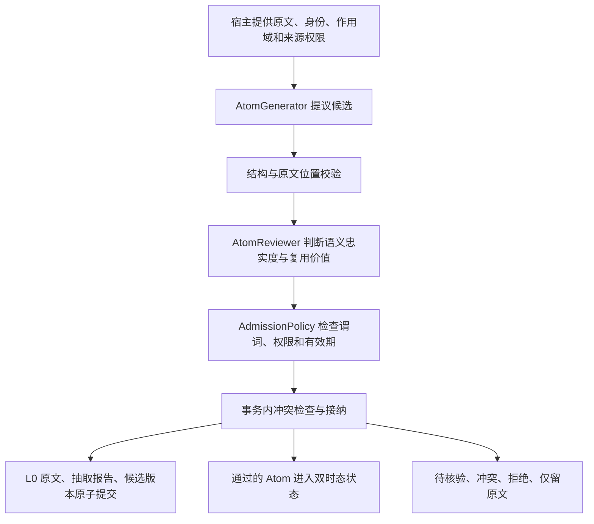

# 自动 Atom 抽取与接纳

`extract_atoms()` 将原文转换为候选，分别判断原文是否支持候选、内容是否值得复用，
然后交给已有的来源权限、谓词注册和双时态接纳规则。它是显式启用的新入口；
`remember()` 的旧 Claim 提取路径和 `remember_atoms()` 的显式候选入口保持兼容。

## 架构与职责



| 模块 | 职责 |
| --- | --- |
| `domain.py` / `ports.py` | 候选位置、审查结论、结果回执及生成器/审查器协议 |
| `consolidation/atom_extraction.py` | 调用预算、输入校验、语义与价值判定、幂等编排 |
| `consolidation/extraction_rules.py` | 不依赖模型的有限语法参考实现 |
| `consolidation/admission.py` | 宿主谓词与来源权限规则 |
| `consolidation/admission_runtime.py` | 候选与证据版本、冲突、原子提交、结果恢复 |
| `retrieval/atom_state.py` | 按现实有效时间和系统获知时间投影状态 |
| `evaluation/extraction.py` | 离线评测，生产流程不依赖它 |

这里的审查回答“原文是否这样表达”，不证明说话者所说的现实事实必然为真。
例如付款状态可注册为 `PredicateSpec("paid", value_type="boolean", allow_self_report=False)`，
用户自述不能直接变成已核验的付款事实。宿主必须提供合格业务证据，再调用
[显式核验接口](ATOM_ADMISSION.md)。本期不自动调用外部业务系统。

## 使用方式

```python
import asyncio
from agent_memory import (
    AdmissionPolicy, AgentMemory, AtomExtractionPipeline, MemoryScope,
    PredicateSpec, RuleBasedAtomAdapter, ScopeLevel, SourceAuthority,
)

async def main():
    scope = MemoryScope("demo", user_id="alice", session_id="chat-1")
    adapter = RuleBasedAtomAdapter(subject_id="alice")
    pipeline = AtomExtractionPipeline(adapter, adapter, scope_level=ScopeLevel.USER)
    policy = AdmissionPolicy([
        PredicateSpec("home_city"), PredicateSpec("response_language"),
        PredicateSpec("response_style"),
    ])
    # 必须来自宿主认证上下文，不能由对话文本或模型生成。
    authority = SourceAuthority(
        "authenticated-alice", subjects=("alice",),
        predicates=("home_city", "response_language", "response_style"),
    )
    async with AgentMemory.local("memory.db", scope=scope) as memory:
        result = await memory.extract_atoms(
            "以后用中文回答", pipeline=pipeline, authority=authority, policy=policy,
            idempotency_key="message-123",
        )
        print(result.decisions[0].action)  # ACCEPT
        print(await memory.extraction_status("message-123"))
        print(await memory.atom_status(result.admission.candidate_ids[0]))

asyncio.run(main())
```

默认作用域为 `SESSION`；上例由宿主明确选择 `USER`。判断为 `durable` 不会自行扩大作用域。
`extraction_status()` 返回首次提交的抽取结果；之后的人工核验或冲突变化通过
`atom_status()` / `atom_history()` 查看。候选记录包含 `payload.extraction`，保留原文位置、
审查原因和适配器版本。结构错误的候选没有候选 ID，但仍出现在抽取报告中。

## 判定过程

| 判定 | 处理 |
| --- | --- |
| 缺少必要字段、非标量值、模型试图改变作用域或发起修正 | `REJECT` |
| 原文位置缺失、重复引用无法定位、位置与引用不符 | `PENDING_VERIFICATION` |
| 审查器明确判定候选不被原文支持 | `REJECT` |
| 语义或复用价值不确定 | `PENDING_VERIFICATION` |
| 一次性内容 | `L0_ONLY` |
| 只适合本会话，但宿主要求提升至其他作用域 | `L0_ONLY` |
| 语义与价值通过，来源或谓词权限不足 | `PENDING_VERIFICATION` |
| 检查全部通过 | 进入既有接纳与冲突判断，可能为 `ACCEPT` 或 `CONTESTED` 等 |

`L0_ONLY` 仍保存候选和判断轨迹供审计，不发布可召回事实。计划、否定等非断言内容
不会通过默认 Atom 接纳规则变成当前事实。默认召回也不会借原始 L0 绕过接纳判断。
同一候选出现相互冲突的审查结论时，整个候选保留待核验。

## 接入模型

生成器实现 `AtomGenerator.generate_atoms(event)`，返回映射序列。每个候选必须显式包含：

```json
{
  "subject_id": "alice",
  "predicate": "home_city",
  "value": "Hangzhou",
  "kind": "fact",
  "modality": "asserted",
  "source_quote": "我住在杭州",
  "source_start": 0,
  "source_end": 5
}
```

位置采用 Python 字符串索引，左闭右开；不是 UTF-8 字节或 UTF-16 单元位置。
省略位置时，仅在引用在原文中唯一出现时推导位置。可选 `valid_from` / `valid_to`
必须是带时区 ISO 时间；缺省起点沿用来源的观察时间，不猜测历史有效期。
自动抽取不发起历史修正或临时覆盖；这些操作须由宿主使用显式候选入口。

审查器实现 `AtomReviewer.review_atoms(event, candidates)`，返回每个候选对应的
`AtomReview(candidate_index, faithfulness, retention, reasons)`：

- `faithfulness`：`supported`、`unsupported`、`uncertain`。
- `retention`：`durable`、`session`、`transient`、`uncertain`。
- `candidate_index` 是传入审查器的候选序号，必须完整、唯一。
- 检查完整原文中的主体、谓词、值、类型、断言方式、时间、否定、转述和条件。
  原文中出现一段相同字符串，不等于原文支持该候选。

两类适配器都需要 `version`。提示词、模型或绑定配置变更时必须更新版本。
模型输出的 `confidence`、`authority`、任意 `text` 不赋予权限；发布文本由已经审查的
结构化字段生成。模型审查仍可能出错，应在实际领域数据上评测后再部署。

## 参考规则的边界

`RuleBasedAtomAdapter` 使用完整消息匹配，不搜索引号内片段，不截断条件或转述前缀。
它将第一人称绑定到宿主指定的主体，并规范化以下内容：

- 居住地：杭州、上海、北京及对应英文名称。例如“我目前住在杭州”“I live in Shanghai.”。
- 回答语言：中文、英文；例如“以后用中文回答”“Always answer in English.”。
- 回答风格：简洁；例如“以后请简洁回答”“Always be concise.”。
- 对支持的计划、否定和一次性表达保留非事实判断，例如“我可能下周搬到上海”
  “我不住在上海”“这次用中文回答”。“请简洁回答”只判为会话内复用。

未覆盖的城市、改写、多句上下文、指代消解、复杂时间表达会弃权。外部生成器给出的
候选若无法由参考语法确认，审查返回不确定。规则生成与审查共享同一语法，只是独立重解析；
这不是两个模型的独立共识，更不是通用语义验证器。

## 事务、失败与幂等

生成和审查在数据库事务外执行。默认最多 32 个候选，内核最多 64 个；原文最多
32,000 字符；两个阶段各有默认 20 秒的协作式异步超时，上限各 30 秒。
宿主适配器必须使用可取消的异步 I/O，不要在事件循环中执行阻塞模型调用。

最后将 L0 原文、抽取报告、候选记录和发布结果放在一个事务中提交，包含无候选、
生成失败及审查失败的情况。生成失败不发布候选；审查失败保留待核验候选。
错误报告只记录通用故障码，不写入供应商异常文本。数据库失败会回滚并向调用者抛错。

相同作用域和幂等键先查保存结果，已有结果不会重新调用生成器。复用同一键但改变原文、
显式观察时间、来源权限或适配器配置会报错。首次默认生成的观察时间不会导致重试冲突。
并发请求可能同时调用模型，但只有一个批次提交，所有成功返回的请求均读取该批次。
不承诺模型调用 exactly-once。回执的调用次数和耗时属于提交的批次，不统计并发落败调用。
删除已保存来源或候选后，旧幂等键不能重新插入或恢复被删除内容。

这是同步入口：提交成功后才确认完成；生成期间尚未保存 L0，进程崩溃或调用被取消时
需要调用者重试。它没有预先持久化任务或后台恢复 worker；针对已存在记录的删除屏障
也不等于取消所有尚未提交的新请求。失败结果同样按原键缓存，重新抽取须明确使用新键。

## 评测与后续开发

```bash
python examples/evaluate_atom_extraction.py
python -m pytest tests/test_atom_extraction.py
```

示例使用临时 SQLite 数据库和 29 条**人工编写**的中英文样例，覆盖有效信息、噪声、
一次性要求、否定、计划、转述和语义篡改。不是实际用户对话集。固定样例包含两条已知
规则覆盖缺口，避免只展示成功案例：当前 9 条有效事实正确接纳、2 条漏提、0 条误接纳，
4 条篡改候选均拒绝。精确率 100%、召回率 81.8% 只描述此小样例集合。

评测同时输出拒绝率、失败数、调用次数和实际耗时。全拒绝实现会得到零召回，
没有输出时 precision 为 `null`；不将其报告为 100%。未接入模型计费数据，token 和费用
为 `null`。自动抽取行为测试同时覆盖 SQLite 和配置了测试 DSN 的真实 PostgreSQL。

后续优先补充领域真实对话评测、模型适配器和业务证据核验，再实现持久任务与恢复。
L2 场景知识和 L3 长期画像尚未由本入口自动生成；它们应依赖可追溯、已接纳的 Atom。

## 可选的来源遗漏审计（B2）

`AtomReviewer` 只核对已提出的候选，零候选不会调用它。新增的默认关闭
`SourceOmissionAudit` 在宿主选择的变更、未审计或高价值问题/原文范围上独立检查遗漏，
即使生成器返回零候选也运行。它明确记录遗漏候选、冲突、未解决或没有追加候选；
“已处理”不证明召回完整，也不构成现实世界中的否定证据。

补提候选仍经过原有位置、忠实度、权限和接纳规则，且必须保持待宿主核验，
不会因模型审查通过而自动成为有效事实。原有生成器/审查器及可信结构化入口保持兼容。
来源版本、范围、权限、删除代次、时间和适配器配置在调用后、复用时及事务末尾重新检查。
不新增表，也不依赖独立开发的 PR #18。协议、预算、持久任务接入、兼容和未完成的
本地 Qwen3.5:9B 质量门槛见[来源遗漏审计](source-omission-audits.md)。
