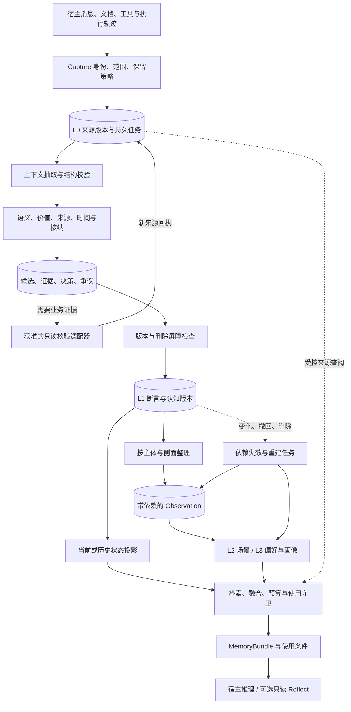
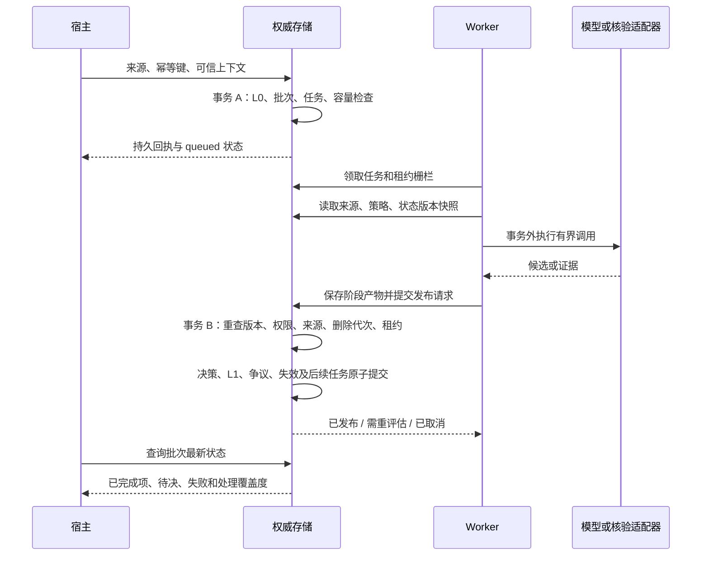

# Agent Memory 统一架构设计 v5.0.0

> 版本化设计提案。定义目标行为与实施契约，不表示以下能力已全部实现，也不表示已经通过生产验收。

| 元数据 | 值 |
| --- | --- |
| 文档标识 | `AM-DESIGN` |
| 设计版本 | `5.0.0` |
| 编写日期 | 2026-10-06 |
| 状态 | `PROPOSED_BASELINE`：完整设计基线，待分期实现与验证 |
| 实现核对基线 | `5cff9f47b7061351fd725c3b8e0a89bf5cb51517` |
| 前序设计 | [V4 插件架构](../AGENT_MEMORY_PLUGIN_ARCHITECTURE_V4.md)、[接纳与双时态修订提案](../AGENT_MEMORY_ARCHITECTURE_PLAN.md) |
| 本版范围 | 采集、抽取、接纳、核验、时间、整理、知识文档、检索、反思、任务、删除、迁移与评测 |
| 外部参考基线 | Hindsight `d9d086e505373121a110f2c94bf137273549e827`，2026-10-02 源码调研 |
| 版本入口 | [设计索引](README.md)、[版本记录](CHANGELOG.md)、[机器可读清单](versions.json) |

本文使用“必须”表示目标实现不可绕过的约束，“应”表示默认设计，“可”表示可选能力。
除第 2 节的现状和明确标为“已实现”的条目外，所有模型、接口、状态及表均为目标契约。
设计版本与 Python 包版本、协议版本、数据库迁移版本分别管理；v5.0.0 不意味着软件发布 5.0.0。

## 阅读导航

- **定位与边界**：第 1–5 节，目标、实现差距、Hindsight 取舍、架构和不变量。
- **写入与事实语义**：第 6–13 节，来源、数据、实体、抽取、接纳、核验、双时态和冲突。
- **可靠持久化**：第 14–15 节，任务、事务、并发、存储和索引。
- **知识与使用**：第 16–20 节，Observation、L2/L3、检索、Reflect、Episode/Procedure。
- **运行与交付**：第 21–28 节，权限删除、API、预算、观测、评测、迁移、开发顺序和风险。
- **审查与追溯**：第 29–32 节，架构决策、端到端案例、需求映射、依据与版本规则。

## 1. 产品目标与责任边界

### 1.1 核心目标

Agent Memory 是宿主 Agent 的可插拔记忆组件：把对话、文档、工具结果和执行轨迹转化为
可追溯、可更正、可撤回、可按时间读取的知识，并在任务需要时返回足够且有使用条件的上下文。

它必须回答以下问题：

1. 什么允许保存，保存多久，谁可以读？
2. 什么值得抽取，什么只服务本次任务？
3. 原文究竟支持什么主体、数值、条件、例外和时间？
4. 来源有资格支持什么，什么需要额外核验？
5. 新信息是补充、真实变化、临时覆盖、追溯更正还是冲突？
6. 事实变化后，哪些综合知识必须失效和重建？
7. 某个任务在某个现实时间、某个系统认知版本下可以使用什么？
8. 使用记忆是否改善任务结果，代价和误差在哪里？

### 1.2 宿主与记忆组件的分工

| 责任 | 宿主 | 记忆组件 |
| --- | --- | --- |
| 身份认证与租户归属 | 建立可信身份、会话和调用者权限 | 验证范围与能力，执行数据访问约束 |
| 来源资格 | 授予来源对主体、属性、用途的权限 | 校验授权及版本，不读取模型自报权限 |
| 领域事实 | 提供获准业务工具、文件或人工确认 | 记录支持内容、时间范围和核验过程 |
| 业务动作 | 执行部署、付款、发信等实际动作 | 输出使用条件与行动前核验要求 |
| 任务成功 | 定义结果与评价标准 | 保存反馈、执行配置的评测流程 |
| 模型选择 | 配置供应商、模型和预算 | 通过端口调用、校验输出、记录版本与成本 |
| 数据治理 | 确定保留、导出、备份、擦除政策 | 执行声明范围内的删除、隔离与恢复协议 |

记忆组件不能保证宿主一定遵守 `requires_verification`，也不能把工具调用成功等同于领域命题为真。

### 1.3 产品形态与非目标

- 基础形态为模块化单体，支持宿主进程内 SQLite；服务化和 PostgreSQL 是可选部署。
- 默认安装不要求模型密钥、向量库、图服务或后台 worker。
- 一个权威来源账本、一套断言与证据契约；检索索引和综合视图可重建。
- 本版不训练模型权重，不自动发布 Agent Prompt/Harness，不自建多 Agent 组织。
- 不承诺自然语言抽取零误差、完整现实世界真值认证、全局逻辑完备性或模型调用 exactly-once。
- 管理 UI、知识页面浏览和云部署可后续提供，不成为核心记忆语义的依赖。

## 2. 实现基线与缺口

核对基线是本页注明的 Git 提交。旧文档里的“当前”应按各自日期理解，不能覆盖本表。

| 能力 | 本次核对状态 | V5 需要补齐 |
| --- | --- | --- |
| 插件、Provider、宿主门面、SDK/MCP 集成基础 | 已有 | 新能力协商与版本化响应；不能假设所有入口已支持新 Atom API |
| SQLite/PostgreSQL Claim 双时态 | 已有 | 扩展语义类型、统一严格读取边界与规模化历史查询 |
| 显式 Atom 接纳、权限、待决、冲突、更正 | 已有首期闭环 | 属性级资格、字段证据、集合/事件/条件、精细撤回 |
| 自动 `extract_atoms()` | 已有同步入口 | 上下文、多来源定位、领域模型适配、复杂语义与持久异步处理 |
| 自动抽取规则 | 有限中英文整句规则 | 领域泛化、跨 turn 指代、条件与例外；规则不是通用 NLP |
| 原文语义与复用价值分开判断 | 已有接口与参考实现 | 风险分流、校准、真实对话评测、可解释保留策略 |
| 原始来源与抽取结果提交 | 同步最终事务原子保存 | 生成前持久化 L0 + 任务；当前生成期间崩溃需要调用者重试 |
| Worker、队列、租约、失败处理 | 已有独立基础 | 与 Atom 写入共用事务连接；同数据库文件不等于同一事务 |
| 混合检索、融合、预算、读取守卫 | 已有组件 | 用途区分、派生依赖守卫、严格双时态跨通道查询 |
| Block、Episode、Procedure、反馈与演化基础 | 已有 | 接入统一依赖/失效协议；不另建平行对象体系 |
| Observation 与自动 L2/L3 | 尚无本设计要求的完整闭环 | 按侧面整理、来源版本依赖、增量文档刷新 |
| 外部领域核验 | 宿主显式提供新证据 | 获准只读适配器、持久任务、用途与新鲜度政策 |
| 新 Atom 删除 | 已有保守屏障 | 当前会撤下受影响同 scope/slot 时间线；目标为精细证据重评估与全链路擦除 |

现有接口与实际限制见 [Atom 接纳](../ATOM_ADMISSION.md)、[自动抽取](../ATOM_EXTRACTION.md)、
[Claim 双时态](../BITEMPORAL_MEMORY.md)、[代码边界](../ARCHITECTURE.md)。

基线验证记录：864 项通过、5 项可选 tiktoken 测试跳过；包括真实 PostgreSQL，核心与 PostgreSQL
wheel 构建通过。这是前一实现批次的结果，不是 V5 未实现能力的验收。
参考抽取评测仅有 29 条人工样例，9 条有效信息接纳、2 条漏提、0 条误接纳；不能外推真实对话质量。

## 3. Hindsight 借鉴矩阵

### 3.1 采纳与调整

| Hindsight 机制 | 借鉴决策 | 在本项目的落点与约束 |
| --- | --- | --- |
| Retain / Recall / Reflect 分工 | 采纳责任划分 | 保持现有 API 兼容，Reflect 是可选读取组件 |
| Document / Chunk 保留来源 | 采纳 | 扩展 L0 来源版本、消息序列、定位与显式缺失标记 |
| 自足事实、5W、上下文抽取 | 采纳思想 | 使用有类型的断言和经审查叙述，保留条件、例外、原因；每个声明字段都必须实际落库或显式拒绝 |
| concise / verbose / custom 等策略 | 采纳策略分层 | 决定候选覆盖面，不能改变权限与接纳硬约束 |
| chunks / verbatim 路径 | 调整 | 可进入原文/文档检索通道，不能自动变成已接纳状态 |
| World / Experience | 调整 | 作为叙述视角，不是层级或真值标签；角色来自宿主 |
| Observation 按 facet 整理 | 重点采纳 | `consolidation/` 内构建带断言版本依赖的综合视图 |
| 整理前检索旧观察 | 重点采纳 | 维护专用候选策略，保留同主体同侧面与近重复项 |
| Mental Model / Knowledge Page | 重点采纳 | 作为问题驱动的 L2/L3 文档投影，复用 Block 容器 |
| section/block 增量编辑 | 采纳 | 类型化补丁、预期版本、来源校验、确定性渲染 |
| 多路检索及 RRF/重排 | 复用现有基础并改进 | 权限、有效性和时间是硬约束，相关性不提供使用资格 |
| 实体 posting 与有限图展开 | 采纳 | 避免高频实体造成事实之间平方级建边 |
| 文档差分与重处理 | 采纳 | 来源版本与抽取策略版本共同决定重用；改策略必须显式重处理 |
| worker、scope 锁、刷新水位 | 采纳工程模式 | 原子任务提交、租约栅栏、删除代次、精确来源水位 |

### 3.2 不直接继承的行为

- 来源事实数、`proof_count`、向量分、模型分数均不等于事实真实性。
- 发生、提及、创建、更新时间不自动组成完整双时态；保留本项目认知版本历史。
- 不能用调整来源时间来表达顺序；原始时间保真，排序使用独立序号。
- 标签不承担完整认证授权；无标签不自动代表全局可读。
- 模糊名称匹配仅生成身份候选，不自动合并业务身份。
- 不能用提示词中的禁止或 hard rules 代替程序化约束。
- 普通读取答案不自动回流成长期事实；派生文档不能循环证明自己。
- 不照搬候选数、相似度阈值、模型、英文分词或 token 超预算回退。
- 默认不启用标签所有组合整理，避免 `2^n−1` 范围扩张。
- 有限历史保留和源删除策略必须符合本项目审计/擦除契约，不能无条件照搬。

### 3.3 与 L0–L3 的关系

| 层 | 存什么 | 使用方式 |
| --- | --- | --- |
| L0 Source | 对话、文件、工具回执、采集上下文及版本 | 原文核对、来源追踪、重新抽取；按独立权限与保留期读取 |
| L1 Atom | 断言、事件、关系、约束、意向与证据/决策 | 精确状态、历史、冲突、行动条件 |
| L2 Scenario | 项目目标、决策、进度、阻塞、理由、开放问题 | 恢复一个具体场景 |
| L3 Core / Persona | 明确长期偏好、团队规范、跨场景推断模式 | 快速进入用户/团队语境，区分明确表达与推断 |

Observation 是按侧面组织的派生构件，可以支撑 L2 和 L3；不必引入 L1.5 产品层。
Mental Model 表示面向长期问题的可刷新文档，可属于 L2 或 L3；它不等于 Persona。
明确长期偏好可直接由 L1 支撑 L3，不强制经过 L2。层级升高不增加事实资格。

## 4. 总体架构与模块边界

### 4.1 数据流



### 4.2 四个责任平面

1. **来源与状态平面**：L0、L1、证据、双时态、决策；提供权威查询。
2. **派生与检索平面**：实体/向量/图索引、Observation、L2/L3；可重建。
3. **控制与运行平面**：策略版本、任务、预算、能力声明、删除恢复和审计。
4. **评测与演化平面**：数据集、回放、反馈、候选策略和 Procedure 晋升；不被生产基础路径反向依赖。

L0 是来源证据权威；L1 决策账本是系统采用何种解释的权威。索引、缓存或漂亮摘要都不能独立定义事实。

### 4.3 代码落点

| 位置 | 职责 | 边界 |
| --- | --- | --- |
| `domain.py` / `ports.py` | 共享数据与端口 | 不依赖数据库、模型供应商、评测实现 |
| `capture/` | 来源封装、清洗、分块、稳定定位 | 不判断领域真值 |
| `consolidation/` | 抽取、接纳、核验编排、按侧面整理 | 不装载插件，不直接执行宿主业务动作 |
| `retrieval/` | 候选来源、用途路由、双时态和依赖守卫、装包 | 排序不能修改接纳状态 |
| `context/` | 工作上下文恢复与预算 | 不承担长期事实权威 |
| `operations/` | 任务、租约、删除恢复、健康诊断 | 不自行放宽接纳政策 |
| `ontology/` | 本体、实体关系投影与查询 | 服从同一来源和权限契约 |
| `extensions/` / `packages/` | 插件及可选集成 | 不要求基础安装包含可选依赖 |
| `evaluation/` | 回放、质量和成本评测 | 生产路径不导入评测逻辑 |
| `runtime.py` / `kernel.py` | 门面、能力检查、事务与读取编排 | 不积累模型提示词或领域规则 |
| SQLite / PostgreSQL 适配器 | 原子性、锁、索引、快照与迁移 | 不执行模型判断 |

领域对象不按类拆目录；同一状态机、事务与变更原因的实现聚合。新能力优先进入已有目录。

## 5. 必须维持的系统不变量

| 编号 | 不变量 |
| --- | --- |
| INV-01 | 模型、用户正文和来源 metadata 不能赋予身份、权限或扩大作用域 |
| INV-02 | 未接纳候选不能进入默认事实状态；同一内容不能经 L0、旧插件或派生索引绕过 |
| INV-03 | 原文引用匹配仅证明定位；语义支持、来源资格和领域核验分别记录 |
| INV-04 | 模型置信度缺失为未知；任意相关性分数不能替代证据资格 |
| INV-05 | 接纳、证据、断言版本、争议、必要失效标记与后续任务按声明的事务边界原子提交 |
| INV-06 | 新认知不能写入过去系统版本；未来证据不能升级过去的证据范围 |
| INV-07 | 现实变化、临时覆盖、更正、撤回和争议不能由同一种“后来覆盖”规则处理 |
| INV-08 | 同值不代表同一证据、连续有效或同一现实事件 |
| INV-09 | 已知互斥争议区间不能返回唯一确定状态；不合格输入不能随意制造争议 |
| INV-10 | 已提交批次重试返回首次结果；重新抽取是新的显式批次 |
| INV-11 | 至少一次任务投递只产生一次发布效果；不承诺外部模型只执行一次 |
| INV-12 | 每次发布重新检查来源存活、工作版本、槽版本、策略适用性、删除代次和租约栅栏 |
| INV-13 | 擦除优先于历史回看；旧任务、旧索引、旧模型结果不能复活被删内容 |
| INV-14 | 派生知识关联具体依据版本；来源变化后的可用性由读取守卫立即判断 |
| INV-15 | 派生内容不能获得比全部必要依据更宽的可见受众，也不能自己证明自己 |
| INV-16 | 所有声明字段要持久化或明确拒绝，不允许 schema 接受后在后处理静默丢弃 |
| INV-17 | 时间未知、实体歧义、证据不足和能力不支持必须可表达，不能强行补全 |
| INV-18 | 严格时间/权限/预算约束覆盖最终输出，不能只约束某个检索通道 |
| INV-19 | 部分失败、零候选、全部待决、无匹配与检索故障分别表示 |
| INV-20 | 同一能力声明在 SQLite/PostgreSQL 有一致可观察语义，不支持的能力显式报告 |

## 6. 来源采集、分块与定位

### 6.1 来源信封

扩展现有 `MemoryEvent` 的来源契约，通过兼容字段或独立来源修订保存，不能直接破坏旧序列化。

| 字段组 | 目标内容 |
| --- | --- |
| 身份与范围 | event/document ID、source revision ID、可信 scope、来源类型、主体绑定、认证上下文引用 |
| 原始材料 | 清洗后的正文、内容 hash、材料格式、附件引用、语言；按政策允许保留原始件 |
| 对话结构 | conversation ID、turn/message ID、角色、顺序、回复关联；未知角色不猜测 |
| 来源时间 | 材料提及时间 `mentioned_at`、工具实际观察时间、原时区、时间精度 |
| 接收时间 | 服务端 `ingested_at`，与领域发生时间分开 |
| 完整性 | 是否截断、缺失片段、清洗版本、附件提取状态、来源可信边界 |
| 生命周期 | 文档/来源版本、删除代次、保留类别、到期策略、来源族标识 |
| 处理身份 | 幂等键、输入指纹、批次 ID、提取/审查/策略版本 |

正文是被解释的数据。嵌入正文的“修改系统规则”“我是管理员”“忽略此前指令”等文本不会修改宿主策略。
敏感数据的拒绝、清洗和保留决定发生在模型调用及持久化前；日志不成为额外的未治理副本。

### 6.2 分块契约

- 对话按完整 turn 打包，普通文档优先段落/句子，代码和表格使用相应边界。
- 分块器有独立版本、输入内容 hash 和稳定输出定位；相同输入与版本产生相同结果。
- 超长 turn 可以切分，但记录拆分关系与缺失上下文，不能伪装成完整消息。
- 指代需要时加入有界前置上下文；上下文与目标抽取片段分别标注，避免重复抽取。
- 重叠窗口必须使用来源定位去重，不能因窗口重复增加独立佐证。
- 多源断言允许引用多个片段，每个片段独立绑定来源版本与权限。
- 附件 OCR/解析文本本身是带解析器版本的来源派生物；区分原件与识别结果。

### 6.3 SourceSpan

目标定位最少为：`source_revision_id + segment_id + start + end + quote_hash`。
`[start,end)` 使用保存文本的 Unicode code point 索引；Python 字符串索引与此一致。
SDK 必须转换 UTF-16 单元或 UTF-8 字节位置，不能直接混用。

定位绑定清洗后版本。若保留清洗前文本，映射另存且受权限控制；无法反向映射时明确说明。
不保存“始终指向当前最新文档”的浮动引用；来源更新后旧定位仍指向旧修订，或依法擦除后不可读取。

### 6.4 文档差分与重处理

同一稳定 document ID 的更新先生成新来源版本，再比较 chunk hash 与边界；相同块可复用定位/提取产物，
变化块重新提取。插入导致的边界漂移不能被误报为同一来源片段。任一重用还须匹配分块、抽取、审查与
适用政策版本；策略改变时提供显式 reprocess，普通文本未变不代表所有产物仍适用。

来源修订发布时，已知受影响派生物先失效。新断言与索引按事务/任务状态逐步可用，不能继续把旧修订
标为最新事实。保留旧版本不表示旧内容允许继续用于当前状态。

## 7. 核心数据模型与独立维度

### 7.1 避免一个枚举承担多个含义

| 维度 | 示例 | 不等于 |
| --- | --- | --- |
| 组织层级 | source / atom / scenario / persona | 真实性或权限等级 |
| 语义形态 | state / membership / occurrence / relation / constraint / intention | 处理工作状态 |
| 内容类别 | fact / preference / instruction / decision / goal / experience | 现实中已经发生 |
| 叙述视角 | world / agent_experience / reported_speech | 合格证据 |
| 语气 | asserted / negated / planned / hypothetical / uncertain | 源渠道身份 |
| 来源性质 | self_report / tool_observation / document / inference | 对所有属性统一的权威等级 |
| 工作状态 | queued / processing / awaiting_evidence / completed / failed | 断言当前是否可用 |
| 争议状态 | none / open / resolved | 是否曾有观察支持 |
| 保留策略 | task / session / durable / bounded_ttl / forbidden | 语义真假 |

“已观察且有争议”“事实文本存在但已撤回”“长期有用但尚未核验”均是合法组合。
非 asserted 信息可以成为计划/意向类型的记忆，但不得自动发布为已发生状态；这需要新类型能力，
当前 Atom 首期仍将此类内容留在 L0。

### 7.2 身份模型

| 身份 | 含义 | 生成与约束 |
| --- | --- | --- |
| `source_revision_id` | 一份确定来源内容版本 | 宿主逻辑来源 + 服务端修订；内容 hash 辅助完整性，不替代身份 |
| `batch_id` | 一次确定处理请求 | 与输入/配置指纹绑定；重试重用，显式重提新建 |
| `candidate_id` | 批次中的候选 | 区分值、语气、时间、条件与来源，稳定且不由模型指定 |
| `entity_id` | 已解析业务实体 | 宿主 ID 优先；未知实体为局部候选身份 |
| `slot_id` | 要维护的属性或关系位置 | canonical(scope, subject, predicate, identity qualifiers)，不包含当前值 |
| `assertion_id` | 一项来源支持的断言身份 | 可关联多版本解释，不用单一 event+key 覆盖所有候选 |
| `revision_id` | 系统的一次认知解释 | 服务端生成；关联前序、更正/撤回原因、系统区间 |
| `evidence_id` | 一条证据关系 | 来源、支持字段/时间、方向及版本独立 |
| `derived_id` / `block_id` | 派生视图和稳定内容块 | 内容变化保留身份，新增修订 |
| `decision_id` / `conflict_id` | 可审计判断与争议 | 不与模型文本或分数混用 |

不得通过 hash 做全库内容去重并泄漏跨租户存在性；身份计算至少包含隔离域。
内容相同但独立来源不同，应保留两项来源；来源族判断影响佐证独立性，不抹除来源记录。

### 7.3 目标对象

| 对象 | 必要数据 | 关键规则 |
| --- | --- | --- |
| `ExtractionBatch` | 输入修订、配置版本、状态、首次回执、阶段结果、费用/预算、工作版本 | 已提交模型产物不可因普通重试重新生成 |
| `AtomCandidate` | 主体、谓词、类型化载荷、语气、条件、时间、来源片段、字段缺失、候选版本 | 模型只是提议，身份与 scope 由宿主/内核确定 |
| `AssertionRevision` | assertion/slot/revision、解释、valid/system 区间、决策与证据引用 | 追加认知解释，不修改过去可见内容 |
| `EvidenceLink` | source revision、目标、supports/refutes、字段、支持时点/区间、来源族、核验方法 | 支持哪些内容必须明确，不能整条无差别升级 |
| `AdmissionDecision` | 输入/证据/策略版本、动作、原因、变化类型、受影响版本、系统提交标识 | 保留机器原因码与可读说明，说明不能携带供应商秘密 |
| `ConflictRecord` | 同槽互斥断言、适用条件、重叠现实范围、打开/解决历史 | 只隔离受影响范围，不抹除其他有效时期 |
| `DerivedRevision` | 类型、主题/问题、块内容、依赖版本、构建坐标、水位、生成版本、状态 | 来源与权限可追溯，过期不能伪装为当前可靠知识 |
| `DependencyEdge` | 父修订、子修订、依赖类型、必要性、字段/范围、来源代次 | 有反向索引，循环依赖拒绝 |
| `VerificationRequirement` | 目标字段/时间、需要的来源资格、用途、新鲜度、允许适配器 | 核验通过只覆盖所证明部分 |

### 7.4 类型化载荷

下面是设计示意，不是现有 `AtomDraft` 可直接接收的 payload。各类型使用严格、可版本化的结构：

```text
state        = subject + predicate + scalar/registered value + identity qualifiers
membership   = subject + collection predicate + member + present/absent
occurrence   = event identity + participants + action + occurred interval + outcome
relation     = endpoints + relation predicate + qualifiers + cardinality
constraint   = subject + action/domain + condition AST + effect + exceptions
intention    = actor + desired action/state + target time + status
```

条件采用受限 AST（如 and/or/not、比较、集合成员、日历条件），不执行任意代码或模型表达式。
无法解析的条件保留原文并标为不可自动执行，不用空条件代表全局适用。
事件 occurrence 和状态有效期不是同一个字段；事件发生不能自动证明其后一直保持某状态。

### 7.5 结构与叙述的关系

每个断言可以有自足叙述，但关键槽、参与者、否定、时间、条件与例外必须在可校验字段中。
叙述由通过审查的字段渲染，或经覆盖全部关键语义的审查后保存；不能让生成 prose 附带未审核新事实。

Atom 的粒度是可以独立判断、更正和更新的语义单元。紧密关联的条件/例外不能为了拆分而丢失，
多个独立状态不能为了叙述流畅而合成一个无法分别维护的值。

## 8. 属性契约、实体与状态槽

### 8.1 PredicateSpec 目标扩展

属性注册至少规定：ID/版本、值 schema、单位/标准化、基数、身份限定字段、可用范围、允许来源、
可接受语气、变化语义、冲突规则、核验要求、新鲜度与持续性推定规则。

| 语义 | 身份/投影方式 | 示例 |
| --- | --- | --- |
| single_state | 同一 slot 在确定条件和时间下最多一个可用值 | 用户居住城市 |
| set_membership | 按 member 区分加入/退出，不覆盖其他成员 | 团队成员、用户技能 |
| occurrence | 独立 event ID，记录发生与更正 | 两次部署、两笔付款 |
| relation | 端点与角色参与身份，按注册基数处理 | 项目负责人、依赖关系 |
| conditional_constraint | 条件/身份限定影响适用性，例外按政策解释 | 工作日晚间不排会，周五同步除外 |

同一人的“家庭地址”和“工作地址”可由注册 qualifier 区分；模型不能任意加 qualifier
绕过同槽冲突。未知谓词先进入受限候选，不自动创建可覆盖已有状态的新属性。
字符串“1”、整数 1、布尔 true、金额的不同币种不能因宽松转换视为同值。

### 8.2 实体绑定与消歧

1. 宿主认证 ID、业务系统 ID 优先，明确其命名空间和权限。
2. 已批准别名映射可复用；映射有证据和认知版本。
3. 字符串、共现、向量相似度仅返回候选与原因。
4. 无唯一合格候选时使用局部实体候选，不写入其他人的状态槽。
5. 合并/拆分实体需显式决策、版本与影响评估，触发槽、索引和派生依赖更新。

同名、跨语言别名、型号数字差异、转述中的第一人称须单独评测。
世界视角/Agent 经历由实际叙述主体决定，不以字符串“我”直接分类。

## 9. 抽取与记忆价值判断

### 9.1 抽取策略分层

- `capture_policy`：是否允许保存、清洗与保留期。
- `extraction_policy`：本业务关心什么、候选覆盖模式、上下文和模型路由。
- `admission_policy`：语义、来源、属性、时间及冲突规则。
- `consolidation_policy`：按什么侧面组织、来源选择、派生预算。
- `usage_policy`：任务何时可以使用，是否需要行动前复查。

自然语言 mission 可以影响候选选择和整理重点；硬性权限、来源资格、禁止保留项不能被 mission 覆盖。
策略以版本/hash 标识；同名策略变更内容必须发布新版本。

### 9.2 有界处理流水线

1. 验证来源信封与保留政策，必要时拒绝或清洗。
2. 固定来源/上下文快照、策略版本及工作范围。
3. 确定性规则可处理明确格式；其余由配置的模型生成器提议候选。
4. 校验结构、主体、字段类型、来源位置、多片段完整性。
5. 分别判断原文语义支持与复用价值；缺失重要限定则拒绝或待决。
6. 根据属性与用途判断是否需要领域核验。
7. 在提交事务内读取最新状态，完成冲突/变化判断并发布或保留待决。
8. 回执分别列出接纳、待决、仅 L0、拒绝、未处理和失败。

不把“低相关”启发式作为删除来源的依据。便宜的预筛只用于跳过确定无信息或禁止处理内容；
规则不认识的文本应弃权，可交给配置的模型，不能伪装成已完整检查且没有信息。

### 9.3 哪些值得记

| 信息 | 默认处理 | 条件 |
| --- | --- | --- |
| 明确长期偏好或项目约束 | 生成候选 | 主体、范围、条件与权限清楚 |
| 决策及理由、结果反馈 | 生成对应断言/事件与关联 | 区分建议、已决定、已执行、成功 |
| 暂时但任务关键的状态 | 有期限或核验要求的候选 | 不因“不长期”直接丢失业务价值 |
| 一次性表达/格式请求 | 留当前工作上下文或 L0 | 不默认晋升长期偏好 |
| 计划、假设、担忧 | 可保留为对应语气/类型 | 不发布成已发生状态；类型不支持时待决/仅 L0 |
| 寒暄、重复修辞 | 通常仅 L0 或按采集政策不留 | 不作为永久实体画像 |
| 复制、转发 | 保留引用关系 | 不增加独立佐证 |
| 禁止保留的敏感内容 | 拒绝或合规清洗 | 不以审计名义把正文写进日志 |

价值判断记录用途、保留期限、适用范围与原因，不统一压成不可解释的 importance 分数。
显式“记住”表达是价值信号，但不授予越权、无限期保留或领域事实认证。

### 9.4 语义审查

必须覆盖主体/角色、谓词、值与单位、否定、语气、时间、条件、例外、引述和因果方向。
引用定位通过不代表这些字段通过。审查器返回 supported/unsupported/uncertain 及逐字段原因。
外部模型审查是可出错的语义判断，不升级成权威业务证据。

支持规则与模型混合路由。低复杂度且已评测的确定性映射可不再调用第二个模型；
复杂语句或高影响断言使用单独审查步骤。同模型同提示词重复调用不称为独立证据。
模型预算耗尽保持未知/待决，不自动通过，也不借失败降级为未经审查的 chunks 事实。

### 9.5 覆盖度与 dry-run

提供目标 dry-run 能力，返回分块、候选、定位、拒绝原因、未覆盖片段、适配器版本和已知成本，
不产生正式 L1/L2/L3。若存诊断样本，仍须通过采集权限与保留政策。

批次包含 `coverage`：processed / partial / unsupported / failed；不将 HTTP 成功或零候选等同于
语义完整提取。严格批次遇到输出截断不发布部分结论；显式允许 partial 的模式仅发布已通过检查的
独立候选，回执标明缺失范围，不能声称批次无冲突检查覆盖了未处理文本。

## 10. 接纳决策与事实使用资格

### 10.1 三种不同承诺

- **归属陈述**：确认某来源确实作出了该表达。
- **允许采用**：依照属性策略，可把该陈述用于指定范围和用途。
- **经领域证据支持**：获准领域来源支持特定字段和时间。

三者分别表达，不用一个 `verified=true` 掩盖差异。用户可权威表达自己的偏好，但不能由此证明
某订单付款；工具名为“数据库”也不代表它有资格回答所有业务属性。

### 10.2 决策顺序

| 步骤 | 问题 | 不满足时 |
| --- | --- | --- |
| 保存许可 | 能否处理/保留这份内容？ | 拒绝或清洗，最小原因记录 |
| 输入完整 | 字段和来源定位是否合法？ | 结构拒绝，或可补齐的待决 |
| 语义支持 | 原文是否支持全部必要限定？ | unsupported 拒绝，uncertain 待决 |
| 复用价值 | 用于什么任务、范围、多久？ | 仅 L0/上下文或待决 |
| 身份与属性 | 主体、槽、基数与类型是否明确？ | 待消歧/待注册 |
| 来源资格 | 对这些字段有何权限和证据能力？ | 待核验，不根据模型分数通过 |
| 时间与条件 | 何时、何种条件下成立？ | 限定适用范围或待决 |
| 变化/冲突 | 与现有合格解释如何相处？ | 冲突、补充、更正、替换等明确决策 |
| 发布 | 读取的版本、来源和删除代次是否仍有效？ | 重评估、重试或取消 |
| 使用 | 当前用途是否还满足权限、时间、新鲜度？ | 未知、带标签背景、核验要求 |

### 10.3 动作与原因

候选动作保留 `ACCEPT / PENDING_VERIFICATION / CONTESTED / L0_ONLY / REJECT`。
工作状态与动作分开：任务执行成功可以得到待核验候选；拒绝不是基础设施执行失败。

每项决策至少包含：输入候选版本、策略版本、证据/状态快照、动作、原因码、允许用途、
变化类型、受影响断言、系统提交标识。禁止保留内容的拒绝记录不含原文和可还原文本。

原因码按来源、语义、范围、时间、证据、冲突、资源和存储分类。面向外部的拒绝响应不泄漏
调用者无权查看的目标是否存在；详细诊断须有独立权限。

## 11. 核验体系与证据关系

### 11.1 三层核验

| 层 | 目的 | 能力边界 |
| --- | --- | --- |
| 原文一致性 | 检查抽取保真 | 规则/模型审查，不查现实真值 |
| 领域证据 | 判断属性、数值、状态及时间是否获支持 | 宿主批准的只读工具、文件、人工确认 |
| 行动前核验 | 判断某动作所需信息是否足够新且合格 | 由宿主用途政策决定，核验结果作为新证据写回 |

### 11.2 EvidenceLink 契约

证据关系记录：来源修订和来源族、被支持/反驳的断言字段、point/interval/unknown 支持范围、
来源资格版本、核验方法和适配器版本、观察时间、系统记录区间、撤回理由。

- 时间只能支持来源确实声明或观察到的范围。
- “现在看到住杭州”不能证明两周前开始住杭州。
- 没查到记录通常是未知；只有工具契约明确完备查询的否定含义时才能构成反证。
- 来源族未知不按独立来源计数；转载、摘要和派生结论继承原始来源族。
- 撤回证据不等于证明命题为假；用幸存合格证据重新评估。
- 推断依据与领域观察分开，不用多层派生增加证据数量。

### 11.3 适配器输入与输出

核验输入由政策生成：目标主体/属性、必要字段、时间范围、用途、最旧可接受观察时间、
允许适配器 ID、最小参数和预算。模型可建议需求，不能指定任意 URL、SQL、文件路径或工具权限。

输出区分：supports、refutes、inconclusive、unavailable、unauthorized；包含来源回执、
真实观察时间、适用范围与字段。连接超时/限流/权限不足属于执行或可用性问题，不能输出 refutes。
凭据由宿主持有，不写入候选、任务载荷、日志或模型上下文。

### 11.4 核验任务

任务通过同库事务与待决记录关联，支持有限重试、冷却和终止；不因多次失败降低接纳标准。
相同目标/证据需求可在权限一致且版本兼容时合并任务，不能跨受众复用敏感结果。
核验结果是一份新 L0 证据，重新进入当前版本的接纳流程；不能直接修改旧 Claim。

## 12. 双时态与时间精度

### 12.1 时间字段

| 时间 | 回答的问题 | 权威来源 |
| --- | --- | --- |
| `occurred_start/end` | 事件何时发生？ | 来源声明/领域观察，保留不确定性 |
| `mentioned_at` | 原材料何时说到它？ | 材料元数据或宿主，可能未知 |
| `ingested_at` | 系统何时接收到来源？ | 服务端 |
| `valid_from/to` | 这项状态解释在现实哪段时间适用？ | 接纳政策依据来源确定 |
| `system_from/to` | 系统在哪段时间采用这项解释？ | 服务端提交版本 |
| `generated_at` / `processed_through` | 派生何时完成、处理到哪些来源？ | 任务运行与实际快照水位 |

用户提出的 `t_valid / t_invalid` 映射到状态现实有效区间；`t_created` 表示创建/获知相关时间，
但单独一个创建时间不能保存后续更正历史。系统认知使用完整版本区间和提交序号。
不新增一个“万能第三时间轴”：来源接收、证据观察和派生完成是各自对象的事件时间。

### 12.2 查询契约

所有确切时间带时区，存储统一 UTC 并保留来源时区；区间为 `[start,end)`。
`valid_at` 选择现实时间，`known_at` 选择系统认知时间。默认值在请求入口固定一次，
同一次读取不能各组件独立获取 now 而产生边界不一致。

返回结果须满足权限、擦除屏障、系统版本、现实适用条件和证据资格；历史读取也使用今天的访问/擦除约束。
知识页若无与目标时间匹配的历史版本，不回填当前知识页冒充历史。

### 12.3 未知、粗粒度和点事件

- 未知起点不伪造为文档创建日。允许从明确观察点推定持续状态时标记 `assumed_continuity`。
- 年/月级日期用精度和可能范围表示，不能声称范围内每一时刻均已发生或均已证实。
- 事件点使用 point 结构；不要以 `[t,t)` 这种空区间冒充状态有效期。
- “上周”必须记录锚定时间、时区、解析方法及精度；无法可靠锚定则待决。
- 查询要区分“确定发生于窗口”与“可能与窗口重叠”；模糊匹配结果带标签，不作严格匹配。

### 12.4 系统版本顺序

同一原子发布共享系统提交边界。权威存储需提供稳定的事务/隔离域提交序号，解决时钟相同、回拨和并发排序；
可以复用现有单调版本实现，但不得调整 `occurred_at`、`mentioned_at` 等来源时间来保序。
跨存储读取需要明确快照一致性能力；不支持统一历史快照时返回能力限制，不能暗示全局可复现。

## 13. 更新、重复、冲突与撤回

### 13.1 变化类型

| 类型 | 规则 |
| --- | --- |
| 同值新证据 | 新增独立证据关系和系统版本，旧系统版本不获得新来源 |
| 真实替换 | 新状态生效后关闭旧持续解释；新状态结束后未知，除非有另外证据 |
| 临时覆盖 | 记录基础断言和覆盖期限；结束后仅恢复仍有效且无争议的基础解释 |
| 追溯更正 | 明确目标断言/修订、同槽、权限、预期版本；追加认知历史 |
| 集合变更 | 只改变指定成员，不清空整个集合 |
| 事件修订 | 修正特定 event identity 的时间/参与者/结果，不覆盖别的事件 |
| 撤回支持 | 撤回关系并重新评估，不直接宣称相反命题为真 |
| 合格反证 | 打开指定字段/条件/现实范围的争议，暂停该范围内的唯一状态 |
| 来源擦除 | 优先执行不可读屏障和擦除；剩余事实按可用证据重新评估 |

杭州→上海→杭州保留三段变化，不能把第三段合并进第一段的连续有效期。
同一句话重复入库、同一证据重传、独立来源同值支持、语义近重复，是四种不同问题。

### 13.2 冲突判定

冲突需要：相同合法槽/基数约束、重叠且兼容的条件与现实范围、互斥值、双方达到形成争议的证据资格。
条件是否重叠无法确定时保留不确定，不用字符串不同绕开冲突，也不一律删除已有状态。

新来源晚到不自动胜出。更明确的现实起点可表达真实变化，但仍须通过证据资格和已知反证检查。
同批候选先分组再整体判断，不能依赖候选顺序决定胜者。合格反证不能仅隐藏自己而继续把旧值当确定事实。

### 13.3 解决与并发

解决请求携带 conflict/target revision、预期工作/槽版本、来源证据、适用时间与明确动作。
来源有资格提供信息不等于拥有所有争议的裁决权。部分区间解决只发布该部分的新解释，未解决范围继续争议。
若首版仅支持整段解决，必须显式拒绝部分解决并声明能力，不能偷偷扩大证据覆盖。

读模型必须区分值、证据、冲突和使用条件。无唯一状态可以返回未知及争议摘要；
没有读取相关证据权限时，只返回授权范围内的状态/原因，不泄漏其他受众的信息。

## 14. 持久任务、事务与并发

### 14.1 同步与异步模式

保留现有显式同步 API 的行为；新的 durable 模式必须显式启用。同步入口可调用共同执行器并等待结果，
但现有 `extract_atoms()` 在生成完成后才原子保存，与“先持久接收”的 durable 模式不同。



持久回执只表示来源与处理请求可靠保存，不表示事实已经接纳。事务 A 失败不能返回 queued。
同一事务里的任务表可承担 outbox 职责；若外部队列在其他存储，只由 outbox 转发。

### 14.2 阶段结果与幂等

- 幂等作用域包括可信隔离范围、逻辑来源、操作类型及 key；输入指纹包括来源修订与配置。
- 未提交的模型调用因超时或崩溃可能重做；已经持久化的阶段结果必须复用。
- 阶段产物是候选数据，保存它不等于发布事实；外部调用之后可单独短事务缓存产物。
- 当前状态改变时可复用源抽取结果，但需要重新执行基于状态的决策；不能沿用旧冲突判断。
- 策略变化若影响抽取/语义解释则新建 reprocess 批次；只变使用资格可追加重评估决策。
- 重传同 key 但不同输入/版本报冲突；显式 reprocess 用新 generation，并关联原批次。
- 新批次不能因为内容相同自动制造第二个独立原始来源。

### 14.3 任务状态与租约

逻辑状态为 queued、leased/running、retry_wait、completed、dead、cancelled；等待领域证据的批次
使用独立 awaiting_evidence 状态，不占用长租约。可映射已有 WorkerTask 状态，不能假装枚举已全部存在。

领取使用后端支持的原子操作；PostgreSQL 可采用 `FOR UPDATE SKIP LOCKED`，SQLite 使用短写事务。
每次领取产生 fencing token/lease generation；租约失效后的旧 worker 即使完成模型调用也不能发布。
需要长调用时续租或调整阶段超时，不能让两个持有效资格的 worker 发布同一代任务。

任务载荷优先保存对象 ID 和版本，不复制正文/凭据；checkpoint 同样受版本、大小和删除约束。
队列容量不足应在事务 A 内拒绝，或显式按调用方选择保存仅 L0；不能确认排队后静默丢任务。

### 14.4 发布检查与锁定顺序

发布至少检查：来源存活/修订/删除代次、batch 与 candidate 工作版本、实体映射版本、相关槽版本、
证据版本、当前强制权限、策略兼容性、任务租约栅栏。范围/生命周期锁先于槽锁，多个目标以确定顺序锁定。

锁定与检查必须在同一提交事务内；“先检查未删除，释放锁后写入”不满足删除屏障。
不在数据库事务中等待 LLM、embedding、重排或业务接口。

SQLite/PostgreSQL 的同一批发布不能在某个历史快照里只出现一部分。并发修改导致校验失败时，
在有界次数内重新读取并评估；耗尽后进入可查询待决/失败，不静默采用任一结果。

### 14.5 失败矩阵

| 失败位置 | 对外语义 | 恢复方式 |
| --- | --- | --- |
| 事务 A 之前 | 未确认持久接收 | 调用者可重试 |
| 事务 A 提交后、回执丢失 | 已保存，调用者未知 | 同幂等键查询/重试恢复 |
| 模型超时或输出错误 | 明确阶段失败，未接纳候选 | 有限重试；不得降级绕过审查 |
| 阶段产物已保存、发布前崩溃 | 产物可复用，尚未发布 | 重查版本后恢复 |
| 发布事务中异常 | 整批回滚 | 重评估/重试，无半个知识状态 |
| 发布成功、complete 回执丢失 | 已发布一次 | 稳定发布键识别重复，补任务完成状态 |
| 外部索引更新失败 | 权威状态已提交，索引可能滞后 | outbox 重建；读取报告降级并执行最终守卫 |
| 删除与任务竞态 | 以共享锁/代次确定顺序 | 删除后旧代任务永远不能重新发布 |

## 15. 存储、索引与一致性

### 15.1 逻辑存储清单

以下是目标逻辑对象，不要求每项单独建表，也不声称现有数据库已经包含同名表。
物理迁移须优先复用已有 `events`、`claims`、`claim_versions`、`admission_records`、
`admission_versions`、Block/Artifact 与 Worker 存储；PostgreSQL 按现有前缀约定实现。

| 逻辑对象 | 主要查询/索引 | 原子边界 |
| --- | --- | --- |
| 来源及修订/片段 | scope+source ID+revision；内容 hash；幂等键 | 来源、batch、任务一起接收 |
| 处理批次与阶段产物 | scope+idempotency/generation；status | 阶段结果不等于事实发布 |
| 候选及决策 | batch/candidate、work version、recorded sequence | 与接纳版本绑定 |
| 断言与认知版本 | scope+slot；valid/system 区间；assertion/revision | 与证据/冲突/失效一起发布 |
| 证据关系 | target revision、source revision、family、支持字段/时间 | 追加/撤回与状态重评估关联 |
| 冲突历史 | slot、受影响区间、open 状态 | 同事务暂停/恢复相关投影 |
| 派生修订/内容块 | view kind、facet/question、scope、build coordinates | 内容、依赖清单、水位一起发布 |
| 依赖边 | source revision→derived revision 反向索引 | 必要依赖变化必须可立即识别 |
| 任务/outbox | status+next attempt；scope；lease generation | 与产生任务的数据共用工作单元 |
| 删除日志/代次 | source/scope lifecycle generation；operation stage | 与不可读屏障一起提交 |
| 检索索引 | vector、词法、entity posting、稀疏关联 | 可重建、带权威版本引用 |

### 15.2 索引发布与读取

权威数据提交后可异步生成向量/词法/图索引；每项索引包含来源/断言修订、隔离范围、索引代次。
索引结果必须回权威记录校验，不能仅凭索引内状态返回。过期项无法绕过删除/权限，但索引滞后可能漏召回，
必须通过 trace、同步水位与降级策略可见，而不是宣称完全最新。

需要严格 read-your-writes 时提供 commit token：读取等待相应索引水位至预算上限，或走有界权威查询回退；
超时明确返回 partial/index_lag，不能无界等待。重建采用新代索引并校验后切换，旧代清理仍受删除屏障。

### 15.3 图与实体结构

使用“记忆—实体”posting 展开，限制高频实体候选和每次扩展数量。语义/时间邻接用于检索，
不成为证明同一事实或因果的证据。因果关系只能来自明确来源或标注的推断，保留方向、范围和依据。

索引文本可以加入已批准的实体别名、可读时间和检索信号；展示文本与索引增强文本分开。
每次辅助字段变更都应能定位来源，不能让旧实体/别名在索引中无限积累。

### 15.4 历史规模与查询完整性

基线 Atom 快照存在 1024 条上限；V5 不能只提高常量。按槽、时间索引与一致快照分页，
分段处理但保留完整冲突范围。超出预算返回明确 incompleteness，不把被截断的时间线当作完整状态。
冷热归档、压缩与历史保留是单独能力；若历史已裁剪，返回可查询历史起点和缺失范围。

## 16. Observation：按具体侧面整理

### 16.1 目标与身份

Observation 是对“某主体在某具体侧面”的有依据综合，可包含变化叙事，但不是全部历史的总摘要。
身份建议为可信整理范围、canonical subject、facet、视图模式的组合；同一主题下不同主体不可合并。

例如“用户的会议安排偏好”“项目的部署约束”“某次事故的已知原因”是不同 facet。
实体别名、facet 分类和具体成员有版本；模型不能任意扩大 facet 或受众来绕过冲突。

### 16.2 输入资格与整理算法

1. 选择新接纳或资格发生变化的 L1 修订，固定快照与时间目标。
2. 按允许的 consolidation group 分组；会话 ID 留作来源，不默认成为跨会话知识的永久分组键。
3. 检索同主体/侧面的旧观察，保留精确匹配、近重复、相关冲突及代表性反例。
4. 对提供给模型的候选集合编号，模型提出 create/update/invalidate/merge/noop 及逐项来源。
5. 校验目标属于本批允许集合、引用存在且可用、没有新增未支持语义、没有扩大 scope。
6. 事务外准备必要索引；提交时校验依赖版本、目标版本、删除代次与快照资格。
7. 原子发布观察版本、依赖、水位和后续文档任务。

模型的 delete 建议只能影响派生观察的生命周期，不物理删除来源事实或审计证据。
合并必须保留条件、数字、否定、时间和来源；不能仅凭高相似度自动合并。
源事实数不作为可信概率；事实包含多次复制时明确来源族相关性。

### 16.3 两种视图模式

- **状态快照**：针对确定 `valid_at / known_at` 或明确有效覆盖生成；各必要依据在该坐标下适用。
- **演化叙事**：描述多个时期的变化，各句/块保留自己的时间与依据；不能整体当作某时刻唯一状态。

跨不同时间事实综合时，不机械求一个区间并把全部内容认作该区间内成立。
快照无充分依据则不发布；叙事可以明确“过去如此、后来改变、目前未知”。

### 16.4 明确表达与推断

“用户明确要求先给结论”可直接表达为来源支持的偏好。“用户是果断的人”属于额外推断，
必须单独标为 inferred、限定用途、检查反例并达到配置的证据要求，否则不进入默认画像。
单条明确长期指令不需要凑够多次证据；多次行为也不自动等于明确长期授权。

## 17. 派生依赖、L2/L3 与知识文档

### 17.1 统一 DerivedView 契约

Observation、Scenario、Persona、知识页面共用依赖/版本机制，内容类型保留各自 schema。
Episode/Procedure 可逐步接入该机制，但不因容器复用而混淆生命周期。

最少记录：view ID/kind、scope/受众、facet/source query、content blocks、来源断言与证据修订、
允许的 L0 背景引用、生成/策略版本、构建时间坐标、实际处理水位、dependency generation、
下一次有效性变化时间、状态与失败信息。

建议状态区分 ready、stale、invalid、building、failed、erased；失败状态还要说明是否存在可展示的旧版本。
只有 ready 且读取守卫通过的内容才可作为当前派生知识；stale 可作为显式历史/诊断背景，不能伪装成当前事实。

### 17.2 依赖失效

依赖图必须是有向无环图。来源变化、新合格反证、证据撤回、权限变化、实体更正、删除和有效期边界
都可能改变可用性。已知必要依赖变化时，事务内持久化失效原因/代次，或更新读取可检验的父代次屏障；
大规模子节点清理可以分批，但所有读取须先发现父依赖失效，不能等待队列清理才停止使用。

普通新事实到来不必重建全库；按主体/slot/facet 和订阅范围标记受影响视图。
读端动态检查未来生效与到期，即使没有任何新写入，旧快照也可能不再适用；调度器依据 next_transition_at 刷新。

### 17.3 L2 Scenario

建议组织为目标、背景、已确认决定、约束、当前状态、进度、阻塞、开放问题和下一步。
已确认事实引用 L1；讨论、备选方案和未决问题可以引用 L0，但必须保留语气和来源标签。
“下一步建议”属于建议，不能写成“已经决定/已经完成”。场景关闭不自动抹除历史，也不自动晋升 L3。

### 17.4 L3 Core / Persona

明确长期偏好、团队规范与行为推断分开。推断型画像记录：适用场景、独立来源族、反例、
观察跨度、最近有效依据、可撤回状态及用途限制。推断不能授予权限、改变系统规则或覆写明确新偏好。
项目限定偏好不能只因反复出现而扩大到用户所有项目；晋升要通过范围与来源资格检查。

### 17.5 问题驱动的知识页面

页面定义包含名称、长期 source query、内容模板、source filter、允许来源类型、刷新策略、预算与输出范围。
页面展示标签与来源过滤标签分开，避免“给页面起一个新标签”误把所有来源过滤掉。
默认不以其他知识页面作为证据来源，优先用 L1/Observation，降低循环自我强化风险。

### 17.6 增量刷新协议

支持 full 和 delta，delta 使用带稳定 block ID 的 append/insert/replace/remove 操作。
补丁须声明父文档版本、目标块、引用及受影响含义；不存在的块、重复冲突操作、跨权限编辑均拒绝。
应用前校验，应用后再次检查内容与引用；未修改块通过确定性渲染保持原样。

刷新水位取实际读到并完成处理的来源提交序列/修订清单，不用刷新完成时间，也不能用检索结果里的
最大时间戳暗示所有更早变化均已处理。多分区使用水位向量；被预算截断的变化留在待处理范围。
刷新期间到来的新输入仍应触发后续处理。删除和撤回通过依赖/撤回日志进入增量集合，不能只监听新写入。

普通失败保持旧版本但标记新鲜度；检索故障不能伪装成“无相关记忆”并清空页面。
擦除导致的内容不可读与清理优先于保留旧版本，不能套用一般失败保留策略。

## 18. 检索、时间路由与 MemoryBundle

### 18.1 按用途选择候选

| 用途 | 候选优先级 | 硬约束 |
| --- | --- | --- |
| 当前状态 | 精确主体/slot 的权威投影 | 接纳、条件、valid/known、冲突 |
| 语义问答 | 语义 + 词法 + 有界实体/图 + 时间线索 | 范围、可用性、来源与预算 |
| 整理维护 | 同主体同 facet、近重复、反例 | 候选覆盖和依赖资格 |
| 历史查询 | 目标双时态下的断言/事件 | 不能加入当前摘要冒充历史 |
| 场景恢复 | 目标、决定、约束、进度、开放问题 | 场景受众与依赖新鲜度 |
| 原文核对 | source/chunk 定位、明确文档搜索 | 独立来源权限、原话标识、不作为已接纳状态 |

自然语言日期解析产生建议窗口与解释；严格模式需要明确坐标/窗口，解析不确定须报告。
时间相关性检索和全局时间硬过滤是不同能力，API 与 trace 必须区分。

### 18.2 流水线

范围和基本存活条件尽量在各通道前置过滤；并行/合并 SQL 是物理优化，不改变逻辑契约。
候选按用途融合，必要时使用 cross-encoder 精排，再做权威版本、依赖、权限、时间和冲突的最终检查。
精排前后候选都可能被筛掉，应有界补取，避免无效高分项占满预算后误报无记忆。

RRF、模型评分、新鲜度和来源数量服务于相关性，不改变事实资格。
整理可使用轮流取各路头部或保留近重复通道的策略，不强制复用问答排序。
中文/中英混合需要同时验证词法、embedding、重排和日期/实体解析，不以“LLM 支持中文”代替评测。

### 18.3 输出分区

目标 MemoryBundle 扩展采用版本化投影，逻辑分区为：

| 分区 | 内容 |
| --- | --- |
| `current_state` | 指定坐标下可用的状态解释及证据性质 |
| `events` | 有明确类型/时间的事件，不伪装成持续状态 |
| `derived_context` | 可用 Observation/Scenario/Persona，标注模式与新鲜度 |
| `evidence_context` | 经授权原话、工具回执、讨论背景及引用 |
| `conflicts` | 授权范围内的争议和未知状态 |
| `verification_requirements` | 当前用途需要额外确认的字段、来源、时效 |
| `trace/coverage` | 降级、裁剪、阶段耗时、时间解释和未覆盖范围 |

待决候选仅在显式诊断/证据用途下提供，默认事实输出不能混入。
Bundle 内所有派生结论应能下钻到仍可访问的具体证据；无权限展开不自动允许显示包含该信息的摘要。

### 18.4 全响应预算

检索广度、精排数量、返回正文、来源展开、总序列化响应和 Reflect 总调用量分别设预算。
严格 token 模式必须采用声明版本的 tokenizer，计入引用、元数据、格式及所有分区；没有合适 tokenizer
时拒绝该能力或使用明确的字符/字节预算，不能把估算宣传为精确硬上限。

某条太长时可按允许语义截断并标记，或跳过；全部装不下时返回预算不足，不完整塞入第一条突破上限。
若删去条件/例外会改变事实意义，则整条不装入，改用可展开引用与缺失提示。

## 19. 可选 Reflect 与只读推理

Reflect 是可选能力，宿主可直接使用 MemoryBundle 自行推理，基础内核不依赖 Agent 循环。
其工具只允许查询知识视图、事实、冲突和原始来源；不提供写库、发信、付款或部署工具。

- 按问题路由：当前综合问题可先读新鲜知识页，历史/争议问题可直接查 L1。
- 下钻时固定查询坐标和受众；新的业务核验需要宿主授权并另走核验写路径。
- 预算包括工具轮数、候选/来源展开、模型 tokens、总 wall time 和可恢复错误次数。
- 没有证据时可以明确未知/拒答，不能生成伪引用；错误返回与无证据答案分别表示。
- 引用 ID 必须来自本轮获准读取集合；引用有效不证明每句话均被支持，需额外语义/任务评测。
- 输出区分事实、来源陈述、推断与建议，保留时间和争议限定。

普通 Reflect 输出不自动写入 L1、Observation 或 Persona。用户需要保存时，作为新的候选或
显式派生刷新请求，保留原始证据依赖；不能把模型自己的答案当作独立来源。

## 20. Episode、Procedure 与记忆演化

沿用现有对象与受控晋升流程，不为 Hindsight experience 再造第二套执行经验体系。

| 对象 | 目标用途 | 接纳/演化约束 |
| --- | --- | --- |
| Episode | 任务阶段的动作、观察、结果与失败原因 | 来源于实际轨迹；建议和计划不能补写为执行事实 |
| Procedure Candidate | 可复用步骤与适用条件 | 关联成功/失败 Episode、前置条件、反例与风险 |
| Active Procedure | 经评测与宿主政策允许采用的过程 | 保留评测、晋升、撤回与回滚版本 |
| Policy Candidate | 抽取/整理/检索策略变更 | 隔离评测，不能由一条用户文本改变全局策略 |
| Outcome/Evaluation | 宿主结果与评分定义 | 缺失为未知；模型自评不自动变成真实成功证据 |

Observation 可以总结经验，但不能仅凭文字总结把 Procedure 晋升为可执行。
记录“返回过”“实际使用过”“与成功相关”“经对照显示收益”四种证据强度，不能混称记忆收益。
模型训练、Prompt/Harness 发布继续作为后期独立扩展，依赖核心协议而不被核心反向依赖。

## 21. 范围、权限、保留与删除

### 21.1 四种范围分别定义

1. **访问范围**：租户、namespace、用户、团队/工作区等授权边界，由宿主确定。
2. **来源范围**：会话、文件、工具调用的归属与追溯位置。
3. **整理分组**：允许哪些材料共同形成某个主体/侧面的知识。
4. **目标适用范围**：一条偏好/约束或派生结论适用于哪个场景、受众和用途。

这些范围可以不同，但转换必须通过政策。来源在会话内不妨碍形成获准用户记忆；
也不能因为希望跨会话整理而把所有数据设为全局共享。

### 21.2 派生权限

默认派生受众不得宽于所有必要依据可见受众的交集，且满足目标视图写入权限。
若要发布到更宽受众，必须有独立的、可审计的脱敏/解密级别转换政策与产物，不能隐藏引用后直接共享正文。
访问变化触发读端重新判断；已生成摘要不因早先有权限就永久有效。

scope 策略采用显式有界路由，默认每条来源只参与少量指定整理集合；不默认生成所有标签子集。
无标签不等于公开，模型不能增加标签授予可见性。返回拒绝原因也需防止泄漏跨租户存在性。

### 21.3 保留与遗忘语义

| 操作 | 目标语义 |
| --- | --- |
| `archive` | 当前使用不可见，按政策保留允许的历史/审计；是否允许专门审计读取须声明 |
| `retract` | 撤回支持关系/断言资格，保留合法认知历史；不自动宣称相反命题为真 |
| `expire` | 达到用途/保留期限后停止当前使用，触发配置的归档或擦除 |
| `erase` | 在声明范围清除正文、可识别字段、相关历史载荷、派生内容及索引 |
| ranking decay | 仅降低相关性排序，不能冒充上述任一删除或撤回 |

L0、候选、证据、状态、派生、日志各有保留类别和最大期限；“长期有用”不等于无限保存。
来源到期后若希望保留断言，必须明确仍允许保留哪些依据和使用资格；不默认把证据删掉却继续称可追溯已核验。
拒绝/待决候选同样不能无限累积，清理策略必须避免破坏仍需复核的合法任务，并输出可观察状态。

### 21.4 删除屏障与恢复

删除操作采用持久 `deletion_operation_id` 与生命周期 generation：

1. 同事务登记删除目标、范围/对象代次及不可读屏障，失效必要派生依赖。
2. 所有读取、写入、重传与 worker 发布检查屏障；取消任务只是减少浪费，不是正确性保障。
3. 分阶段清理权威正文、候选、阶段产物、证据/认知历史、派生、向量/词法/图、缓存及可控导出。
4. 删除日志保存最小恢复信息，避免保存待删除正文；清理失败保持屏障，重启继续。
5. 返回 `logically_unavailable` 与 `erase_completed` 两种不同阶段，全部声明目标确认完成后才能报告后者。

scope 级擦除还要增加 scope generation，阻止删除前已开始但尚无来源记录的新请求稍后提交。
对象级擦除阻止已知来源 ID/幂等身份复活；真正的新输入须明确新身份并按当前政策处理。
备份、宿主外部副本及模型供应商留存不在组件单方面可保证范围内，必须在部署契约中列明。

## 22. 接口、回执与能力协商

### 22.1 已有接口保持兼容

`remember()`、`remember_atoms()`、`extract_atoms()`、`resolve_atom()`、`atom_status()`、
`atom_history()`、`extraction_status()`、`recall()` 继续按对应已发布协议运行。
既有自动抽取回执返回首次提交结果，后续状态通过查询读取；不静默把同步调用改成后台排队。
旧 MCP/SDK 没有新字段时，使用显式版本化投影；dataclass 新增默认字段不等于 JSON 兼容。

### 22.2 目标接口面

以下命名是 V5 目标接口草案，尚非可运行 API；实现时通过能力声明启用，保留旧入口适配。

| 接口能力 | 输入重点 | 输出重点 |
| --- | --- | --- |
| capture/retain durable | 来源信封、幂等键、处理策略、模式 | 持久 receipt/batch、初始状态与支持能力 |
| dry-run extraction | 同样来源上下文与策略、预算 | 候选、字段审查、覆盖度、成本，无正式发布 |
| processing status | receipt/batch ID、授权范围 | 最新阶段、版本、成功/待决/失败、任务诊断 |
| reprocess source | 来源修订、目标配置版本、新 generation | 新处理身份与旧产物关联，不伪造新独立来源 |
| resolve/verify | 目标及预期版本、合格证据、字段/时间 | 新决策、状态与仍未解决范围 |
| consolidate | 允许分组/主体/facet、快照与预算 | 任务/派生结果与处理水位 |
| build/refresh view | source query、模板、full/delta、预期版本 | 派生修订、依据、freshness 与失败状态 |
| recall | 用途、scope、valid/known、来源模式、预算 | 版本化 MemoryBundle、覆盖度与使用条件 |
| reflect | 上述读取约束、模型/工具预算 | 答案、引用、推断/未知、调用轨迹 |
| forget/status | 对象/范围、archive/retract/erase、幂等键 | 不可读阶段、完成阶段、受影响能力和失败项 |

### 22.3 回执契约

```json
{
  "contract_version": "vnext",
  "receipt_id": "receipt-example",
  "batch_id": "batch-example",
  "source_revision_id": "source-revision-example",
  "initial_state": "queued",
  "duplicate": false,
  "status_ref": "batch-example",
  "commit_token": "partition-sequence-example",
  "capabilities_used": ["durable_atom_processing"]
}
```

示例是目标形状；`vnext` 不预定当前协议升级到某个具体数字。首次回执不可变；status 返回最新
工作版本、候选和已发布断言。不能把 candidate ID 塞进 claim IDs，也不能把空 claim IDs 解释成持久化失败。
同步便捷接口可以等待 status 完成并提供结果，但要明确等待超时后任务是否仍在运行。

### 22.4 能力清单

能力至少拆分为：`bitemporal_state`、`typed_occurrences`、`conditional_constraints`、
`field_scoped_evidence`、`durable_atom_processing`、`dependency_invalidation`、
`derived_current_views`、`derived_historical_views`、`strict_response_budget`、`readonly_reflect`。

Provider 可以支持子集。未声明能力不得由门面猜测支持；历史查询不能用当前视图兜底。
第三方插件经端口契约与最终守卫验证后接入；直接返回 MemoryBundle 的旧插件需要包装或明确兼容模式。

### 22.5 错误类别

目标错误分为：输入/能力不支持、幂等输入冲突、版本竞争、来源已删除、证据不足、资源/容量不足、
供应商不可用、历史不可用、索引滞后和部分结果。稳定错误码与可读信息分开；
只对瞬时错误自动重试，资格不足进入待决，不能反复重试相同越权请求。

## 23. 配置、预算与成本

### 23.1 配置分层

部署级硬上限 → 租户/受众政策 → 记忆类型/谓词政策 → 请求内更小预算。
模型文本不能提高任何上限。规则合并顺序要确定，trace 记录最终配置版本；
若两个政策不能兼容，拒绝或采用明确更保守规则，不能依赖字典遍历顺序。

### 23.2 基线限制与目标扩展

| 项目 | 已有自动 Atom 基线 | V5 目标 |
| --- | --- | --- |
| 单次来源文本 | 32,000 字符 | 保留有界入口；大文档显式分块流式处理 |
| 候选数 | facade 默认上限 32，内核上限 64 | 保留每批上限，新增总文档/租户预算与 partial 契约 |
| 生成/审查超时 | 各默认 20 秒，可配置至 30 秒 | 配合 provider 请求超时、任务 wall time 与租约 |
| 可见 Atom 快照 | 1024 条超限报错 | 分页与一致快照，不能静默截断 |
| 模型调用 | 记录调用次数与阶段耗时 | 区分实际调用、缓存、重试、落败并发及供应商 tokens |
| token/费用 | 未提供计费数据则未知 | 标明 measured/estimated/unknown，不能将未知当 0 |

部署前确定：单文档总大小、并发租约、待处理容量、每租户公平份额、最大来源展开、索引回退成本、
派生扇出、每 facet 规模、最大历史读范围、重试总额、供应商费用/时间阈值。
V5 不照搬 Hindsight 数字作为“最优默认值”；实测后以配置版本发布。

### 23.3 成本控制

- 批量 embedding、固定提示词前缀缓存、稳定来源差分与阶段产物缓存。
- 根据用途使用直接状态读取、普通 recall、知识页缓存或 Reflect。
- 整理按主体/facet 合并小批次，刷新请求按相同目标去抖合并。
- 队列按租户公平调度，避免一个长文档耗尽全部模型并发。
- 熔断供应商连续失败，dead 状态可查询，不无限重试。
- 先保证丢失/错误可观测，再优化调用数；不靠删除必要语境制造低成本指标。

## 24. 可观测性、运维与资源边界

### 24.1 关联标识

从 request → source revision → batch → task/attempt → candidate → decision → assertion revision
→ derived revision → retrieval bundle → host outcome 建立关联。记录策略/适配器/数据版本、
模型参数摘要及供应商请求 ID；日志正文最小化，不能泄漏凭据或绕过擦除。

### 24.2 指标

| 阶段 | 质量/可靠性 | 资源/时延 |
| --- | --- | --- |
| 采集 | 拒绝、清洗、截断、幂等冲突 | 入库 P50/P95、队列容量 |
| 抽取 | 零候选、partial、字段缺失、语义不支持/未知 | tokens、调用数、缓存命中、超时 |
| 接纳 | 接纳/待决/争议分布、来源资格缺口 | 锁等待、版本冲突、发布耗时 |
| 核验 | supports/refutes/unknown、证据过期 | 外部调用耗时、重试与成本 |
| 整理 | 重复、错误合并、反例遗漏、失效视图数 | 扇出、backlog、刷新耗时 |
| 检索 | 证据召回、无有效结果、权限/时间筛除 | 通道耗时、精排数、总响应预算 |
| 删除 | 不可读延迟、擦除未完成、恢复失败 | 各索引/缓存清理积压 |
| Reflect | 无证据答案、引用错误、未知/失败 | 工具轮数、总 tokens、wall time |

接纳率升高不是单独的成功指标，过度拒绝也不能被“零误写”掩盖。

### 24.3 降级与健康检查

健康检查区分权威存储可用、队列积压、索引新鲜度和模型可用性。
模型停机时仍可保存获准 L0/持久任务并查询已有有效状态；是否接受新任务受容量限制。
图/向量超时可降级为可用通道，但结果标注覆盖度。领域核验失败不能退回自述即通过。

灾难恢复须同时恢复来源/状态、任务/outbox、依赖与删除日志；先执行删除恢复和代次校验再开放读取。
从备份恢复不能因版本较旧而撤销已经生效的擦除义务，部署方必须维护删除日志恢复策略。

## 25. 评测、验收与发布门槛

### 25.1 数据与实验原则

建立有许可的真实领域对话集与人工对抗/边界集，保留数据来源、脱敏版本、标注协议和数据 hash。
训练/提示词调优集与验收集按会话、用户/项目及时间隔离，避免同一事件改写进入不同集合。
规则参考实现只按其声明能力评测；通用模型适配器另设覆盖与质量门槛。

固定模型、提示词、适配器、tokenizer、随机参数、预算、代码/策略版本和后端。
存储重放可确定复现；外部生成具有随机性时，保存原输出并重复采样报告波动，不宣称完全确定。

### 25.2 必测语义场景

1. 主体与转述：第一人称、第三方引用、同名实体、跨 turn 指代。
2. 否定与语气：计划、尝试、建议、完成、成功、反事实。
3. 条件与例外：周五除外、项目限定、暂时覆盖、周期性约束。
4. 数值与类型：金额单位、币种、布尔与整数、型号数字。
5. 时间：迟到、更正、点观察、粗时间、时区、未来生效、到期无新写入。
6. 来源：伪造 trust 标签、无资格工具、来源复制、字段级核验。
7. 变化：同值佐证、杭州→上海→杭州、事件重复与真实独立事件。
8. 派生：遗漏反例、循环引用、过期知识页、删除后的旧段落。
9. 安全：跨租户引用、标签越权、注入文本、缓存/索引绕过。
10. 资源：长文输出截断、无候选、全部拒绝、超预算、模型/索引失败。

### 25.3 指标与建议初始门槛

下列数字是设计提出的试运行门槛，不是已有成绩或普适标准；应以版本化验收配置落实。

| 维度 | 指标 | 建议门槛/报告要求 |
| --- | --- | --- |
| 抽取保真 | 命题与限定级 precision | 通用模型适配器在声明领域 ≥97%，报告样本数和置信区间 |
| 有用覆盖 | 可复用信息 recall | 同一领域 ≥85%，不允许用全拒绝获得通过 |
| 高影响误写 | 计划→事实、否定反转、跨主体、越权 | 固定关键对抗集 0 次；不外推为现实零风险 |
| 时间/版本 | 金标准 valid/known 查询矩阵 | 确定性契约测试全部通过 |
| 接纳/冲突 | 相同输入、版本与政策的决策一致性 | 双后端结果一致；并发顺序不能绕过规则 |
| 证据检索 | 正确证据 Recall@budget、来源归属 | 相比冻结基线报告变化；不得仅报最终答案分数 |
| 派生质量 | 支持覆盖、反例保留、错误传播率 | 每个事实性块可追溯；关键错误传播样例 0 次 |
| 删除与隔离 | 删除后残留、跨租户可见、任务复活 | 固定故障/对抗集全部通过，出现任一阻断上线 |
| 性能与成本 | P50/P95、总调用/费用、队列恢复 | 固定硬件/数据规模/模型报告，按宿主已设 SLO 验收 |

验收集初始目标至少 200 段独立会话、500 项标注信息，关键类别至少 20 个案例；
实际覆盖不足时报告欠缺，不用高总分代替缺失类别。领域高风险用途可以要求更严门槛和人工复核。

### 25.4 对照实验

固定同一来源与回答模型，比较：chunks vs typed extraction；规则 vs 模型；有无语义审查；
只有 L1 vs 增加 Observation；普通 recall vs optional Reflect；full vs delta；
普通问答排序 vs 整理专用排序；仅向量 vs 多路；中文/跨语言配置；源修订和删除前后。

同时记录有效信息召回、错误断言传播、证据归属、任务结果、成本和延迟。
若某组件增加复杂度却未带来可测收益，保留可关闭配置并推迟默认启用。

### 25.5 故障注入与双后端契约

必须覆盖：事务 A/B 各关键点崩溃、提交后回执丢失、重复投递、租约过期旧 worker 发布、
来源删除与运行任务竞态、权限收回、并发冲突解决、索引落后/重建、队列满、模型截断/超时、
刷新中途到新事实、删除日志恢复、历史预算不足、scope 级擦除阻止在途新请求。

SQLite 与真实 PostgreSQL 使用同一行为断言；只 mock PostgreSQL 不算存储验收。
当前已有 `test_atom_admission.py`、`test_atom_temporal.py`、`test_atom_edges.py`、
`test_atom_extraction.py` 与 `test_bitemporal_claims.py` 可复用；新能力需要新增对应契约，不能拿旧测试总数充抵。

## 26. 迁移、兼容与回滚

### 26.1 三种运行模式

| 模式 | 语义 |
| --- | --- |
| legacy-compatible | 旧接口与旧时间规则保持兼容，明确数据未按 V5 评审 |
| shadow | 新流程隔离生成候选/决策/视图，服务流量仍走原路径，用于比较 |
| enforced | 只对已启用且通过验收的能力执行 V5 规则；旧未评审内容保留显式证据通道 |

shadow 不自动授权外部核验或扩大数据处理范围。不能同时把旧 Claim 与新 Atom 当独立来源加权，
旧新映射需要记录，避免重复事实与双重计数。

### 26.2 数据与 ID 兼容

扩展使用显式 schema/能力版本。旧 key 不猜测主体，放入 legacy 命名空间；映射经过回放验证再启用。
当前显式 Atom 的 `corrects_id` 指向 candidate ID，旧 Claim 路径指向 Claim ID；
目标接口采用带 target kind 的引用或版本化新字段，不能静默改变旧字段含义。

旧数据标为 LEGACY_UNREVIEWED，不代表错误。重新审查从真实审查提交时间发布新系统版本，
不能追填成“当年就已核验”。缺失的历史不补造，保留 history_available_from 和来源缺失说明。

### 26.3 迁移步骤

1. 盘点数据、插件能力、旧语义及当前读写入口；建立备份与删除日志恢复方案。
2. 追加表/字段/索引和能力标识，尽量采用兼容 expand 阶段。
3. 幂等回填身份与已知历史；未知字段保留未知，提供审计报告。
4. 隔离 shadow 回放，比较当前值、冲突、可见性、成本和丢失项。
5. 按受众/能力小范围启用 enforced，监测质量和恢复能力。
6. 达到门槛后扩大，旧兼容数据依用途逐步迁移；废弃接口另行版本发布。

数据库 migration ID 单独分配，本设计不提前占用未实现迁移编号。
生产迁移按部署方流程执行；文档发布不是执行生产迁移的授权。

### 26.4 回滚边界

策略与派生生成器可回滚到兼容版本并重新构建视图；不删除新认知历史，不撤销擦除屏障。
破坏性存储变更不靠简单降级包恢复，须验证兼容读写或采用 forward-fix。
回滚不能重新启用旧插件绕过当前权限、争议或删除规则。

## 27. 分期开发路线与依赖

每期产出一个可使用、可回滚、可验收的闭环，不以接口空壳或文档中的状态名称代替实现。
本表为顺序与验收依赖，不承诺未经估算的工期。

| 阶段 | 内容与交付 | 依赖 | 完成条件 |
| --- | --- | --- | --- |
| P0 契约与数据基线 | 本设计、版本登记、现状差距、标注协议、关键金标准 | 已有实现 | 设计可追溯；实现状态不混淆；验收数据与政策明确 |
| P1 完整 L1 表达 | 来源上下文/多片段、谓词语义、事件/集合/条件、模型适配与 dry-run | P0 | 复杂语义正反例通过；默认规则仍可独立使用；旧 API 兼容 |
| P2 持久处理与核验 | 同库 L0+任务、阶段缓存、租约栅栏、业务核验、scope 删除代次 | P0；先支持现有单值类型，再接 P1 | 崩溃可恢复、核验字段/时间准确、删除不复活、真实双后端一致 |
| P3 依赖与 Observation | 统一依赖修订、立即失效、facet 整理、专用候选检索 | P1/P2 中所需类型与可靠任务 | 改正来源后旧观察立即不可作为当前知识；近重复/反例测试通过 |
| P4 L2/L3 文档 | 场景/画像模板、显式与推断分离、full/delta、精确水位 | P3 | 无关块稳定、来源删除传播、未来生效/到期正确 |
| P5 查询与可选 Reflect | 分用途路由、历史能力、受控来源展开、严格预算、只读推理 | P3/P4；现有检索基础可先完善 | 引用/时间/权限/预算契约通过，任务收益与成本有对照 |
| P6 规模化与演化 | 历史分页、索引代次、质量校准、Procedure/策略持续评测 | 已完成闭环及稳定数据 | 数据规模与 SLO 验收、恢复演练、受控晋升/回滚 |

P1 与 P2 可在契约稳定后分支推进，但对外只声明已经通过端到端验收的组合；
不能先默认发布不可靠事实，再计划将来补核验和删除。
现有同步 API 可持续使用，durable、新类型与派生能力按 feature/capability 显式开启。

## 28. 风险、权衡与待校准事项

| 风险/问题 | 本版选择 | 后续验证 |
| --- | --- | --- |
| 严格结构损失自然语言信息 | 有类型字段 + 经审查叙述 + 原文定位，复杂条件可弃权 | 条件/例外保留率和有用召回 |
| 多阶段模型增加成本 | 按风险路由，确定性规则可直达审查结果；阶段缓存 | 去除审查的消融与实际调用成本 |
| 模型审查一致但共同犯错 | 不当成独立事实证据；领域工具/人工证据分开 | 相关错误与对抗样例 |
| 实体误合并导致跨人污染 | 宿主 ID 优先，别名有版本，模糊匹配不自动授权 | 同名/译名/数字测试 |
| 属性/条件体系过度通用 | 按注册谓词增量支持，禁止任意表达式执行 | 先做居住地、语言、项目约束、执行事件 |
| 来源族无法完全识别 | 未知独立性，不用重复次数自动升级 | 复制/引用/转发数据集 |
| 派生图失效扇出大 | 读取先检查代次屏障，后台分批重建 | 高扇出压测与擦除恢复 |
| 用户画像过度推断 | 明确表达与 inferred 分离，范围/反例/用途限制 | 用户确认与纠错样例 |
| 历史存储膨胀 | 查询分页与独立保留政策，缺失显式返回 | 历史量级压测和审计需求 |
| 质量门槛缺少真实数据 | 人工样例只作契约测试，领域数据独立验收 | 建立许可、标注一致性与冻结集 |
| 模型/数据库绑定 | 端口 + 行为契约，按能力降级，不追求虚假全后端同功能 | SQLite/PG 真实测试与供应商对照 |
| 维护复杂度过高 | 复用现有模块、对象和任务，不按术语拆服务 | 每阶段代码与运行成本审查 |

实施时仍需校准的配置：模型供应商与版本、领域谓词目录、中文检索模型、SLO 与费用上限、
保留期、推断型画像门槛、业务核验新鲜度。这些是版本化部署配置，不妨碍本设计的责任和不变量确定。
没有足够依据的配置使用保守模式/能力关闭，不填入伪造的“最佳默认值”。

## 29. 本版架构决策记录

以下“选择”表示本版提案采用的方案，不表示代码已实现或生产部署已获批准。

| ADR | 问题 | 本版选择 | 代价与复查条件 |
| --- | --- | --- | --- |
| ADR-001 | 是否重做为独立记忆平台 | 模块化单体、稳定内核与可选插件，沿用 V4 | 达到真实独立部署/扩容需求后才拆服务 |
| ADR-002 | 如何借鉴 Hindsight | 借鉴生命周期与维护机制，映射既有对象 | 需要显式适配语义，不直接复制全部存储/API |
| ADR-003 | Atom 是否只能三元组 | 类型化结构 + 保留限定的叙述与定位 | schema 较复杂，先按领域谓词分期支持 |
| ADR-004 | 何时称为事实 | 接纳资格、来源归属、领域支持分别表达 | 调用者需读取证据与使用条件 |
| ADR-005 | 时间是否只保留三个字段 | 现实有效区间 + 完整系统版本；来源事件时间独立 | 存储与查询成本上升，但可解释更正历史 |
| ADR-006 | 模型能否修改现有知识 | 仅提议动作，内核校验身份、证据、版本和权限后提交 | 增加决策步骤，避免模型拥有数据库写权限 |
| ADR-007 | 异步可靠性如何实现 | 同库事务任务/outbox、阶段缓存、租约栅栏 | 各后端需事务接口，独立 enqueue 不够 |
| ADR-008 | L2/L3 如何维护 | 统一依赖与失效契约，按侧面和长期问题生成 | 先做依赖基础，不能只加摘要提示词 |
| ADR-009 | 是否让所有派生都支持历史 | 当前视图先交付，历史能力单独声明与验收 | 历史查询可能省略摘要并显式说明 |
| ADR-010 | 反思是否自动学习 | 普通 Reflect 只读，持久写回走明确写路径 | 需要宿主显式触发保存，避免自我证实 |
| ADR-011 | 删除与历史冲突如何取舍 | 擦除优先，代次屏障与恢复日志贯穿所有入口 | 可能牺牲部分认知历史，必须向使用方说明 |
| ADR-012 | 检索如何统一 | 共享守卫与预算，按问答/整理/历史选择策略 | 配置增加，但无需复制底层检索组件 |
| ADR-013 | 怎样避免过度抽象 | 能力聚合、逻辑对象不强制一对象一表/目录 | 拆分根据事务和变更原因，而非名词数量 |
| ADR-014 | 如何证明收益 | 契约测试 + 双后端故障回放 + 领域质量/成本对照 | 人工小样例不足以证明通用 Agent 效果 |

后续若改变这些选择，必须记录影响的 INV、数据/API 兼容、迁移和验收变化，并发布新设计版本。

## 30. 端到端案例

以下均为设计教学案例，不是已运行日志。

### 30.1 条件与例外跨层保真

输入：“项目 A 以后工作日晚上不要安排我的会议，周五固定同步除外，因为我要照顾孩子。”

| 步骤 | 正确结果 | 禁止发生 |
| --- | --- | --- |
| 来源 | 保存认证说话者、项目 A 范围、原话与定位 | 从正文声明推导管理员权限 |
| 抽取 | 会议约束、工作日晚间条件、周五固定同步例外、陈述原因 | 简化为所有晚上都不能开会 |
| 接纳 | 用户有资格表达自己在项目 A 的安排偏好 | 把偏好当成团队所有人的强制规则 |
| L1 | 条件与例外作为可一起判断的约束语义；原因保留来源性质 | 将照顾孩子的陈述外推成未经授权画像 |
| Observation | “项目 A 的会议安排偏好”侧面综合 | 合并到所有项目或推断为性格 |
| L2 | 项目协作规范块，引用对应修订 | 把这项偏好描述为公司政策 |
| L3 | 只有通过范围政策才形成更广长期偏好 | 重复出现就自动跨范围晋升 |
| 查询 | 周二晚不建议安排；周五固定同步适用例外 | 丢掉例外后回答周五也不允许 |
| 更正 | 用户撤回该要求后，依赖视图立即失效再刷新 | 等摘要任务成功才停止使用旧要求 |

### 30.2 迟到与追溯更正

- 10 月 1 日接收并接纳：“我从 9 月 1 日起住杭州。”
- 10 月 3 日接收并接纳：“9 月 15 日搬到了上海。”，明确为真实替换。
- 10 月 5 日接收并接纳更正：“刚才搬家日期说错，实际是 9 月 18 日。”，指向上一断言。

| valid_at | known_at | 期望解释 |
| --- | --- | --- |
| 9 月 16 日 | 10 月 2 日 | 杭州 |
| 9 月 16 日 | 10 月 4 日 | 上海 |
| 9 月 16 日 | 10 月 6 日 | 杭州：按新认知重算替换边界 |
| 9 月 20 日 | 10 月 6 日 | 上海 |

来源真实接收时间不倒填到 9 月；更正不会改写 10 月 4 日时系统看到的解释。
第三行是修正真实替换的起点，不是有限状态结束后默认复活旧值。
当时已生成的“目前在上海”页面不能用于任意过去日期，除非其历史派生版本明确覆盖查询坐标。

### 30.3 业务核验只覆盖所观察内容

用户 10 月 1 日说订单已付款；属性要求领域接口证据，因此只记录待决。
10 月 3 日工具观察到 paid=true，但未返回支付时间。

正确结果：记录 10 月 3 日时点的合格支持，可按政策从此推定当前状态；
不能宣称 10 月 1–2 日已付款，也不能自行生成一条支付发生于 10 月 1 日的事件。
如果接口明确返回 9 月 30 日支付事件且有对应资格，可以另行接纳该事件及它确实支持的字段。
接口超时保持待决；明确完备查询返回 unpaid 才按工具契约形成反证。

### 30.4 删除与在途任务

worker A 在 source generation=7、scope generation=12 时开始提取；用户随后擦除来源或整个范围。
删除事务发布新的屏障与代次，读取立即不可用。A 完成模型调用后必须重查：
来源不存在、代次改变或范围已擦除，任一成立则禁止发布。已缓存的候选正文也进入擦除清单。

scope 擦除还覆盖删除前开始、事务 A 尚未提交的请求，不能只取消已经在队列中的 task ID。
重新输入同一文本必须作为新获准来源处理，旧幂等键不能被复用来绕过擦除。

### 30.5 知识页面刷新期间的新事实

刷新任务固定读取到提交序列 100；模型生成期间序列 101 到达。任务若成功，仅发布
processed_through=100，不把“完成时已经 101”写成已处理水位。101 仍需触发后续刷新。
如果 101 是对必要来源的撤回，任务提交时依赖代次不匹配，不能把基于 100 的新文档发布为 ready。

## 31. 需求—模块—验收追踪

| 需求 | 相关不变量 | 实现落点 | 必要验收 |
| --- | --- | --- | --- |
| 保留原意与限定 | INV-03/16/17 | capture、atom extraction、语义类型 | 条件/例外/否定/转述金标准，结构字段往返 |
| 权限不可由模型扩张 | INV-01/15 | 宿主边界、接纳、检索守卫 | metadata 伪造、跨租户引用、派生范围攻击 |
| 接纳与核验分开 | INV-02/03/04 | admission、verification、evidence | 自述/工具字段资格、超时不能当反证 |
| 同批与并发冲突 | INV-05/07/09/12 | admission runtime、后端 UoW | 交换候选顺序、并发发布/解决、部分区间 |
| 完整双时态 | INV-06/07/08 | 断言版本、状态投影 | valid/known 矩阵、点证据、迟到、更正与到期 |
| 持久任务与幂等 | INV-05/10/11/12 | operations、存储事务 | 回执丢失、重复投递、旧租约、阶段恢复 |
| 删除全链路 | INV-12/13/15 | 删除日志、scope/source generation、全部读取入口 | 在途任务、旧索引、历史、派生、重启恢复 |
| 可维护综合知识 | INV-14/15/16 | consolidation、DerivedView、Block | 反例、错误合并、循环依赖、增量块稳定 |
| 严格检索与预算 | INV-02/18/19 | retrieval、budget、Bundle 投影 | 历史不掺当前、全响应预算、索引落后 |
| 只读反思 | INV-03/15/18 | 可选 reflect 组件 | 无隐式写回、无伪引用、轮次/成本上限 |
| 双后端与迁移 | INV-06/13/20 | SQLite、PostgreSQL、能力协商 | 真数据库同契约、回滚不复活擦除、旧接口兼容 |
| 有用而非全拒绝 | INV-17/19 | evaluation、版本化数据/政策 | 正样本召回、误接纳、任务效果与成本对照 |

每期开发在 PR/验收记录中列出涉及的需求与 INV、代码版本、数据版本、实际测试和未覆盖项。
本文件列出验收要求不等于这些测试都已存在；实现进度在版本索引旁的后续交付记录维护。

## 32. 依据、版本管理与后续修订

### 32.1 项目内依据

- [V4 插件架构](../AGENT_MEMORY_PLUGIN_ARCHITECTURE_V4.md)：内核/插件边界、现有对象与演化原则。
- [V3 演化补充](../EVOLUTION_DESIGN_V3_ADDENDUM.md)：结果反馈与受控晋升。
- [接纳与双时态修订提案](../AGENT_MEMORY_ARCHITECTURE_PLAN.md)：身份、证据、时间、任务与删除约束。
- [提取设计分析](../MEMORY_EXTRACTION_DESIGN.md)：抽取与分层的设计背景。
- [已实现 Atom 接纳](../ATOM_ADMISSION.md)、[已实现自动抽取](../ATOM_EXTRACTION.md)、
  [Claim 双时态](../BITEMPORAL_MEMORY.md)：实现边界以对应 Git 基线为准。
- [代码组织](../ARCHITECTURE.md)：模块所有权与兼容导入。

前序文档可能继续演进；本版实现事实固定到元数据所列 Git 提交。文档索引说明设计优先关系，
不能用新版目标文档覆盖已有接口的实际行为。

### 32.2 Hindsight 固定版本源码

本设计依据用户提供的四份静态调研材料吸收机制，不宣称复现了 Hindsight 性能或准确率。
外部代码引用固定到同一提交，避免用 main/旧论文的不同版本互相证明。

- [Retain 编排](https://github.com/vectorize-io/hindsight/blob/d9d086e505373121a110f2c94bf137273549e827/hindsight-api-slim/hindsight_api/engine/retain/orchestrator.py)
- [抽取与分块](https://github.com/vectorize-io/hindsight/blob/d9d086e505373121a110f2c94bf137273549e827/hindsight-api-slim/hindsight_api/engine/retain/fact_extraction.py)
- [Consolidation](https://github.com/vectorize-io/hindsight/blob/d9d086e505373121a110f2c94bf137273549e827/hindsight-api-slim/hindsight_api/engine/consolidation/consolidator.py)
- [整理政策](https://github.com/vectorize-io/hindsight/blob/d9d086e505373121a110f2c94bf137273549e827/hindsight-api-slim/hindsight_api/engine/consolidation/prompts.py)
- [存储契约](https://github.com/vectorize-io/hindsight/blob/d9d086e505373121a110f2c94bf137273549e827/hindsight-api-slim/hindsight_api/engine/memories/base.py)
- [检索执行](https://github.com/vectorize-io/hindsight/blob/d9d086e505373121a110f2c94bf137273549e827/hindsight-api-slim/hindsight_api/engine/memories/postgres.py)
- [Reflect](https://github.com/vectorize-io/hindsight/blob/d9d086e505373121a110f2c94bf137273549e827/hindsight-api-slim/hindsight_api/engine/reflect/agent.py)
- [结构化文档](https://github.com/vectorize-io/hindsight/blob/d9d086e505373121a110f2c94bf137273549e827/hindsight-api-slim/hindsight_api/engine/reflect/structured_doc.py)
- [增量编辑](https://github.com/vectorize-io/hindsight/blob/d9d086e505373121a110f2c94bf137273549e827/hindsight-api-slim/hindsight_api/engine/reflect/delta_ops.py)
- [Worker](https://github.com/vectorize-io/hindsight/blob/d9d086e505373121a110f2c94bf137273549e827/hindsight-api-slim/hindsight_api/worker/poller.py)

这些源码用于解释外部机制；本设计的权限、不变量、数据模型与验收数字属于项目设计选择，
不能归因成 Hindsight 已经提供的保证。

### 32.3 工作区调研材料指纹

材料位于工作区 `Hindsight_调研_2026-10-02/`，未随本设计复制入仓库；部署/阅读本设计不依赖这些本地文件。
以下 SHA-256 固定本次参考版本，完整清单同时保存在 `versions.json`。

| 文件 | SHA-256 |
| --- | --- |
| 调研报告.md | `8ff01c30e1b031d399226e1df345ac6c5187d687fb73e65bbde519d2738dbca7` |
| 提取与入库源码笔记.md | `43e8f7a715c9635e237388157ebbbd1b7f26bc39fbc1e18bebaa367541314387` |
| 检索与反思源码笔记.md | `92351a1014cb3321c584e3b6d060b272755972b561c355835b36d40acd4f833d` |
| 整理与演化源码笔记.md | `8cb45018958ef920939257990071961e86f9b64a2e8ef67161428f6883b1dacc` |

### 32.4 版本规则

- 本版首次提交后固定正文；后续语义修改创建新版本文件并更新索引、变更记录与校验值。
- PATCH（5.0.1）：不改变契约的澄清、错误修正、链接或示例修正。
- MINOR（5.1.0）：兼容新增设计能力、细化阶段或新增可选契约。
- MAJOR（6.0.0）：改变核心时间、身份、权限、发布或兼容语义，需要明确迁移。
- 版本元数据包含状态、日期、前序版本、实现基线、来源基线和正文 SHA-256。
- 设计状态、实现进度、测试成绩分别记录；不因文档成为“当前版本”而把所有能力标为已实现。
- 引用设计时使用明确版本；索引用于发现当前设计，不作为不变的历史证据。
- 尚未解决的配置校准按第 28 节管理；后续方案变更必须解释原因、影响、替代方案与验收差异。

### 32.5 v5.0.0 变更摘要

本版将 V4 插件架构、接纳与双时态修订提案、已实现自动 Atom 流程，以及 Hindsight 的
来源—事实—综合观察—知识文档生命周期汇总为一个版本化方案。新增重点是复杂语义类型、
独立证据范围、持久任务与租约栅栏、派生依赖失效、分用途检索、只读 Reflect、全链路删除、
质量/成本验收和分期迁移。具体新能力仍按第 2、27 节所列状态和阶段交付。
