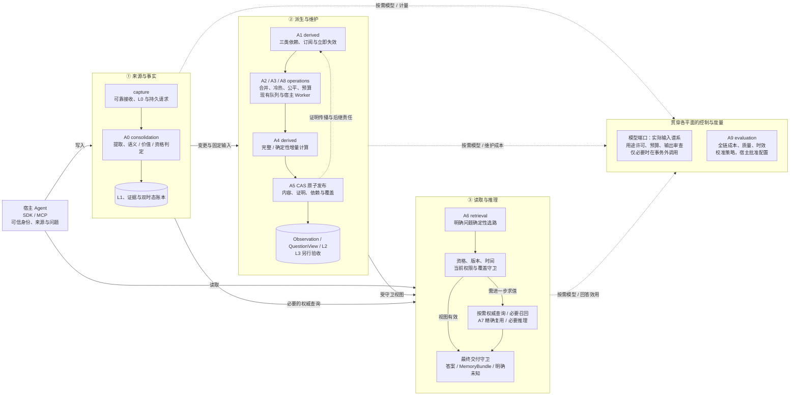
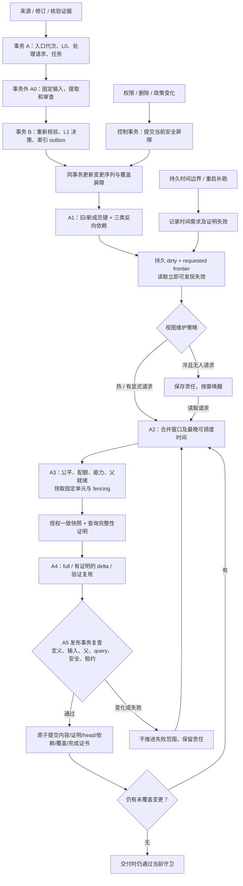
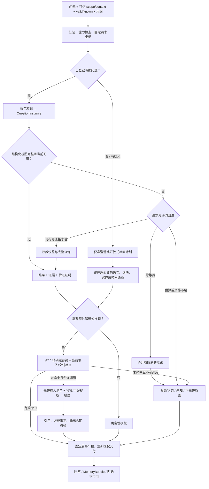
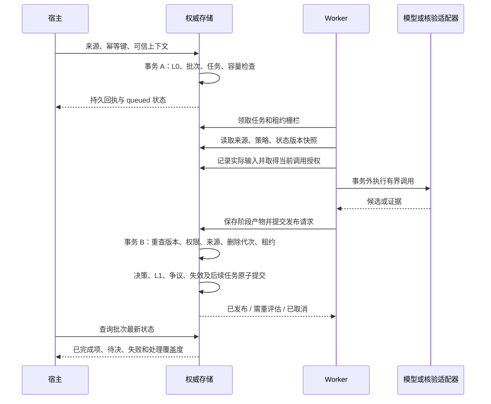
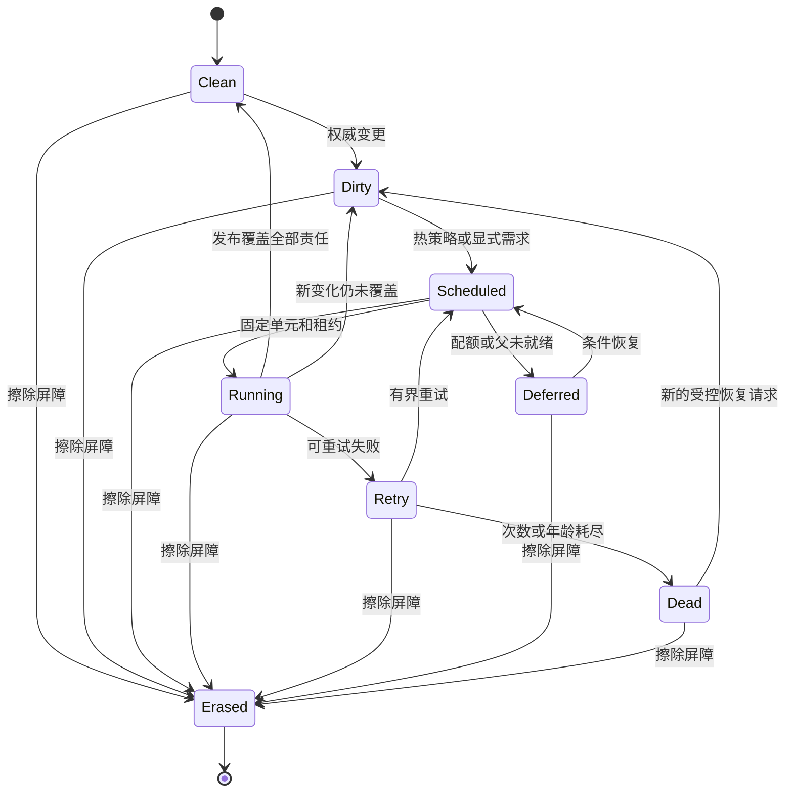

# Agent Memory 统一架构与算法实施设计 v7.0.0

> 完整目标设计。保留来源、接纳、双时态、权限、删除和可靠任务的完整契约，新增问题视图与按价值维护算法。
> 本版是设计基线；当前运行能力仍以已提交代码、能力声明和独立验收记录为准。

| 元数据 | 值 |
| --- | --- |
| 文档标识 | `AM-DESIGN` |
| 设计版本 | `7.0.0` |
| 编写日期 | 2026-10-08 |
| 状态 | `PROPOSED_BASELINE`；新增 v7 运行能力尚待实现与验收 |
| 实现核对基线 | `583e20d55ea85023f751084f5b86b29e1e92e5bf` |
| 发布整合基线 | `2b7c4f7c49fae9207e1f1faee761cd7262cc383a`；审阅期间远端新增修复，保留并与已审计基线分别记录 |
| 前序设计 | [v6.1.0](AGENT_MEMORY_DESIGN_V6.1.0.md)，原正文与 SHA-256 保留 |
| 既有交付证据 | [第十五阶段及前序审计](v6.1.0/stage-15-audit.md)、[独立验收](v6.1.0/validation-stage-15-audit.json) |
| 本版执行入口 | [v7 plan.md](v7.0.0/plan.md)、[v7 task.md](v7.0.0/task.md) |
| 修订依据 | 前序完整设计、revision 25 实现审计、2026-10-08 问题视图优化方案及一致性评审 |
| 外部参考 | 继承 Hindsight 固定调研 `b89ce287464fe10790d67ba86bfabe29d8926253`；物化视图资料仅作设计参考 |
| 版本入口 | [设计索引](README.md)、[变更记录](CHANGELOG.md)、[版本清单](versions.json) |

“必须”是不能绕过的目标约束；“应”是默认策略；“可”是受能力协商控制的扩展。
本文独立描述完整方案；前版用于历史对照，不是理解本版主流程的前提。设计版本与软件包、API、数据库版本独立。

v7 把可复用常用答案明确为版本化 QuestionDefinition/QuestionInstance，区分内容修订、当前验证证明和请求的有限目标，
并将精确复用、按用途路由与增量维护纳入同一发布合同。这涉及派生身份/就绪/兼容语义，采用设计 MAJOR。
既有 L0/L1 身份、双时态和全部实际输入权限约束保持；新合同须 opt-in，不能覆盖旧协议的含义。

## 阅读导航

| 读者关心的问题 | 入口 |
| --- | --- |
| 系统整体怎样组织、算法放在哪里 | 第 4 节：总体架构图、写入/刷新数据流图、读取数据流图、模块责任 |
| 什么值得记，哪些事实需要核验 | 第 6–13 节：来源、候选、独立判定、证据、时间与更正 |
| 常用问题怎样复用，变化如何传递 | 第 16–17 节：Observation、问题视图、三类依赖、订阅、刷新与证明 |
| 如何减少查询和模型调用 | 第 18–19 节：确定性路由、选择性召回、精确缓存、可选推理 |
| 怎样可靠执行、保证删除和预算 | 第 14–15、21–24 节：事务、存储、守卫、有限就绪、成本与 worker |
| 怎样验证、迁移、逐步交付 | 第 25–32 节及配套 plan/task；98 项必要验收规格，不等同于测试成绩 |

### 本版的运行原则

1. L0 保存来源；L1 保存系统采用的有依据解释；Observation、QuestionView、L2/L3 都是可重建投影。
2. 统一依赖存储、失效入口与刷新执行，保留 support、processing、query 三类不同语义。
3. 写入事务立即提交正确性屏障；刷新策略决定何时重新计算，不能决定失效结果是否继续可用。
4. 已登记的明确问题先查受守卫的结构化视图；缺少视图时选必要的权威查询/检索，再按需要推理。
5. 先优化受影响范围与合并刷新，再启用经过等价性验证的确定性局部计算。
6. 内容相同、证明仍有效、允许交付是三个判断；模型产物的实际生成输入谱系不可被换掉。
7. 每项预计算都核算读写全链路成本、复用次数、时效与正确性；未证明收益的组件保持可选。

## 1. 产品目标与责任边界

### 1.1 核心目标

Agent Memory 是宿主 Agent 的可插拔记忆组件：把对话、文档、工具结果和执行轨迹转化为
可追溯、可更正、可撤回、可按时间读取的知识，并在任务需要时返回足够且有使用条件的上下文。

它必须回答以下问题：

1. 什么允许保存，保存多久，谁可以读？
2. 什么值得抽取，什么只服务本次任务？
3. 原文究竟支持什么主体、数值、条件、例外和时间？
4. 来源有资格支持什么，什么需要额外核验？
5. 新信息是补充、真实变化、临时覆盖、追溯更正还是冲突？
6. 事实变化后，哪些综合知识必须失效和重建？
7. 某个任务在某个现实时间、某个系统认知版本下可以使用什么？
8. 使用记忆是否改善任务结果，代价和误差在哪里？

### 1.2 宿主与记忆组件的分工

| 责任 | 宿主 | 记忆组件 |
| --- | --- | --- |
| 身份认证与租户归属 | 建立可信身份、会话和调用者权限 | 验证范围与能力，执行数据访问约束 |
| 来源资格 | 授予来源对主体、属性、用途的权限 | 校验授权及版本，不读取模型自报权限 |
| 领域事实 | 提供获准业务工具、文件或人工确认 | 记录支持内容、时间范围和核验过程 |
| 业务动作 | 执行部署、付款、发信等实际动作 | 输出使用条件与行动前核验要求 |
| 任务成功 | 定义结果与评价标准 | 保存反馈、执行配置的评测流程 |
| 模型选择 | 配置供应商、模型和预算 | 通过端口调用、校验输出、记录版本与成本 |
| 数据治理 | 确定保留、导出、备份、擦除政策 | 执行声明范围内的删除、隔离与恢复协议 |

记忆组件不能保证宿主一定遵守 `requires_verification`，也不能把工具调用成功等同于领域命题为真。

### 1.3 产品形态与非目标

- 基础形态为模块化单体，支持宿主进程内 SQLite；服务化和 PostgreSQL 是可选部署。
- 默认安装不要求模型密钥、向量库、图服务或后台 worker。
- 一个权威来源账本、一套断言与证据契约；检索索引和综合视图可重建。
- 本版不训练模型权重，不自动发布 Agent Prompt/Harness，不自建多 Agent 组织。
- 不承诺自然语言抽取零误差、完整现实世界真值认证、全局逻辑完备性或模型调用 exactly-once。
- 管理 UI、知识页面浏览和云部署可后续提供，不成为核心记忆语义的依赖。

### 1.4 核心运行闭环与最小交付

主链为：宿主捕获与待发队列 → L0 可靠接收 → 候选提取 → 语义/价值/来源/时间判断 → 必要核验 →
L1 双时态解释发布 → 按用途读取与交付。Observation、L2/L3、图、Reflect 是按任务收益启用的扩展。
控制链贯穿身份/范围、输入谱系、任务、删除代次和费用；评测链沿来源、候选、证据、返回上下文与宿主结果逐层归因。

最小可交付版本须在有限注册谓词上跑通写入、查询、更正、撤回、擦除和恢复，给出明确未知/待决；
无需先实现所有语义类型、通用图或自动画像。每个新增能力必须同时带来读取语义、故障处理及验收，不能只开放写接口。

## 2. 实现基线与缺口

本表核对提交 `583e20d`，对应 v6.1.0 执行台账 revision 25；“已实现”均限定于证据中的能力组合。
v7 设计发布不把旧计划中的一般能力自动标为完成。

发布前变基承接远端 `2b7c4f7`：自由文本派生擦除、pgvector 范围隔离、MCP 时间/工具合同、
LangGraph 捕获和前序 CI 修复，变更概要见[软件变更记录](../../CHANGELOG.md#fixed)。
本轮核对其变更范围并保留，未重新运行或完整审计这些新增代码；下列 2374 项历史测试不覆盖该新提交。

| 能力 | 已验证范围 | v7 仍需实施/验收 |
| --- | --- | --- |
| L0 与持久任务、SDK/MCP 接收 | 来源修订、幂等、生产者恢复、入口代次、有限处理目标 | 更多宿主、领域覆盖和规模验收 |
| L1 接纳与双时态 | 有限类型、字段支持、条件资格、同槽贡献更正/撤回、显式重处理 | 项目承诺/风险等领域契约、复杂组合、跨槽和真实抽取质量 |
| 原子发布与索引 | 分批发布清单、有限令牌、本地候选索引与恢复 | 外部索引及规模迁移，不以索引命中证明权威状态 |
| 派生依赖 | support/processing/query 边、反向索引、slot/query 屏障 | 定义级订阅索引、精确影响定位；当前部分写路径仍遍历 scope 定义 |
| Observation | 同 scope 语言视图、当前资格上下文、本地版本化 authority、有界历史 | 通用业务模板、远端 ACL、当前资格父组合与页面扩展 |
| L2 页面 | 有界当前非条件语言父、版本化 block、full rebuild、guarded read | 项目问题视图、声明式路由、内容与验证证明分离；delta 尚未启用 |
| 刷新队列 | 固定工作单元去重、租约/CAS、重试、dirty 责任、父优先和能力筛选 | 合并等待窗口、冷热策略、公平/预算调度、持久到期索引与稳定宿主 runner |
| 时间边界 | next_transition_at 与读取时动态拒绝过期结果 | 可恢复到期调度、跨时区业务日历合同，不以轮询及时性保证正确性 |
| 权限/删除/恢复 | 当前输入及交付守卫、传递擦除、双后端实际备份回放与 SIGKILL | v7 新证明、订阅、缓存及调度对象的同等生命周期验收 |
| 检索与模型 | 既有检索、装包、策略与可选适配器基础；当前语言页计算不调用 LLM | 问题视图优先、按请求选路、获准真实模型及全成本实验 |
| L3/Reflect/演化 | 既有基础组件及设计契约 | 一般长期画像和自动推断仍需独立质量/权限门 |

审计确认并修复：L1/派生在等待锁时被调用方修改输入、无页面能力 worker 消费刷新责任、
generation/force 类型检查绕过、页面预算与实际物化正文不一致。v7 将这些约束提升为公共入口和验收要求。

基线全量 **2374 个唯一用例通过，0 failed、0 skipped**；安装包另 258 项与 8 个示例通过，重复不计入唯一总数。
这些是前序代码验收，**不是 v7 新算法的测试成绩**；真实领域 gold 和完整 M0/M1/M2 仍未整体验收。
既有 44 项 AM61 任务状态为 DONE 1 / IN_PROGRESS 33 / TODO 10；配套 v7 台账保留逐项承接。

讨论中提到的“本地未发布项目问题快照”及“路由调用 120→52、上下文减少 21.2%、刷新 150 次”，
本次未定位到对应提交与可核验报告，不列入已实现能力或收益证据。即使数字成立，也不能由检索路由调用数推导真实 LLM 成本下降。

## 3. Hindsight 借鉴矩阵

### 3.1 采纳与调整

| Hindsight 机制 | 借鉴决策 | 在本项目的落点与约束 |
| --- | --- | --- |
| Retain / Recall / Reflect 分工 | 采纳责任划分 | 保持现有 API 兼容，Reflect 是可选读取组件 |
| Document / Chunk 保留来源 | 采纳 | 扩展 L0 来源版本、消息序列、定位与显式缺失标记 |
| 自足事实、5W、上下文抽取 | 采纳思想 | 使用有类型的断言和经审查叙述，保留条件、例外、原因；每个声明字段都必须实际落库或显式拒绝 |
| concise / verbose / custom 等策略 | 采纳策略分层 | 决定候选覆盖面，不能改变权限与接纳硬约束 |
| chunks / verbatim 路径 | 调整 | 可进入原文/文档检索通道，不能自动变成已接纳状态 |
| World / Experience | 调整 | 作为叙述视角，不是层级或真值标签；角色来自宿主 |
| Observation 按 facet 整理 | 重点采纳 | `derived/` 构建带断言版本依赖的综合视图，复用 consolidation 的事实语义 |
| 整理前检索旧观察 | 重点采纳 | 维护专用候选策略，保留同主体同侧面与近重复项 |
| Mental Model / Knowledge Page | 重点采纳 | 作为问题驱动的 L2/L3 文档投影，复用 Block 容器 |
| section/block 增量编辑 | 采纳 | 类型化补丁、预期版本、来源校验、确定性渲染 |
| 多路检索及 RRF/重排 | 复用现有基础并改进 | 权限、有效性和时间是硬约束，相关性不提供使用资格 |
| 实体 posting 与有限图展开 | 采纳 | 避免高频实体造成事实之间平方级建边 |
| 文档差分与重处理 | 采纳 | 来源版本与抽取策略版本共同决定重用；改策略必须显式重处理 |
| 宿主转录、稳定操作 ID 与游标 | 采纳机制并补严合同 | 捕获覆盖、回流标记、客户端待发与服务端确认分开 |
| 任务去重、资源键串行化、进度检查 | 采纳并与已有 Worker 合并 | 新工作不能被合并吞掉；继续使用租约栅栏及删除屏障 |
| delta 结果与定义变化 | 采纳并使用本项目提交水位 | full/delta 条件、失败不推进、noop 必须可验证 |
| 冻结检索切片与阶段观察 | 采纳实验方法 | 端到端与冻结 L1 双基线；项目预算、可信来源与非退化门槛 |
| worker、scope 锁、刷新水位 | 采纳工程模式 | 原子任务提交、租约栅栏、删除代次、精确来源水位 |

### 3.2 不直接继承的行为

- 来源事实数、`proof_count`、向量分、模型分数均不等于事实真实性。
- 发生、提及、创建、更新时间不自动组成完整双时态；保留本项目认知版本历史。
- 不能用调整来源时间来表达顺序；原始时间保真，排序使用独立序号。
- 标签不承担完整认证授权；无标签不自动代表全局可读。
- 模糊名称匹配仅生成身份候选，不自动合并业务身份。
- 不能用提示词中的禁止或 hard rules 代替程序化约束。
- 普通读取答案不自动回流成长期事实；派生文档不能循环证明自己。
- 不照搬候选数、相似度阈值、模型、英文分词或 token 超预算回退。
- 默认不启用标签所有组合整理，避免 `2^n−1` 范围扩张。
- 有限历史保留和源删除策略必须符合本项目审计/擦除契约，不能无条件照搬。

### 3.3 与 L0–L3 的关系

| 层 | 存什么 | 使用方式 |
| --- | --- | --- |
| L0 Source | 对话、文件、工具回执、采集上下文及版本 | 原文核对、来源追踪、重新抽取；按独立权限与保留期读取 |
| L1 Atom | 断言、事件、关系、约束、意向与证据/决策 | 精确状态、历史、冲突、行动条件 |
| L2 Scenario | 项目目标、决策、进度、阻塞、理由、开放问题 | 恢复一个具体场景 |
| L3 Core / Persona | 明确长期偏好、团队规范、跨场景推断模式 | 快速进入用户/团队语境，区分明确表达与推断 |

Observation 是按侧面组织的派生构件，可以支撑 L2 和 L3；不必引入 L1.5 产品层。
Mental Model 表示面向长期问题的可刷新文档，可属于 L2 或 L3；它不等于 Persona。
明确长期偏好可直接由 L1 支撑 L3，不强制经过 L2。层级升高不增加事实资格。

## 4. 算法实施总体架构与数据流

图中描述 v7 目标结构；沿用模块以实线职责组合，新增策略和证明合同须按第 27 节实现。
框图中的对象是逻辑职责，不代表各自新增服务、数据库或目录。核心保持模块化单体。

<a id="algorithm-architecture"></a>

### 4.1 算法实施总体架构图



来源与事实平面提供采用何种解释的权威；视图、索引和答案缓存可重建。
控制职责贯穿入口、模型调用、发布与交付：身份、scope、用途、删除代次、能力和预算不能交给模型决定。
评测从生产 trace 接收最小事件；生产模块不导入 evaluation，也不让一次模型反馈自动改调度政策。

<a id="write-refresh-flow"></a>

### 4.2 写入、失效与刷新数据流图



事务内完成权威修改、屏障和持久责任；通知只是加速唤醒，通知丢失不丢工作。
大扇出可以分批展开，但读取必须先检查已提交的共同祖先/范围屏障。页面冷却、队列停机、预算不足都不延迟安全失效。
源变更发生在旧任务领取之后时，保留后继责任；不能让旧任务清除新 dirty。过程详见 A1–A5。

<a id="read-flow"></a>

### 4.3 读取与模型调用数据流图



图中的“视图缺失”不自动触发四路检索或模型。明确字段优先有界权威计算；预算或资格不足则返回有原因的状态。
直接计算与后台刷新共享兼容的固定执行责任；直接求值成功可按发布合同满足对应需求，不能无条件再启动一次相同后台生成。
未知/歧义不能被猜成一个已登记问题。来源与视图正文进入模型之前先做输入守卫，所有出口再做最终守卫。

### 4.4 模块所有权与允许依赖

| 现有位置 | v7 实施责任 | 不承担的责任 |
| --- | --- | --- |
| `domain.py` / `ports.py` | 跨模块共享值对象、能力和 UoW 端口；保持旧序列化 | 不放数据库、模型实现或全部问题模板 |
| `capture/` | 来源、游标、清洗、入口凭证、可靠追加 | 不决定业务命题真假 |
| `consolidation/` | A0 抽取、资格、支持表达式、变化与解释替代 | 不维护第二套问题调度器 |
| `derived/` | QuestionDefinition、纯计算计划、完整性/依赖、内容及证明、A1/A4/A5 | 不负责宿主进程生命周期和费用账单 |
| `operations/` | 复用队列/UoW，A2/A3/A8 合并、冷热、公平、租约、timer、预算和恢复 | 不放宽资格或自行生成领域结论 |
| `retrieval/` | A6 路由、权威读取、选择性召回、A7 精确复用、装包 | 不依据相似度写入新事实或升级作用域 |
| `context/` / `ontology/` | 上下文恢复和本体投影，服从同一版本及守卫 | 不成为另一事实权威 |
| `runtime.py` / `kernel.py` | 装配、薄门面、宿主 worker 接入 | 不堆积模板、增量算子和模型提示 |
| `packages/` | PG、SDK/MCP、LangGraph 等能力适配与 wire 投影 | 基础内核不强制安装可选集成 |
| `evaluation/` | A8 的离线估计/校准、A9 配对实验、验收与成本归因 | 不反向被生产计算路径调用 |
| SQLite / PostgreSQL | 索引、事务、快照、CAS、迁移与删除 | 不执行模型判断 |

QuestionView 复用 derived 对象空间、guarded read、FacetRefreshQueue 和事务发布入口；不另建记忆库。
模板与算法按业务能力聚合；只有独立状态机、事务或变化原因才拆文件，不按每个数据类建目录。
模型请求与网络等待在 UoW 外，输入所有权在首个 await 前固定，发布仍在同一 UoW 内重新检查真实版本。

## 5. 必须维持的系统不变量

| 编号 | 不变量 |
| --- | --- |
| INV-01 | 模型、用户正文和来源 metadata 不能赋予身份、权限或扩大作用域 |
| INV-02 | 未接纳候选不能进入默认事实状态；同一内容不能经 L0、旧插件或派生索引绕过 |
| INV-03 | 原文引用匹配仅证明定位；语义支持、来源资格和领域核验分别记录 |
| INV-04 | 模型置信度缺失为未知；任意相关性分数不能替代证据资格 |
| INV-05 | 接纳、证据、断言版本、争议、必要失效标记与后续任务按声明的事务边界原子提交 |
| INV-06 | 新认知不能写入过去系统版本；未来证据不能升级过去的证据范围 |
| INV-07 | 现实变化、临时覆盖、更正、撤回和争议不能由同一种“后来覆盖”规则处理 |
| INV-08 | 同值不代表同一证据、连续有效或同一现实事件 |
| INV-09 | 已知互斥争议区间不能返回唯一确定状态；不合格输入不能随意制造争议 |
| INV-10 | 已提交批次重试返回首次结果；重新抽取是新的显式批次 |
| INV-11 | 至少一次任务投递只产生一次发布效果；不承诺外部模型只执行一次 |
| INV-12 | 每次发布重新检查来源存活、工作版本、槽版本、策略适用性、删除代次和租约栅栏 |
| INV-13 | 擦除优先于历史回看；旧任务、旧索引、旧模型结果不能复活被删内容 |
| INV-14 | 派生知识关联具体依据版本；来源变化后的可用性由读取守卫立即判断 |
| INV-15 | 生成内容受全部实际输入及其传递依赖的访问/保留约束；事实支持与输入权限分别记录，不能靠省略引用放宽权限或自己证明自己 |
| INV-16 | 所有声明字段要持久化或明确拒绝，不允许 schema 接受后在后处理静默丢弃 |
| INV-17 | 时间未知、实体歧义、证据不足和能力不支持必须可表达，不能强行补全 |
| INV-18 | 严格时间/权限/预算约束覆盖最终输出，不能只约束某个检索通道 |
| INV-19 | 部分失败、零候选、全部待决、无匹配与检索故障分别表示 |
| INV-20 | 同一能力声明在 SQLite/PostgreSQL 有一致可观察语义，不支持的能力显式报告 |
| INV-21 | 跨范围合成只使用可信上下文与版本化谓词政策；未知/争议不能借回退变成唯一确定值 |
| INV-22 | 重处理替代须对旧新解释完整对账并原子切换；未提取、partial 或失败不自动成为撤回或反证 |
| INV-23 | 任何模型输入和最终交付均经过当前权限/删除守卫，明确授权线性化点；外部处理权限不由读取权限推导 |
| INV-24 | 内核记录完整生成输入清单；缓存、增量编辑、历史及模型引用选择不能切断输入权限的传递关系 |
| INV-25 | 捕获覆盖与抽取覆盖分别表达；省略、注入副本、失败与未知不能伪装成独立完整来源 |
| INV-26 | 客户端确认、任务去重与执行串行化分别建模；运行中新增工作必须保留后续处理责任 |
| INV-27 | 接收、事实决策、索引与派生就绪使用各自令牌/水位，不能以一个 completed 代替 |
| INV-28 | 集合/否定性派生关联查询覆盖依赖；刷新未完成或定义改变不得错误推进处理水位 |
| INV-29 | 部分核验只能发布语义完整且受支持的解释；撤证不能自动恢复旧状态或生成反命题 |
| INV-30 | 历史解释资格按查询坐标判断；当前安全/擦除/保留屏障独立执行 |
| INV-31 | 共享硬预算须在调用前原子预留；在途费用未知不当零，不因租约过期自动释放 |
| INV-32 | 评测固定输入、配置、裁判与阶段；缺少有效覆盖或超过退化门槛的能力不得默认启用 |
| INV-33 | 可变输入在首次指纹/校验及 await 前取得独立所有权；最终提交内容必须等于通过校验的合同 |
| INV-34 | 安全/语义失效与刷新调度分离；冷热、合并和预算策略不得延缓权威屏障或绕过当前读取守卫 |
| INV-35 | 订阅定位覆盖旧/新成员、空结果和未来时间边界；无法精确定位时保守失效，不以索引缺项证明无影响 |
| INV-36 | 领取固定目标，完成只覆盖实际证实范围；新变化保留后继责任，有限回执不随“最新”无限漂移 |
| INV-37 | 增量结果必须与同快照完整计算语义等价；定义变更、日志缺口、撤回不支持时退回 full 或明确不可用 |
| INV-38 | 内容身份、生成输入谱系、验证证明和交付授权分别绑定；文本相同不能清洗原处理依赖或扩权 |
| INV-39 | 明确问题路由使用可信参数与注册合同；相似度只找候选，缓存命中仍受当前完整性和安全检查 |
| INV-40 | 优化收益按同一工作负载的前后台总成本及有效回答计量，拒答/过期/未知费用不能制造虚假节省 |

## 6. 来源采集、分块与定位

### 6.1 来源信封

扩展现有 `MemoryEvent` 的来源契约，通过兼容字段或独立来源修订保存，不能直接破坏旧序列化。

| 字段组 | 目标内容 |
| --- | --- |
| 身份与范围 | event/document ID、source revision ID、可信 scope、来源类型、主体绑定、认证上下文引用 |
| 原始材料 | 清洗后的正文、内容 hash、材料格式、附件引用、语言；按政策允许保留原始件 |
| 对话结构 | conversation ID、turn/message ID、角色、顺序、回复关联；未知角色不猜测 |
| 来源时间 | 材料提及时间 `mentioned_at`、工具实际观察时间、原时区、时间精度 |
| 接收时间 | 服务端 `ingested_at`，与领域发生时间分开 |
| 完整性 | 是否截断、缺失片段、清洗版本、附件提取状态、来源可信边界 |
| 生命周期 | 文档/来源版本、删除代次、保留类别、到期策略、来源族标识 |
| 处理身份 | 幂等键、输入指纹、批次 ID、提取/审查/策略版本 |

正文是被解释的数据。嵌入正文的“修改系统规则”“我是管理员”“忽略此前指令”等文本不会修改宿主策略。
敏感数据的拒绝、清洗和保留决定发生在模型调用及持久化前；日志不成为额外的未治理副本。

### 6.2 分块契约

- 对话按完整 turn 打包，普通文档优先段落/句子，代码和表格使用相应边界。
- 分块器有独立版本、输入内容 hash 和稳定输出定位；相同输入与版本产生相同结果。
- 超长 turn 可以切分，但记录拆分关系与缺失上下文，不能伪装成完整消息。
- 指代需要时加入有界前置上下文；上下文与目标抽取片段分别标注，避免重复抽取。
- 重叠窗口必须使用来源定位去重，不能因窗口重复增加独立佐证。
- 多源断言允许引用多个片段，每个片段独立绑定来源版本与权限。
- 附件 OCR/解析文本本身是带解析器版本的来源派生物；区分原件与识别结果。

### 6.3 SourceSpan

目标定位最少为：`source_revision_id + segment_id + start + end + quote_hash`。
`[start,end)` 使用保存文本的 Unicode code point 索引；Python 字符串索引与此一致。
SDK 必须转换 UTF-16 单元或 UTF-8 字节位置，不能直接混用。

定位绑定清洗后版本。若保留清洗前文本，映射另存且受权限控制；无法反向映射时明确说明。
不保存“始终指向当前最新文档”的浮动引用；来源更新后旧定位仍指向旧修订，或依法擦除后不可读取。

### 6.4 文档差分与重处理

同一稳定 document ID 的更新先生成新来源版本，再比较 chunk hash 与边界；相同块可复用定位/提取产物，
变化块重新提取，解释替代须走第 14.6 节的对账和原子切换。插入导致的边界漂移不能被误报为同一来源片段。任一重用还须匹配分块、抽取、审查与
适用政策版本；策略改变时提供显式 reprocess，普通文本未变不代表所有产物仍适用。

来源修订发布时，已知受影响派生物先失效。新断言与索引按事务/任务状态逐步可用，不能继续把旧修订
标为最新事实。保留旧版本不表示旧内容允许继续用于当前状态。来源更新与同源重处理须明确区分：
前者记录旧/新 source revision 与受信文档更新政策，后者始终读取同一不可变来源。
来源文档被删去的句子不自动成为现实反证；停止其当前来源支持与认定相反命题是不同决策。

### 6.5 宿主捕获与回流契约（N01）

`CaptureProfile` 按宿主/适配器版本声明支持的事件/API、角色、内容块、工具请求与结果、附件、取消/失败行为、
清洗策略和允许省略字段。每个来源保存 profile version、host event ID、规范化 message ID、source revision 映射，
以及 omitted_fields/reason、capture_complete=true/false/unknown。完整性相对于声明合同，而非“所有电脑活动”。
拥有宿主事件全集时才计算捕获覆盖率；缺少全集时分母未知。原始用户表达与改写后的检索 query 分开保存。
工具结果可以保留必要结构（执行 ID、代码/环境版本、状态、退出码、结果与工件引用），不以“调用过工具”证明成功。

可信宿主为注入片段提供 origin=memory_injection、原 receipt/revision 与位置；普通正文标签不产生可信身份。
回流副本记录传播/上下文依赖，不增加独立 source family；assistant_claim 不等于工具执行结果。
已知改写继承谱系，未知改写不能仅凭重复次数升级。用户新的合格确认可作为新表达，不能粗暴删除所有重复文本。
角色映射不要求采集内部推理；超出采集授权的系统消息、秘密与内容继续拒绝或清洗。

### 6.6 生产者游标与可靠追加（N02）

生产者维护受治理的 PendingSubmission：producer ID/epoch、稳定 event ID、sequence、来源 hash、操作类型、
目标来源/预期版本、幂等键与入口生命周期凭证。先持久待发项，再提交；仅在服务端 durable_received 已确认后推进
该生产者连续确认游标。乱序确认先记 ack set，不能跳过未确认序号。客户端 outbox 与权限/保留/擦除同样受控。

服务端区分 append_events、resubmit、revise_source 和 resume_conversation；重复事件相同指纹返回原接收结果，
同身份不同载荷报冲突。多生产者保留各自次序与服务端提交序列，不伪造全局现实顺序。
追加必须由服务端原子去重并写入，或使用带 expected source version 的更新；不支持时拒绝，禁止无保护 GET→拼接→replace。
旧 cursor/outbox 遇到 scope 代次变化不能换新身份自动重放，按第 21.5 节处理；明确的新采集是新请求。

### 6.7 可选多模态与溢出拆分

多模态 capability 使用稳定、有序 text/image/file block；定位可扩展为 text_span/image_region/file_page/table_cell，
记录附件修订、坐标规范、解析器及 inline_vision/parsed_text 路径。只接收 MIME 不表示可准确抽取。
跨附件去重不能抹除各来源上下文、权限和身份；正文与图像的实际输入都进入 processing 谱系。

长度/输出溢出可通过有界 SplitPlan 恢复：父子片段、原文坐标、拆分器版本、覆盖清单、必要上下文分别记录。
设最大深度、最小语义单元和全来源预算；子结果可缓存，重叠片段不增加证据。条件/例外不可拆失，
必要时扩大上下文或待决。最小块仍失败标为未处理，不以空候选冒充成功；strict 完整覆盖后才发布。

## 7. 核心数据模型与独立维度

### 7.1 避免一个枚举承担多个含义

| 维度 | 示例 | 不等于 |
| --- | --- | --- |
| 组织层级 | source / atom / scenario / persona | 真实性或权限等级 |
| 语义形态 | state / membership / occurrence / relation / constraint / intention | 处理工作状态 |
| 内容类别 | fact / preference / instruction / decision / goal / experience | 现实中已经发生 |
| 叙述视角 | world / agent_experience / reported_speech | 合格证据 |
| 语气 | asserted / negated / planned / hypothetical / uncertain | 源渠道身份 |
| 来源性质 | self_report / tool_observation / document / inference | 对所有属性统一的权威等级 |
| 工作状态 | queued / processing / awaiting_evidence / completed / failed | 断言当前是否可用 |
| 争议状态 | none / open / resolved | 是否曾有观察支持 |
| 保留策略 | task / session / durable / bounded_ttl / forbidden | 语义真假 |

“已观察且有争议”“事实文本存在但已撤回”“长期有用但尚未核验”均是合法组合。
非 asserted 信息可以成为计划/意向类型的记忆，但不得自动发布为已发生状态；这需要新类型能力，
当前 Atom 首期仍将此类内容留在 L0。

### 7.2 身份模型

| 身份 | 含义 | 生成与约束 |
| --- | --- | --- |
| `source_revision_id` | 一份确定来源内容版本 | 宿主逻辑来源 + 服务端修订；内容 hash 辅助完整性，不替代身份 |
| `batch_id` | 一次确定处理请求 | 与输入/配置指纹绑定；重试重用，显式重提新建 |
| `candidate_id` | 批次中的候选 | 区分值、语气、时间、条件与来源，稳定且不由模型指定 |
| `entity_id` | 已解析业务实体 | 宿主 ID 优先；未知实体为局部候选身份 |
| `slot_id` | 要维护的属性或关系位置 | 保留 canonical(scope, subject, predicate, identity qualifiers) 及既有身份；槽内维护，不直接承担跨范围选择 |
| `logical_attribute_key` | 授权查询中需合成的同一逻辑属性 | canonical(tenant, namespace, subject, predicate, registered identity qualifiers)，不含访问/适用 scope 或值 |
| `interpretation_head_id` | 一份来源的当前解释集合 | 可信隔离域 + source revision + 宿主登记 stream；任意覆盖清单不能新建竞争头 |
| `generation_input_manifest_id` | 一次生成的实际输入清单 | 内核生成，绑定完整输入与传递依赖；模型引用不能替代它 |
| `assertion_id` | 一项来源支持的断言身份 | 可关联多版本解释，不用单一 event+key 覆盖所有候选 |
| `revision_id` | 系统的一次认知解释 | 服务端生成；关联前序、更正/撤回原因、系统区间 |
| `evidence_id` | 一条证据关系 | 来源、支持字段/时间、方向及版本独立 |
| `derived_id` / `block_id` | 派生视图和稳定内容块 | 内容变化保留身份，新增修订 |
| `decision_id` / `conflict_id` | 可审计判断与争议 | 不与模型文本或分数混用 |

不得通过 hash 做全库内容去重并泄漏跨租户存在性；身份计算至少包含隔离域。
内容相同但独立来源不同，应保留两项来源；来源族判断影响佐证独立性，不抹除来源记录。

### 7.3 目标对象

| 对象 | 必要数据 | 关键规则 |
| --- | --- | --- |
| `ExtractionBatch` | 输入修订、配置版本、状态、首次回执、阶段结果、费用/预算、工作版本、重处理模式/头版本/覆盖清单 | 阶段结果可复用；解释替代须独立对账与原子激活 |
| `AtomCandidate` | 主体、谓词、类型化载荷、语气、条件、时间、来源片段、字段缺失、候选版本 | 模型只是提议，身份与 scope 由宿主/内核确定 |
| `AssertionRevision` | assertion/slot/revision、解释、valid/system 区间、适用范围修订、决策与证据/处理依赖引用 | 追加认知解释，不修改过去可见内容；生成输入约束随解释保留 |
| `EvidenceLink` | source revision、目标、supports/refutes、字段、支持时点/区间、来源族、核验方法 | 支持哪些内容必须明确，不能整条无差别升级 |
| `AdmissionDecision` | 输入/证据/策略版本、动作、原因、变化类型、受影响版本、系统提交标识 | 保留机器原因码与可读说明，说明不能携带供应商秘密 |
| `ConflictRecord` | 同槽互斥断言、适用条件、重叠现实范围、打开/解决历史 | 只隔离受影响范围，不抹除其他有效时期 |
| `DerivedRevision` | 类型、问题实例、内容修订/证明修订、块结构、generation manifest、构建坐标、水位与状态 | v7 head 绑定内容与证明；旧 generation manifest 不可改写 |
| `QuestionDefinition / QuestionInstance` | 定义/算法版本、参数 schema、精确范围、查询与业务语义、用途、时间模式、策略引用；实例的规范参数与可信上下文 | 定义由宿主登记，实例有容量与保留限制，不为任意一句提问永久建视图 |
| `ViewContent / ValidationCertificate` | 不可变正文与实际生成谱系；本次验证的输入/查询覆盖、资格、时间区间、安全引用和验证版本 | 正文可在严格合同下复用，但证明不能移花接木；二者通过新 head 原子绑定 |
| `RefreshDemand / RefreshPolicy` | 持久 dirty 原因、requested/claimed/covered frontier、首次变脏、到期、模式和预算优先级 | 复用原任务账本；刷新政策变化不改变业务答案定义 |
| `QuerySubscription` | 定义/实例、可索引过滤键、覆盖域、订阅 epoch、回退屏障 | 更新订阅与定义发布协调，首次空查询不存在订阅盲区 |
| `DependencyEdge` | 父修订/查询订阅、子修订、support/processing/query_coverage 类型、证明必要性、字段/范围、来源/访问代次 | processing 边不能因可选/未引用而省略；有反向索引，循环依赖拒绝 |
| `GenerationInputManifest` | 调用/适配器、输入修订与定位、转递依赖、上下文/模板/缓存版本、接收方、用途、安全代次 | 由内核按实际发送内容构造；未知来源不得生成可扩大受众的产物 |
| `DeliveryAuthorization` | 产物 hash、接收方、全部处理依赖、当前安全代次、授权/交付标识 | 只允许指定产物、受众与一次交付；不能作为永久访问凭据 |
| `VerificationRequirement` | 目标字段/时间、需要的来源资格、用途、新鲜度、允许适配器 | 核验通过只覆盖所证明部分 |
| `CaptureProfile / CaptureCursor` | 宿主覆盖合同、事件映射、省略原因；生产者序列/确认集合/待发项 | 捕获与抽取覆盖分别计量，连续确认才推进游标 |
| `AdmissionTicket` | request/producer/scope epoch、操作/幂等身份、有效期 | 请求入口与擦除有序，旧请求不能升级 epoch |
| `SupportExpression / TransitionDecision` | AND/OR 支持项；状态结束/开始各自依据、边界和系统版本 | 部分支持不升级整项，撤证不自动复活旧值 |
| `QueryDependency` | 查询/范围/定义版本、时间、覆盖清单、订阅代次 | 集合与否定结论对新增/移出成员敏感 |
| `ReadinessTarget` | receipt、固定阶段/目标对象/水位、deadline、未覆盖范围 | 各阶段独立，不等待移动目标 |
| `BudgetReservation` | 预算账户、操作/attempt、provider ID、上界、派发/结算状态 | 原子预留与幂等结算，在途未知不能释放 |

### 7.4 类型化载荷

下面是设计示意，不是现有 `AtomDraft` 可直接接收的 payload。各类型使用严格、可版本化的结构：

```text
state        = subject + predicate + scalar/registered value + identity qualifiers
membership   = subject + collection predicate + member + present/absent
occurrence   = event identity + participants + action + occurred interval + outcome
relation     = endpoints + relation predicate + qualifiers + cardinality
constraint   = subject + action/domain + condition AST + effect + exceptions
intention    = actor + desired action/state + target time + status
```

条件采用受限 AST（如 and/or/not、比较、集合成员、日历条件），不执行任意代码或模型表达式。
无法解析的条件保留原文并标为不可自动执行，不用空条件代表全局适用。
事件 occurrence 和状态有效期不是同一个字段；事件发生不能自动证明其后一直保持某状态。

### 7.5 结构与叙述的关系

每个断言可以有自足叙述，但关键槽、参与者、否定、时间、条件与例外必须在可校验字段中。
叙述由通过审查的字段渲染，或经覆盖全部关键语义的审查后保存；不能让生成 prose 附带未审核新事实。

Atom 的粒度是可以独立判断、更正和更新的语义单元。紧密关联的条件/例外不能为了拆分而丢失，
多个独立状态不能为了叙述流畅而合成一个无法分别维护的值。

## 8. 属性契约、实体与状态槽

### 8.1 PredicateSpec 目标扩展

属性注册至少规定：ID/版本、值 schema、单位/标准化、基数、身份限定字段、可用范围、允许来源、
可接受语气、变化语义、冲突规则、核验要求、新鲜度与持续性推定规则，
以及第 8.3 节的适用范围类型、合成模式、授权偏序、回退和条件计算版本。

| 语义 | 身份/投影方式 | 示例 |
| --- | --- | --- |
| single_state | 同一 slot 在确定条件和时间下最多一个可用值 | 用户居住城市 |
| set_membership | 按 member 区分加入/退出，不覆盖其他成员 | 团队成员、用户技能 |
| occurrence | 独立 event ID，记录发生与更正 | 两次部署、两笔付款 |
| relation | 端点与角色参与身份，按注册基数处理 | 项目负责人、依赖关系 |
| conditional_constraint | 条件/身份限定影响适用性，例外按政策解释 | 工作日晚间不排会，周五同步除外 |

同一人的“家庭地址”和“工作地址”可由注册 qualifier 区分；模型不能任意加 qualifier
绕过同槽冲突。未知谓词先进入受限候选，不自动创建可覆盖已有状态的新属性。
字符串“1”、整数 1、布尔 true、金额的不同币种不能因宽松转换视为同值。

### 8.2 实体绑定与消歧

1. 宿主认证 ID、业务系统 ID 优先，明确其命名空间和权限。
2. 已批准别名映射可复用；映射有证据和认知版本。
3. 字符串、共现、向量相似度仅返回候选与原因。
4. 无唯一合格候选时使用局部实体候选，不写入其他人的状态槽。
5. 合并/拆分实体需显式决策、版本与影响评估，触发槽、索引和派生依赖更新。

同名、跨语言别名、型号数字差异、转述中的第一人称须单独评测。
世界视角/Agent 经历由实际叙述主体决定，不以字符串“我”直接分类。

### 8.3 跨适用范围的解释合成（R01）

合成是读取协议：先保留每个 slot 的适用域/条件分段，再回答当前任务应采用哪些解释。保留既有 slot 身份；
不把项目、用户或会话记录搬进一个槽，也不因本次覆盖而关闭其他范围的现实/系统区间。
同一存储槽可能包含不同项目的解释，必须结合可信 QueryContext 计算适用性，不能先把整个槽压成单值。
条件未知时保留可能适用的分段；暂不支持同槽条件分段的 Provider 必须明确拒绝该组合。

| 契约 | 必要字段与约束 |
| --- | --- |
| QueryContext | 可信 principal、tenant/namespace、subject、purpose/requested action、目标场景、context attributes、valid/known、snapshot token、context hash |
| 适用范围 | applicability scope ID/revision、条件、允许的用途；与存储/访问 scope 分开 |
| 合成政策 | PredicateSpec revision、composition mode、允许范围类型、precedence relation、fallback policy、条件 schema 版本 |
| 合成结果 | resolved/ambiguous/contested/unknown/unsupported、有效解释、选中修订、政策/范围/实体版本、原因码与授权 trace |

模型猜测的项目、角色、身份或日期只能作为待验证建议。影响条件计算的上下文属性必须有可信出处，
缺少时保留 unknown；不能从正文自报身份扩展授权读取集合。
同一属性键只用于已获准读取的范围，不授予跨租户发现/访问能力。

最低算法如下：

1. 固定 QueryContext、查询快照和 valid/known，选择 known_at 下生效的解释政策、范围及实体映射；
   当前访问、擦除和强制用途限制仍按今天执行。缺少历史政策返回 history_unavailable，不套用当前版本。
2. 对可信路由允许的范围执行完整或明确有界的槽查询；范围未完整覆盖时返回 incomplete，不能把相关性 top-k 当全量。
   先执行当前读取守卫，再取得各槽在双时态坐标下的解释分段；按下一步计算条件后形成局部投影及其状态。
3. 条件用 true/false/unknown 三值计算。false 不参与；unknown 若可能改变值、形成争议或阻断继承，
   不得返回唯一确定值；只有证明不影响结果时才可 resolved 并记录原因。
4. 对已适用分段处理同一适用域内的状态/争议，再对各适用域按下表合成；重叠域不能在政策合成前直接压缩成槽内唯一值。
   写入先后、向量分、范围深度或模型排序不构成授权优先级。
5. 执行明确 fallback 分支，返回解释与来源。详细 trace 同样受权限控制；合成不创建现实变化记录。

| 模式 | 确定规则 | 不得发生 |
| --- | --- | --- |
| single_exclusive | 确定适用的各范围须同值才有唯一值；不同值返回歧义/争议 | 默认用最近记录获胜 |
| ordered_override | 使用宿主批准的无环偏序；选取极大适用解释，同值保留独立依据；不可比较异值返回 ambiguous | 通用“会话 > 项目 > 用户 > 团队”阶梯 |
| constraint_conjunction | 合取适用约束；例外默认只修改其所属约束；不可满足为 contested，不可判定为 unknown | 用个人偏好的例外解除团队强制约束 |
| member_composition | 逐成员处理 present/absent/unknown，成员冲突及合成方式由谓词声明 | 将部分成员列表当完整集合做交集/差集或推导不存在 |

优先关系在装载/发布时检查无环；只允许政策授权的覆盖。最高适用范围自身 contested 时不得退回低优先值。
fallback 必须分别处理无记录、自然到期、争议、读取失败和显式禁止继承：仅政策允许的缺失/到期可继承。
`inheritance_effect=block_inheritance` 是可选谓词能力，须有合格来源与版本，不由缺记录推导；
能力未开启时拒绝该语义，不能悄悄忽略。没有合成政策且仅一个合格适用解释可直接返回；
多范围需要合成时返回 composition_unsupported/ambiguous。

缓存合成结果必须绑定 context hash、政策/范围/实体版本、快照和输入修订，并重新执行当前安全守卫。
合成结果是读取投影；要持久保存为派生物时，仍遵守第 21.2 节的全部实际输入约束。

## 9. 抽取与记忆价值判断

### 9.1 抽取策略分层

- `capture_policy`：是否允许保存、清洗与保留期。
- `extraction_policy`：本业务关心什么、候选覆盖模式、上下文和模型路由。
- `admission_policy`：语义、来源、属性、时间及冲突规则。
- `consolidation_policy`：按什么侧面组织、来源选择、派生预算。
- `usage_policy`：任务何时可以使用，是否需要行动前复查。

自然语言 mission 可以影响候选选择和整理重点；硬性权限、来源资格、禁止保留项不能被 mission 覆盖。
策略以版本/hash 标识；同名策略变更内容必须发布新版本。

### 9.2 有界处理流水线

1. 验证来源信封与保留政策，必要时拒绝或清洗。
2. 固定来源/上下文快照、策略版本及工作范围。
3. 确定性规则可处理明确格式；其余由配置的模型生成器提议候选。发送任何模型输入前执行第 18.5 节守卫并记录完整 input manifest。
4. 校验结构、主体、字段类型、来源位置、多片段完整性。
5. 分别判断原文语义支持与复用价值；缺失重要限定则拒绝或待决。审查器调用也受同一输入守卫和处理依赖约束。
6. 根据属性与用途判断是否需要领域核验。
7. 在提交事务内读取最新状态，完成冲突/变化判断并发布或保留待决。
8. 回执分别列出接纳、待决、仅 L0、拒绝、未处理和失败。

不把“低相关”启发式作为删除来源的依据。便宜的预筛只用于跳过确定无信息或禁止处理内容；
规则不认识的文本应弃权，可交给配置的模型，不能伪装成已完整检查且没有信息。

### 9.3 哪些值得记

| 信息 | 默认处理 | 条件 |
| --- | --- | --- |
| 明确长期偏好或项目约束 | 生成候选 | 主体、范围、条件与权限清楚 |
| 决策及理由、结果反馈 | 生成对应断言/事件与关联 | 区分建议、已决定、已执行、成功 |
| 暂时但任务关键的状态 | 有期限或核验要求的候选 | 不因“不长期”直接丢失业务价值 |
| 一次性表达/格式请求 | 留当前工作上下文或 L0 | 不默认晋升长期偏好 |
| 计划、假设、担忧 | 可保留为对应语气/类型 | 不发布成已发生状态；类型不支持时待决/仅 L0 |
| 寒暄、重复修辞 | 通常仅 L0 或按采集政策不留 | 不作为永久实体画像 |
| 复制、转发 | 保留引用关系 | 不增加独立佐证 |
| 禁止保留的敏感内容 | 拒绝或合规清洗 | 不以审计名义把正文写进日志 |

价值判断记录用途、保留期限、适用范围与原因，不统一压成不可解释的 importance 分数。
显式“记住”表达是价值信号，但不授予越权、无限期保留或领域事实认证。

### 9.4 语义审查

必须覆盖主体/角色、谓词、值与单位、否定、语气、时间、条件、例外、引述和因果方向。
引用定位通过不代表这些字段通过。审查器返回 supported/unsupported/uncertain 及逐字段原因。
外部模型审查是可出错的语义判断，不升级成权威业务证据。

支持规则与模型混合路由。低复杂度且已评测的确定性映射可不再调用第二个模型；
复杂语句或高影响断言使用单独审查步骤。同模型同提示词重复调用不称为独立证据。
模型预算耗尽保持未知/待决，不自动通过，也不借失败降级为未经审查的 chunks 事实。

### 9.5 覆盖度与 dry-run

提供目标 dry-run 能力，返回分块、候选、定位、拒绝原因、未覆盖片段、适配器版本和已知成本，
不产生正式 L1/L2/L3。若存诊断样本，仍须通过采集权限与保留政策。

批次包含 `coverage`：processed / partial / unsupported / failed；不将 HTTP 成功或零候选等同于
语义完整提取。严格批次遇到输出截断不发布部分结论；显式允许 partial 的模式仅发布已通过检查的
独立候选，回执标明缺失范围，不能声称批次无冲突检查覆盖了未处理文本。

## 10. 接纳决策与事实使用资格

### 10.1 三种不同承诺

- **归属陈述**：确认某来源确实作出了该表达。
- **允许采用**：依照属性策略，可把该陈述用于指定范围和用途。
- **经领域证据支持**：获准领域来源支持特定字段和时间。

三者分别表达，不用一个 `verified=true` 掩盖差异。用户可权威表达自己的偏好，但不能由此证明
某订单付款；工具名为“数据库”也不代表它有资格回答所有业务属性。

### 10.2 决策顺序

| 步骤 | 问题 | 不满足时 |
| --- | --- | --- |
| 保存许可 | 能否处理/保留这份内容？ | 拒绝或清洗，最小原因记录 |
| 输入完整 | 字段和来源定位是否合法？ | 结构拒绝，或可补齐的待决 |
| 语义支持 | 原文是否支持全部必要限定？ | unsupported 拒绝，uncertain 待决 |
| 复用价值 | 用于什么任务、范围、多久？ | 仅 L0/上下文或待决 |
| 身份与属性 | 主体、槽、基数与类型是否明确？ | 待消歧/待注册 |
| 来源资格 | 对这些字段有何权限和证据能力？ | 待核验，不根据模型分数通过 |
| 时间与条件 | 何时、何种条件下成立？ | 限定适用范围或待决 |
| 变化/冲突 | 与现有合格解释如何相处？ | 冲突、补充、更正、替换等明确决策 |
| 发布 | 读取的版本、来源和删除代次是否仍有效？ | 重评估、重试或取消 |
| 使用 | 当前用途是否还满足权限、时间、新鲜度？ | 未知、带标签背景、核验要求 |

### 10.3 动作与原因

候选动作保留 `ACCEPT / PENDING_VERIFICATION / CONTESTED / L0_ONLY / REJECT`。
工作状态与动作分开：任务执行成功可以得到待核验候选；拒绝不是基础设施执行失败。

每项决策至少包含：输入候选版本、策略版本、证据/状态快照、动作、原因码、允许用途、
变化类型、受影响断言、系统提交标识。禁止保留内容的拒绝记录不含原文和可还原文本。

原因码按来源、语义、范围、时间、证据、冲突、资源和存储分类。面向外部的拒绝响应不泄漏
调用者无权查看的目标是否存在；详细诊断须有独立权限。

## 11. 核验体系与证据关系

### 11.1 三层核验

| 层 | 目的 | 能力边界 |
| --- | --- | --- |
| 原文一致性 | 检查抽取保真 | 规则/模型审查，不查现实真值 |
| 领域证据 | 判断属性、数值、状态及时间是否获支持 | 宿主批准的只读工具、文件、人工确认 |
| 行动前核验 | 判断某动作所需信息是否足够新且合格 | 由宿主用途政策决定，核验结果作为新证据写回 |

### 11.2 EvidenceLink 契约

证据关系记录：来源修订和来源族、被支持/反驳的断言字段、point/interval/unknown 支持范围、
来源资格版本、核验方法和适配器版本、观察时间、系统记录区间、撤回理由。

- 时间只能支持来源确实声明或观察到的范围。
- “现在看到住杭州”不能证明两周前开始住杭州。
- 没查到记录通常是未知；只有工具契约明确完备查询的否定含义时才能构成反证。
- 来源族未知不按独立来源计数；转载、摘要和派生结论继承原始来源族。
- 撤回证据不等于证明命题为假；用幸存合格证据重新评估。
- 推断依据与领域观察分开，不用多层派生增加证据数量。

### 11.3 适配器输入与输出

核验输入由政策生成：目标主体/属性、必要字段、时间范围、用途、最旧可接受观察时间、
允许适配器 ID、最小参数和预算。模型可建议需求，不能指定任意 URL、SQL、文件路径或工具权限。

输出区分：supports、refutes、inconclusive、unavailable、unauthorized；包含来源回执、
真实观察时间、适用范围与字段。连接超时/限流/权限不足属于执行或可用性问题，不能输出 refutes。
凭据由宿主持有，不写入候选、任务载荷、日志或模型上下文。

### 11.4 核验任务

任务通过同库事务与待决记录关联，支持有限重试、冷却和终止；不因多次失败降低接纳标准。
相同目标/证据需求可在权限一致且版本兼容时合并任务，不能跨受众复用敏感结果。
核验结果是一份新 L0 证据，重新进入当前版本的接纳流程；不能直接修改旧 Claim。

### 11.5 部分核验与完整解释投影（R05）

PredicateSpec 声明必要字段、不可拆限定、可独立投影单元与允许用途。证据关系可组成版本化 SupportExpression：
按查询坐标递归求值：AND 要求全部子项合格，支持域取交；OR 要求至少一个完整分支合格，支持域取合格分支的并集，
不得填补时间间隙。未选用或已失效的 OR 分支不阻断幸存分支。实际联合使用的支持须绑定相同目标主体、事件身份、
条件和单位；要求业务快照一致的谓词另须绑定相同 observation_group/domain revision。相同来源族不满足独立佐证要求。

只要原候选必要字段缺少支持，原候选仍 pending/contested；不得整体 ACCEPT 后靠展示隐藏未核验字段。
若部分内容独立完整、原文和领域证据确实支持，可创建新的 projected assertion，记录 derived_from_candidate 与
受支持的字段/时间、独立决策和全输入谱系，原候选其余部分仍待决。这需要 partial_evidence_projection 能力。
例如仅证明 10 月 3 日 paid=true，可发布该观察及政策明确允许的持续性推定，不能发布 10 月 1 日付款或金额100。
主体、否定、条件、例外、单位等不可分限定不得为通过核验而丢弃。缺能力时保留待决并返回核验结果作有标签证据。

撤回证据重算支持表达式：一个 OR 分支失效但另一分支合格可保留；AND 缺项则资格失效。
支持不足不同于命题为假，使用限制/失效标记与新认知决策同事务更新。

## 12. 双时态与时间精度

### 12.1 时间字段

| 时间 | 回答的问题 | 权威来源 |
| --- | --- | --- |
| `occurred_start/end` | 事件何时发生？ | 来源声明/领域观察，保留不确定性 |
| `mentioned_at` | 原材料何时说到它？ | 材料元数据或宿主，可能未知 |
| `ingested_at` | 系统何时接收到来源？ | 服务端 |
| `valid_from/to` | 这项状态解释在现实哪段时间适用？ | 接纳政策依据来源确定 |
| `system_from/to` | 系统在哪段时间采用这项解释？ | 服务端提交版本 |
| `generated_at` / `processed_through` | 派生何时完成、处理到哪些来源？ | 任务运行与实际快照水位 |

用户提出的 `t_valid / t_invalid` 映射到状态现实有效区间；`t_created` 表示创建/获知相关时间，
但单独一个创建时间不能保存后续更正历史。系统认知使用完整版本区间和提交序号。
不新增一个“万能第三时间轴”：来源接收、证据观察和派生完成是各自对象的事件时间。

### 12.2 查询契约

所有确切时间带时区，存储统一 UTC 并保留来源时区；区间为 `[start,end)`。
`valid_at` 选择现实时间，`known_at` 选择系统认知时间。默认值在请求入口固定一次，
同一次读取不能各组件独立获取 now 而产生边界不一致。

返回结果须满足权限、擦除屏障、系统版本、现实适用条件和证据资格；历史读取也使用今天的访问/擦除约束。
知识页若无与目标时间匹配的历史版本，不回填当前知识页冒充历史。

### 12.3 未知、粗粒度和点事件

- 未知起点不伪造为文档创建日。允许从明确观察点推定持续状态时标记 `assumed_continuity`。
- 年/月级日期用精度和可能范围表示，不能声称范围内每一时刻均已发生或均已证实。
- 事件点使用 point 结构；不要以 `[t,t)` 这种空区间冒充状态有效期。
- “上周”必须记录锚定时间、时区、解析方法及精度；无法可靠锚定则待决。
- 查询要区分“确定发生于窗口”与“可能与窗口重叠”；模糊匹配结果带标签，不作严格匹配。

### 12.4 系统版本顺序

同一原子发布共享系统提交边界。权威存储需提供稳定的事务/隔离域提交序号，解决时钟相同、回拨和并发排序；
可以复用现有单调版本实现，但不得调整 `occurred_at`、`mentioned_at` 等来源时间来保序。
跨存储读取需要明确快照一致性能力；不支持统一历史快照时返回能力限制，不能暗示全局可复现。

## 13. 更新、重复、冲突与撤回

### 13.1 变化类型

| 类型 | 规则 |
| --- | --- |
| 同值新证据 | 新增独立证据关系和系统版本，旧系统版本不获得新来源 |
| 真实替换 | 仅关闭明确目标且获准替换的适用域/条件内旧持续解释；不关闭同槽其他场景；新状态结束后未知，除非有另外证据 |
| 临时覆盖 | 记录基础断言和覆盖期限；结束后仅恢复仍有效且无争议的基础解释 |
| 追溯更正 | 明确目标断言/修订、同槽、权限、预期版本；追加认知历史 |
| 集合变更 | 只改变指定成员，不清空整个集合 |
| 事件修订 | 修正特定 event identity 的时间/参与者/结果，不覆盖别的事件 |
| 撤回支持 | 撤回关系并重新评估，不直接宣称相反命题为真 |
| 合格反证 | 打开指定字段/条件/现实范围的争议，暂停该范围内的唯一状态 |
| 来源擦除 | 优先执行不可读屏障和擦除；剩余事实按可用证据重新评估 |

杭州→上海→杭州保留三段变化，不能把第三段合并进第一段的连续有效期。
同一句话重复入库、同一证据重传、独立来源同值支持、语义近重复，是四种不同问题。

### 13.2 冲突判定

冲突需要：相同合法槽/基数约束、重叠且兼容的条件与现实范围、互斥值、双方达到形成争议的证据资格。
条件是否重叠无法确定时保留不确定，不用字符串不同绕开冲突，也不一律删除已有状态。
不同适用域（包括共享存储槽的适用域）的共同适用由第 8.3 节合成；获准覆盖不被预先误判为槽内争议。
没有覆盖关系的互斥解释仍按明确政策报告歧义/争议。跨范围歧义不自动证明任一原断言为假，
也不由读取合成器擅自创建更正/替换写入。

新来源晚到不自动胜出。更明确的现实起点可表达真实变化，但仍须通过证据资格和已知反证检查。
同批候选先分组再整体判断，不能依赖候选顺序决定胜者。合格反证不能仅隐藏自己而继续把旧值当确定事实。

### 13.3 解决与并发

解决请求携带 conflict/target revision、预期工作/槽版本、来源证据、适用时间与明确动作。
来源有资格提供信息不等于拥有所有争议的裁决权。部分区间解决只发布该部分的新解释，未解决范围继续争议。
若首版仅支持整段解决，必须显式拒绝部分解决并声明能力，不能偷偷扩大证据覆盖。

读模型必须区分值、证据、冲突和使用条件。无唯一状态可以返回未知及争议摘要；
没有读取相关证据权限时，只返回授权范围内的状态/原因，不泄漏其他受众的信息。

### 13.4 状态终止与新值支持分别建模（R06）

真实替换记录 TransitionDecision：前后解释、适用域、valid boundary、end_support、start_support、策略与系统版本。
前后边界可以引用同一来源，但结束旧值和开始新值的证明职责分别记录。只撤回新值支持不自动撤销旧值终止。
旧值终止仍合格、新值失去支持时，该区间为 unknown；撤回不生成“又回到旧值”的现实事件。

若明确更正整次错误替换或其时间，授权决策须指向 transition/预期版本，重评旧值幸存依据后追加系统版本。
只有旧值及其连续性仍合格、且结束边界被明确纠正时，才可重算旧值覆盖；不是简单删除 B 后复活 A。
若结束依据也丢失但没有明确更正，保持边界不确定，不能自动填满时间线。擦除还必须满足当前处理依赖屏障。

### 13.5 可选跨槽更正（R07）

保留普通同槽 correct 的安全限制；cross_slot_correction 是独立的事务性操作：引用旧断言/修订、
明确纠正的 old_contribution_refs/evidence_refs 及其预期版本、新候选、目标实体/谓词/适用域、纠错依据和各槽 expected version。
先分别验证撤回旧贡献与创建新贡献的权限和资格。只退出被明确纠正的来源贡献，按幸存支持重新计算旧解释，
独立来源的合格支持必须保留。新解释只能引用实际支持新语义的证据，不能自动搬入旧槽全部证据。
范围/生命周期锁、解释头锁、多槽锁按统一顺序取得，原子追加旧支持退出、新解释、替代关联、争议重评、派生失效和任务。
任一目标不支持/越权/版本竞争则整项不提交。默认不扩大受众或推断身份合并；旧 known_at 历史保留。
操作限定于 Provider 声明可以原子协调的隔离域，跨租户或跨权威存储默认不支持。
例如工作地址误写家庭地址可以通过此操作迁移解释，不能逐步执行无关联的删除/新增后宣称原子更正。

## 14. 持久任务、事务与并发

### 14.1 同步与异步模式

保留现有显式同步 API 的行为；新的 durable 模式必须显式启用。同步入口可调用共同执行器并等待结果，
但现有 `extract_atoms()` 在生成完成后才原子保存，与“先持久接收”的 durable 模式不同。



持久回执只表示来源与处理请求可靠保存，不表示事实已经接纳。事务 A 失败不能返回 queued。
同一事务里的任务表可承担 outbox 职责；若外部队列在其他存储，只由 outbox 转发。

### 14.2 阶段结果与幂等

- 幂等作用域包括可信隔离范围、逻辑来源、操作类型及 key；输入指纹包括来源修订与配置。
- 未提交的模型调用因超时或崩溃可能重做；已经持久化的阶段结果必须复用。
- 阶段产物是候选数据，保存它不等于发布事实；外部调用之后可单独短事务缓存产物。
- 当前状态改变时可复用源抽取结果，但需要重新执行基于状态的决策；不能沿用旧冲突判断。
- 策略变化若影响抽取/语义解释则新建 reprocess 批次，并明确第 14.6 节的 additive/replace_interpretation；只变使用资格可追加重评估决策。
- 重传同 key 但不同输入/版本报冲突；显式 reprocess 用新 generation，并关联原批次。
- 新批次不能因为内容相同自动制造第二个独立原始来源。

### 14.3 任务状态与租约

逻辑状态为 queued、leased/running、retry_wait、completed、dead、cancelled；等待领域证据的批次
使用独立 awaiting_evidence 状态，不占用长租约。可映射已有 WorkerTask 状态，不能假装枚举已全部存在。

领取使用后端支持的原子操作；PostgreSQL 可采用 `FOR UPDATE SKIP LOCKED`，SQLite 使用短写事务。
每次领取产生 fencing token/lease generation；租约失效后的旧 worker 即使完成模型调用也不能发布。
需要长调用时续租或调整阶段超时，不能让两个持有效资格的 worker 发布同一代任务。

任务载荷优先保存对象 ID 和版本，不复制正文/凭据；checkpoint 同样受版本、大小和删除约束。
维护任务的合并目标、资源排他、defer、实际进度与取消见第14.7节；普通队列成功不等于各阶段已经就绪。
队列容量不足应在事务 A 内拒绝，或显式按调用方选择保存仅 L0；不能确认排队后静默丢任务。

### 14.4 发布检查与锁定顺序

发布至少检查：来源存活/修订/删除代次、batch 与 candidate 工作版本、实体映射版本、相关槽版本、
证据版本、全部处理依赖的当前强制权限/删除代次、策略兼容性、任务租约栅栏；重处理另检查 interpretation head generation。
范围/生命周期锁先于解释头锁，再到槽锁；多个同类目标以确定顺序锁定。

锁定与检查必须在同一提交事务内；事务 A 另检查第21.5节的入口凭证；“先检查未删除，释放锁后写入”不满足删除屏障。
不在数据库事务中等待 LLM、embedding、重排或业务接口。

SQLite/PostgreSQL 的同一批发布不能在某个历史快照里只出现一部分。并发修改导致校验失败时，
在有界次数内重新读取并评估；耗尽后进入可查询待决/失败，不静默采用任一结果。

### 14.5 失败矩阵

| 失败位置 | 对外语义 | 恢复方式 |
| --- | --- | --- |
| 事务 A 之前 | 未确认持久接收 | 调用者可重试 |
| 事务 A 提交后、回执丢失 | 已保存，调用者未知 | 同幂等键查询/重试恢复 |
| 模型超时或输出错误 | 明确阶段失败，未接纳候选 | 有限重试；不得降级绕过审查 |
| 阶段产物已保存、发布前崩溃 | 产物可复用，尚未发布 | 重查版本后恢复 |
| 发布事务中异常 | 整批回滚 | 重评估/重试，无半个知识状态 |
| 发布成功、complete 回执丢失 | 已发布一次 | 稳定发布键识别重复，补任务完成状态 |
| 外部索引更新失败 | 权威状态已提交，索引可能滞后 | outbox 重建；读取报告降级并执行最终守卫 |
| 删除与任务竞态 | 以共享锁/代次确定顺序 | 删除后旧代任务永远不能重新发布 |

### 14.6 重处理的对账与解释替代（R02）

`reprocess` 必须显式选择模式。普通重试复用原批次；新 generation 不是新独立来源。

| 模式 | 效果 | 限制 |
| --- | --- | --- |
| additive | 对同一来源追加经审查候选/支持，并与当前状态重评估 | 不因新结果缺少旧候选而撤回；不重复计算来源族；不得暗示旧一代已被全面纠正 |
| replace_interpretation | 对声明覆盖范围的旧新解释完整对账，合成新的有效解释集合并原子激活 | 不能直接把“新提取列表”当替代结果；partial/基础设施失败不能激活 |

请求最少包含：source_revision_id、宿主登记 interpretation_stream、模式、目标提取/审查/接纳版本、
expected_head_generation、coverage_manifest、幂等 key/generation；替代计划另含旧/新候选与证据映射、
逐项处置、来源族、语义理由和处理完整性。模型不能任意创建 stream 绕过同一来源的竞争。
输入/幂等指纹包含模式、覆盖和目标版本；相同 key 不能在两种模式之间切换。

解释头身份固定为可信隔离域 + source revision + 登记 stream。局部覆盖也在同一头上形成完整新 generation，
未覆盖的解释显式 carry_forward；不按任意 coverage hash 建独立头，避免两个重叠区间各自 CAS 成功。
同一来源合法的多个 stream 不等于多个独立来源，聚合时仍使用真实来源族。
coverage_manifest 列出来源片段、稳定定位、处理策略及覆盖完成状态；重叠片段先规范化。
旧集合包括该头中所有尚未显式退出的解释贡献，含待决、争议和暂时被屏蔽的条目，不能按当前事实可用性筛选，
也不能只查询最近 batch 而漏掉更早 additive 结果；已经退出的历史贡献不重复进入活动集合。
目标片段与仅作为上下文的片段分别列出；完整语义单元跨多个片段时必须覆盖其全部必要限定，
不支持的半句/半个条件替代显式拒绝。shadow stream 与生产头隔离，不参与当前正式解释。

对账过程必须检查“覆盖内旧解释 ∪ 新候选”：

| 对账动作 | 前置依据 | 发布效果 |
| --- | --- | --- |
| retain | 旧解释在固定原文和目标策略下仍受支持，即使本次生成器没有提到它 | 复用已有证据身份；必要时追加新认知决策，不制造重复独立支持 |
| replace | 明确旧新语义映射，新解释通过审查与当前接纳；目标变化受能力与权限允许 | 原子退出被替代的该来源解释并发布新解释，保存替代关系与历史 |
| withdraw_source_support | 独立复核确认旧抽取不受原文支持，或当前政策明确不再允许采用并记录区别 | 只撤回该来源/stream 的支持，按其他幸存证据重评估；不发布相反命题 |
| qualification_pending | 审查已完成但资格仍未知，且目标政策允许将该解释明确降为待决 | 在新一代中记录待决原因，不作为正式事实；相关旧投影按该降级决定重评估 |
| carry_forward | 位于声明覆盖之外，未被当前失效/删除/政策屏障禁止 | 在新头显式保留；不能据此声称完成全来源新策略重评审 |

字段/范围/否定等关键差异不能仅凭向量相似度映射。跨主体/谓词更正若超出现有支持能力，
返回 capability_unsupported，不借 replace 绕过目标权限或同槽更正限制。
每项映射记录旧支持/修订、新候选、字段与时间、复核结果及原因；旧贡献必须有且仅有一个处置，
每个新候选必须有接纳结果。允许经校验的一对多拆分/多对一合并，拒绝悬空、重复或越覆盖映射。
多来源联合支持在移除一项后重评完整支持条件，不能把幸存片段自动当独立完整证明。
旧候选没有出现在新提取结果中，必须单独对照固定原文复核：supported 且目标政策允许时可以 retain，
故零新候选也可能完成合法替代；明确 unsupported 或目标政策明确禁止采用时，才按各自原因撤回对应来源支持。
语义未知、调用失败和截断不等同于上述结论。
这里的独立复核是单独判断步骤，不意味着重复模型调用具有统计独立性或能认证现实真值。

替代工作状态为 preparing → reconciling → ready_to_commit → activated；另有
retry_wait、needs_resolution、failed/cancelled。needs_resolution 是有界处理的可查询终态，可由新的显式请求续办；
不持有长租约或无限重新抽取。审查缺项、未覆盖已声明范围或基础设施失败阻止整项切换；
“完整审查后得到未知”与“审查尚未做完”分别记录。前者仅在政策允许 qualification_pending 时
可 activated_with_pending，否则进入 needs_resolution。未激活计划不成为新当前解释。

事务 B 同时执行解释头 CAS、来源/处理依赖/权限/删除/租约检查、源支持退出与新增、
断言和证据的系统版本、冲突重评估、必要派生失效和后续任务。检查失败整项回滚；
expected_head_generation 属于不可变请求指纹；头变化返回 interpretation_head_changed，原请求不自动升级预期版本。
显式新请求基于新 head 重做对账；来源/配置兼容且输入谱系通过当前检查时可复用抽取阶段产物，
但不能覆盖并发新增项或直接沿用旧处置。
锁顺序遵循第 14.4 节。索引可滞后，但最终权威读取必须阻止旧解释继续作为当前事实。
新认知以实际激活提交边界开始，不能修改旧 known_at 的解释。

重处理失败本身不删除旧事实；若旧解释已被当前安全/资格政策独立禁止，它仍须立即停止当前使用，
不能用“等待新一代完成”延缓失效。新来源版本的文档替代须明确 base/target source revision、
更新政策、删除片段及映射，并锁定文档头和相关解释头；用同一对账协议，但不把不同源版本冒充同源重试。
未支持跨源版本替代时显式拒绝其能力，不影响同一不可变来源的 reprocess。

### 14.7 去重、资源串行化与进度（N03）

三种标识各司其职：dedupe_key 标识相同提交，serialization_key 绑定受限资源（文档/解释头/视图），
execution generation 标识一次领取。相同任务重试不扩目标；新的请求有新的幂等身份，并可合并到尚未覆盖的维护任务。
维护任务保存 requested_through 与 claimed_through，均是提交序列/向量或明确单元集合，不是墙钟时间。

领取时固定 claimed_through；执行中新输入原子提高 requested_through 或创建后继任务，不能返回“已有任务”就丢弃处理责任。
完成时同时登记实际完成范围并检查剩余工作，有缺口必须继续调度；每个请求 receipt 仍绑定它自己的有限目标范围。
跨 worker 的同资源活跃租约排他，过期领取产生新 fencing generation；串行化不替代数据 CAS。
资源键至少包含隔离域；禁止全租户不分资源串行，也不以 NULL 资源键冒充已受保护。

`deferred` 表示配额/背压暂缓，记录 deferred_until/reason，不消耗一般故障重试次数，但占用有界队列容量并受总年龄限制。
`last_committed_progress_at` 仅在实际单元事务提交后推进；心跳仅续租。总 wall time、无进展超时与费用上限独立控制。
取消停止新工作，回执列出已提交单元/令牌、未处理范围和在途状态；不回滚合法已提交事实，也不能绕过擦除屏障。
大任务按已声明的原子单元处理；strict 替代计划自身仍不得半代激活。

## 15. 存储、索引与一致性

### 15.1 逻辑存储清单

以下是目标逻辑对象，不要求每项单独建表，也不声称现有数据库已经包含同名表。
物理迁移须优先复用已有 `events`、`claims`、`claim_versions`、`admission_records`、
`admission_versions`、Block/Artifact 与 Worker 存储；PostgreSQL 按现有前缀约定实现。

| 逻辑对象 | 主要查询/索引 | 原子边界 |
| --- | --- | --- |
| 来源及修订/片段 | scope+source ID+revision；内容 hash；幂等键 | 来源、batch、任务一起接收 |
| 处理批次与阶段产物 | scope+idempotency/generation；status | 阶段结果不等于事实发布 |
| 候选及决策 | batch/candidate、work version、recorded sequence | 与接纳版本绑定 |
| 断言与认知版本 | scope+slot；valid/system 区间；assertion/revision | 与证据/冲突/失效一起发布 |
| 证据关系 | target revision、source revision、family、支持字段/时间 | 追加/撤回与状态重评估关联 |
| 冲突历史 | slot、受影响区间、open 状态 | 同事务暂停/恢复相关投影 |
| 派生修订/内容块 | view kind、facet/question、scope、build coordinates | 内容、证明/处理依赖、input manifest、水位一起发布 |
| 解释头与替代计划 | source revision+登记 stream、generation；覆盖与旧新映射 | CAS、证据/断言/冲突/失效与任务同事务切换 |
| 生成输入与调用/交付授权 | manifest、产物 hash、接收方、policy/access/delete generation | 发布/读取必须验证；保存审计元数据不复制敏感正文 |
| 依赖边 | source revision→derived revision 反向索引 | 必要依赖变化必须可立即识别 |
| 任务/outbox | status+next attempt；scope；lease generation | 与产生任务的数据共用工作单元 |
| 删除日志/代次 | source/scope lifecycle generation；operation stage | 与不可读屏障一起提交 |
| 检索索引 | vector、词法、entity posting、稀疏关联 | 可重建、带权威版本引用 |

### 15.2 索引发布与读取

权威数据提交后可异步生成向量/词法/图索引；每项索引包含来源/断言修订、隔离范围、索引代次。
索引结果必须回权威记录校验，不能仅凭索引内状态返回。过期项无法绕过删除/权限，但索引滞后可能漏召回，
必须通过 trace、同步水位与降级策略可见，而不是宣称完全最新。

需要严格 read-your-writes 时使用第 22.6 节的 publication token：读取等待相应索引水位至预算上限，或走有界权威查询回退；
超时明确返回 partial/index_lag，不能无界等待。重建采用新代索引并校验后切换，旧代清理仍受删除屏障。

### 15.3 图与实体结构

使用“记忆—实体”posting 展开，限制高频实体候选和每次扩展数量。语义/时间邻接用于检索，
不成为证明同一事实或因果的证据。因果关系只能来自明确来源或标注的推断，保留方向、范围和依据。

索引文本可以加入已批准的实体别名、可读时间和检索信号；展示文本与索引增强文本分开。
每次辅助字段变更都应能定位来源，不能让旧实体/别名在索引中无限积累。

### 15.4 历史规模与查询完整性

基线 Atom 快照存在 1024 条上限；本版不能只提高常量。按槽、时间索引与一致快照分页，
分段处理但保留完整冲突范围。超出预算返回明确 incompleteness，不把被截断的时间线当作完整状态。
冷热归档、压缩与历史保留是单独能力；若历史已裁剪，返回可查询历史起点和缺失范围。

### 15.5 索引空间与模型迁移

每代向量索引记录 embedding 模型/供应商修订、预处理、维度、归一化和 tokenizer 版本；
同维度不代表同空间。查询向量与目标索引空间必须匹配，不匹配时拒绝或选显式兼容代，不能静默混算。
更换空间在新代重建，固定数据水位与删除日志、质量回归通过后切换；保留可用回退但仍执行当前安全屏障。
中文专项分别测语义、词法和重排，不直接采用调研中的英语默认模型。

## 16. Observation：按具体侧面整理

### 16.1 目标与身份

Observation 是对“某主体在某具体侧面”的有依据综合，可包含变化叙事，但不是全部历史的总摘要。
身份建议为可信整理范围、canonical subject、facet、视图模式的组合；同一主题下不同主体不可合并。

例如“用户的会议安排偏好”“项目的部署约束”“某次事故的已知原因”是不同 facet。
实体别名、facet 分类和具体成员有版本；模型不能任意扩大 facet 或受众来绕过冲突。

### 16.2 输入资格与整理算法

1. 选择新接纳或资格发生变化的 L1 修订，固定快照与时间目标。
2. 按允许的 consolidation group 分组；会话 ID 留作来源，不默认成为跨会话知识的永久分组键。
3. 检索同主体/侧面的旧观察，保留精确匹配、近重复、相关冲突及代表性反例。
4. 优先使用已登记的确定性计算计划；需要语义归纳时才对实际模型输入编号、记录完整 manifest 并授权调用。模型可提议 create/update/invalidate/merge/noop 及引用，不能直接作发布决定。
5. 校验目标属于本批允许集合、引用存在且可用、没有新增未支持语义；生成受众须通过全部输入约束，不能只检查模型引用。
6. 事务外准备必要索引；提交时校验依赖版本、目标版本、删除代次与快照资格。
7. 原子发布观察版本、证明/处理依赖与 input manifest、水位和后续文档任务；交付仍须执行当前安全守卫。

模型的 delete 建议只能影响派生观察的生命周期，不物理删除来源事实或审计证据。
合并必须保留条件、数字、否定、时间和来源；不能仅凭高相似度自动合并。
源事实数不作为可信概率；事实包含多次复制时明确来源族相关性。

### 16.3 两种视图模式

- **状态快照**：针对确定 `valid_at / known_at` 或明确有效覆盖生成；各必要依据在该坐标下适用。
- **演化叙事**：描述多个时期的变化，各句/块保留自己的时间与依据；不能整体当作某时刻唯一状态。

跨不同时间事实综合时，不机械求一个区间并把全部内容认作该区间内成立。
快照无充分依据则不发布；叙事可以明确“过去如此、后来改变、目前未知”。

### 16.4 明确表达与推断

“用户明确要求先给结论”可直接表达为来源支持的偏好。“用户是果断的人”属于额外推断，
必须单独标为 inferred、限定用途、检查反例并达到配置的证据要求，否则不进入默认画像。
单条明确长期指令不需要凑够多次证据；多次行为也不自动等于明确长期授权。

## 17. 问题视图、依赖失效与统一维护算法

### 17.1 统一 DerivedView 与版本身份

Observation、QuestionView、Scenario、Persona 共用派生对象空间、依赖/失效、任务与提交机制，内容各有 schema。
QuestionView 是某个版本化问题在规范参数、可信作用域和时间模式下的结构化答案；一个 L2 页面可以组织多个这样的结果。
它不是新的事实权威或独立产品层。Episode/Procedure 接入时仍保留自己的业务生命周期。

v7 逻辑上区分以下记录，可复用现有 derived ledger；物理表数量由查询和事务需要决定：

| 记录 | 必要身份与内容 | 修改规则 |
| --- | --- | --- |
| Definition | question ID/version、参数/输出 schema、查询、语义/规则/模板版本、时间模式、用途和处理计划 | 改变答案含义时新定义 generation；刷新频率只变独立 policy revision |
| Instance | definition、规范参数、可信 scope/context binding、受众/用途分区 | 同一实例共享工作；参数不能绕过权限，实例总量受配额限制 |
| Content | 正文/结构、value digest、structure digest、renderer/model version、实际 generation manifest | 不可变修订；文本相同不代表相同生成身份 |
| Certificate | 对某 content 的本次验证：input/query frontier、支持集合、完整性、valid/known 覆盖、政策/上下文、安全引用、验证算法版本 | 追加新证明，不能回写旧 known_at 或替换旧生成输入 |
| Head | 精确绑定 content revision + certificate revision + definition/epoch | 与依赖、覆盖和完成证书在同一事务 CAS 更新 |
| Demand / Job | 固定请求目标、requested/claimed/covered frontier、dirty 原因、due_at、租约、结果和后继责任 | 复用刷新账本，不能通过清除 dirty 丢弃未覆盖变化 |

content revision 的身份包含隔离范围、实例、生成版本、结构与实际生成清单；value digest 仅用于比较业务值。
不能把正文 hash 作为全局产物身份。底层可在同一治理范围内复用物理字节，但所有引用、删除和证明仍分别维护。

状态至少分三个维度：业务答案 `resolved/unknown/contested/empty/incomplete`，可用性 `valid/stale/invalid/erased`，
刷新执行 `idle/pending/running/retry/deferred/dead`。成功执行可以得到明确未知或完整空答案；任务 completed 不代表当前可用。
已有 v6 页面状态继续按旧投影返回，新协议不能改变旧 `complete/page_complete/page_ready` 含义。

### 17.2 三类依赖与立即失效：算法 A1

| 边类型 | 记录什么 | 失效职责 |
| --- | --- | --- |
| support | 支持/反驳的字段、时间、条件及 AND/OR 证据表达式 | 重算采用资格；失去支持不自动形成相反命题 |
| processing | 实际进入生成/验证的全部内容及传递谱系，包含未引用输入 | 当前权限、处理用途、保留和擦除传播；不能按重要性删除边 |
| query | 问题的查询域、谓词/成员/过滤条件、覆盖证明及订阅版本 | 新增、移出、反例、空结果和无写入时间变化均可影响答案 |

复用已有 typed edge 与 reverse index。定义级订阅解决“未来成员尚无父修订边”的问题；它不能由已有引用反推。
依赖 DAG 使用稳定身份和有界展开；超出能力限额返回 capacity/incomplete，不能静默省略依赖以完成发布。

A1 必须与事实/权限/删除更新共享原子顺序：

```text
on_change(change, uow):
    写入权威变更及单调提交序列，更新始终存在的 slot/scope 屏障
    keys = 旧成员键 ∪ 新成员键 ∪ 改变的字段/时间/政策键
    affected = 三类反向依赖 ∪ 定义订阅命中(keys)
    若谓词/索引版本/变更信息不足：增加覆盖域屏障，保守选择候选定义
    对 affected：追加语义或安全原因，合并 requested_frontier，保存 dirty 责任
    同事务写 outbox/唤醒提示；大扇出可续办，但祖先屏障已经使读取失效
```

覆盖状态只能按真实变化日志或完整快照证明更新。安全变更不得排在普通模型重建后生效；删除清理即使分批，旧内容也先不可读。
普通内容更正只影响所声明语义范围；历史解释与当前安全按第 17.8 节分开判断。

### 17.3 L2 Scenario 与首批项目问题

L2 组织目标、决定、约束、当前状态、承诺、阻塞和开放问题。已确认内容来自合格 L1；讨论和建议可引用获准 L0，但保留语气标签。
页面不是“项目状态”新事实的来源；源事实变化后由对应计算计划重新得出结构化答案，再按模板组织。

| 问题模板 | 必须先注册的业务含义 | 未知与完整性要求 |
| --- | --- | --- |
| 项目负责人 | 业务项目 ID、角色、基数、委派/结束、来源资格与适用时间 | 多个互斥合格负责人为争议；无记录不推导无人负责 |
| 项目当前状态 | 宿主状态枚举、状态迁移/撤回、阶段定义、明确状态与推导状态的区别 | 缺必要字段时输出局部已知和未知，不用文字总结补全 |
| 未完成承诺 | 稳定承诺 ID、承诺者、动作、完成/取消/未知、截止时间及日历规则 | 未观察到完成不等于已证实未完成；谓词须明确何种权威状态可采用 |
| 当前风险/阻塞 | 风险规则版本、影响条件、证据和覆盖范围，推断与已观察事件分开 | 无命中仅表示约定完整范围内无匹配；不声称现实世界没有风险 |

默认先启用少量确定性规则。复杂风险解释可以请求模型，但必须标为推断并满足证据、权限和用途合同。
已有语言模板不自动证明这些业务谓词已支持；AM61 未完成领域资格任务仍是相应能力的前置条件。

### 17.4 L3 Core / Persona

明确长期偏好、团队规范与行为推断分开。推断记录适用场景、独立来源族、反例、观察跨度、最近有效依据和撤回条件。
项目限定偏好不因重复出现扩大到全局；画像不能授予权限或替代明确指令。推断 L3 单独通过稳定性和真实领域质量门。
冷热策略不能把访问频繁的猜测升级为长期事实；普通读取和模型答案不自动回流为独立证据。

### 17.5 问题定义、参数与维护策略

QuestionDefinition 由可信宿主登记，至少包含：

| 合同组 | 字段/含义 |
| --- | --- |
| 身份与语义 | question ID/version、参数 schema、输出 schema、business policy、unknown/conflict/empty 解释 |
| 范围与输入 | 精确 storage scope、主体/项目参数绑定、允许父/查询、query fingerprint、必要字段、完整性级别 |
| 时间与上下文 | current / exact historical、valid/known 策略、时区/日历版本、可信 context 及到期 |
| 计算计划 | 注册确定性 renderer/算子及版本、允许 full/delta/证明复用、可选模型角色和输出审查 |
| 治理 | 目标受众/用途、实际输入权限、保留/删除、输出与依赖容量、配置版本 |
| 维护引用 | 独立 RefreshPolicy 绑定、预算账户、优先级、可接受等待与回退；执行记录固定实际 policy revision |

刷新政策绑定独立于语义定义指纹：仅改变 debounce/冷热/并发不新增问题语义版本，
每次执行固定实际使用的 policy revision。改变输出含义、允许的输入或完整性承诺则必须升级定义；
不能把语义变更伪装成仅调整刷新政策。

实例键由内核计算：`scope + question definition + normalized parameters + material context + audience/purpose partition`。
不按自然语言问题向量直接共享身份；别名/同义句只映射到可验证的注册问题。影响语义的参数缺失时澄清或返回 unknown。
任意时间/参数组合不能无限建实例；历史查询默认按需执行，热门实例晋升需宿主策略批准、容量及保留合同。
页面展示标签与来源过滤分开。默认父输入为合格 L1/Observation/QuestionView 的已声明组合；页面自引用和循环证据拒绝。

| 内容/用途 | 默认维护方式 | 立即执行的约束 |
| --- | --- | --- |
| 权威事实、权限、删除 | 事务更新和屏障 | 不交给 debounce 或模型 |
| 高频、定义稳定的问题 | 变更触发 + 合并计算 | 修改提交后旧证明即时失效 |
| 到期/临期/未来生效 | 持久时间边界唤醒 | 读取按当前时间拒绝越界，worker 延迟不影响此规则 |
| 低频、昂贵综合 | 只标脏，按需请求 | 冷却不解除依赖、删除、保留和时间检查 |
| 一次性探索 | 有界普通检索/推理 | 不自动生成永久订阅或视图 |
| 自然语言说明 | 结构化结果 + 模板；必要时模型 | 解释缓存另有实际生成输入和权限 |

### 17.6 完整计算、确定性增量与补丁：算法 A4

v7 首先实现“只定位并重建受影响视图”，再实现“只计算该视图受影响部分”。二者分别计量、验收和启用。
full 是所有模板必须提供的参考实现。delta 是相同业务函数在变更集上的实现，不允许改变结果含义。

```text
F(definition, snapshot, context, valid_at, known_at) -> StructuredResult
D(old_state, complete_delta, fixed_target) -> StructuredResult
要求 semantic_equal(D(...), F(...))，并单独验证证据/权限/时间/完整性等价
```

初期算子限于白名单：键控字段投影、显式集合增删、计数、有单位合同的聚合，以及具有完整分组状态的规则重算。
更新必须按 old contribution 撤去、new contribution 加入；删除、撤回、更正、资格改变和时间到期都是输入。
MIN/MAX 删除当前极值需保留候选结构或重算整个分组；distinct 需要成员引用计数；不能只累加新值。
未知值与缺失字段单独计量，不能作为零或 false 参与确定性聚合。

以下任一条件发生必须 full 或明确 unsupported：定义/算法/实体政策不兼容，日志缺口，旧状态无证明，
跨域快照无法保证，未知算子影响域，完整性不满足，或无法安全处理撤回。预算不足时继续保持 stale，不能忽略该变化。
不同 L1 系统版本的增量顺序依权威提交序列；迟到的现实时间证据按新系统版本触发其影响区间重评估。

文档补丁使用稳定 block ID、预期父页/块版本与 append/insert/replace/remove；校验冲突、结构、引用和容量后原子应用。
未改变块保留原生成谱系；模型修改块及其保留/排序/组合决策继承该次全部实际输入。模型空补丁不是 noop 证明。
第一轮 v7 delta 限定确定性结构化计划；自由 LLM 页面 patch 继续作为独立能力，不能因为有补丁类型就默认启用。
物化正文预算按真实交付结构计量，最终响应还须计入引用、状态和元数据预算。

### 17.7 查询覆盖与定义级订阅

查询的“完整”必须注明来源口径：已接纳 L1，还是指定 capture receipt 涉及的全部待处理来源。
若请求要求 read-your-writes，必须等对应 publication manifest 闭合或返回处理中；L0 已收到不能冒充 L1 全部可见。
没有上游系统的摄取覆盖证明，只能声明本库已知/获准范围，不能推断现实世界的完整否定。

QuerySubscription 按 `scope + predicate + registered project/entity/filter keys` 建索引，绑定定义/实例、订阅 schema、generation 和保守覆盖域。
旧/新值都参与定位，例如任务从 open 移到 done、项目 A 移到 B，必须使原集合和新集合都失效。
复杂动态谓词不能假装拥有精确倒排键：退回有界上级域屏障或拒绝相应规模能力。反向修订边与定义订阅不能互相替代。

首次查询前必须已有始终维护的上级屏障；订阅安装、范围替换与定义发布同事务协调。
算法顺序是：安装/取得覆盖屏障 → 同一一致快照查询完整候选集并记录 generation → 发布时原子比较 generation。
禁止先读空结果再安装订阅。重建索引/迁移期间用上级屏障保守失效，不能出现无人负责的新成员窗口。

`coverage` 保存分页/候选全集完成标识、谓词和资格版本、系统 frontier、valid-time 范围、来源口径与截断原因。
“没有阻塞”“所有承诺已完成”“唯一负责人”必须满足该问题要求的完整性；top-k、预算截断或失败通道不提供否定证明。
查询覆盖依赖包括当时拒绝/待决的相关候选，因为其资格变化可能改变后续结果。

### 17.8 freshness、历史语义与当前安全

freshness 不是 `now - generated_at < TTL`。当前可用至少满足：

```text
当前安全/保留/删除守卫通过
AND definition、实例参数、上下文及资格政策匹配
AND 查询/父输入版本及要求的实际覆盖匹配
AND valid_at 落在证实的现实有效覆盖内
AND known_at 落在已证实的认知覆盖内
AND 请求要求的就绪阶段/完整性满足
```

current 请求固定一次请求时间；可复用的是经证明不变的时间覆盖，不是任意按分钟取整的缓存键。
历史请求同时固定 valid_at / known_at，按当时政策和实际输入解释；当前 ACL、处理谱系、保留与擦除始终按今天核验。
普通语义更正不抹去合法旧认知，安全撤销也不能因历史回看而回退。

`next_transition_at` 为所有相关事实、条件/日历、证据期限及已知上下文期限中最早可能改变结果的边界；
安全到期仍在读端独立检查。无法预测精确边界时用保守更早上界或按需求值，不能声明永久有效。
模型/worker 停机后，旧结果到点仍不可作为当前答案。`stale` 可在显式历史/诊断用途下呈现并标注坐标，默认当前路径不交付旧事实。
没有相符历史 proof 时返回 history_unavailable，不能用当前问题视图兜底。

### 17.9 刷新 outcome、实际覆盖和有限目标

| outcome | 内容/证明动作 | 完成与水位 |
| --- | --- | --- |
| applied_full | 从当前获准输入完整生成并校验新内容/证明 | 原子推进实际完整覆盖 |
| applied_delta | 按兼容基页与完整变更集确定性应用 | 只推进有等价性和完整性证明的范围 |
| noop_verified | 验证业务内容不变，并按第 17.13 节发布新验证证明 | 零正文修改也必须有真实覆盖与提交证书 |
| incomplete | 仍有缺口、未知必要输入或未完成分区 | 不跨缺口；独立分区仅按声明向量记录 |
| deferred | 配额、父未就绪或显式资源背压 | 保留责任，记录下一次机会；不作为普通失败计数 |
| apply_failed / retraction_unresolved | 失败不发布；受撤回/安全影响内容即刻禁用 | 不推进失败范围，不以旧 ready 或空补丁完成 |

requested/claimed/covered frontier 是提交序列向量或精确单元集合，绝不是最后更新时间或看到的最大序号。
只在连续覆盖得到证明时使用向量 `>=`；否则使用显式完成集合，不能把有缺口的最大序号当完成。

旧 v6 回执仍固定精确 unit，不能改成“某个更晚版本也算完成”。v7 合并回执须显式声明 `coverage_target/1`：
在提交时固定本请求的有限 required frontier、定义/上下文/时间模式和请求语义；后续新变化不扩大该目标。
兼容的较新完整处理可以证明该有限责任已覆盖，但不声称返回当时的 exact snapshot。历史/精确快照请求不得与 current 目标混合。
完成该请求仍不证明页面此刻 ready；交付另外检查当前 head、当前版本、时间和权限。

### 17.10 冷热策略与按需依赖拉取

RefreshPolicy 至少包含 `mode=on_change|on_demand|scheduled|hybrid`、debounce、max_wait、priority、并发/费用限制、
max_age、允许回退、hotness 观察窗口、升降级条件、最小驻留时间和配置 revision。安全状态不属于此 policy 的可调参数。

热度估计只使用真实获准读取、有效复用、变更频率和已测维护成本；设置升降级滞回，避免少量波动导致频繁切换。
低频视图持续保存 dirty 和证据责任但不持续计算；首次请求 single-flight 合并到同实例需求，显式 force 仍是受控宿主操作。
热门下游依赖冷父时，为其固定目标创建有界瞬时 demand，按 DAG 父优先执行；这不自动永久晋升父为热门。
按需回退也进入同一预算/并发记账，不能因后台配额耗尽就从前台无约束重复计算。

### 17.11 合并等待和后继工作：算法 A2

对无活跃固定执行的实例维护 `first_dirty_at`、`last_dirty_at`、requested frontier 和 `earliest_semantic_boundary`。
默认可调度时间为：

```text
due_at = min(last_dirty_at + debounce_window,
             first_dirty_at + max_wait,
             earliest_required_boundary_or_explicit_request_deadline)
```

公式定义“最晚进入可调度集合”，不保证在资源故障或预算不足时已经完成。超过 SLO 需报告 deadline_missed/deferred，
保持失效状态；硬预算、当前安全和租约规则不得因紧急而绕过。新变更不能重置本轮 first_dirty_at 来无限延迟。

```text
claim(instance):
    短事务检查 capability、epoch、父可用、配额和同资源活跃租约
    固定 immutable claimed_frontier、definition/context、处理单元和 fencing
    记录 demanded frontier 的已领取部分，未覆盖责任仍持久保留
finish(execution, prepared):
    通过 A5 发布实际覆盖与完成证书
    若新的 requested frontier 未被本次覆盖：保留/创建后继 demand
    否则清理本轮 dirty；原回执按各自合同判断，不扩大目标
```

新请求与任务 dedupe、资源排他是三种不同职责；同 scope 同实例同兼容目标共享执行，不跨权限/时间模式合并。
普通输入在运行中变化时，旧 current 计算不能发布为最新；有历史能力且证明完整时可保存明确 as_of 产物，否则重试后继。
有限目标不漂移不等于持续写入下保证最新答案必定及时产生；高写频时须报告 lag、背压或当前答案暂不可用。



图只表达维护状态；权限撤销可将任一活跃状态的产物标为 invalid，不需要先经过 worker 状态转换。

### 17.12 公平调度、时间边界和宿主 Worker：算法 A3

调度只从持久 due 索引选择可运行 demand；按租户/隔离域公平轮转，再按类别、到期时间和等待年龄选择。
可采用带成本估计的 deficit round-robin：每轮增加配置 quantum，执行扣除估计额度并按实际资源校正，
类别内加入 aging，避免低优先级长期饥饿。估计不足不能突破硬配额，超大任务拆成已声明原子单元或明确拒绝。
配额至少覆盖全局、租户、实例的并发/待处理量，模型费用另由第 23.4 节原子预留。

父未就绪、quota 不足、无后端能力必须区分；不支持的 worker 不领取该任务，更不能消费其 dirty。
允许过期租约重新领取，旧 fencing 无法提交。任务心跳只续租，实际提交才推进进度；总年龄、无进度时间和重试各有限额。

宿主 runner 复用 BoundedWorker/FacetRefreshQueue，负责 start/stop、通知、周期兜底、租约续期、限流和健康状态。
通知不作为事实来源；重启从持久 dirty、retry、lease 与 `due_at/next_transition_at` 补跑，到期索引避免扫描所有问题。
可采用进程内堆加持久 due 索引；堆可丢弃重建。UTC 定时坐标与业务时区/日历版本分别保存，时钟异常要暴露健康状态。
启动先验证当前能力与删除恢复，停止时不领取新任务，保留已提交结果与可恢复未完成责任。

### 17.13 证明更新、结果不变和下游传播：算法 A5

输出比较至少分别持有 `value_digest`、`structure_digest`、`support_digest`、`generation_manifest_digest`、
`query/validation_digest` 和 `safety_fingerprint`。业务 digest 包含必要条件、否定、单位、适用时间和冲突/未知状态，不能只 hash 展示文字。

| 变化 | 可省略的工作 | 仍必须执行 |
| --- | --- | --- |
| 业务值/结构改变 | 无法普遍省略下游计算 | 失效、重算受影响字段和证明、当前交付核验 |
| 值/结构不变，证据/查询覆盖改变 | 满足声明接口的确定性下游可能无需重算值；解释文字可能复用 | 验证新证据/完整性、追加 certificate、传播验证责任 |
| ACL/处理许可/删除/保留改变 | 不能靠值相同跳过 | 即刻阻断受限使用，清理或在独立获准输入上新生成 |
| 定义/上下文/时间语义改变 | 默认不复用增量/旧证明 | 新定义 full 或明确兼容迁移，重建相关依赖 |

复用旧 content 时，其 generation manifest 永久保持原实际输入。新 certificate 另记录 validation manifest；
后续交付同时约束原实际生成谱系和本次证明，不把新公开证据写成“旧模型从未读过私有内容”。
若旧实际输入已擦除或不能再处理/保留，即使有同值新证据也不能复用旧产物；须从获准输入独立生成新修订。
必要引用已写进正文、解释理由或结构发生变化时，同样必须重新渲染，不能只改元数据冒充一致。

“停止传播”仅指停止不必要的昂贵内容计算。当前证明需要更新的下游仍保留 dirty/validation_pending，
通过有界拓扑遍历逐个验证并提交 certificate 后才能恢复 current。只依赖声明业务投影的纯函数可使用上游等价证明；
依赖来源、解释、排序、数量、权限、时间或完整输入的消费者，不能仅比较 value digest。

A5 发布事务统一校验：输入独立副本及其摘要、definition/context、完整 source/parent/query 版本、slot/政策、
权限/删除 epoch、租约/fencing、预期 head 和真实物化预算；然后原子写 content 或复用引用、certificate、head、
三类依赖、真实覆盖、完成证书和后继需求。失败全部回滚，不能先推进证明水位再保存正文。
验证 metadata 不等于任意访问正文；权限和传递 header 检查仍须先于受限正文加载。

### 17.14 算法实施索引与成本边界

| 算法 | 输入 → 输出 | 主要落点 | 关键成本/约束 |
| --- | --- | --- | --- |
| A0 提取与资格判定 | 获准来源 → 候选/决策/L1 | 第 9–14 节、consolidation | 有界片段、必要核验，模型不直接发布 |
| A1 影响定位 | 权威变更 → typed invalidation/demand | 第 17.2/17.7 节、derived/存储 | 目标 O(命中订阅 + 影响边)；退化到有界范围失效必须计量 |
| A2 合并与固定目标 | demands → 固定执行 + 后继责任 | 第 17.9–17.11 节、operations | 不移动有限目标，不清除新 dirty |
| A3 选择与执行 | due/预算/父图 → lease/延后原因 | 第 17.12 节、operations/宿主 | due 索引、公平、硬配额、重启恢复 |
| A4 full/delta | 固定快照/完整变更集 → 结构化结果 | 第 17.6 节、derived | 与 full 等价；全量重算为正确性回退 |
| A5 原子证明发布 | 结果/证明 + 实际版本 → 新 head/完成证书 | 第 17.13 节、derived/UoW | CAS/安全/覆盖一起提交，证明传播不可丢 |
| A6 确定性选路 | 可信问题参数 → 视图/精确查询/必要召回 | 第 18.1/18.2 节、retrieval | 规则不认识时弃权，不跑无用通道 |
| A7 精确答案复用 | 固定输入与配置 → 缓存产物或获准模型调用 | 第 18.8 节、retrieval/模型端口 | 命中仍检查原生成谱系与当前证明 |
| A8 冷热决策 | 分窗口真实读写成本 → policy 建议/版本 | 第 23.5 节、评测校准/运行策略 | 滞回、容量、最低服务；不直接改变语义 |
| A9 收益验收 | 配对工作负载 → 质量/时效/总成本结论 | 第 25.11 节、evaluation | 统计前后台全成本，未知不当零 |

## 18. 检索、时间路由与 MemoryBundle

### 18.1 按问题合同选择读取路径

| 请求 | 首选路径 | 何时需要其他通道/模型 |
| --- | --- | --- |
| 显式 question ID 与完整可信参数 | 守卫通过的 QuestionView；缺失则有界权威求值或按需刷新 | 请求确需解释且结构化结果不足时 |
| 已注册别名、确定主体/字段 | 确定性规范化到相同问题合同 | 有歧义则澄清或普通检索，不能猜身份/项目 |
| 当前精确状态 | L1 槽投影与获准跨适用域合成 | 证据/条件不足返回 unknown，不靠模型补事实 |
| 历史/争议/来源核对 | 对应双时态 L1、有效历史证明或原文定位 | 当前页面不能冒充历史；可选有界解释 |
| 开放式语义问答 | 按需求组合语义/词法/实体图/时间通道 | 有歧义或需综合推理时可用获准模型路由 |
| 整理维护 | 同主体/facet 的完整必要候选和反例 | 不强制复用面向问答的相关性排序 |
| 一次性探索 | 普通 recall / 可选只读 Reflect | 不自动安装永久订阅或把答案提升为 L1 |

四类召回通道是能力池。请求计划明确列启用原因、预算和回退；精确字段问题无需先调用模型选路。
语义匹配可以发现候选定义，但仍须校验参数、作用域、时间和问题语义才使用；模糊匹配本身不产生缓存命中。

### 18.2 视图优先与选择性召回：算法 A6

```text
answer(request):
    固定可信 principal/scope/context、用途和 valid/known 坐标
    对明确问题执行规则路由；未知/歧义路径弃权，不强行映射
    若有兼容 QuestionInstance：先检查 definition、当前安全和验证证明
        可用且满足请求完整性：取得结构化结果
        不可用：合并一个有限刷新需求，按预算等待/有界直接求值/返回状态
    若仍需要检索：选择必要通道，并记录每条通道的资格、覆盖和成本
    需要复杂解释时再走 A7 精确缓存或受治理模型；否则确定性模板输出
    校验完整序列化响应的预算、引用和必要限定
    在最终交付点重查当前安全；返回结构化答案或有原因的不可用状态
```

直接求值与后台计算复用同一业务函数、时间/资格/完整性合同。前台不能因为超时就忽略待决、反例或上游处理缺口。
相同请求并发通过固定实例和兼容目标合并；缓存未命中不是新增独立 L1 事实或无限 force 的理由。

索引只提供候选定位，实际正文进入 embedding/精排/模型前先执行权威输入守卫；最终交付仍检查全部输入谱系。
通道超时和无匹配分开；对无效候选可有界补取，预算不足明确 incomplete。RRF、相关性和新鲜度分数不提供事实资格。
中文/跨语言日期、实体和词法配置单独评测；自然语言解析出的身份/时间仅为建议，严格用途需要可信绑定。

### 18.3 输出分区

目标 MemoryBundle 扩展采用版本化投影，逻辑分区为：

| 分区 | 内容 |
| --- | --- |
| `current_state` | 指定坐标与可信上下文下合成的可用状态、合成状态及证据性质 |
| `events` | 有明确类型/时间的事件，不伪装成持续状态 |
| `derived_context` | 可用 Observation/Scenario/Persona，标注模式与新鲜度 |
| `evidence_context` | 经授权原话、工具回执、讨论背景及引用 |
| `conflicts` | 授权范围内的争议和未知状态 |
| `verification_requirements` | 当前用途需要额外确认的字段、来源、时效 |
| `trace/coverage` | 降级、裁剪、阶段耗时、时间解释和未覆盖范围 |

待决候选仅在显式诊断/证据用途下提供，默认事实输出不能混入。
Bundle 内所有派生结论应能下钻到仍可访问的具体证据；无权限展开不自动允许显示包含该信息的摘要。

### 18.4 全响应预算

检索广度、精排数量、返回正文、来源展开、总序列化响应和 Reflect 总调用量分别设预算。
严格 token 模式必须采用声明版本的 tokenizer，计入引用、元数据、格式及所有分区；没有合适 tokenizer
时拒绝该能力或使用明确的字符/字节预算，不能把估算宣传为精确硬上限。

某条太长时可按允许语义截断并标记，或跳过；全部装不下时返回预算不足，不完整塞入第一条突破上限。
若删去条件/例外会改变事实意义，则整条不装入，改用可展开引用与缺失提示。

### 18.5 模型输入与最终交付守卫（R03）

守卫覆盖抽取、语义审查、embedding、精排、Observation/L2/L3、Reflect、缓存复用及第三方插件。
能读取不自动等于能交给任意供应商处理；本地模型也需满足当前主体、用途、保留和处理政策。
组件保证覆盖其受控模型调用与交付出口；宿主取得 Bundle 后自行调用模型或再次转发，由宿主执行相应约束。
不把组件的交付凭证解释为宿主的任意后续外发授权。

| 边界 | 必须检查 | 失败结果 |
| --- | --- | --- |
| 输入组装 | 内核从实际输入构建 GenerationInputManifest，展开继承的处理依赖；不得信任模型自报引用 | 缺来源/不完整清单则拒绝调用或降为明确不支持能力 |
| 调用授权 | 权威来源存活、当前 ACL/用途、擦除与保留限制、处理接收方/供应商/区域、政策代次与预算 | 丢弃越权输入；若移除会改语义则取消/重新构造完整输入，不隐式删限定 |
| 产物发布 | 全部处理依赖仍允许处理/保存、目标受众合法、版本和删除屏障通过 | 取消发布、失效候选缓存；不得因模型已经付费而绕过 |
| 最终交付 | 最终序列化产物及接收方固定；全部处理依赖仍允许当前交付，证明/时间资格另行检查 | access_revoked/source_erased/delivery_unavailable；不给未经清理的答案/引用/解释 |

输入清单包括实际发送的对话历史、上下文、few-shot 示例、工具回执、旧摘要、检索片段、
模板中的私有文本、缓存/阶段产物，以及它们继承的 processing 依赖。程序内固定公共模板只记录版本和公开分类；
不能把动态私有示例伪装成公共模板。只保存定位/hash/版本等最小清单，正文仍归属受治理来源。
清单在调用前密封并绑定实际请求 hash；处理授权注明 provider/account/endpoint、区域、操作用途、
供应商留存/训练条款、政策版本与有效期。基础模型预训练语料不属于可枚举的请求输入，不能声称追溯到其训练谱系。
透明模型适配器必须接受内核给定清单并禁止添加不可审计的上下文；不透明远程会话/记忆不支持该严格能力。

**授权顺序与保证范围。** 每次调用和交付都取得一次性、绑定 payload hash/接收方/依赖代次的授权。
授权检查与写入调用或交付记录在同一短事务/安全协调边界内完成，与删除/访问 epoch 变更有确定顺序；
外部网络及模型等待在事务外。调用授权的线性化点是当前检查通过并登记 dispatch 的时刻；
交付线性化点是当前检查通过并将固定产物交给受控传输/宿主的时刻。
排队、重试、改 payload 或换接收方须重新授权，旧票据不能长期复用。
授权记录与单次消费不可拆成可无限延迟的两个动作；dispatch/交付 ID 和消费状态须能审计重放而不重复释放。

擦除/撤权若先于相应授权点提交，调用/交付必须拒绝；若发生在已授权在途调用之后，
尽力取消处理，并阻止之后的发布和新交付授权。已经发送给供应商或已交付接收方的字节不能追回，
供应商留存依第 21.4 节部署契约处理，不宣称“删除后物理网络绝无在途字节”。
宿主外部 ACL 必须提供可校验的单调 epoch 或等价有序授权协议；不可验证时 fail closed，
或明确不声明严格代次能力，不能用无限期缓存 ACL 冒充即时撤权。

默认生成结果缓冲至整体检查后交付。流式能力必须显式启用，每个输出 chunk 在发送前按同一代次规则授权；
中途撤权立即阻止之后的 chunk 授权并返回不含敏感正文的终止状态，已发内容不可撤回。
不支持逐块授权的适配器只能使用缓冲模式。最终守卫覆盖正文、引用、理由、trace、工具错误与可控日志/缓存出口。
派生产物的输入权限计算见第 21.2 节；仅确认引用在本轮出现过不足以通过守卫。

### 18.6 证据阶段追踪（N06）

在已有 trace 上关联来源/断言修订及阶段：捕获 → 抽取 → 候选通道 → 守卫 → 融合/精排 → 装包 → 答案引用。
记录命中通道、排名、去重映射、保留/淘汰原因与预算，不以正文副本制造额外保留负担。
原因区分 capture_loss、extraction_miss、candidate_miss、guard_filter、rerank_loss、packing_loss、synthesis_error。
正确拒绝无权/过期证据不计作检索失败；gold 必须先按查询权限和时间定义合格证据。
证据按最小充分支持集评估，可有 AND/OR 结构；单一替代分支内的必需项不等于所有分支全局必需。
单列 support_complete：至少一个合格替代分支全部满足；片段 Recall 另计，不能替代充分性。
同一正确文档中任意无关事实不算充分命中；评分适配见第 25.7 节。
公开 trace 不泄漏无权来源 ID/内容/存在性，详细审计单独授权。

### 18.7 模型输入预算与评分合同（N07）

每个模型适配器声明模型/版本、tokenizer、输入上限、输出预留、截断/拒绝策略和实际计量来源；
embedding、reranker、生成器分别计量，不能只检查最终 Bundle。提交前固定最终输入并记录 token/字节数与 truncation map，
之后追加的提示/历史也要重新计量和授权。无法精确 token 计量时显式使用字符/字节或声明不支持严格能力。
必要条件/例外、实体和否定被截断时，按语义整体跳过、受限重组或失败，不能静默送入缺限定文本。

reranker 声明 score_kind（rank_only/relative/absolute_calibrated 等）、分值范围与校准版本及允许阈值；
相对分数不能套绝对相关性门槛。主模型失效切换 provider 时，阈值不兼容必须报告或走明确降级，
不能继续沿用原数值。评分始终不赋予事实/权限资格；候选工作量、精排数量、模型输入和输出预算分别控制。

### 18.8 精确答案缓存：算法 A7

结构化 QuestionView 与模型答案缓存使用同一安全守卫，但分别计量。视图证明业务查询已被完整处理；
缓存只证明曾在指定输入、配置和上下文下生成过一个输出。缓存存在不能补足查询覆盖或事实资格。

精确键按版本化规范编码后计算摘要，至少包含：

| 键分量 | 必须绑定的内容 |
| --- | --- |
| 问题 | question definition/version、规范化参数与实际任务意图；仅向量相近不等于同问题 |
| 隔离与上下文 | tenant/scope、用途、受众类别、会影响答案的可信用户/项目上下文、合成政策版本 |
| 证据与查询 | 固定输入修订、完整生成 input manifest、查询定义/成员覆盖 generation、实际覆盖 frontier |
| 时间 | valid/known 坐标；current 复用仅限证书证明的有效窗口，不能用时间桶猜测等价 |
| 推理配置 | prompt/template、模型供应商/版本、tokenizer、解码参数、工具配置、规则与资格版本 |
| 输出 | 输出 schema/语言/格式版本、影响结果的预算与截断模式；不合格 partial 不伪装完整 |

当前授权状态不能被缓存键永久固定。候选键与最小元数据查询之后，先验证当前权威的权限/删除状态、
全部实际生成输入及查询证书，再读取并使用受保护正文；交付前再按第 18.5 节建立授权顺序。
安全 epoch 变化可保守 miss，也可按明确合同重新核验，绝不以旧缓存“当时有权限”直接通过。
多用户共享只允许在受众合同与上下文确实等价且每次读取都获当前授权时发生。

```text
exact_reuse(request):
  coordinates = freeze_trusted_request(request)
  candidate = lookup_metadata(canonical_key(coordinates, input_snapshot, config))
  if candidate and validate_query_and_all_generation_inputs(candidate, coordinates):
      body = guarded_load(candidate)
      return guarded_deliver(body, current_authority)
  inputs = governed_query_or_retrieval(coordinates)
  result = governed_generate(inputs, reserve_budget=True)
  if persistence_allowed(result): publish_cache_with_immutable_manifest(result)
  return guarded_deliver(result, current_authority)
```

以上为合同伪代码：`input_snapshot` 来自已通过守卫的视图证书或真实查询，不能由客户端声称命中。
没有现成证书时，取得输入快照本身可能仍需检索，缓存收益必须扣除这部分成本。
缺少完整模型配置或处理谱系时 miss；供应商不提供计费数据时费用 unknown，不能计为免费调用。
并发请求只在上述合同、目标和授权兼容时 singleflight；等待者逐个交付核验，取消一个等待者不取消其他人的责任。
重试、失败调用和并发落败调用分别记账。缓存大小、实例数、保留期和擦除反向索引都有界；不能因“只是缓存”免除治理。

第一版不提供相似问题直接复用答案。语义相似度最多辅助发现已注册 QuestionDefinition；最终仍须绑定同一规范化问题合同。
模型输出若要写回 L1/Observation，必须重新走显式接纳/整理流程，不能把缓存命中当作事实核验。

## 19. 可选 Reflect 与只读推理

Reflect 是可选能力，宿主可直接使用 MemoryBundle 自行推理，基础内核不依赖 Agent 循环。
其工具只允许查询知识视图、事实、冲突和原始来源；不提供写库、发信、付款或部署工具。

- 按问题路由：当前综合问题可先读新鲜知识页，历史/争议问题可直接查 L1。
- 下钻时固定查询坐标和受众；新的业务核验需要宿主授权并另走核验写路径。
- 预算包括工具轮数、候选/来源展开、模型 tokens、总 wall time 和可恢复错误次数。
- 没有证据时可以明确未知/拒答，不能生成伪引用；错误返回与无证据答案分别表示。
- 引用 ID 必须来自本轮获准读取集合；内核同时记录全部实际输入及传递依赖。引用有效不证明每句话均被支持，也不证明现在仍可交付。
- 生成完成后按第 18.5 节重查全部输入的当前访问/擦除约束，撤销时丢弃相关产物或在新的获准输入上重新生成；最终答案不能沿用工具读取时的旧授权。
- 输出区分事实、来源陈述、推断与建议，保留时间和争议限定。

普通 Reflect 输出不自动写入 L1、Observation 或 Persona。用户需要保存时，作为新的候选或
显式派生刷新请求，保留原始证据依赖；不能把模型自己的答案当作独立来源。

## 20. Episode、Procedure 与记忆演化

沿用现有对象与受控晋升流程，不为 Hindsight experience 再造第二套执行经验体系。

| 对象 | 目标用途 | 接纳/演化约束 |
| --- | --- | --- |
| Episode | 任务阶段的动作、观察、结果与失败原因 | 来源于实际轨迹；建议和计划不能补写为执行事实 |
| Procedure Candidate | 可复用步骤与适用条件 | 关联成功/失败 Episode、前置条件、反例与风险 |
| Active Procedure | 经评测与宿主政策允许采用的过程 | 保留评测、晋升、撤回与回滚版本 |
| Policy Candidate | 抽取/整理/检索策略变更 | 隔离评测，不能由一条用户文本改变全局策略 |
| Outcome/Evaluation | 宿主结果与评分定义 | 缺失为未知；模型自评不自动变成真实成功证据 |

Observation 可以总结经验，但不能仅凭文字总结把 Procedure 晋升为可执行。
记录“返回过”“实际使用过”“与成功相关”“经对照显示收益”四种证据强度，不能混称记忆收益。
模型训练、Prompt/Harness 发布继续作为后期独立扩展，依赖核心协议而不被核心反向依赖。

## 21. 范围、权限、保留与删除

### 21.1 四种范围分别定义

1. **访问范围**：租户、namespace、用户、团队/工作区等授权边界，由宿主确定。
2. **来源范围**：会话、文件、工具调用的归属与追溯位置。
3. **整理分组**：允许哪些材料共同形成某个主体/侧面的知识。
4. **目标适用范围**：一条偏好/约束或派生结论适用于哪个场景、受众和用途。

这些范围可以不同，但转换必须通过政策；适用范围不承担认证授权，访问范围也不自动定义事实覆盖优先级。
第 8.3 节使用可信 QueryContext 在已获准范围内合成解释，原 scope/slot 身份保持不变。来源在会话内不妨碍形成获准用户记忆；
也不能因为希望跨会话整理而把所有数据设为全局共享。

### 21.2 派生权限

派生受众不得宽于**全部实际生成输入及其传递处理依赖**当前允许受众的交集，还须满足产物自身
保留/用途政策与目标写入权限。先前生成时的授权只记录审计，不赋予永久资格。

| 依赖 | 回答的问题 | 生命周期 |
| --- | --- | --- |
| support dependency | 哪些证据支持哪些字段、时间和解释；必要/替代支持如何组成 | 影响事实资格、反证、撤回和内容重算；不是完整权限清单 |
| processing dependency | 哪些内容实际进入该产物生成过程或作为已有输入的传递来源 | 全部传播权限、处理、保留和擦除约束；不能因非必要、未引用或权重低而省略 |

内核按第 18.5 节记录输入清单，模型只能建议证明引用。多轮模型调用、阶段缓存和旧派生输入继承
此前实际输入的处理约束，形成可反查的无环依赖图；多个独立调用若经可信确定性隔离为独立块，
按各块真实输入记录，不能仅凭模型声称“这一句没用私有材料”断开依赖。
该要求也适用于由模型生成的 L1 解释、候选和索引增强文本，不能先转成 Atom 再绕过生成输入权限。

例如模型读过团队公开文档 P 和管理员私有文档 S，即使输出只引用 P，默认产物仍受 P 与 S 的交集限制。
若希望面向团队发布，必须在仅含获准公开输入的独立上下文中重新生成，或使用获准的独立级别转换流程。
新调用不能带入旧私有答案、隐藏会话状态或受其污染的缓存来假装只读 P。

扩大受众必须有独立、可审计的脱敏/级别转换政策、专门授权与新产物，记录输入、转换规则、目标受众和审核决策；
模型删引用、打低敏感标签或一句“已脱敏”都不构成授权。该例外只改变获准的受众/用途边界，
保留内部处理谱系及来源擦除反向关联，不自动免除保留或擦除义务。
后续调用只读取转换产物时，按仍有效的释放许可计算该输入的获准受众；原私有来源保留为内部审计/擦除谱系，
不会再次以其原始读取 ACL 否定已获准的释放。许可须声明来源撤权后的继续释放规则，且当前可撤销；
来源擦除仍传播。若同次调用又读取受限原文，原文的完整限制重新参与交集，不能借转换产物给原文授权。
基础版本不提供通用自动解密/降密功能；没有独立能力时拒绝扩大受众。

权限交集还要逐项满足目的、接收方和保留限制；受众交集非空不意味着政策一定兼容。
冲突政策明确拒绝；到期不得超过任何必要处理限制，确有独立保留授权时须记录依据。
访问收回、禁止处理或擦除发生时，沿 processing 边立即阻断相关产物的受限使用和新交付，后台清理可以异步。
缓存命中必须重查完整输入清单和当前代次；省略引用、清空提示词日志或历史查询都不能移除此责任。
清理错误/待决产物同样遵守源数据期限，不额外保存私有正文作为审计副本。

scope 策略采用显式有界路由，默认每条来源只参与少量指定整理集合；不默认生成所有标签子集。
无标签不等于公开，模型不能增加标签授予可见性。返回拒绝原因也需防止泄漏跨租户存在性。

### 21.3 保留与遗忘语义

| 操作 | 目标语义 |
| --- | --- |
| `archive` | 当前使用不可见，按政策保留允许的历史/审计；是否允许专门审计读取须声明 |
| `retract` | 撤回支持关系/断言资格，保留合法认知历史；不自动宣称相反命题为真 |
| `expire` | 达到用途/保留期限后停止当前使用，触发配置的归档或擦除 |
| `erase` | 在声明范围清除正文、可识别字段、相关历史载荷、派生内容及索引 |
| ranking decay | 仅降低相关性排序，不能冒充上述任一删除或撤回 |

L0、候选、证据、状态、派生、日志各有保留类别和最大期限；“长期有用”不等于无限保存。
来源到期后若希望保留断言，必须明确仍允许保留哪些依据和使用资格；不默认把证据删掉却继续称可追溯已核验。
拒绝/待决候选同样不能无限累积，清理策略必须避免破坏仍需复核的合法任务，并输出可观察状态。

### 21.4 删除屏障与恢复

删除操作采用持久 `deletion_operation_id` 与生命周期 generation：

1. 同事务登记删除目标、范围/对象代次及不可读屏障，失效必要派生依赖。
2. 所有读取、写入、重传、worker 发布、模型 dispatch 和答案交付检查屏障；沿 support/processing 两类反向依赖传播，取消任务只是减少浪费。
3. 分阶段清理权威正文、候选、阶段产物、证据/认知历史、派生、向量/词法/图、缓存及可控导出。
4. 删除日志保存最小恢复信息，避免保存待删除正文；清理失败保持屏障，重启继续。
5. 返回 `logically_unavailable` 与 `erase_completed` 两种不同阶段，全部声明目标确认完成后才能报告后者。

scope 级擦除增加 scope generation，阻止删除前已获第 21.5 节入口凭证但事务 A 尚未提交的请求稍后提交。
对象级擦除阻止已知来源 ID/幂等身份复活；真正的新输入须明确新身份并按当前政策处理。
备份、宿主外部副本及模型供应商留存不在组件单方面可保证范围内，必须在部署契约中列明。

### 21.5 入口生命周期凭证（R10）

受治理请求的开始定义为服务端与 scope 生命周期协调后签发 AdmissionTicket 的原子时刻：
绑定 request ID、producer/event、scope epoch、操作、幂等身份、有效期和允许处理范围。签发须在读取/持久化待处理正文前，
与删除 epoch 变更有确定顺序；网络层尚未获得凭证的连接不属于“已接纳请求”。大附件分段上传同样绑定该凭证。

事务 A 必须比较入口 epoch 与当前 epoch；旧凭证不能在排队或重试后自动换新代次。擦除使旧已接纳请求和旧 outbox 重传失效，
旧身份保留最小不可恢复内容的 tombstone；擦除后的新采集由当前授权政策明确签发新身份/凭证。
离线生产者持有的旧 session/capture epoch 在重连时重新验证，不能把旧待发事件重标为新输入；
无法区分旧采集与新采集的适配器不声明此严格能力。对象级擦除和 scope 擦除分别匹配其目标。
删除与凭证签发的先后记录可审计；已有转发到外部的字节仍遵守第 18.5 节的在途保证边界。

## 22. 接口、回执与能力协商

### 22.1 已有接口保持兼容

`remember()`、`remember_atoms()`、`extract_atoms()`、`resolve_atom()`、`atom_status()`、
`atom_history()`、`extraction_status()`、`recall()` 继续按对应已发布协议运行。
既有自动抽取回执返回首次提交结果，后续状态通过查询读取；不静默把同步调用改成后台排队。
旧 MCP/SDK 没有新字段时，使用显式版本化投影；dataclass 新增默认字段不等于 JSON 兼容。

### 22.2 目标接口面

以下命名是继承并纳入 V7 的目标接口草案，尚非可运行 API；实现时通过能力声明启用，保留旧入口适配。

| 接口能力 | 输入重点 | 输出重点 |
| --- | --- | --- |
| capture/retain durable | 来源信封、CaptureProfile/producer 身份、入口凭证、幂等键、策略/模式 | durable receipt、capture token、覆盖与支持能力 |
| append events / capture status | 稳定事件 ID/序列、producer epoch、可选预期来源版本 | 去重结果、连续确认边界、缺口与原接收回执 |
| dry-run extraction | 同样来源上下文与策略、预算 | 候选、字段审查、覆盖度、成本，无正式发布 |
| processing status | receipt/batch ID、授权范围 | 最新阶段、发布 tokens、成功/待决/失败、覆盖与任务诊断 |
| wait until | receipt、固定 target/对象/水位、deadline | reached/processing/blocked/failed/unsupported/timed_out 与未覆盖范围 |
| reprocess source | 来源修订、登记 stream、显式模式、覆盖清单、预期 head、目标配置、新 generation | 对账状态、逐项处置、激活 generation、待决与覆盖；不伪造独立来源 |
| resolve/verify | 目标及预期版本、合格证据、字段/时间 | 新决策、部分合格解释与仍待决原候选 |
| cross-slot correction | 旧/新目标、完整纠错依据、各范围权限与 expected versions | 原子更正关联、全部受影响决策或整项失败 |
| consolidate | 允许分组/主体/facet、快照与预算 | 任务/派生结果与处理水位 |
| build/refresh view | source query/filter、definition fingerprint、模板、full/delta、预期版本/水位 | outcome、依赖、实际覆盖与 freshness |
| recall | 可信 QueryContext、授权 scope、valid/known、来源模式、预算 | 版本化 MemoryBundle、合成状态/依据、覆盖度与使用条件 |
| reflect | 上述读取约束、模型/工具预算 | 答案、引用、推断/未知、调用轨迹 |
| forget/status | 对象/范围、archive/retract/erase、幂等键 | 不可读阶段、完成阶段、受影响能力和失败项 |

### 22.3 回执契约

```json
{
  "contract_version": "vnext",
  "receipt_id": "receipt-example",
  "batch_id": "batch-example",
  "source_revision_id": "source-revision-example",
  "initial_state": "queued",
  "duplicate": false,
  "status_ref": "batch-example",
  "capture_commit_token": "capture-partition-sequence-example",
  "publication_commit_tokens": [],
  "publication_manifest_closed": false,
  "readiness_ref": "batch-example",
  "capabilities_used": ["durable_atom_processing"]
}
```

示例是目标形状；`vnext` 不预定当前协议升级到某个具体数字。首次回执不可变；status 返回最新
工作版本、候选和已发布断言。不能把 candidate ID 塞进 claim IDs，也不能把空 claim IDs 解释成持久化失败。
同步便捷接口可以等待 status 完成并提供结果，但要明确等待超时后任务是否仍在运行。

### 22.4 能力清单

能力至少拆分为：`bitemporal_state`、`typed_occurrences`、`conditional_constraints`、
`field_scoped_evidence`、`durable_atom_processing`、`dependency_invalidation`、
`derived_current_views`、`derived_historical_views`、`strict_response_budget`、`readonly_reflect`，
以及 `scope_composition`、`interpretation_replacement`、`generation_input_lineage`、`guarded_model_dispatch`、
`guarded_delivery`；流式交付需另声明 `guarded_streaming`。
本版扩展 `capture_profile`、`producer_append`、`staged_readiness`、`partial_evidence_projection`、
`cross_slot_correction`、`query_coverage_dependencies`、`generation_definition_refresh`、`strict_cost_budget`、
`model_input_budget`、`typed_reranker_scores` 和 `evidence_stage_trace`。多模态、archive_restore、portable_transfer 另作可选能力。

能力之间需要检查依赖：严格当前集合/否定视图依赖 query coverage；历史派生依赖第17.8节两类守卫；
任何模型能力继承既有输入/交付安全约束；严格费用能力要求可约束上界。依赖不满足返回 unsupported，
不能先开放名称再依靠 prompt 补足。

所有宣称符合本版严格模型/派生能力的 Provider 必须满足 input lineage、输入调用与交付守卫，
不能把安全前置条件设成可随意关闭的性能开关。前两个功能能力可以独立不开启。

Provider 可以支持子集。未声明能力不得由门面猜测支持；历史查询不能用当前视图兜底。
第三方插件经端口契约与最终守卫验证后接入；直接返回 MemoryBundle 的旧插件需要包装或明确兼容模式。

### 22.5 错误类别

目标错误分为：输入/能力不支持、幂等输入冲突、版本竞争、来源已删除、证据不足、资源/容量不足、
供应商不可用、历史不可用、索引滞后和部分结果。稳定错误码与可读信息分开；
只对瞬时错误自动重试，资格不足进入待决，不能反复重试相同越权请求。
本版新增原因包括 composition_unsupported/ambiguous、reconciliation_incomplete/needs_resolution、
interpretation_head_changed、input_lineage_incomplete、processing_unauthorized、access_revoked 和 delivery_unavailable；
不得通过跨范围 trace 或生成失败消息泄漏无权来源是否存在。

### 22.6 按用途等待就绪（N05 / R11）

接收 token 只证明事务 A；publication token 证明特定 L1/决策发布。旧版目标字段 commit_token 若保留为兼容别名，
必须标明 token kind，不能把接收水位解释成新事实已检索可见。首次回执不可变，后续 status 列出实际发布令牌与处理结果。
token 绑定隔离域、提交序列/向量和阶段，不接受调用者伪造跨域水位。

有限处理目标绑定 publication_manifest，包含目标 generation、关联令牌与 closed/终结版本。只有目标阶段闭合后，
才能判断全部发布是否已覆盖；首次空令牌列表表示尚未枚举完成，不能据此成功。确实零发布时明确返回
no_outputs/no_indexable_outputs 及各候选处置；index_visible 不因此获得有新事实可查的含义。
后续独立核验、append 或新 generation 另有处理目标，不扩大旧 receipt 的有限目标。

`wait_until(receipt, target, deadline)` 与非阻塞 status 使用相同状态合同：

| target | 完成条件 | 仍需分别报告 |
| --- | --- | --- |
| source_persisted | 来源及处理请求 durable 接收 | 尚未决定候选 |
| l1_decided | 固定批次目标都有接纳/拒绝/待决等处置 | accepted/pending/contested/coverage；不保证事实为真 |
| index_visible | 指定 publication tokens 在所选索引连续覆盖，或明确等价权威回退可用 | 渠道、水位、回退成本和降级；纯接收 token 不适用 |
| observation_covered | 对指定有限来源/发布集合完成相关 facet 处置 | 未纳入/待决、生成策略、失败和剩余范围 |
| view_covered | 指定 view/definition 在目标水位的变化完整处理且依赖合格 | as_of 坐标、当前新鲜度；不表示所有后来输入也已纳入 |

等待时固定目标，不追随不断增长的“全库最新”。返回 reached/processing/blocked/failed/unsupported/timed_out，
附目标与实际水位、未覆盖范围、状态版本；能力不适用返回 unsupported，不能空集合假成功。
awaiting_evidence 可达到 l1_decided，但应明确没有可用新事实；索引滞后与处理未结束不是同一错误。
到达 deadline 仅结束等待，默认不取消后台工作。有限范围处理被拆分为多次发布时等待全部关联 token，
索引水位是连续完成覆盖而不是看见的最大序号；权限/删除在每次查询和交付时重新检查。

### 22.7 V7 问题视图与刷新接口

下表是拟实施的逻辑接口，不是当前 SDK/MCP 已暴露的方法；最终命名与 JSON schema 由 AM70-T01 固定。
宿主登记问题、刷新政策和领域谓词；模型调用者只能在宿主授权的实例中读取或提出受预算约束的刷新请求。

| 逻辑接口 | 合同重点 |
| --- | --- |
| register question definition | 预期定义版本、领域谓词/查询、参数 schema、资格与空结果语义、处理器身份、兼容规则 |
| read question | definition/instance、可信 scope/context、valid/known、readiness 目标、预算；返回业务状态、证书、引用、freshness 与必要的刷新状态 |
| request refresh | 明确 exact snapshot 或 coverage target、当前定义、幂等身份；返回不可变首次回执和可查询的后续状态 |
| explain question | 默认结构化依据及模板；显式需要推理且具备能力/预算时才调用模型 |
| inspect refresh / worker | 当前 requested/claimed/covered、未覆盖原因、due/retry/dead；运维详情仅向获授权宿主开放 |

建议能力名为 `question-view/1`、`query-subscriptions/1`、`refresh-policy/1`、`coverage_target/1`、
`deterministic-delta/1`、`view-proof-reuse/1`、`exact-answer-cache/1`；这些是 V7 提案标识，不能直接加入现有运行时 advertised capabilities。
其中 question view 依赖注册定义、完整查询覆盖、资格与当前交付守卫；delta 另依赖连续变更及受支持算子；
proof reuse 依赖内容/证书分离和完整旧生成谱系；答案缓存依赖已验收的模型输入/预算/交付合同。

`coverage_target/1` 与既有固定单元回执显式区分：前者可由同定义/同坐标合同下完整覆盖其下界的后继计算满足；
后者继续要求指定单元及其原有精确身份。exact snapshot 请求不能被更新快照替代。
查询身份、租户、角色、policy 与安全 epoch 由可信入口构造；字符串参数不能成为任意 SQL、任意工具调用或越权 scope。
实例不存在、未授权、证据不足、刷新失败分别按安全错误合同处理，不泄漏别人的问题或来源是否存在。

## 23. 配置、预算与成本

### 23.1 配置分层

部署级硬上限 → 租户/受众政策 → 记忆类型/谓词政策 → 请求内更小预算。
模型文本不能提高任何上限。规则合并顺序要确定，trace 记录最终配置版本；
若两个政策不能兼容，拒绝或采用明确更保守规则，不能依赖字典遍历顺序。

### 23.2 基线限制与目标扩展

| 项目 | 既有有限自动 Atom 入口（非全部能力上限） | V7 目标 |
| --- | --- | --- |
| 单次来源文本 | 32,000 字符 | 保留有界入口；大文档显式分块流式处理 |
| 候选数 | facade 默认上限 32，内核上限 64 | 保留每批上限，新增总文档/租户预算与 partial 契约 |
| 生成/审查超时 | 各默认 20 秒，可配置至 30 秒 | 配合 provider 请求超时、任务 wall time 与租约 |
| 可见 Atom 快照 | 1024 条超限报错 | 分页与一致快照，不能静默截断 |
| 模型调用 | 记录调用次数与阶段耗时 | 区分实际调用、缓存、重试、落败并发及供应商 tokens |
| token/费用 | 未提供计费数据则未知 | 标明 measured/estimated/unknown，不能将未知当 0 |

部署前确定：单文档总大小、并发租约、待处理容量、每租户公平份额、最大来源展开、索引回退成本、
派生扇出、每 facet 规模、最大历史读范围、重试总额、供应商费用/时间阈值。
本版不照搬 Hindsight 数字作为“最优默认值”；实测后以配置版本发布。

### 23.3 成本控制

- 批量 embedding、固定提示词前缀缓存、稳定来源差分与阶段产物缓存。
- 根据用途使用直接状态读取、普通 recall、知识页缓存或 Reflect。
- 整理按主体/facet 合并小批次，刷新请求按相同目标去抖合并。
- 队列按租户公平调度，避免一个长文档耗尽全部模型并发。
- 熔断供应商连续失败，dead 状态可查询，不无限重试。
- 先保证丢失/错误可观测，再优化调用数；不靠删除必要语境制造低成本指标。

### 23.4 并发硬预算与费用结算（R12）

共享预算记录 BudgetAccount(scope/window/currency/config) 和 Reservation(operation/attempt/内部 call_id/供应商 request ID、
保守最大用量、expires/settlement status)。调用前原子比较“已结算 + 全部未决预留 + 新上界 ≤ 硬限额”，
成功预留后才允许 dispatch；重试与并发败者每次实际可能计费的调用都占用额度。

一次调用对全部适用账户按稳定顺序原子检查并预留，任一失败则全部不派发、不留下部分预留。
各层是同一费用的约束视图，结算按同一调用身份更新，不能相加成多次实际费用。窗口/配置变化不删除、迁移或释放旧未决债务；
跨存储无法共同事务时，集中预算权威或显式不声明该组合的严格预算能力。

状态为 reserved → dispatch_intent → dispatched → settled；外发前生成稳定内部 call_id 并持久化 dispatch_intent，
供应商 request ID 可在回执后补充。只有能证明尚未派发的预留可 released；有 intent 而无确定回执时进入 reconciliation_pending，
不能由本地仍无 dispatched 推断没有费用。未决项继续保守占用，不因本地超时、租约失效或 worker 崩溃释放。
未知调用的重试须另行预留，除非供应商合同保证同一幂等调用不会重复计费。供应商回执/账单以稳定 ID 幂等结算，
实际费用可释放多余预留，但不能重复计费；需要补额的后续调用先重新预留。
provider 无法提供或约束费用上界时不声明 strict_cost_budget，采用明确估计/软限额或拒绝该调用；
不能用预计均值冒充硬上限。总 wall time、tokens、并发和费用分别计量；不在数据库锁内等待供应商。
重放 reservation/settlement 必须与调用谱系、删除后的最小财务审计策略兼容，不保存被禁止正文。

### 23.5 热冷分级与收益控制：算法 A8

按每个问题实例和固定统计窗口估计“维护是否值得”：

```text
benefit = requests * (cost_on_demand - cost_guarded_reuse)
          - refresh_cost - dependency_maintenance_cost - storage_cost
          - recovery_cost - amortized_promotion_cost
```

比较必须在相同质量、完整性和 freshness 要求下进行。`requests` 是实际兼容且获授权的请求，
不能拿全项目访问量当每个视图的复用量；冷启动/定义注册/首次完整构建计入成本。
对尚无观测的 on-demand 成本使用标注的估计或小规模受控采样，不能让反事实估计冒充账单。
确定性 CPU、数据库 I/O、存储、网络、模型费用可分别报告；只有已声明单价时才能合成货币成本。

升温条件包含足够样本、近期复用、预期净收益和可用预算；降温使用不同阈值及最小驻留期，防止频繁切换。
具体窗口/阈值由 AcceptanceProfile 与部署策略冻结，本设计不编造最优常量。
定义或工作负载明显变化时重新评估。人工优先级可以保障关键业务 SLO，但不伪称其一定节省成本。

冷视图仍立即标脏和停止错误交付，仅不主动重算。热门下游需要冷上游时，产生有界、可归属本次需求的刷新责任，
纳入同一去重/预算队列；不能因为父节点冷而永远卡死，也不能把一次请求永久提升为热门。
后台与前台共用预算账户，前台优先级不意味着无限额旁路。预算不足返回 deferred/受治理实时查询/刷新中，
不得以“提高命中率”为由返回已知不合格旧答案。

热点计数只保留必要聚合，按租户/实例有界；统计与缓存键也可能包含敏感项目身份，纳入访问、保留和擦除策略。
任何削减后台工作的政策都不得削弱权威写入、删除屏障和读取守卫。

## 24. 可观测性、运维与资源边界

### 24.1 关联标识

从 request → source revision → batch → task/attempt → candidate → decision → assertion revision
→ derived revision → retrieval bundle → host outcome 建立关联；补充 interpretation head/generation、
对账动作、composition context/policy、input manifest、dispatch/delivery ID 与安全 epoch。记录策略/适配器/数据版本、
模型参数摘要及供应商请求 ID；日志正文最小化，不能泄漏凭据或绕过擦除。

### 24.2 指标

| 阶段 | 质量/可靠性 | 资源/时延 |
| --- | --- | --- |
| 采集 | 拒绝、清洗、截断、幂等冲突 | 入库 P50/P95、队列容量 |
| 抽取 | 零候选、partial、字段缺失、语义不支持/未知 | tokens、调用数、缓存命中、超时 |
| 接纳 | 接纳/待决/争议分布、来源资格缺口 | 锁等待、版本冲突、发布耗时 |
| 核验 | supports/refutes/unknown、证据过期 | 外部调用耗时、重试与成本 |
| 整理 | 重复、错误合并、反例遗漏、失效视图数 | 扇出、backlog、刷新耗时 |
| 检索 | 证据召回、无有效结果、权限/时间筛除 | 通道耗时、精排数、总响应预算 |
| 删除 | 不可读延迟、擦除未完成、恢复失败 | 各索引/缓存清理积压 |
| Reflect | 无证据答案、引用错误、未知/失败 | 工具轮数、总 tokens、wall time |

接纳率升高不是单独的成功指标，过度拒绝也不能被“零误写”掩盖。

### 24.3 降级与健康检查

健康检查区分权威存储可用、队列积压、索引新鲜度和模型可用性。
模型停机时仍可保存获准 L0/持久任务并查询已有有效状态；是否接受新任务受容量限制。
图/向量超时可降级为可用通道，但结果标注覆盖度。领域核验失败不能退回自述即通过。

灾难恢复须同时恢复来源/状态、任务/outbox、依赖与删除日志；先执行删除恢复和代次校验再开放读取。
从备份恢复不能因版本较旧而撤销已经生效的擦除义务，部署方必须维护删除日志恢复策略。

### 24.4 V7 成本与稳定性指标

| 指标 | 口径与用途 |
| --- | --- |
| total model calls / tokens / cost | 以唯一内部 call/attempt 统计前台、后台、失败、重试、并发落败及未决费用；同时标注 measured/estimated/unknown |
| valid view hit rate | 通过业务、覆盖、时间和当前安全守卫的复用数 / 适用请求数；单纯查到缓存不算命中 |
| retrievals per request | 记录实际渠道、查询、精排和权威回退次数，区分模板直读、选择性召回和开放推理 |
| refreshes per change | 实际启动计算数 / 去重后的权威变化数；另报一个变化影响多少视图，避免用合并掩盖扇出 |
| coalescing / waste | 原始兼容需求与实际 claim 的比率、被更新计算取代的开销、生成后未被使用即失效的视图成本 |
| lag / due / starvation | 从最早未处理变化到覆盖的分位数、最老等待时长、deadline miss、租户份额及 deferred/retry/dead 原因 |
| stale or unsafe delivery | 过期语义、覆盖不完整却宣称完整、越权/擦除后交付分别计数；已知不合格输出是正确性错误 |
| answer utility | 必要事实与限定保留、充分证据覆盖、正确回答、合理未知、错误拒答、系统错误分别报告 |

成本至少同时按“全部请求”和“有效回答”归一化，报告总量与请求/变化分布；全拒答不能制造低成本成功。
请求主 trace 包括其触发的异步责任；跨多个请求共享的后台成本按固定规则分摊，同时保留不重复的全局总账。
外部供应商数据缺失不能记录为零。trace 中的私有来源/问题 ID 不应暴露给无权调用者。

## 25. 评测、验收与发布门槛

### 25.1 数据与实验原则

建立有许可的真实领域对话集与人工对抗/边界集，保留数据来源、脱敏版本、标注协议和数据 hash。
训练/提示词调优集与验收集按会话、用户/项目及时间隔离，避免同一事件改写进入不同集合。
规则参考实现只按其声明能力评测；通用模型适配器另设覆盖与质量门槛。

固定模型、提示词、适配器、tokenizer、随机参数、预算、代码/策略版本和后端。
存储重放可确定复现；外部生成具有随机性时，保存原输出并重复采样报告波动，不宣称完全确定。

### 25.2 必测语义场景

1. 主体与转述：第一人称、第三方引用、同名实体、跨 turn 指代。
2. 否定与语气：计划、尝试、建议、完成、成功、反事实。
3. 条件与例外：周五除外、项目限定、暂时覆盖、周期性约束。
4. 数值与类型：金额单位、币种、布尔与整数、型号数字。
5. 时间：迟到、更正、点观察、粗时间、时区、未来生效、到期无新写入。
6. 来源：伪造 trust 标签、无资格工具、来源复制、字段级核验。
7. 变化：同值佐证、杭州→上海→杭州、事件重复与真实独立事件。
8. 派生：遗漏反例、循环引用、过期知识页、删除后的旧段落。
9. 安全：跨租户引用、标签越权、注入文本、缓存/索引绕过。
10. 资源：长文输出截断、无候选、全部拒绝、超预算、模型/索引失败。

### 25.3 指标与建议初始门槛

下列数字是设计提出的试运行门槛，不是已有成绩或普适标准；应以版本化验收配置落实。

| 维度 | 指标 | 建议门槛/报告要求 |
| --- | --- | --- |
| 抽取保真 | 命题与限定级 precision | 通用模型适配器在声明领域 ≥97%，报告样本数和置信区间 |
| 有用覆盖 | 可复用信息 recall | 同一领域 ≥85%，不允许用全拒绝获得通过 |
| 高影响误写 | 计划→事实、否定反转、跨主体、越权 | 固定关键对抗集 0 次；不外推为现实零风险 |
| 时间/版本 | 金标准 valid/known 查询矩阵 | 确定性契约测试全部通过 |
| 接纳/冲突 | 相同输入、版本与政策的决策一致性 | 双后端结果一致；并发顺序不能绕过规则 |
| 证据检索 | 正确证据 Recall@budget、来源归属 | 执行第25.8节冻结的绝对下限及非退化规则；缺有效门槛不得默认启用 |
| 派生质量 | 支持覆盖、反例保留、错误传播率 | 每个事实性块可追溯；关键错误传播样例 0 次 |
| 删除与隔离 | 删除后残留、跨租户可见、任务复活 | 固定故障/对抗集全部通过，出现任一阻断上线 |
| 性能与成本 | P50/P95、总调用/费用、队列恢复 | 固定硬件/数据规模/模型报告，按宿主已设 SLO 验收 |

验收集初始目标至少 200 段独立会话、500 项标注信息，关键类别至少 20 个案例；
实际覆盖不足时报告欠缺，不用高总分代替缺失类别。领域高风险用途可以要求更严门槛和人工复核。

### 25.4 对照实验

固定同一来源与回答模型，比较：chunks vs typed extraction；规则 vs 模型；有无语义审查；
只有 L1 vs 增加 Observation；普通 recall vs optional Reflect；full vs delta；
普通问答排序 vs 整理专用排序；仅向量 vs 多路；中文/跨语言配置；源修订和删除前后。

同时记录有效信息召回、错误断言传播、证据归属、任务结果、成本和延迟。
若某组件增加复杂度却未带来可测收益，保留可关闭配置并推迟默认启用。

### 25.5 故障注入与双后端契约

必须覆盖：事务 A/B 各关键点崩溃、提交后回执丢失、重复投递、租约过期旧 worker 发布、
来源删除与运行任务竞态、权限收回、并发冲突解决、索引落后/重建、队列满、模型截断/超时、
刷新中途到新事实、删除日志恢复、历史预算不足、scope 级擦除阻止在途新请求。

SQLite 与真实 PostgreSQL 使用同一行为断言；只 mock PostgreSQL 不算存储验收。
当前已有 `test_atom_admission.py`、`test_atom_temporal.py`、`test_atom_edges.py`、
`test_atom_extraction.py` 与 `test_bitemporal_claims.py` 可复用；新能力需要新增对应契约，不能拿旧测试总数充抵。

### 25.6 继承 V6 的四项问题验收矩阵

下表是待实施的行为要求，不是已经运行通过的测试。每项能力启用前，在适用真实后端和
模型/传输替身上检查状态、实际发送 payload 与授权顺序；不能只验证最终答案文字。

| 用例 | 输入/竞态 | 必须满足的结果 |
| --- | --- | --- |
| R01-01 | 用户中文，项目 A 英文，批准覆盖；另测同用户存储槽分别适用 A/B 的两条偏好 | 按政策解释；不同适用域不提前压缩为单值，更新 A 不关闭 B 或广域时间线 |
| R01-02 | 不可比较范围异值；交换入库/候选顺序；循环优先政策 | 异值 ambiguous、顺序无关；循环政策拒绝 |
| R01-03 | 高优先项分别为争议、无记录、到期、block_inheritance | 争议不回退；缺失/到期仅按政策继承；显式屏障不得当无记录 |
| R01-04 | 用户周五例外与团队维护禁止同时适用；时区未知 | 用户例外不撤销团队约束；关键上下文未知不伪确定 |
| R01-05 | Python/SQL 部分成员观察与 Python 反证 | 不做闭合集合推导；仅相关成员按声明政策争议 |
| R01-06 | K1/K2 合成政策不同，今天撤权；历史政策缺失 | 分别按对应认知版本解释，当前安全仍生效；缺历史显式不可用 |
| R02-01 | 新提取零候选，但旧候选逐项复核仍 supported | 可 retain 后激活；零候选不等于全撤回 |
| R02-02 | 旧误提被明确判为 unsupported，新解释通过 | 原子替代并保留认知历史，不短暂发布伪争议或半个状态 |
| R02-03 | 生成截断/审查缺项；完整审查但资格未知 | 前者不激活；后者仅按政策明确待决或 needs_resolution |
| R02-04 | 撤去来源 A 支持，独立来源 B 仍支持同值 | B 的支持幸存，A 新批次不增加独立来源数 |
| R02-05 | 覆盖重叠或不相交的两个替代及并发 additive | 同一头 CAS；败者返回版本变化，经显式新请求重新对账，不改原指纹或丢并发项 |
| R02-06 | 对账期间删除/撤权、提交崩溃或回执丢失 | 屏障阻止发布；原子回滚或幂等查询恢复；旧 known_at 不被回写 |
| R03-01 | 旧索引命中已撤权正文，拟送外部精排 | 供应商实际输入中无该正文；最终过滤不能替代输入检查 |
| R03-02 | 有读取权但无指定供应商/区域处理权 | dispatch 被拒绝，不能将读权限当外发授权 |
| R03-03 | Reflect 读取后、交付授权前擦除；缓存命中也同样 | 产物不交付，派生/候选缓存受清理治理 |
| R03-04 | 删除分别发生在 dispatch/交付授权点前后 | 前置删除拒绝；已在途边界明确，后续授权不可继续；不承诺追回已发字节 |
| R03-05 | 输出中途撤权、适配器无逐 chunk 授权 | 停止新 chunk；不支持者只能缓冲输出；错误不含私有正文 |
| R03-06 | 外部 ACL 不可验证、远程模型暗含额外上下文 | fail closed 或不声明严格能力；不能靠过期缓存/模型自报通过 |
| R04-01 | 模型读 P 公开与 S 私有，但只引用 P 或将 S 标可选 | 产物仍受 P/S 交集约束，模型引用不改变输入谱系 |
| R04-02 | 多轮、旧摘要、few-shot、缓存、L1 解释携带私有输入 | 处理依赖传递，不能跨阶段清洗成公开来源 |
| R04-03 | delta 仅改一个块，提示词含私有资料 | 修改块继承全部本次输入；确定性未改块保留原依赖；整页交付检查所有输出 |
| R04-04 | 因省略引用而不再“必要”的来源撤权/擦除 | 仍沿 processing 边阻断其后代，历史和缓存不能绕过 |
| R04-05 | 仅公开输入的全新上下文重新生成 | 可按真实公开输入计算受众；不得含旧私有答案/隐藏状态 |
| R04-06 | 模型自称已脱敏与独立获准级别转换 | 前者不能扩受众；后者须独立产物/授权/审计，并保留擦除谱系 |

设计层修订闭合不等于上述24项已经通过运行验收；与第25.9节新增42项构成继承的66项必要场景，另有第25.10节V7新增32项，均须关联实际交付证据。

### 25.7 冻结场景、gold 与评分协议（N08）

建立两条基线：A 冻结来源/L1/依赖与索引构建输入，隔离检索改变；B 从原始宿主事件重放，测捕获、抽取与任务端到端。
fixture hash 绑定后端/模型/策略/索引空间与重建方法；不能每轮重抽取后把波动都归因于排序。
gold 包含可信身份、可答性、valid/known、必要/禁止来源、精确证据片段与最小充分支持集，而非只有一段标准答案。

现有 required_source_event_ids 只承接没有替代关系的必需项；复杂 AND/OR 支持表达式通过版本化评分适配器求值，
不展平成全局必需集合。support_complete 检查至少一个分支完整合格，来源族独立性、字段与时间资格分别校验。
例如 {A,B} OR {C} 中，仅 C 或同时 A+B 可充分支持；仅 A、仅 B 或同文档无关片段均不充分。
删除一个替代分支不自动否定另一合格分支；片段 Recall 与充分支持率同时报告。

裁判协议版本化：精确时间/数值/身份/来源集合优先确定性检查；语义支持与限定另由受控模型裁判并人工抽查。
“旧120错误，正确12”不因包含120而失败；当前值错误、合理拒答、错误拒答、系统异常分别记分。
报告证据级 Recall@budget、来源级排序指标、可答题覆盖、错误传播、隔离、P95及全链路成本。
模型重复采样，按会话/项目分组报告配对差异与置信区间，不对同题反复调优后称为留出泛化成绩。

2026-10-06 材料的17事件/20检查只作为待适配的合成种子：固定四个检查点按序重放；工具身份由可信 fixture 提供；
同文档更正映射新修订及明确决策；delete_document 明确 archive/retract/erase。Q16 转述仅在独立接入且仍获准保留时幸存，
processing 后代不得绕过 erase；Q15 擦除涵盖历史、缓存、引用与诊断；Q20 单独预算诊断，不计入语义答题分母。
17/20 原文件不是 SDK payload；既有适配夹具及其证据见 AM61-T03，本次文档升级未重新运行评测。
这些合成种子不替代许可真实数据、并发测试或本版专属验收。

### 25.8 发布门槛与收益归因（R13）

每项准备默认启用的能力必须有冻结 AcceptanceProfile：目标领域/用途/样本版本、金标准覆盖、
绝对 Recall@budget 下限、相对冻结基线允许退化、可答题覆盖/错误答案限制、任务质量/成本与延迟 SLO、
统计/裁判版本、缺样本/失败处理。数值由领域试运行在发布前确定，缺项即不可默认启用；不得事后调低以迁就结果。
第25.3节抽取建议阈值只覆盖抽取，不能代替最终检索和任务门槛；高安全分不能靠全部拒答取得。

复用现有 release 验收设施；跨租户、擦除泄漏、关键语义反转等契约失败直接阻断相关能力。
模型效果必须满足预先确定的覆盖/非退化与误差规则，统计不足时保持实验性。所有质量/成本结果关联真实阶段完成状态。
消融固定来源、回答模型、可用权限与预算：chunks→typed→Observation→页面/Reflect 分步比较；
移除语义结果与禁用图种子是不同实验，不构建图与构建后不用也分别计费。
未证明收益的组件保持可选；不能用 Hindsight 作者历史跑分或大上下文配置证明本项目收益。

### 25.9 新增借鉴与组合契约验收

以下42项与第25.6节24项构成继承的66项验收规格，适用证据按既有台账逐项映射；另有第25.10节V7新增32项，均不是本次新增测试成绩。

| 用例 | 输入/竞态 | 必须满足的结果 |
| --- | --- | --- |
| N01-01 | 纯工具响应、多块内容、流中断 | 捕获映射/省略明确，成功声明不能替代执行结果 |
| N01-02 | 注入记忆再回流及已知改写 | 继承来源族/处理谱系，不增加独立支持 |
| N01-03 | 无宿主事件全集或伪造来源角色 | 覆盖未知，不从正文授予身份/工具资格 |
| N02-01 | 确认丢失、重复投递、同ID异载荷 | 恢复原接收结果；异载荷冲突；不产生重复来源 |
| N02-02 | 乱序ack、多个生产者并发追加 | 游标不跨缺口，各自序列保真，不丢会话轮次 |
| N02-03 | 离线outbox遇scope擦除 | 旧epoch不能换身份重放，明确新输入另行接纳 |
| N03-01 | 整理运行中收到新变更 | 新请求保有处理责任，完成旧目标后继续处理新水位 |
| N03-02 | 同资源多worker及旧租约回报 | 资源排他且fencing拒绝旧发布，其他资源可前进 |
| N03-03 | 背压defer、心跳无提交、部分提交后取消 | 失败计数/进度分开，不能无限续命，回执列已提交范围 |
| N04-01 | source query/模板语义变化 | 新定义full或显式兼容迁移，不沿用错误delta下界 |
| N04-02 | 零edits、补丁无效、待撤回内容 | 只有verified noop可推进，失败不丢变更，受限内容即停用 |
| N04-03 | 刷新期间新增相关成员 | 当前完整发布失败或显式as_of，后续任务保留 |
| N05-01 | 来源接收但提取未完成 | 只达到source_persisted，不以索引到接收token声称事实可见 |
| N05-02 | 全部待决、多次发布、部分索引落后 | 阶段处置和事实可用性分开，等待所有固定目标token |
| N05-03 | 持续新增、deadline、权限撤回 | 有限目标不漂移，超时不自动取消，状态查询遵守当前权限 |
| N06-01 | gold分别在候选/精排/装包阶段丢失 | 原因和修订可追踪，正确文档的无关片段不计充分覆盖 |
| N06-02 | gold需要多个桥梁证据或有替代支持 | 按AND/OR充分集合评分，不能单项命中伪成功 |
| N06-03 | 无权/过期来源被过滤 | 不计应召回缺失，trace不泄漏被禁来源存在性 |
| N07-01 | 长中文/emoji/尾部否定及例外 | 各模型实际输入计量，关键语义不能静默截断 |
| N07-02 | 相对rerank分数、provider failover | 不兼容绝对阈值拒绝或明确降级 |
| N07-03 | 同维度embedding模型替换 | 新旧空间不混用，新代回归与水位检查后切换 |
| N08-01 | 冻结L1检索与原事件端到端两组 | 数据/索引/裁判可重放，错误归因区分抽取与检索 |
| N08-02 | 17事件/20检查适配 | 可信fixture、阶段、更正/擦除语义明确，Q20独立统计 |
| N08-03 | 抽取达标但最终召回/任务退化 | 冻结发布门槛阻断相关能力，不能只报告变差 |
| R05-01 | 部分字段/时间核验 | 原候选保持待决，仅发布独立完整的受支持解释 |
| R05-02 | 联合证据不同业务版本、OR时段不重合、AND无共同区间、撤项 | AND取交、OR取并且不填间隙；幸存OR分支不被失效分支阻断 |
| R06-01 | A被B替换，撤回B支持但结束A依据幸存 | 该段未知，不自动恢复A |
| R06-02 | 明确纠正错误transition及其起点 | 依据合格时重算边界，旧known_at保持原认知 |
| R07-01 | E1误提家庭地址，E2独立支持家庭地址；更正E1为工作地址 | 仅纠正E1；旧槽保留E2，新槽独立审查E1，原子记录关联/失效 |
| R07-02 | 一个贡献或槽版本变化、目标越权、隔离域不支持 | 整项不提交，不留下半个纠错状态 |
| R08-01 | 首次订阅前、查询中、发布检查后分别新增阻塞 | 读取前屏障及发布顺序阻止遗漏；已发布结果后续失效，不能错误交付当前完整结论 |
| R08-02 | 查询截断、删除成员、无写入时间边界 | 不能作闭合否定；变化可触发失效或unknown |
| R09-01 | K20更正A1后查询K15历史派生 | 按K15的语义依赖读取，不能仅因当前semantic epoch变化拒绝 |
| R09-02 | 今天撤权/擦除后查询任意known_at | 当前安全屏障生效，不回退权限或泄漏历史正文 |
| R10-01 | 入口ticket签发后、事务A前scope擦除 | A比较旧epoch失败，请求不能自动更新凭证 |
| R10-02 | 新授权输入与旧离线重传 | 新输入身份与许可明确，旧事件/票据不可复活 |
| R11-01 | capture token到位、publication manifest未闭合且为空 | 不得达到事实索引可见目标；闭合零发布须明确no_outputs及处置 |
| R11-02 | 多个发布token与不连续索引完成 | 只能按连续覆盖/等价回退宣布就绪 |
| R12-01 | 十个worker竞争多层账户最后一次调用额度 | 全部账户原子预留或全不提交；各层不重复计费 |
| R12-02 | 供应商接受后、本地dispatched前崩溃，费用未知、账单重放 | dispatch_intent保留未决预留，重试另预留，最终幂等结算 |
| R13-01 | 全部拒答换取安全分、检索有效覆盖退化 | 覆盖/非退化门槛阻断，分类报告系统错误 |
| R13-02 | 缺门槛配置/数据量不足/事后改裁判 | 不默认启用；新配置重新冻结验证而非追认通过 |

### 25.10 V7 新增验收矩阵

下列 32 项与继承的 66 项合计 **98 项必要验收规格**。它们是设计责任，不是测试通过数。
AM70 任务是新设计的实施责任；既有 AM61 的证据与未完成项继续保留，不能靠新增编号重新宣称完成。
每项至少有正例、反例和适用的竞争/恢复断言；不能用一个同名空壳测试代表完成。

| 编号 | 场景 | 必须满足 | 主责任 |
| --- | --- | --- | --- |
| Q7-01 | 首次订阅与新增成员并发 | 登记屏障、快照和发布 CAS 覆盖三个竞争位置；新 blocker 使空结果失效 | AM70-T03 |
| Q7-02 | 成员跨项目/字段移动及删除 | 同时使用 old/new 路由键定位，原集合与新集合均被正确失效 | AM70-T03 |
| Q7-03 | 查询谓词无法精确反查 | 按声明的保守 scope/query generation 失效；不能漏掉受影响视图 | AM70-T03 |
| Q7-04 | 订阅索引重建/升级时发生写入 | 建索引和所有写路径切换有覆盖屏障；未完成回填不能宣称新鲜 | AM70-T14 |
| Q7-05 | 多请求/worker 对同一兼容目标刷新 | singleflight、资源排他和幂等结果成立；每位读者独立授权 | AM70-T05 |
| Q7-06 | 旧目标运行中不断到达新变更 | claimed 固定，successor 持久存在；旧 exact 回执不改义，coverage 回执不追逐无限最新 | AM70-T05 |
| Q7-07 | 连续变更超过 debounce 等待窗 | 不晚于 max_wait 进入可调度状态；资源不足明确 deferred/延迟，不伪造按时完成 | AM70-T05 |
| Q7-08 | 时间边界、重启与系统时钟跳变 | 持久 due 恢复；边界到达读取先失效；时钟异常不导致旧值长期有效 | AM70-T07 |
| Q7-09 | 冷视图长时间无人读取 | 持续变化只标脏且不生成无用计算；下次读取按政策创建有限需求 | AM70-T06 |
| Q7-10 | 热门页面依赖冷父视图 | 父需求可被临时拉起且计入同一预算；完成后不被永久无条件预计算 | AM70-T06 |
| Q7-11 | 大租户与小租户争抢预算 | 租户公平、队列 aging 和硬限额可观测；不承诺超出预算的 deadline | AM70-T06 |
| Q7-12 | 不支持处理器的 worker 领取任务 | 不得消耗或完成其不具备能力的责任；支持者仍能恢复处理 | AM70-T07 |
| Q7-13 | 来源已接收但事实发布未闭合 | source coverage 与 admitted-L1 coverage 分开；read-your-writes 等待闭合目标 | AM70-T04 |
| Q7-14 | 注册字段查询及模板说明 | 无需模型路由/生成即可返回正确字段、引用与限定，实际模型调用为零 | AM70-T08 |
| Q7-15 | 自然语言指向不明或参数冲突 | 不强行映射错误项目/问题；澄清或受治理检索，模型路由保留能力边界 | AM70-T08 |
| Q7-16 | 无 completion、无 risk 命中或 top-k 截断 | 未知、完整空集和世界否定分开；不把缺少完成证据判成已知未完成 | AM70-T02 |
| Q7-17 | 集合/聚合加入、修改、删除和时间变化 | 确定性 delta 与同快照 full 的业务、成员、限定和必要证明等价 | AM70-T10 |
| Q7-18 | 定义、政策、schema 或算子不兼容变化 | 强制 full/rebuild 或明确 unsupported，不沿旧 delta 基线 | AM70-T10 |
| Q7-19 | delta 日志有缺口、重复、乱序 | 幂等规范化；无法证明连续覆盖时 full，不能推进虚假 frontier | AM70-T10 |
| Q7-20 | 迟到有效期与新的系统认知 | 重算相关 valid 区间，新 known 可见而旧 known 不被回写；无历史能力时显式拒绝 | AM70-T04 |
| Q7-21 | 业务结果不变但证据修订变化 | 更新证书、查询覆盖与当前安全证明；仅被证明纯投影的下游可跳过昂贵计算 | AM70-T11 |
| Q7-22 | 旧私有生成输入撤权而公开来源同文 | 保留旧不可变生成谱系并阻断旧文本；仅全新获准上下文可生成可公开产物 | AM70-T11 |
| Q7-23 | 部分块编辑和整页输出 | 稳定块身份、结构/引用及真实输入谱系正确，整页物化容量和最终守卫完整 | AM70-T09 |
| Q7-24 | 计算后来源/查询变化及调用者修改输入 | 发布验证全部版本、覆盖、租约与所有权快照；败者不覆盖新状态、不遗失后继需求 | AM70-T04 |
| Q7-25 | 不同用户/项目/时间/用途的相似答案 | 严格缓存键和当前授权拒绝跨上下文复用；向量相近不能直接复用 | AM70-T12 |
| Q7-26 | 缓存命中后撤权或擦除 | 加载/dispatch/交付顺序受屏障约束，历史及缓存不能绕过 | AM70-T12 |
| Q7-27 | 模型 failover、prompt/参数/格式变化 | 不兼容配置 miss；未知计费不当零，真实输入清单完整 | AM70-T12 |
| Q7-28 | 预算已派发但回执丢失、worker 崩溃 | dispatch intent 保留未决占用，重试另预留，账单幂等结算 | AM70-T12 |
| Q7-29 | 刷新提交前后强杀及通知丢失 | 双后端独立进程恢复，due/dirty/后继责任 durable；无重复或漏发布 | AM70-T07 |
| Q7-30 | 带 V7 对象的备份恢复/擦除/回滚 | 新 content/certificate/cache/subscription/统计受删除日志与版本门约束，旧备份不复活正文 | AM70-T14 |
| Q7-31 | 后台预热、失败调用与零命中维护 | 全成本、分母、未知项、未完成责任均入账；不能仅以前台调用数宣称省钱 | AM70-T13 |
| Q7-32 | 真实领域数据及模型质量/成本对照 | 冻结数据/模型/裁判/阈值与置信区间，最终效用非退化；合成用例不冒充生产效果 | AM70-T15 |

### 25.11 全链路成本与效用实验：算法 A9

1. 冻结带许可的项目状态、承诺、风险数据，标明哪些是自述、系统执行结果、待核验或已核验。
   事件流同时包含新增、更正、撤回、权限/删除、成员移动、迟到和纯时间边界；请求覆盖热/冷/一次性问题。
2. 在同一事件顺序、数据快照、语义规则、硬预算和当前安全合同下比较：按需 full；合并刷新 full；
   在前一组上增加确定性 delta/证明复用；再分别增加精确模型缓存。路由、热冷、delta、缓存分别做消融，避免同时改变多个变量归因。
3. 先用确定性处理器验证事务和计量正确性，再使用固定真实模型/配置验证效果。模型桩结果只证明协议，
   不能推导真实 tokens、质量或供应商费用；语义模型与生成模型分别注明是否实际运行。
4. 统计从冷启动、注册、预热到前台/后台全部工作的成本。停止注入后按同一规则排空有限责任，
   或同时报告固定窗口费用、未决债务与后续 drain 费用；不能把一组后台费用移到计量窗口外。
5. 比较正确率、必要证据、条件/例外保真、unknown/拒答、有效覆盖、freshness 和延迟；
   安全/删除不变量不得退化。按全部请求和有效回答双口径展示成本，总调用与供应商账单对账。
6. 以项目/会话为适当重采样单元报告差异与置信区间、样本量和不确定性；门槛在看结果前冻结。
   数据不足或效用退化不启用相关优化；收益不明显时保留更简单的按需/full 路径。

此前对话中“120→52 次路由、上下文减少 21.2%、150 次刷新”的记录未在本次代码基线中找到可复放原始工件，
不作为 V7 的收益证据或验收目标；即使该实验可恢复，也需补齐真实模型与后台成本才能支持总成本结论。

## 26. 迁移、兼容与回滚

### 26.1 三种运行模式

| 模式 | 语义 |
| --- | --- |
| legacy-compatible | 旧接口与旧时间规则保持兼容，明确数据未按目标合同评审 |
| shadow | 新流程隔离生成候选/决策/视图，服务流量仍走原路径，用于比较 |
| enforced | 只对已启用且通过验收的能力执行本版相应规则；旧未评审内容保留显式证据通道 |

shadow 不自动授权外部核验或扩大数据处理范围。不能同时把旧 Claim 与新 Atom 当独立来源加权，
旧新映射需要记录，避免重复事实与双重计数。

### 26.2 数据与 ID 兼容

扩展使用显式 schema/能力版本。旧 key 不猜测主体，放入 legacy 命名空间；映射经过回放验证再启用。
当前显式 Atom 的 `corrects_id` 指向 candidate ID，旧 Claim 路径指向 Claim ID；
目标接口采用带 target kind 的引用或版本化新字段，不能静默改变旧字段含义。

旧数据标为 LEGACY_UNREVIEWED，不代表错误。重新审查从真实审查提交时间发布新系统版本，
不能追填成“当年就已核验”。缺失的历史不补造，保留 history_available_from 和来源缺失说明。

### 26.3 迁移步骤

1. 盘点数据、插件能力、旧语义及当前读写入口；建立备份与删除日志恢复方案。
2. 追加表/字段/索引和能力标识，尽量采用兼容 expand 阶段。
3. 幂等回填身份与已知历史；未知字段保留未知，提供审计报告。
4. 隔离 shadow 回放，比较当前值、冲突、可见性、成本和丢失项。
5. 按受众/能力小范围启用 enforced，监测质量和恢复能力。
6. 达到门槛后扩大，旧兼容数据依用途逐步迁移；废弃接口另行版本发布。

数据库 migration ID 单独分配，本设计不提前占用未实现迁移编号。
生产迁移按部署方流程执行；文档发布不是执行生产迁移的授权。

### 26.4 回滚边界

策略与派生生成器可回滚到兼容版本并重新构建视图；不删除新认知历史，不撤销擦除屏障。
破坏性存储变更不靠简单降级包恢复，须验证兼容读写或采用 forward-fix。
回滚不能重新启用旧插件绕过当前权限、争议或删除规则。

### 26.5 从 V5 提案到 V6 契约

本版不批量改写既有 slot ID，也不把旧来源当成新独立证据。现有已发布接口继续走原协议，
新增范围合成和解释替代通过能力协商启用；SDK/MCP 需显式投影 QueryContext、合成状态、对账模式和 generation。
旧行为若不能满足 V6，必须在能力结果里声明，不把旧结果包装成符合 V6 的严格输出。

| 对象 | 迁移要求 | 不可采用的捷径 |
| --- | --- | --- |
| 范围/属性政策 | 注册逻辑属性键映射、适用范围与版本化合成政策，shadow 验证旧查询 | 猜测所有项目都优先于团队，或从正文补造授权 |
| 旧解释与重处理 | 为真实旧来源建立带出处的解释头/映射；缺失旧候选清单时拒绝完整替代或保留待核对 | 仅按最新 batch 清掉其他活跃解释 |
| 旧派生/缓存 | 能从完整运行记录恢复实际输入则核验；否则标记 lineage_unknown，禁止 V6 严格生成/交付复用，并从获准原始输入重建 | 把引用列表当完整输入清单，伪造 lineage_complete |
| 模型/传输插件 | 提供输入清单、当前处理授权、dispatch/交付顺序与可验证 epoch | 因插件已经存在而豁免安全守卫，或无逐块能力却流式输出 |
| 级别转换产物 | 独立授权、审核和处理谱系 | 自动删除私有引用就放宽旧产物受众 |

只支持旧协议的范围可继续明确使用 legacy-compatible 模式；不能混入声明严格 V6 的结果或成为其生成输入。
旧数据即使留在兼容模式，也必须遵守已经生效的宿主权限与删除义务。
回滚可关闭新功能，但不得移除已经生效的访问/删除屏障，亦不得将 lineage_unknown 自动升级为可共享。

### 26.6 V6.0 → V6.1 能力与配置迁移

旧模型、slot、来源族和历史身份保持；新增输入profile、ticket、支持表达式、查询依赖、阶段令牌与预算字段
按能力版本扩展，不能以 NULL 默认值声称旧数据具备完整捕获/负面证明/费用结算历史。
目标 vnext 回执显式区分 token kind，已发布 JSON 协议通过新投影启用，旧同步行为不变。
旧任务缺 requested/claimed coverage 时保守重规划，不把已有 completed 当所有新阶段都覆盖。
旧视图缺 query dependency 只能作为有标签 as_of 背景或重建，不能升级为当前完整集合结论。
旧评测数据经过权限、来源、时间及裁判复核后才能进入新冻结集；未知费用/历史不回填伪值。

### 26.7 可选归档恢复与便携迁移

restore_archived 必须重查当前资格、权限、删除屏障和冲突，以当前系统提交发布恢复决策；不能恢复旧 ready 标记。
内容、时间、实体更正分别重审相应证据/因果关系并重建检索邻接；不能以“重建向量”代替语义关系复核。
源已 erase 时禁止归档恢复；原合法历史仍服从当前安全约束。

portable_transfer 包含来源/L1/系统历史、双类与query依赖、策略/schema/模型版本、ID映射、删除水位与索引重建清单；
声明快照范围/隔离能力，不能只因用了一个事务宣称全局一致。导入在有 operation ownership 的隔离目标进行，
校验/重映射/重建完成后切流量；失败清理只能触碰本操作拥有的半成品。不原样重放旧pending任务/lease或未知外部副作用。
物理灾备则恢复权威表与outbox/删除日志，再验证代次恢复工作；两条路径必须分别验收。

### 26.8 V6.1 → V7 的数据、任务与安全迁移

| 对象/行为 | 迁移与回滚规则 |
| --- | --- |
| 旧来源、Atom、双时态、固定回执 | 保留 ID、历史与原合同；V7 不修改旧 receipt 目标或将 capture token 当 publication token |
| 新 QuestionDefinition/Instance | 显式登记与 opt-in；规范化、schema、处理器和能力版本固定；实例容量有界 |
| 旧 DerivedRevision | 视作不可拆的 legacy 产物；只有完整可验证的生成谱系才可迁移，不从引用列表补造 input manifest |
| content/certificate 分离 | 内容与旧生成清单冻结；新证书只增加验证依据，不能替换生成来源；旧读取器不得将新证书解释为旧产物 |
| 订阅索引 | 先加写屏障/保守 generation，再回填和校验；所有写入口切换后才启用精确覆盖，禁止漏记迁移期间变化 |
| 刷新责任 | 老租约按老能力处理或明确终止并交接；覆盖回执使用新合同，不能升级进程后悄悄改变旧回执完成条件 |
| 冷热/时间调度 | 持久责任、due 与配置版本先落库，后台再启动；缓存堆/通知丢失可由权威存储重建 |
| 擦除/备份/恢复 | 更新全部新对象的反向关联、删除日志重放及检查点校验，具备恢复验证后才开放写入 |
| 旧版本回滚 | 关闭新入口，排空/封存新责任；不识别新记录的旧程序不得读取、写入或恢复相应范围，不能靠降级忽略新屏障 |

复用现有 ledger、generation、UoW、FacetRefreshQueue 和 typed edges，按事务责任增加必要表/索引，
不要求每个逻辑对象独立服务或独立表。SQLite 与 PostgreSQL 分别做真实事务、迁移中写入及恢复验证。
新对象的键、热度统计、缓存和旧证书也纳入保留/擦除范围；垃圾回收必须考虑活动引用、法定/策略保留、
历史覆盖与未结责任，不能提前丢弃仍用于资格证明的记录。收到 erase 时，正文清除按既有擦除合同优先执行，
必要最小 tombstone/审计不应携带可恢复的已删内容。

上线顺序：schema/双写或保守屏障 → 全写入口与删除/恢复适配 → 回填校验 → shadow 对照 → 按能力启用 → 观测/回滚演练。
每批新增写能力同时交付对应读取、竞争、删除和恢复切片，不能将全部安全迁移拖到最终阶段。

## 27. 分期开发路线与依赖

每期交付可用、可回滚、可验收的纵向闭环。默认只启用已通过对应验收的组合；不以接口空壳或设计状态替代实现。

| 阶段 | 交付重点 | 依赖 | 完成条件 |
| --- | --- | --- | --- |
| P0 合同与gold | CaptureProfile、来源/谓词政策、场景适配、冻结fixture/scorer/AcceptanceProfile | 现有实现与许可数据 | 正反例/权限/时间语义明确，阈值配置及未覆盖范围可审查 |
| P1 有限领域事实闭环 | 捕获/回流、完整限定、部分核验、范围合成、双时态、更正读取、模型输入守卫 | P0 | 有用事实从输入到读取可追溯；必要限定保真；不支持组合显式拒绝 |
| P2 可靠处理与核验 | 生产者cursor、入口epoch、L0+任务、解释替代、资源调度、费用预留、分阶段就绪 | P0；先复用当前有限类型，再接P1 | 崩溃/重传/竞争/擦除/费用未知有确定结果，真实双后端契约一致 |
| P3 可维护Observation | 证明/处理/query依赖、当前/历史双守卫、facet、反例与立即失效 | 所需P1类型与P2运行合同 | 更正/撤权/新成员/时间边界均按范围失效；来源链完整 |
| P4 场景和画像文档 | L2/L3、definition版本、full/delta outcome、精确水位、按用途就绪 | P3 | 空补丁不误推进，例外与来源保真，画像不擅自扩大范围 |
| P5 检索与可选Reflect | 证据阶段trace、多路对照、评分/输入预算、只读工具与交付 | P1起已有基础守卫；高级视图依赖P3/P4 | 冻结证据/任务门槛通过，成本/延迟达标，能力收益可归因 |
| P6 规模与可选扩展 | 历史分页、索引空间迁移、归档/portable transfer、多模态、受控Procedure演化 | 已有闭环与相应能力验收 | 历史与恢复边界可验证，扩展确有业务收益，不削弱核心语义 |

P1/P2 可在合同固定后并行；所有数据写入必须同步提供必要读取、更正和删除守卫，不能等到P5再补正确性。
N01/N06/N08 的最小字段和基线从P0开始，后续阶段逐步扩展；N02/N03/N05属于P2，N04属于P3/P4，N07横跨模型和检索接口。
最先投入的业务谓词仍建议限定为用户语言/偏好、项目约束、决定/计划和执行结果，先证明收益再扩大本体目录。
工期、具体模型、规模与费用上限须依据实现估算和试运行配置，不在本提案伪造日期承诺。

### 27.1 V7 实施批次与既有计划衔接

以上 P0–P6 保留为能力归组，不表示本项目从零开始，也不表示之前的阶段已经全部完成。
V7 在 `583e20d` 的第十五阶段审计基线上，按下面 B0–B6 顺序推进；详见 [plan](v7.0.0/plan.md) 与 [task](v7.0.0/task.md)。
既有 44 项 AM61 任务和第十六阶段计划继续有效，未完成项按依赖纳入新批次，不能以改版本号清空欠账。

| 批次 | 完整交付范围 | 进入依赖 | 出口 |
| --- | --- | --- | --- |
| V7-B0 合同与基线 | 问题语义、schema/capability、指标口径、许可数据和质量门 | 既有审计及 AM61 的适用合同 | 热/冷与未知/空集规则清楚，可对照复放；新能力仍关闭 |
| V7-B1 精确失效与证明 | 订阅索引、old/new 成员、query barrier、双时态 freshness、V7 安全迁移基础 | B0 | 任意相关变更立即阻断不合格结果，首次订阅/恢复/擦除无窗口 |
| V7-B2 合并调度 | 固定目标/后继需求、debounce/max_wait、热冷/公平预算、持久 due 与宿主 worker | B1 | 持续变化不丢责任；崩溃可恢复；预算与未支持能力明确 |
| V7-B3 业务视图与读取 | 项目状态/承诺/风险 full 视图、确定性路由、SDK/MCP；资格父/页面按原第十六阶段约束实现 | B0–B2 与所需领域谓词/证据切片 | 结构化问题可用且限定保真；复杂问题安全回退；仍不承诺 delta |
| V7-B4 可证明的局部维护 | 受支持算子 delta、内容/证书分离、受约束 noop 与下游传播 | B3 full 作为 oracle | delta 与 full 等价；新证据不洗白旧输入；不支持场景自动 full |
| V7-B5 受治理模型复用 | 实际模型适配、输入/费用/交付守卫、精确答案缓存与真实成本试验 | B3；复用 B4 证书时需 B4；AM61 模型/预算缺口已验收 | 同配置、同语义、同安全边界下有可复放效用与成本证据 |
| V7-B6 完整验收与发布 | 双后端全量、真实故障/恢复、构建安装、兼容矩阵、许可数据评测、文档与按模块提交 | 本次声明启用的 B0–B5 能力 | 通过对应 98 项规格的适用映射；缺失能力明确关闭，无假通过 |

每批实现后执行专项和受影响测试，最终 B6 对声明能力进行完整回归；没有变更的每步不机械重复全量。
测量从 B0 即开始，迁移/擦除从首次新写入即开始，B6 是集成复核。历史 QuestionView、语义相似答案缓存、
任意本体/任意 LLM delta 不属于默认启用范围；保留有限历史能力和其他 AM61 目标，不擅自扩大已支持范围。

## 28. 风险、权衡与待校准事项

| 风险/问题 | 本版选择 | 后续验证 |
| --- | --- | --- |
| 严格结构损失自然语言信息 | 有类型字段 + 经审查叙述 + 原文定位，复杂条件可弃权 | 条件/例外保留率和有用召回 |
| 多阶段模型增加成本 | 按风险路由，确定性规则可直达审查结果；阶段缓存 | 去除审查的消融与实际调用成本 |
| 模型审查一致但共同犯错 | 不当成独立事实证据；领域工具/人工证据分开 | 相关错误与对抗样例 |
| 实体误合并导致跨人污染 | 宿主 ID 优先，别名有版本，模糊匹配不自动授权 | 同名/译名/数字测试 |
| 属性/条件体系过度通用 | 按注册谓词增量支持，禁止任意表达式执行 | 先做居住地、语言、项目约束、执行事件 |
| 来源族无法完全识别 | 未知独立性，不用重复次数自动升级 | 复制/引用/转发数据集 |
| 派生图失效扇出大 | 读取先检查代次屏障，后台分批重建 | 高扇出压测与擦除恢复 |
| 用户画像过度推断 | 明确表达与 inferred 分离，范围/反例/用途限制 | 用户确认与纠错样例 |
| 历史存储膨胀 | 查询分页与独立保留政策，缺失显式返回 | 历史量级压测和审计需求 |
| 质量门槛缺少真实数据 | 人工样例只作契约测试，领域数据独立验收 | 建立许可、标注一致性与冻结集 |
| 模型/数据库绑定 | 端口 + 行为契约，按能力降级，不追求虚假全后端同功能 | SQLite/PG 真实测试与供应商对照 |
| 维护复杂度过高 | 复用现有模块、对象和任务，不按术语拆服务 | 每阶段代码与运行成本审查 |
| 失效精确度不足 | old/new 索引与查询订阅，无法证明时保守范围失效 | 扇出/索引维护成本与无漏失效验证 |
| 写入持续快于刷新 | 有限覆盖回执与当前 freshness 分开，按需权威快照回退 | 不承诺所有高变动视图永远 current-ready |
| 内容相同被误判可复用 | 内容、证明、生成谱系分离，纯投影才可省算 | 私有输入撤权且答案同文的反例 |
| 预计算成本倒挂 | 热冷/滞回/预算及 unused-refresh 成本 | 全链路对照；收益不足回到按需/full |
| 问题与缓存实例爆炸 | 宿主注册、有界参数域、实例上限及安全清理 | 内存/磁盘、租户公平和删除恢复 |
| 模型缓存降低质量 | 固定配置、证据/时间/上下文键和有效期证明 | 真实模型质量非退化，缺配置 miss |

实施时仍需校准的配置：模型供应商与版本、领域谓词目录、中文检索模型、SLO 与费用上限、
保留期、推断型画像门槛、业务核验新鲜度。这些是版本化部署配置，不妨碍本设计的责任和不变量确定。
没有足够依据的配置使用保守模式/能力关闭，不填入伪造的“最佳默认值”。

## 29. 本版架构决策记录

以下“选择”表示本版提案采用的方案，不表示代码已实现或生产部署已获批准。

| ADR | 问题 | 本版选择 | 代价与复查条件 |
| --- | --- | --- | --- |
| ADR-001 | 是否重做为独立记忆平台 | 模块化单体、稳定内核与可选插件，沿用 V4 | 达到真实独立部署/扩容需求后才拆服务 |
| ADR-002 | 如何借鉴 Hindsight | 借鉴生命周期与维护机制，映射既有对象 | 需要显式适配语义，不直接复制全部存储/API |
| ADR-003 | Atom 是否只能三元组 | 类型化结构 + 保留限定的叙述与定位 | schema 较复杂，先按领域谓词分期支持 |
| ADR-004 | 何时称为事实 | 接纳资格、来源归属、领域支持分别表达 | 调用者需读取证据与使用条件 |
| ADR-005 | 时间是否只保留三个字段 | 现实有效区间 + 完整系统版本；来源事件时间独立 | 存储与查询成本上升，但可解释更正历史 |
| ADR-006 | 模型能否修改现有知识 | 仅提议动作，内核校验身份、证据、版本和权限后提交 | 增加决策步骤，避免模型拥有数据库写权限 |
| ADR-007 | 异步可靠性如何实现 | 同库事务任务/outbox、阶段缓存、租约栅栏 | 各后端需事务接口，独立 enqueue 不够 |
| ADR-008 | L2/L3 如何维护 | 统一依赖与失效契约，按侧面和长期问题生成 | 先做依赖基础，不能只加摘要提示词 |
| ADR-009 | 是否让所有派生都支持历史 | 当前视图先交付，历史能力单独声明与验收 | 历史查询可能省略摘要并显式说明 |
| ADR-010 | 反思是否自动学习 | 普通 Reflect 只读，持久写回走明确写路径 | 需要宿主显式触发保存，避免自我证实 |
| ADR-011 | 删除与历史冲突如何取舍 | 擦除优先，代次屏障与恢复日志贯穿所有入口 | 可能牺牲部分认知历史，必须向使用方说明 |
| ADR-012 | 检索如何统一 | 共享守卫与预算，按问答/整理/历史选择策略 | 配置增加，但无需复制底层检索组件 |
| ADR-013 | 怎样避免过度抽象 | 能力聚合、逻辑对象不强制一对象一表/目录 | 拆分根据事务和变更原因，而非名词数量 |
| ADR-014 | 如何证明收益 | 契约测试 + 双后端故障回放 + 领域质量/成本对照 | 人工小样例不足以证明通用 Agent 效果 |
| ADR-015 | 多范围属性如何选用 | 授权上下文内先槽投影，再按谓词偏序/合取策略合成；不更改原时间线 | 增加政策与历史版本；未明确关系返回歧义 |
| ADR-016 | 重抽取如何纠正旧解释 | additive/replace 显式分离，旧新联合对账，同一解释头 CAS 原子激活 | 增加映射和复核成本；partial 不激活 |
| ADR-017 | 模型处理与最终输出如何授权 | 输入、dispatch、发布、交付分别验证当前约束并定义顺序；默认缓冲 | 无法追回已外发内容；严格能力要求适配器配合 |
| ADR-018 | 派生受众由什么决定 | 全部实际输入与传递依赖，证明引用另记；级别转换独立授权 | 受众可能更窄，需要最小输入、重建或受控转换 |
| ADR-019 | 捕获完整与模型抽取怎样区分 | 宿主profile/游标/回流谱系独立于抽取coverage | 需要适配器测试，未知覆盖不伪造分母 |
| ADR-020 | 如何合并后台任务 | 去重、资源排他与requested/claimed水位分离 | 调度状态增多，避免运行中新工作丢失 |
| ADR-021 | 何时算用户需要的知识就绪 | 按有限目标等待来源/L1/索引/观察/页面 | 不提供含糊全链completed，API需表达待决和缺口 |
| ADR-022 | 派生如何处理集合和历史 | query coverage加双类守卫，definition/outcome控制水位 | 保守失效可能更多，换取明确完整性 |
| ADR-023 | 如何控制模型输入和实际费用 | 每适配器输入/score合同及原子预算预留结算 | 未知上界时不提供严格费用保证 |
| ADR-024 | 怎样阻止高分掩盖退化 | 冻结L1/端到端双基线、充分证据、版本化裁判/非退化门槛 | 需要真实数据与统计，缺配置不默认启用 |

后续若改变这些选择，必须记录影响的 INV、数据/API 兼容、迁移和验收变化，并发布新设计版本。

本版新增决策如下；备选路径体现在“问题/选择/代价”中，后续改变合同需新版本。

| ADR | 问题 | 本版选择 | 代价与复查条件 |
| --- | --- | --- | --- |
| ADR-025 | 各类视图是否自建失效引擎 | 复用依赖/队列/守卫，保留 support、processing、query 类型 | 公共协议更严；业务处理器保持独立，不能混淆资格与授权 |
| ADR-026 | 是否提前生成所有答案 | 仅注册、范围明确且值得维护的问题形成视图；临时探索按需检索 | 需实例/热度策略；若复用不足及时降温 |
| ADR-027 | 失效能否等待后台预算 | 权威屏障即时生效，计算按预算延后 | 可能返回刷新中/未知，需要明确业务可用性合同 |
| ADR-028 | 是否直接采用通用模型增量编辑 | 先确定性 full，再证明局部算子 delta；LLM patch 单独受治理 | full 成本较高，但有等价 oracle 与明确回退 |
| ADR-029 | 同答案是否可覆盖旧来源 | 内容和不可变生成谱系分离于验证证书；来源/权限重新验证 | 多类摘要与证书管理成本，换取安全可解释复用 |
| ADR-030 | 每次查询是否先调模型选路 | 已注册字段走确定性合同；开放歧义请求保留受治理路由 | 需问题规范化与弃权规则，不追求错误的零调用率 |
| ADR-031 | 合并刷新是否重定义旧回执 | 新增有限 coverage 合同；旧 exact 单元保持身份 | 两种目标需显式协商，避免无限追最新或假就绪 |
| ADR-032 | 以前台调用下降判断收益是否足够 | 计算前后台全成本，并以质量/freshness 非退化约束 | 需要真实供应商/领域数据；没有证据不能宣称节省 |

## 30. 端到端案例

以下均为设计教学案例，不是已运行日志。

### 30.1 条件与例外跨层保真

输入：“项目 A 以后工作日晚上不要安排我的会议，周五固定同步除外，因为我要照顾孩子。”

| 步骤 | 正确结果 | 禁止发生 |
| --- | --- | --- |
| 来源 | 保存认证说话者、项目 A 范围、原话与定位 | 从正文声明推导管理员权限 |
| 抽取 | 会议约束、工作日晚间条件、周五固定同步例外、陈述原因 | 简化为所有晚上都不能开会 |
| 接纳 | 用户有资格表达自己在项目 A 的安排偏好 | 把偏好当成团队所有人的强制规则 |
| L1 | 条件与例外作为可一起判断的约束语义；原因保留来源性质 | 将照顾孩子的陈述外推成未经授权画像 |
| Observation | “项目 A 的会议安排偏好”侧面综合 | 合并到所有项目或推断为性格 |
| L2 | 项目协作规范块，引用对应修订 | 把这项偏好描述为公司政策 |
| L3 | 只有通过范围政策才形成更广长期偏好 | 重复出现就自动跨范围晋升 |
| 查询 | 周二晚不建议安排；周五固定同步适用例外 | 丢掉例外后回答周五也不允许 |
| 更正 | 用户撤回该要求后，依赖视图立即失效再刷新 | 等摘要任务成功才停止使用旧要求 |

### 30.2 迟到与追溯更正

- 10 月 1 日接收并接纳：“我从 9 月 1 日起住杭州。”
- 10 月 3 日接收并接纳：“9 月 15 日搬到了上海。”，明确为真实替换。
- 10 月 5 日接收并接纳更正：“刚才搬家日期说错，实际是 9 月 18 日。”，指向上一断言。

| valid_at | known_at | 期望解释 |
| --- | --- | --- |
| 9 月 16 日 | 10 月 2 日 | 杭州 |
| 9 月 16 日 | 10 月 4 日 | 上海 |
| 9 月 16 日 | 10 月 6 日 | 杭州：按新认知重算替换边界 |
| 9 月 20 日 | 10 月 6 日 | 上海 |

来源真实接收时间不倒填到 9 月；更正不会改写 10 月 4 日时系统看到的解释。
第三行是修正真实替换的起点，不是有限状态结束后默认复活旧值。
当时已生成的“目前在上海”页面不能用于任意过去日期，除非其历史派生版本明确覆盖查询坐标。

### 30.3 业务核验只覆盖所观察内容

用户 10 月 1 日说订单已付款；属性要求领域接口证据，因此只记录待决。
10 月 3 日工具观察到 paid=true，但未返回支付时间。

正确结果：记录 10 月 3 日时点的合格支持，可按政策从此推定当前状态；
不能宣称 10 月 1–2 日已付款，也不能自行生成一条支付发生于 10 月 1 日的事件。
如果接口明确返回 9 月 30 日支付事件且有对应资格，可以另行接纳该事件及它确实支持的字段。
接口超时保持待决；明确完备查询返回 unpaid 才按工具契约形成反证。

### 30.4 删除与在途任务

worker A 在 source generation=7、scope generation=12 时开始提取；用户随后擦除来源或整个范围。
删除事务发布新的屏障与代次，读取立即不可用。A 完成模型调用后必须重查：
来源不存在、代次改变或范围已擦除，任一成立则禁止发布。已缓存的候选正文也进入擦除清单。

scope 擦除还覆盖删除前开始、事务 A 尚未提交的请求，不能只取消已经在队列中的 task ID。
重新输入同一文本必须作为新获准来源处理，旧幂等键不能被复用来绕过擦除。

### 30.5 知识页面刷新期间的新事实

刷新任务固定读取到提交序列 100；模型生成期间序列 101 到达。任务若成功，仅发布
processed_through=100，不把“完成时已经 101”写成已处理水位。101 仍需触发后续刷新。
如果101撤回必要来源或改变查询成员集合，任务提交时对应支持/查询代次不匹配，
不能把基于100的新文档发布为当前完整 ready；仅可按政策保存明确 as_of 版本并继续处理101。

### 30.6 用户与项目的语言偏好

用户范围语言偏好为中文，项目 A 为英文。可信上下文指定项目 A，谓词政策批准 A 覆盖用户偏好，
则返回英文并列出两项授权依据及覆盖规则；项目 B 无局部值且允许继承时返回中文。
项目 A 两条合格解释自身争议时返回 contested，不拿中文作为看似确定的兜底。
整个过程不关闭用户中文偏好的现实区间；历史读取按当时合成政策，访问限制按当前检查。

### 30.7 同一原文的新解释

来源 S 原文“以前住上海，现在住杭州”被旧抽取误记成“当前住上海”。新批次指定
replace_interpretation、expected head=4、完整覆盖 S。复核确认旧解释不受原文当前语义支持，
新解释通过；事务 B 以 head 4→5 同时退出 S 的旧支持、发布新解释、重算争议、失效派生。
若另有来源 T 合格支持当前上海，则 T 不被删除，应按冲突政策处理，不能宣称必然唯一杭州。
如果新生成器零候选，仍需复核旧解释；不能以缺席本身撤证。若模型截断，对账未完成，head 保持 4，
但当前政策已独立禁止的旧解释仍由守卫阻断，不因 head 未切换继续使用。

### 30.8 私有输入、缓存与交付

生成器读取公开 P 与私有 S，只引用 P。内核输入清单仍记录 P、S，生成摘要与缓存继承两者的处理约束，
不能面向仅能访问 P 的用户交付。希望公开时，在新上下文仅用 P 重建，或走独立获准级别转换。
管理员合法发起 Reflect，模型运行时 S 被擦除；交付授权重新检查发现屏障，答案及引用不得交付。
如果数据已在删除前获准发送到供应商，组件不能承诺追回外部副本；后续发布/交付仍被阻止。
流式交付若已发送部分内容，删除阻止新的 chunk 授权，报告中止且不重复任何被擦除正文。

### 30.9 一次会话输入到各阶段就绪

生产者提交seq=10，响应丢失；重传同event ID恢复原capture receipt。seq=12先确认时，连续cursor仍停在10，
直到11确认才推进。服务端处理输入形成一个接受和一个待核验候选，l1_decided达到但不能称两条事实均已核验。
索引追平publication token后才达到index_visible。观察任务处理到100期间输入101到达，requested_through提升，
完成100不能吞掉101；等待原receipt只等待它的固定目标，新输入另有处理责任。

### 30.10 识别无阻塞结论失效与检索损失

页面在query epoch=8构建“项目无阻塞”，新阻塞使epoch=9，即使旧引用未变，也不能发布为当前完整ready。
检索问题应当命中该阻塞，却在精排后丢失，trace记录rerank_loss；若是已撤权资料被守卫排除，则是正确过滤，
不能把该来源继续列为必须召回gold。修复后按冻结候选和相同预算评测，不能靠扩大上下文冒充排序收益。

### 30.11 承诺到期、完成与迟到更正

例：合格业务系统在 K1 发布承诺 C，状态 open，截止有效时间 V10。问题定义为“当前明确未完成且已逾期的承诺”，
需比较已知状态和截止时间；仅有承诺文本却没有合格 open 状态时应 unknown。

- 在 V9 查询，C 未逾期；证书记录下一边界 V10，后台即使未醒来，V10 的读取也不能继续返回旧“未逾期”。
- 在 V11/K2 收到完成回执，证明 completed 从 V9.5 生效。K2 后的视图按新认知移除逾期项；
  查询 K1 的历史仍保留当时认知，不能把完成时间倒写成系统早已知道。
- 若数据源只覆盖已接纳 L1，则“没有已知逾期项”仅指此完整查询集合；未处理完的 capture 目标使 read-your-writes 仍未就绪。

### 30.12 连续变更、合并和固定等待

项目 P 在 t0/t1/t2 三次更新，同一定义/实例且目标兼容，队列合并需求并以最早 dirty 时刻约束最长合并等待。
worker 在 t3 claim 固定目标 C3；t4 到达 C4，持久化 successor，不能把正在计算的 C3 偷换为 C4。
C3 发布若满足旧有限回执则旧等待可完成；当前读取仍需看 C4 是否已失效该结果。
如果 C4 令 C3 的 current 发布 CAS 不成立，记录竞争并保留新需求；对支持的 coverage 合同可由后继完整覆盖满足，
exact snapshot 则只能按原坐标处理或明确无法完成。预算不足会延后计算，不会延后读取侧失效。

### 30.13 文字相同不等于权限相同

旧模型答案“负责人是李工”生成时读过私有会议纪要 S。后来公开登记表 P 也支持相同答案。
这允许建立新事实支持，却不能把旧模型产物的生成输入 S 换成 P。
S 撤权后旧答案不可交付；系统可通过只读取 P 的结构化查询/新生成创建新产物。
若只是合法来源的版本变化且旧生成输入仍获授权，可更新验证证书；是否省去下游重算取决于其声明的纯投影合同。

### 30.14 冷视图与热门下游

没人查看的季度说明 Q 只标脏。用户打开热门项目页 H，H 需要 Q 中受支持的某个结构化父结果时，
创建归属于此次 H 需求的有限父刷新，不将 Q 的自然语言长文也默认生成。
预算足够则共同完成；不足则明确哪些字段未就绪或按授权直接查询。成本账记录此次父计算和 H 计算，
去重后分摊一次，不在前台指标中把父计算隐藏成“免费后台”。

以上为设计教学案例，未声明已经运行新的 V7 实验。

## 31. 需求—模块—验收追踪

| 需求 | 相关不变量 | 实现落点 | 必要验收 |
| --- | --- | --- | --- |
| 保留原意与限定 | INV-03/16/17 | capture、atom extraction、语义类型 | 条件/例外/否定/转述金标准，结构字段往返 |
| 权限不可由模型扩张 | INV-01/15/23/24 | 宿主边界、input manifest、模型/交付守卫 | metadata 伪造、跨租户输入、少引用不降密、撤权竞态 |
| 跨范围有效解释 | INV-09/17/21 | PredicateSpec、QueryContext、读取合成 | R01-01 至 R01-06；历史政策、歧义、禁止伪回退 |
| 重处理替代 | INV-05/06/10/12/22 | 对账、解释头、后端 UoW | R02-01 至 R02-06；缺席非反证、并发、原子切换 |
| 全部输入权限传播 | INV-13/15/23/24 | processing 依赖、缓存、派生/交付 | R03/R04 各 6 项；供应商实收输入和输出授权顺序 |
| 接纳与核验分开 | INV-02/03/04 | admission、verification、evidence | 自述/工具字段资格、超时不能当反证 |
| 同批与并发冲突 | INV-05/07/09/12 | admission runtime、后端 UoW | 交换候选顺序、并发发布/解决、部分区间 |
| 完整双时态 | INV-06/07/08 | 断言版本、状态投影 | valid/known 矩阵、点证据、迟到、更正与到期 |
| 持久任务与幂等 | INV-05/10/11/12 | operations、存储事务 | 回执丢失、重复投递、旧租约、阶段恢复 |
| 删除全链路 | INV-12/13/15 | 删除日志、scope/source generation、全部读取入口 | 在途任务、旧索引、历史、派生、重启恢复 |
| 可维护综合知识 | INV-14/15/16 | consolidation、DerivedView、Block | 反例、错误合并、循环依赖、增量块稳定 |
| 严格检索与预算 | INV-02/18/19 | retrieval、budget、Bundle 投影 | 历史不掺当前、全响应预算、索引落后 |
| 只读反思 | INV-03/15/18 | 可选 reflect 组件 | 无隐式写回、无伪引用、轮次/成本上限 |
| 双后端与迁移 | INV-06/13/20 | SQLite、PostgreSQL、能力协商 | 真数据库同契约、回滚不复活擦除、旧接口兼容 |
| 有用而非全拒绝 | INV-17/19/32 | evaluation、冻结数据/裁判/AcceptanceProfile | R13/N08，证据及任务非退化门槛 |
| 捕获到可靠接收 | INV-25/26 | capture、SDK、适配器profile/cursor | N01/N02；遗漏、重传、回流、epoch变化 |
| 不漏后台新工作 | INV-11/26/27 | operations、requested/claimed coverage、资源租约 | N03/N05；运行中到新输入与分阶段等待 |
| 部分证据与变化组合 | INV-06/07/29 | 支持表达式、transition、跨槽纠错 | R05/R06/R07，限定与终止依据保真 |
| 查询完整性与历史派生 | INV-14/28/30 | QueryDependency、双守卫、definition/outcome | R08/R09/N04，成员变化、历史与安全分离 |
| 入口与预算竞态 | INV-12/13/31 | AdmissionTicket、Reservation、幂等结算 | R10/R12，删除前请求、费用未知不可释放 |
| 模型和检索可归因 | INV-18/32 | 适配器输入/score合同、证据阶段trace | N06/N07，语义截断、failover、空间兼容 |

| V7 需求 | 相关不变量 | 实现落点 / 算法 | 必要验收 |
| --- | --- | --- | --- |
| 输入所有权与原子失效 | INV-33/34/35 | derived/operations，A1 | Q7-01–04、13、24、30 |
| 合并且不漏后继责任 | INV-34/36 | FacetRefreshQueue/host worker，A2/A3 | Q7-05–12、29 |
| 确定性业务查询与局部维护 | INV-35/37/39 | domain/derived/retrieval，A4/A6 | Q7-14–20、23 |
| 内容与证明可安全复用 | INV-38 | derived/guarded delivery，A5 | Q7-21/22/24/26 |
| 模型答案精确缓存 | INV-38/39/40 | model ports/retrieval/operations，A7 | Q7-25–28 |
| 全成本与效用 | INV-40 | operations/evaluation，A8/A9 | Q7-09–11、31/32 |

每期开发在 PR/验收记录中列出涉及的需求与 INV、代码版本、数据版本、实际测试和未覆盖项。
本文件列出验收要求不等于这些测试都已存在；实现进度在版本索引旁的后续交付记录维护。
R01–R13及N01–N08的设计落点、实现状态与运行验收分别登记，不以一个“已修复”状态混用。

## 32. 依据、版本管理与后续修订

### 32.1 项目内依据

- [v6.1.0统一设计](AGENT_MEMORY_DESIGN_V6.1.0.md)、[第十五阶段审计](v6.1.0/stage-15-audit.md)与[独立验证](v6.1.0/validation-stage-15-audit.json)：继承合同与实际实现基线。
- [v6.0.0统一设计](AGENT_MEMORY_DESIGN_V6.0.0.md)、[完整性审查](reviews/AGENT_MEMORY_DESIGN_V5.0.0_REVIEW_2026-10-06.md)与[增量借鉴评估](reviews/HINDSIGHT_2026-10-06_V6_BORROWING_REVIEW.md)：前序合同演进依据。
- [V4 插件架构](../AGENT_MEMORY_PLUGIN_ARCHITECTURE_V4.md)：内核/插件边界、现有对象与演化原则。
- [V3 演化补充](../EVOLUTION_DESIGN_V3_ADDENDUM.md)：结果反馈与受控晋升。
- [接纳与双时态修订提案](../AGENT_MEMORY_ARCHITECTURE_PLAN.md)：身份、证据、时间、任务与删除约束。
- [提取设计分析](../MEMORY_EXTRACTION_DESIGN.md)：抽取与分层的设计背景。
- [已实现 Atom 接纳](../ATOM_ADMISSION.md)、[已实现自动抽取](../ATOM_EXTRACTION.md)、
  [Claim 双时态](../BITEMPORAL_MEMORY.md)：实现边界以对应 Git 基线为准。
- [代码组织](../ARCHITECTURE.md)：模块所有权与兼容导入。

前序文档可能继续演进；本版实现事实固定到元数据所列 Git 提交。文档索引说明设计优先关系，
不能用新版目标文档覆盖已有接口的实际行为。

### 32.2 Hindsight 固定版本与借鉴边界

本版以2026-10-06全面调研的固定提交 `b89ce287464fe10790d67ba86bfabe29d8926253` 为主要外部依据，
旧 `d9d086e505373121a110f2c94bf137273549e827` 参考记录保留于v6.0.0。材料区分源码路径、作者分析、
实验建议及历史跑分；本次没有启动Hindsight或复测基准，不将main行为等同已发布软件的保证。

- [宿主转录](https://github.com/vectorize-io/hindsight/blob/b89ce287464fe10790d67ba86bfabe29d8926253/hindsight-integrations/coding-agents/src/core/transcript.ts)
- [Retain hook](https://github.com/vectorize-io/hindsight/blob/b89ce287464fe10790d67ba86bfabe29d8926253/hindsight-integrations/coding-agents/src/core/retain-hook.ts)
- [Retain编排](https://github.com/vectorize-io/hindsight/blob/b89ce287464fe10790d67ba86bfabe29d8926253/hindsight-api-slim/hindsight_api/engine/retain/orchestrator.py)
- [抽取与分块](https://github.com/vectorize-io/hindsight/blob/b89ce287464fe10790d67ba86bfabe29d8926253/hindsight-api-slim/hindsight_api/engine/retain/fact_extraction.py)
- [Consolidation](https://github.com/vectorize-io/hindsight/blob/b89ce287464fe10790d67ba86bfabe29d8926253/hindsight-api-slim/hindsight_api/engine/consolidation/consolidator.py)
- [PG检索](https://github.com/vectorize-io/hindsight/blob/b89ce287464fe10790d67ba86bfabe29d8926253/hindsight-api-slim/hindsight_api/engine/memories/pg/recall.py)
- [评分与重排](https://github.com/vectorize-io/hindsight/blob/b89ce287464fe10790d67ba86bfabe29d8926253/hindsight-api-slim/hindsight_api/engine/search/reranking.py)
- [检索trace](https://github.com/vectorize-io/hindsight/blob/b89ce287464fe10790d67ba86bfabe29d8926253/hindsight-api-slim/hindsight_api/engine/search/trace.py)
- [Reflect](https://github.com/vectorize-io/hindsight/blob/b89ce287464fe10790d67ba86bfabe29d8926253/hindsight-api-slim/hindsight_api/engine/reflect/agent.py)
- [增量编辑](https://github.com/vectorize-io/hindsight/blob/b89ce287464fe10790d67ba86bfabe29d8926253/hindsight-api-slim/hindsight_api/engine/reflect/delta_ops.py)
- [Worker](https://github.com/vectorize-io/hindsight/blob/b89ce287464fe10790d67ba86bfabe29d8926253/hindsight-api-slim/hindsight_api/worker/poller.py)
- [检索回归](https://github.com/vectorize-io/hindsight/blob/b89ce287464fe10790d67ba86bfabe29d8926253/hindsight-system-evals/evals/test_08_retrieval_metrics.py)

链接取自用户提供的静态调研及源码核验清单；本次仅核对清单记录，不声称重新下载复核所有外部源码。
本项目采用的权限、双时态、证据维护及验收门槛是自己的契约，不能归因于Hindsight已有保证。

### 32.3 调研材料版本与文件指纹

主要资料位于工作区 `Hindsight_全面调研_2026-10-06/`，未复制进仓库；运行项目不依赖该目录。
具体取舍见[增量评估](reviews/HINDSIGHT_2026-10-06_V6_BORROWING_REVIEW.md)。本版保留 v6.1.0 已纳入的 N01–N08，
多模态/拆分恢复/归档/迁移等按可选能力和阶段边界设计，不要求基础安装全部实现。

| 文件 | SHA-256 |
| --- | --- |
| 学习报告.md | `b01ba7e732494af91788ac8f3ab4bc0dd553837f8a747af341f549498af5029d` |
| 学习案例.jsonl | `c84a001ad6db4f9487f1c8a6fc43fa9863a69b77ed4531304a3d9d7ad84e7f50` |
| 实验说明.md | `c5f1646c54d41b1eb625bbe74657d39e84f9dffbdae4f867afdd24d9ea1ea5e3` |
| 提取与接入专题.md | `282f5911a154fc20e382fe6bfb6439de8cbe6f28d8136f3e5793b533fc439f09` |
| 整理与生命周期专题.md | `00b9780128aa79b4a082ecb0b15088d1930432c5ab17f4e0897e5f74a73e8e3a` |
| 检索与评测专题.md | `4f4129955fb72a2a23a2844d5d4a1cca93ba045604c75229b8dc5a4bc62e0b1b` |
| 源码核验清单.json | `c958067b20a0afdaf49f93e4514fdd5338833af06e613c8a12768f9382336855` |
| 验收问题.json | `9d50120ab72ca9ddef486aa8c7a5b6cb267285555c6ab6250ba3b1c9c63eae3e` |

### 32.4 版本规则

- 本版首次提交后固定正文；后续语义修改创建新版本文件并更新索引、变更记录与校验值。
- PATCH（例如 7.0.1）：不改变契约的澄清、错误修正、链接或示例修正。
- MINOR（例如 7.1.0）：兼容新增设计能力、细化阶段或新增可选契约。
- MAJOR（本次 7.0.0）：调整问题实例、派生产物/证书和刷新目标的核心设计合同，需明确迁移；不表示现有软件包/API 自动升级或破坏兼容。
- 版本元数据包含状态、日期、前序版本、实现基线、来源基线和正文 SHA-256。
- 设计状态、实现进度、测试成绩分别记录；不因文档成为“当前版本”而把所有能力标为已实现。
- 引用设计时使用明确版本；索引用于发现当前设计，不作为不变的历史证据。
- 尚未解决的配置校准按第 28 节管理；后续方案变更必须解释原因、影响、替代方案与验收差异。

### 32.5 v7.0.0 变更摘要

在 v6.1.0 完整语义上重组统一派生维护与问题读取路径：新增问题定义/实例、算法 A0–A9、
架构/写入刷新/读取三张总体图及保留的事务时序和新增刷新状态图，明确模块所有权与兼容边界。
全文 32 章、40 条不变量、32 项 ADR、98 项必要验收规格（继承 66 项，新增 32 项）。
现有 P0–P6 能力归组与 44 项 AM61 台账保留，新增 B0–B6 实施批次与 15 项 AM70 任务，初始均 TODO。

版本采用 MAJOR 是因为设计中的问题身份、内容/证书与覆盖回执合同发生了系统性调整；
旧 L0/L1 身份、双时态、当前安全边界和既有接口保持原义，新合同显式 opt-in。
实现事实更新到 `583e20d`，既有 2374 项通过记录仅属于前序代码；本次完成文档设计检查，不是 V7 功能验收。

### 32.6 审查与借鉴处理矩阵

下列“已纳入”仅表示设计已有确定规则/验收，不表示实现或生产验收完成。

| 项目 | 设计落点 | 验收/交付 |
| --- | --- | --- |
| R01–R04 范围合成、替代、输入/交付、派生权限 | 8.3、14.6、18.5、21.2；完整继承V6 | 25.6；各6项 |
| R05 部分核验 | 11.5；必要字段/AND-OR/独立完整投影 | R05-01/02；P1/P2 |
| R06 替换后撤证 | 13.4；终止与开始依据分别修订 | R06-01/02；P1 |
| R07 跨槽更正 | 13.5；独立可选原子操作 | R07-01/02；P1/P2，未支持则拒绝 |
| R08 集合/否定依赖 | 17.7；query epoch与覆盖 | R08-01/02；P3 |
| R09 历史派生守卫 | 17.8；语义坐标与当前安全分离 | R09-01/02；历史能力启用前 |
| R10 入口代次 | 21.5；受治理请求起点/凭证 | R10-01/02；P2 |
| R11 分阶段token | 22.3/22.6；capture/publication与有限等待 | R11-01/02；P2 |
| R12 并发费用 | 23.4；预留/派发/未决/结算 | R12-01/02；P2 |
| R13 最终效用门槛 | 25.7/25.8；冻结配置/非退化 | R13-01/02；P0定义，各阶段验收 |
| N01 捕获/回流 | 6.5；CaptureProfile与来源链 | N01-01至03；P0/P1 |
| N02 生产者游标 | 6.6；连续确认与原子追加 | N02-01至03；P2 |
| N03 任务语义 | 14.7；去重/资源键/覆盖/进度 | N03-01至03；P2 |
| N04 刷新合同 | 17.9；definition/outcome与水位 | N04-01至03；P3/P4 |
| N05 用途就绪 | 22.6；有限目标分阶段状态 | N05-01至03；P2起 |
| N06 证据归因 | 18.6；阶段去向与充分支持集 | N06-01至03；P0定义，逐步接入 |
| N07 模型适配 | 15.5、18.7；输入/评分/向量空间 | N07-01至03；P1/P5/P6 |
| N08 评测合同 | 25.7/25.8；双基线、场景、裁判/发布门槛 | N08-01至03；P0起 |

待部署校准仍包括领域谓词/来源资格、具体模型和tokenizer、保留/费用上限、SLO、画像门槛、
AcceptanceProfile中的实际数值与数据充分性。缺少必要配置的能力保持关闭或实验性，不能自行补出“最佳默认值”。
物理表结构、后端锁实现和适配器兼容细节由实现PR验证，必须满足上述可观察合同，不得以实现方便改变语义。

### 32.7 V7 优化依据与外部资料边界

本版新增设计来自用户提出的统一依赖/失效/刷新、分用途物化、确定性选路和全成本衡量方案，
结合本仓库实际的 definition/generation/typed edges/FacetRefreshQueue/CAS/guarded read 能力约束整理。

物化视图可以帮助理解计算结果复用，但“结果已物化”不能自动证明当前读取的一致性：
参见 [Materialize 视图概念](https://materialize.com/docs/fundamentals/concepts/views/) 与
[事务隔离说明](https://materialize.com/docs/serve-results/isolation-level/)。
[PostgreSQL 物化视图文档](https://www.postgresql.org/docs/current/rules-materializedviews.html)说明了持久保存查询结果及刷新行为。
这些一手资料仅用于说明设计背景，核对日期 2026-10-08；本项目没有引入 Materialize，也不因采用 PostgreSQL 就自动获得增量维护。
双时态、事实资格、完整处理谱系、当前权限/删除与有限就绪目标均是本项目自己的合同。

### 32.8 设计交付与实现状态

- 正文为独立完整目标方案，前序 v6.1.0/v6.0.0/v5.0.0 正文及指纹保持不变。
- [V7 实施计划](v7.0.0/plan.md)定义批次、依赖、发布门与回滚；[任务台账](v7.0.0/task.md)定义责任、旧欠账衔接和验收映射。
- [文档验证记录](v7.0.0/design-validation.json)只记录结构/引用/继承/图表与版本一致性，不冒充运行测试。
- 优化收益需按第 25.11 节执行。未支持能力在实现前不向 SDK/MCP 宣告，旧证据不自动变成 V7 全部能力的验收。
