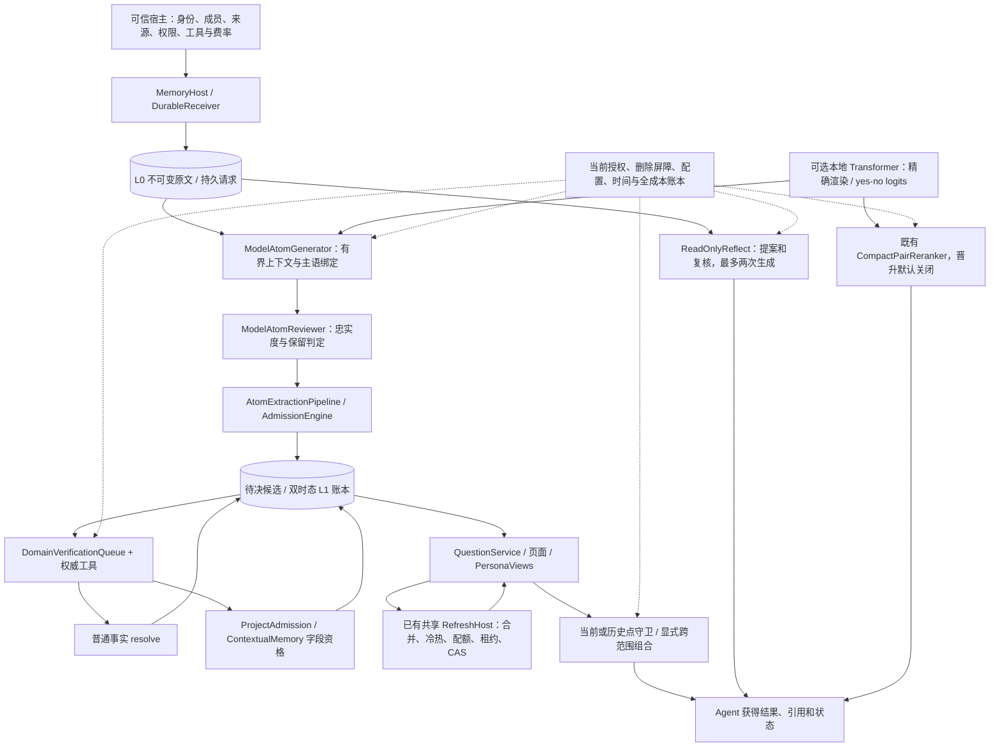

# Agent Memory v7.1.0：受治理抽取、领域核验与运行宿主

版本：7.1.0；日期：2026-10-10；前序完整目标设计：[v7.0.0](AGENT_MEMORY_DESIGN_V7.0.0.md)。
软件包仍为 0.1.0。本文是 v7 的加性运行合同，继承其来源、双时态、权限、完整查询、派生依赖、
调度和评测不变量；不重写冻结正文，也不将本次工程测试换算为真实领域或生产验收。
实施入口：[plan](v7.1.0/plan.md)、[task](v7.1.0/task.md)、[验证记录](v7.1.0/validation.md)。

## 1. 目标和责任边界

把原文持久采集、受治理候选生成、独立语义审查、权威领域核验、问题刷新和受守卫读取接成可运行链路。
确定性读取和计算继续优先；模型只生成提案或说明。用户、项目、来源 authority、成员关系、权限和计价依据
只能由宿主提供。模型评分、原文包含某句话和核验工具返回 unknown 都不能单独证明现实事实。

能力按责任归属放置在模块化单体内：`consolidation` 管候选与资格，`operations` 管持久执行，
`derived` 管问题、历史点、画像与组合，`retrieval` 管治理模型读取/推理，`context` 管输入预算，
`evaluation` 管证据和晋升，`packages/local-models` 管可选模型运行。复用已有数据库/UoW、
retention、derived ledger、ModelBudget 和刷新调度；没有第二套事实库或万能 MemoryManager。

## 2. 算法总体架构

L0 是证据，L1 是有来源和适用时间的事实/候选，L2 是问题/场景投影，L3 是明确标注来源及推断性质的画像。
画像、缓存、模型说明和历史投影都不能作为新的独立来源重新入库。

## 3. 写入和读取数据流

```mermaid
flowchart LR
  Input[已认证事件] --> TXA[事务 A：ticket、原文、请求、显式授权]
  TXA --> Lease[抽取租约]
  Lease --> Model[事务外：授权输入、预算、生成、审查]
  Model --> Preview[可预览的保存阶段：候选、理由、处理依赖]
  Preview --> TXB[事务 B：来源/配置/授权复验，候选发布与任务完成]
  TXB --> Domain[权威核验：supported / refuted / unknown]
  Domain --> TXC[事务 C：候选版本与租约复验、字段证据、原子完成]
  TXC --> Dirty[已有反向订阅标脏]
  Dirty --> Coalesce[合并刷新与固定目标]
  Coalesce --> CAS[完整 / 确定性增量 / 证明复用，CAS 发布]
  CAS --> Request[读取请求]
  Request --> Safety[当前权限、来源、完整性、时间和删除检查]
  Safety --> Reuse[复用结构化答案及引用]
  Safety --> History[已记录 known_at 发布点 + 证明有效窗口]
  Safety --> Composite[同一事务显式跨范围组合]
  Reuse --> Deliver[交付边界复验]
  History --> Deliver
  Composite --> Deliver
  Deliver --> Output[结果或明确不可用/未知/争议]
```

核验与刷新不能延迟删除和撤权的读取失效。unknown 保留待决，不当作反证；后台失败保留责任，
不伪造“已完成”。项目无风险、空集合等负结论仍遵循 v7 的完整查询范围证明。

## 4. M1：生成、审查和上下文

`GovernedSourceCalls` 复用 SourceModelAuthority、GovernedModelAnswers、精确缓存和费用账本。
每个原文分别需要当前读权限和该模型 recipient 的处理权限；输入包含系统模板、完整获准原文及宿主结构化请求。
生成与审查的模板、schema、配置、身份、用途和成本阶段绑定为版本，不能在运行中换目标。

`ModelAtomGenerator` 只接受宿主注册的 subject/predicate、标量 value、完整 kind/modality、原文引用和保留的限定词/时间。
有界上下文最多 16 个原文，主语集合和谓词集合各最多 64 项。第一人称需要宿主明确配置
`primary_subject_id`，并与保留事件的 actor 一致；不是从模型输出推断登录身份。
审查逐候选返回忠实度、保留等级和有限理由码，不能用 confidence 填补业务核验。

发布复验原文、权限、版本和配置。跨轮处理依赖加入候选的擦除依赖；处理过上下文不代表上下文成为事实证据。
使用多来源上下文得到的 ACCEPT 提案降为待核验，只有正常字段资格能证明相应来源支持。
preview 可发生有审计的模型调用，但不发布候选或事实；不能把“预览”理解为零费用。

## 5. M2：权威领域核验

`DomainVerificationQueue` 在既有 derived ledger 保存任务、候选版本、目标指纹、工具版本、来源依赖、epoch、重试和租约 token。
工具注册由宿主绑定 SourceAuthority、subject、predicate 和版本。工具调用在事务外有超时；出版者在租约事务内
执行原有 resolve/qualify/reject，工具完成和实际发布共提交，最后再次检查当前权限、工具、epoch 和租约。

- supported：必须提供精确证据及字段/时间支持，普通事实进入正常接纳；条件候选保留资格投影语义。
- refuted：独立于 unknown，普通/项目候选使用其原生拒绝机制。
- unknown：任务完成、候选仍待决；新来源/候选或工具版本才形成新核验责任。

`LocalRecordVerifier` 支持宿主认证、hash 固定的权威 JSON 记录，按主体、谓词、值与完整有效期匹配。
未来才记录的证据不能冒充当前观察，有限证明不能扩大成开放区间。文件名和 issuer 本身不构成 authority。
条件、例外、否定或不足证据返回 unknown；专用工具可通过 typed finding 与 contextual publisher 提交完整条件和字段支持。
模型来源和记忆回流不是独立证据。对业务接口的认证、读取许可及版本监听由实际宿主接入，不能由本项目虚构。

## 6. M3：精确 token 预算

`ModelInputBudget` 绑定模型、tokenizer、renderer、context、输出预留和明确 framing；`TokenBudgetPort` 对最终实际 payload 计数。
当前权限先于 tokenizer 处理；溢出在缓存槽/费用预留和模型 I/O 之前拒绝，dispatch 前再次计数，响应后核对输入 token 回执。
配置或绑定变更、非整数计数、隐式渲染、回执不一致均拒绝交付；未知费用不会归零。

可选 `LocalTransformerChat` 直接控制本地 tokenizer/chat template、schema 指令和生成 token，因此 renderer 与实际执行一致。
真实本地模型已验证精确计数与执行回执相符。它目前使用明确批准的本地 Qwen3 运行路径和确定性生成。
Ollama Qwen 9B 路径继续只有 byte bound：没有获准且验证一致的服务器 renderer 时，不能宣称该路径具备精确 token 预算。
`LocalChatTokenCounter` 单独存在也不证明其模板和某服务器相同。

## 7. M4：可运行宿主

`MemoryHost` 装配 DurableReceiver、ExtractionQueue、DurableAtomHandler、BoundedWorker、领域核验和可选共享 RefreshHost。
`submit` 把原文、请求和宿主授权放入同一事务，拒绝授权整体回滚；重复提交不重新授予权限。
`submit_project` 通过 ProjectAdmission 保存宿主类型化项目输入及成员映射，始终先待决，由领域工具核验。
这两个入口不允许模型选 authority、scope 或项目成员。

一次循环执行有界抽取、候选核验发现、一个核验任务和已有刷新批次。项目资格完成后不重复排核验；
刷新仍遵守已有合并等待、冷热和共享预算，单个循环不承诺所有视图立即 ready。
stop 停止新工作，当前有界任务可完成；新宿主重启复用持久账本，同一宿主 run 可重新启动其刷新宿主。
聚合指标只报告当前生命周期与安全错误码，不输出原文/引用/模型正文；完整费用以 ModelBudget 为准。

## 8. M5：真实验收的代码与外部输入

`evaluation.real_acceptance` 加入受范围限制的 manifest 与 corpus/gold/judge/pricing 工件 hash 校验。
宿主还必须明确认证语料许可、scope 权限、gold 独立性、裁判和校准依据；文档字符串/hash 不能代替这些认证。
执行接入既有四臂 cold/warm 完整成本实验器，前后检查冻结协议和工件，不新造一套有利指标或假裁判。
未知 GPU/存储/费用、不完整后台工作和失败继续阻止收益/晋升结论。

尚未收到实际获准语料、独立 gold、业务核验来源和费用/阈值依据，因此真实业务效果验收仍等待输入。
本地真实模型运行是 **真实计算 + 作者编写的合成输入**，不计为许可真实业务准确率或全成本下降。

## 9. M6：本地 logits 重排

独立 `agent-memory-local-models` 包惰性导入；核心依然零第三方运行依赖，不自动下载或执行模型仓库 Python。
批准 manifest 覆盖 config、tokenizer 与权重，流式 SHA-256；加载使用 local_files_only 和 trust_remote_code=False。
Qwen3-Reranker 官方固定 prefix/body/suffix 分别分词；取最后位置真实 yes/no logits，交给既有 FinalTokenPairScorer。
最多 16 条一批，显式单条及总 padded token 上限，不静默截断，forward 不保留无用 KV cache。
取消请求不会让新的推理任务排到尚未结束的模型线程后面；占用未释放时明确返回 busy。

本次安装并实际运行发布方 `Qwen/Qwen3-Reranker-0.6B`，冻结 revision
`e61197ed45024b0ed8a2d74b80b4d909f1255473`，权重 SHA-256
`27cd75a405b9c1b46b59abfd88aaa209e6fed2a1972cde9b70e7659537c5e65b`。
模板与方法依据[发布方模型说明](https://huggingface.co/Qwen/Qwen3-Reranker-0.6B)。
真实推理通过不授予生产晋升；仍须 existing feature approval、当前处理权限和 M5 独立效果证据。

## 10. M7：历史、高层组合与只读推理

| 能力 | 已实现合同 | 明确不承诺 |
| --- | --- | --- |
| 问题/页面历史 | `history_points=True`；不可变 published point、精确 known_at 与证明有效窗口、当前权限和擦除、SDK/MCP 交付复验 | 任意过去 known_at 的数据库重建、连续项目历史区间或覆盖缺口外推 |
| 跨范围组合 | 同一 repository 内最多四个已注册当前问题；按 scope 顺序锁定、宿主显式组合授权、所有父复验；不保存复制正文 | 跨数据库分布式事务、隐式跨租户权限、永久保留的通用跨范围页面 |
| L3 / Persona | 显式声明和推断分开；上下文、有界支持/反例、独立来源族阈值、版本、有效期、当前权限；推断支持绑定已接纳 Atom | 把重复引用当独立证据、把画像当现实真相、自动发布未审模型画像 |
| Reflect | 获准原文最多 16 个；固定提案+复核两次生成、精确引用、时限/输出上限、最终处理证明复验、不写入记忆 | 开放工具代理、任意网络操作、自主学习回写或多轮无界推理 |

历史问题在发布事务内保存点；页面由显式 capture 保存真实观察点。无来源的完整空结果也能保存点，但不跨未知 system-time 缺口。
历史读取始终使用今天的权限，不恢复旧权限。历史对象、L3 和核验任务加入 SQLite/PostgreSQL 擦除及备份回放公共路径。
历史和 L3 是保留根；Question GC 不删除其依赖。有限容量耗尽必须显式处置保留，不自动丢掉审计或历史。

L3 推断至少三个独立来源族（宿主可配置 2–16）；所有支持的 Atom 版本、scope、来源、接纳状态和有效期需当前成立。
反例令状态 contested，证据结束限制画像有效期；事实撤回、改版、权限撤销或擦除后旧结果拒绝读取。
显式原文声明可以保留为 host_declared；它与 inferred hypothesis 都不升级成独立事实 authority。

## 11. 升级、回滚和部署

新增类型复用既有 ledger，没有新增 SQL 表。先排空旧写进程，再部署同一版本核心/SDK/provider/worker；
旧二进制不应执行新记录类型的 GC 或擦除。新功能默认关闭或只由可信宿主显式装配。
回滚前关闭新增 worker/读者，保留当前 authoritative 删除日志和金额账本；先用新版本完成擦除回放，
不能把旧数据库快照直接当当前权限、删除状态或余额恢复到在线宿主。

核心与旧六包照常使用；模型包需单独安装。weights 不进入仓库、sdist 或 wheel。
模型晋升、远端 ACL 同步、供应商副本删除、真实费率和法律保留的宿主责任沿用 v7。

## 12. 验收和剩余目标

本轮验证区分协议/事务测试、实际本地模型合成运行、包构建安装及真实业务效果；各次命令和结果见验证记录，不累计旧成绩。
七项都有代码入口，但 M5 的实际业务验收不完成，M7 的 published point 不等于通用连续历史。
这些差异保留在 task 中；AM70/AM61 的旧全目标状态、许可领域质量和完整 M0/M1/M2 门不因本版改写。
