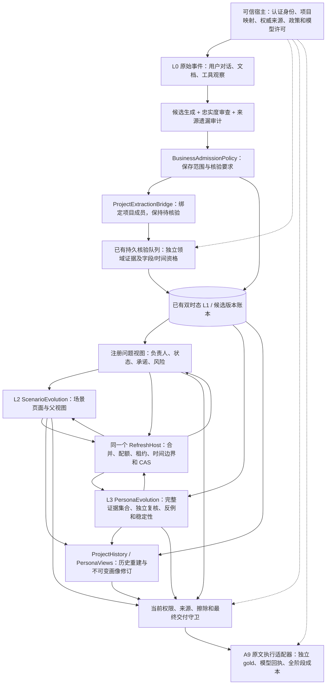
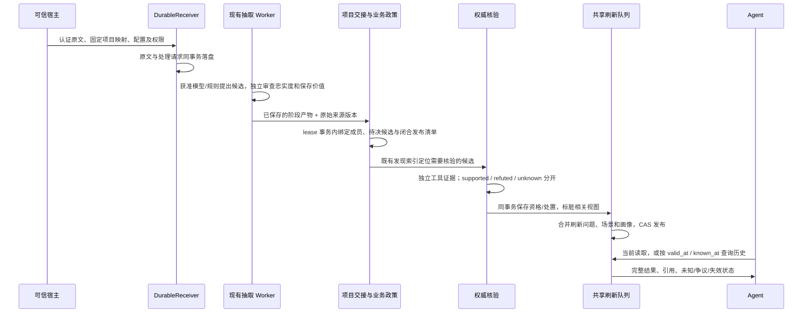

# Agent Memory v7.2.0：原文闭环、业务政策与高层演化

日期：2026-10-10。前序完整目标为 v7.0.0，运行合同承接 v7.1.0。软件包版本保持 0.1.0。
本版增加可调用的运行能力，保留旧接口的默认行为；真实业务效果与生产验收单独记录。

## 1. 总体算法架构

复用原有数据库、UoW、admission ledger、derived ledger、反向订阅、ModelBudget 和刷新队列。
不新增事实库、图数据库或统一万能管理器。模型、画像和派生页面不成为新的独立事实来源。

## 2. 原文到项目视图的数据流

`MemoryHost(..., project_bridge=..., evolutions=...)` 自动执行这些阶段。
高频问题注册 `RefreshPolicy(mode="on_change")`；冷视图仍按需刷新。
没有可信项目映射、语义审查或时间证据的候选保持待决，不能通过“自动接线”绕过核验。
宿主显式配置 observation_time_predicates 时，可用事件观察时间建立拟议有效起点；
审计保留原始未知时间和宿主政策，最终仍需领域时间证据。默认不推测现实生效时间。

## 3. 什么值得保存，什么必须核验

`BusinessAdmissionPolicy` 为每个注册谓词配置 `MemoryRule`：

- `storage=durable/session/l0_only`：决定是否进入长期/会话候选；原文保留及脱敏由 CaptureProfile 管理。
- `allowed_scopes / allowed_kinds`：限制保存范围和事实类型，不因模型说“重要”就扩大范围。
- `verification=source/domain`：明确来源权限足够还是必须独立核验。
- `verification_sources / source_families`：固定允许的核验权威，复制或转发同一来源不算独立确认。

决策和理由随政策版本保存；抽取分数不是事实概率。忠实度、复用价值、事实支持和读取新鲜度分别判断。
普通 Atom resolve 使用验证政策；项目/条件字段出版者用 `policy.guard_domain_publisher(...)` 加上同一业务门。
模型、原始陈述以及来自同一来源族的再次读取不能替代所要求的独立领域核验。

## 4. L2 场景演化

`ScenarioEvolution.register` 以已经注册的问题为场景父，首次冷启动即登记现有页面处理器。
父视图变化、资格变化、来源撤回及时间边界通过原有依赖和共享队列维护；读取立即检查过期/权限。
场景拥有稳定块身份、版本、完整父谱系和历史布局；它没有自行接纳 L1 的权限。

## 5. L3 画像演化

`PersonaEvolution` 注册主体、谓词、上下文、读者、用途、有效期和最小观察跨度。
新增事实和反例也在完整查询依赖内，不能只跟踪旧画像引用过的依据。
独立来源族数量和时间跨度均满足后，提案经独立宿主复核才发布为 `hypothesis`。
明确声明保持独立来源类别；计划、未知和未验证来源不能作为已接纳支持。
获准的未验证冲突证据可经审查作为带标签的反例，不能增加支持数量。
依据不足、到期、撤回或复核否决会发布 withdrawn 修订；旧修订保留历史解释。

`CategoricalPersonaPolicy` 提供宿主批准的分类偏好参考实现，固定谓词、目标值、文本与上下文，
不靠测试假模型生成画像。默认最小观察跨度为一天；零跨度仅作为显式宿主政策/合成演示配置。
画像完整追踪支持 Atom 的证据和处理来源，防止次级核验来源撤权后继续交付。

## 6. 双时态历史

`QuestionService(..., history_rebuild=True)` 记录注册时的业务合同、上下文、来源权威、成员映射和页面布局。
历史读取按任意请求坐标选择 admission 系统版本，再按现实时间重算问题；不复制最接近的旧答案。
场景父问题在同一 UoW 重建；未来的文档修订仅遍历元数据，实际证据正文先经过当前授权。
画像用不可变修订保存旧结论、证据、系统时间和有效范围，普通更正不会把旧结论改写成新结论。

覆盖从启用后的明确注册时间开始。早于覆盖起点、缺失版本、同一时刻的歧义注册、被擦除证据均拒绝外推。
当前支持完整 `admitted_l1` census；`publication_manifest` 尚无历史请求状态账本，仍显式不支持重建。
已发布点历史保持兼容。历史始终使用今天的权限和删除状态，不恢复已撤销的授权。

## 7. 真实验收与成本

`RawSourceWorkflowAdapter` 接入现有 A9，输入真实原始事件而不是预接纳标签。
可信运行绑定提供模型、权威工具、成员映射和各实验臂配置；每臂独立状态、gold 只交给独立裁判。
初始化失败后禁止继续工作；源级遗漏审计和关系控制需与实际 pipeline/contract 一致。
完整模型账本及未执行抽取、核验、刷新任务进入成本结果；没有费率、账单或后台完成证据时保持未知。

生成、复核和可选审计可使用不同的配置；`ModelEvidence.group` 显式固定允许的配置集合，
每笔回执保留真实配置和调用身份，不能为了匹配实验声明改写配置散列。
单模型旧序列化保留；多配置组为显式可选合同。

真实业务效果验收仍需要获准语料、独立 gold、认证业务核验数据、模型预算、裁判与完整费率。
本版工程测试和 authored grammar 演示不宣称真实抽取准确率、遗漏减少或总成本降低。

## 8. 实施与验证

模块和状态见 [plan](v7.2.0/plan.md)、[task](v7.2.0/task.md)、[validation](v7.2.0/validation.md)。
可运行示例：`examples/project_memory_lifecycle.py`。新能力默认需宿主明确装配，既有默认行为保持。
SQLite/PostgreSQL 共用领域语义；历史读取新增元数据/系统版本查询，不新建 SQL 表。
旧 AM61/AM70 台账保留历史范围，不能用本版编号清空真实质量、成本和生产运行的未完成项。
