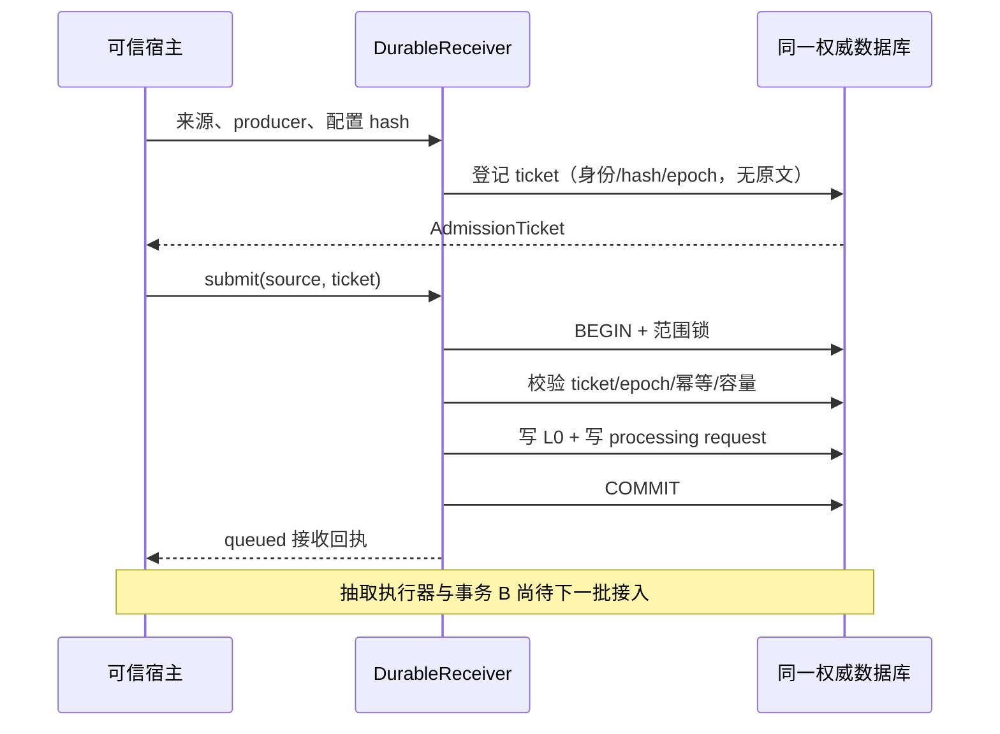

# v6.1.0 第二批：L0 与处理请求原子接收

日期：2026-10-06；台账 revision 3。依据固定设计 v6.1.0 §14.1、§21.5 和任务 T02/T04/T15/T16/T23/T24。
这是 **durable 模式的接收端**，没有启动模型、接纳 L1 或宣称任务已处理。下一批执行计划见 [next-steps.md](next-steps.md)。

## 已实现的行为

1. 可信宿主先签发 `AdmissionTicket`：绑定 exact scope、producer、request、source event、来源幂等键、完整输入指纹、处理配置指纹、scope epoch 和期限。
   票据登记只保存身份与 hash，不保存原文，不从模型输入授予身份。
2. `DurableReceiver.submit()` 在同一 UoW 中校验票据、当前 epoch、容量及幂等身份，然后保存 L0 与处理请求。
   任一步失败或事务内取消，两者一起回滚；事务提交后才返回 queued。
3. 重传相同输入可恢复第一次回执，即使接收完成后票据已到期也不会再写来源。输入、producer、配置或来源身份变化明确冲突。
   未接收且过期的票据不能自动续期；原 source 身份不能通过更换 request ID 绕过保留记录。
4. 已知记忆回流、内部接纳事件、伪造 `atom_*`/`_retention` 元数据不能进入新接收入口。
5. 待处理 L0 使用现有 `memory.atom` 受保护存储类别，保留原 event type、正文、occurred_at 和 capture 注记；不会变成 Claim 或进入默认事实检索。
   这是兼容现有读取守卫的内部映射，不表示已经形成 Atom 决策。
6. 既有 `forget()` 的同一事务会撤销相关票据、取消请求；exact scope 全量 archive/erase 同时推进 scope epoch。
   即使票据签发时范围内尚无 Event，之后的范围删除也使旧票据失效。指定 source ID 的删除可撤销尚未接收的对应票据。
7. `status(scope, request_id)` 返回 queued/cancelled 或不存在；无正文；其他 scope 不能查到请求。
   新授权事件采用新的来源/请求身份，可以在当前 epoch 被接收。



## 代码与存储位置

| 所有权 | 文件 / 变化 |
| --- | --- |
| 入口与接收合同 | `src/agent_memory/operations/retention.py`：DurableReceiver、AdmissionTicket、RetentionReceipt、稳定 RetentionError.code |
| 可选存储端口 | `src/agent_memory/ports.py`：RetentionRepository/RetentionUnitOfWork，不扩大旧 Provider 必须实现的接口 |
| SQLite | `operations/sqlite_retention.py`：SQL 实现；`sqlite.py`：UoW 方法、初始化、forget 事务接入 |
| PostgreSQL | `packages/postgres/src/agent_memory_postgres/retention.py`、repository UoW 与删除接入；新增 `006_retention.sql` |
| 验证 | `tests/test_durable_retention.py`：同一套 SQLite/真实 PostgreSQL 合同行为 |

存储只新增 `retention_epochs` 和 `retention_entries`（PostgreSQL 带 `agent_memory_` 前缀）。
entries 的 ticket/request 两类记录分别保存接收许可和处理责任；请求不复制正文。后续执行器消费这份 outbox，
不能另建一套与它无法原子对账的队列。现有 capture outbox、worker queue 和同步 extract_atoms 行为保持原协议。

SQLite 沿用 `BEGIN IMMEDIATE`；PostgreSQL 沿用 admission 的 namespace 事务锁。
source 写入、request 写入与删除代次更新分别使用各自调用方的同一事务连接，没有“相同数据库、不同连接”的伪原子性。
票据存在表中，调用方构造一个同名 dataclass 不能伪造数据库登记的 token。

## 宿主 API 示例

在已安装当前 core 的 Python 宿主中使用；没有新增开放 MCP 工具，也没有自动打开 capability。

```python
from datetime import UTC, datetime
from hashlib import sha256
from agent_memory.domain import MemoryEvent, MemoryScope
from agent_memory.operations.retention import DurableReceiver
from agent_memory.sqlite import SQLiteMemoryRepository

repository = SQLiteMemoryRepository("memory.db")
await repository.initialize()
receiver = DurableReceiver(repository, max_pending=1000, max_tickets=10000)
scope = MemoryScope("tenant-1", user_id="alice", session_id="session-1")
source = MemoryEvent(
    scope, "user.message", "以后用中文回复。",
    id="opaque-source-revision-1", idempotency_key="opaque-host-event-1",
    occurred_at=datetime(2026, 10, 6, tzinfo=UTC), actor="authenticated-host",
)
# 宿主应对实际的策略/适配器/提示词等冻结配置取 hash；此处只演示接口。
configuration_hash = sha256(b"local-test-configuration-v1").hexdigest()
ticket = await receiver.issue_ticket(
    source, request_id="opaque-request-1", producer_id="host-1",
    configuration_sha256=configuration_hash,
)
receipt = await receiver.submit(
    source, ticket=ticket, producer_id="host-1",
    configuration_sha256=configuration_hash,
)
assert receipt.status == "queued"
assert (await receiver.status(scope, receipt.request_id)).status == "queued"
```

生产宿主负责可信身份和接收前清洗，可先复用已有 CaptureSanitizer；本接口接收已经获准保存的来源。
配置 hash 只固定后续需要匹配的配置，不授予模型外发权限；当前接口不加载或执行该配置。
source/request/producer ID 使用不含正文、密钥或个人资料的 opaque ID。票据 token 不应输出给模型或公开日志。

## 明确限制与迁移

- 当前只有 queued/cancelled 接收状态；没有 worker claim、lease、抽取、阶段产物缓存、事务 B、索引可见性或自动重试消费。
  该接收切片供后续执行器开发使用，不能作为已完成的无人值守记忆写入流程上线。
- 普通 `extract_atoms()` 仍是旧同步协议。不能对本批已保留的相同 source/key 再调用旧接纳入口来“补处理”，
  旧入口会拒绝冲突。下一批必须通过同源的显式发布协议接入，而不是复制一份来源冒充新证据。
- epoch 按 MemoryScope.partition_key() 的精确范围定义；不声明层级 ACL 递归撤权、外部权限 epoch、producer epoch 或 processing 依赖闭包。
  宿主不得给旧离线请求换 source/request ID 伪装成新授权输入。
- max_pending 对未取消请求计数；max_tickets 对保留的全部票据身份计数。默认 1000/10000，TTL 默认 300 秒，最多 3600 秒。
  未提交超时请求不静默续期；长期墓碑保留/压缩与 producer 生命周期政策需在 T17/T23/T40 完成后扩展。
- 当前 archive 与 erase 均阻止后续自动处理；archive 保留的正文仍遵循原归档接口，恢复必须显式走后续授权流程。
- PostgreSQL 新增 006 迁移；SQLite 初始化幂等创建新表。不修改旧事件 schema 或既有传输协议版本。
  新连接重新初始化后能找回同一回执；wheel 包含 PostgreSQL 迁移。
- 开始接收新请求后，不允许新旧二进制混用删除/恢复写路径。旧版本不了解 ticket/epoch，不能证明旧删除操作撤销了入口许可。
  回滚前停止新入口和旧票据重放，保留新 ledger；删除与恢复操作继续由当前版本处理。

## 验证与任务状态

同合同覆盖：接收前无原文、同事务回滚（L0 后/请求后两个注入点）、丢确认重试、跨连接恢复、迁移重放、
并发去重、并发容量、删除与重传竞争、全范围/单来源删除、archive/erase、票据过期、scope 隔离与元数据伪造。
`queued` 来源不会进入默认事实检索；抽取器未被调用。

实际命令、通过/跳过数、文件与 wheel 指纹见 [validation-batch-02.json](validation-batch-02.json)。
异常注入是进程内事务取消，不冒充 kill -9、断电或网络分区实测；这些运维测试仍属于 T24 后续范围。

T15/T16/T23/T24 更新为 IN_PROGRESS；T16 只完成事务 A，事务 B 未完成；T02/T04 增加本批合同/夹具证据。
本批不将 R10、N02、N05、T24 或 M1 整体标记为完成。尚无生产 AcceptanceProfile，也没有真实模型实验。
