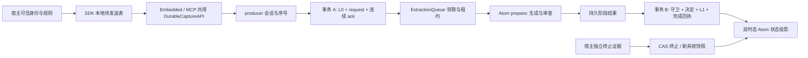

# 第三至第五批：持久 L1 主链、宿主恢复与事实资格

日期：2026-10-06。执行台账 revision 4；目标设计仍为 v6.1.0，正文未改。
本次沿 B03/B04/B05 实施有界能力，**不是三个批次全部验收完成**。
验证明细见 [validation-batch-03-05.json](validation-batch-03-05.json)。

## 已实现的主链



采用模块化单体；不是按图中每个概念新建服务。状态所有权如下：

| 所有者 | 负责 | 不承担 |
| --- | --- | --- |
| `capture/producer.py`、`durable_api.py` | 宿主会话、身份绑定、序号、连续确认、传输合同 | 生成器、事实接纳授权 |
| SDK `durable.py` | 先持久再发送、断线重传、核对回执、清除正文、本地 purge | 自动注册、更换删除代次 |
| `operations/retention.py` | ticket、删除 epoch、来源/request 原子接收 | 模型调用、来源改写 |
| `operations/extraction_worker.py` | 领取、租约、阶段复用、输入清单、事务 B | 事实领域判断、另一套后台调度服务 |
| `consolidation/atom_extraction.py` | `prepare` 与 `publish_prepared`；保留旧 `process` | producer 游标、本地待发 |
| `consolidation/admission*.py`、`retraction.py` | 接纳、候选决定、同槽更正、独立证据终止 | 执行条件表达式、隐式跨槽变更 |
| `fact_qualification.py`、`domain.py` | 限定字段与有界字段证据值对象 | SQL、SDK、外部模型依赖 |
| `retrieval/atom_state.py` | valid/known 时间投影、终止信息、禁止旧值复活 | 修改原始来源或审查结果 |
| SQLite/PG 适配器 | 同一 UoW 的 SQL、锁、迁移 | 业务生成与审查 |

`BoundedWorker` 依赖最小 `WorkerExecutionQueue` 租约接口。完整 `WorkerQueue` 保留通用
入队/统计合同；接收 outbox 不伪装成另一套支持任意入队的通用队列。

## B03：本地、同范围、单来源执行

- 接收事务保存不可变 L0 与 request，发布不会覆盖 L0 正文或附加新的业务元数据。
- 原子领取保存 lease token、到期时间与次数；只有当前租约可保存阶段和发布。
- 生成/审查在数据库事务外运行；成功阶段持久化后，发布回滚或租约到期可以复用阶段。
- 事务 B 内复查来源可见性、scope epoch、lease、配置、输入内容 hash；决定、Claim、候选版本、
  publication identity 和完成回执一起提交。不存在先写一半事实再补任务完成的窗口。
- 输入清单记录实际单来源 ID/hash、精确 scope、配置 hash；输出不能从 session 扩大到 user/team。
- 完成回执包含候选最终决定和抽取诊断；零候选、全部待决、处理失败与完成可区分。
- `source_persisted` 与 `l1_decided` 分开；`index_visible` 明确为 `unsupported`。
- 模型自述来源不能取得独立事实资格；生命周期角色须匹配宿主配置的来源授权。

当前 `local_only=True` 是宿主对适配器的显式运行约定，不是网络沙箱。只能配置受控本地适配器。
外部模型 dispatch、费用预留、多来源依赖、派生任务/index outbox、水位与远端交付仍未接通。
失败尝试有计数；保存阶段里的 generation/review 计数不是跨崩溃调用账单。

## B04：producer 与 SDK/MCP

宿主在代码中调用 `DurableProducer.open` 注册固定 actor/scope/config 的会话；MCP 不提供注册入口。
生产者会话包含 producer ID、删除 epoch、随机 token、配置 hash；token 是宿主凭据，应由宿主保管。
MCP 的 `memory_durable` 仅在显式配置时注册；部署端仍须采用项目已有的可信身份解析与传输保护。

同一 producer/epoch/sequence 重放同内容恢复原回执，异内容拒绝；来源 ID 由 scope+宿主事件 ID
确定，不能因 SDK 重建对象或断线重试产生新的来源。乱序确认保留缺口；收到 2 不代表 1 已收到。
连续 ack、ticket、L0 与 request 共用事务；提交失败全部回滚。

SDK 提供 `durable_append` / `durable_cursor` / `durable_status`，Embedded 和 MCP 走相同核心 API。
调用者 JSON 不能覆盖 actor/scope、提升来源角色，或伪造可信 capture 注记。默认 model 角色可以保留来源，
但后台不得把它当作 user/tool 的独立事实。可信宿主适配应显式配置 `trusted_origin`。

`DurableOutbox` 先接收**宿主已经脱敏的**生命周期 envelope，持久保存后再发。只有收到 producer、epoch、
sequence、正文 hash 均匹配的提交回执才清除正文，并保留 hash/序号墓碑防止复用。
重新打开同一本地库可续传；服务端已提交但回执丢失时只恢复确认。

全 scope 擦除提升服务端 epoch，旧会话即使带着离线正文也不能复活来源；宿主同时调用本地 `purge()`，
清除待发正文并撤销该本地会话。**这不是自动广播到所有离线设备的擦除机制**。
新授权需新 producer ID；不会给旧数据自动换 epoch。单来源删除也保留服务端 ticket 墓碑。

仍未实现：来源 `revise`、显式重新处理与贡献对账、自动多设备 purge 协调、通用后台操作面板。
恢复模式与本次 durable 模式不能混用；构造入口明确拒绝绕过旧恢复门的组合。

## B05：资格与双时态切片

- `AtomDraft` 保留 `conditions`、`exceptions`、`negated`、`field_evidence`。
  当前 scalar projector 不支持条件求值；带这些限定的候选进入待核验，不能静默变成无条件事实。
- 抽取器拒绝未知语义字段；兼容忽略生成器的显示文字、置信度、authority，仍以宿主授权为准。
- `PredicateSpec.required_evidence_fields` 规定需要证据的字段。
  `FieldEvidence` 的每个 alternative 内是 AND，alternatives 间是 OR；逐 span 校验事件 ID、半开区间与正文。
  本次仅支持同一来源修订的定位表达式。跨来源/业务版本/支持时间的 AND 交、OR 并及撤证重算仍未实现。
- 原文定位不等于事实核验；语义审查与宿主来源资格继续分别判断。
- 新字段为空时不进入旧 candidate/config 的序列化 hash，避免普通 Atom 无故改变身份。
- `AdmissionEngine.retract`、Kernel/`AgentMemory.retract_atom` 使用独立来源、expected_version 和显式 valid_to
  终止已接纳状态，原始来源不改，新增系统快照。它不提供替代值，也不恢复更早状态。
- 原有同槽 correction 继续工作；迟到终止可表达 valid_to=10 日、known_at=20 日。
  查询 K19 仍见旧认知，查询 K20 后不再把 10 日后的值当成有效事实。
- 删除任一依赖来源仍采用现有保守槽撤回策略；没有宣称完成 R06 独立贡献幸存或跨槽 R07。

## 运行与迁移

可运行示例：[examples/durable_memory.py](../../../examples/durable_memory.py)。安装本仓库 core 与 SDK 后：

```bash
python examples/durable_memory.py
```

示例只用现有 `RuleBasedAtomAdapter` 的整句语法，不需要外部模型。
真实宿主需固定 generator/reviewer/policy/authority 版本，计算 `processing_configuration_sha256`，
并为该配置创建相应 queue 与 handler。配置改变不允许在旧 request 上静默重跑。

PostgreSQL 新迁移：`006_retention.sql` 与 `007_producers.sql`；SQLite 在初始化中建同义表。
PG wheel 包含两份迁移。旧同步 API 默认路径保留，durable 入口显式注入后才启用。
回退先停止 durable 宿主发送与 worker；已有新表保留，不能为了回退删除 ticket/epoch 墓碑。
回退版本无法处理新队列，不应在接收新请求的同时移除 worker。

资源默认值：单 scope 待处理 1,000、ticket 10,000；producer 最大序号缺口 1,024；
本地待发 1,000；单来源正文 32,000 字符、接收 envelope 128,000 bytes、阶段 160,000 bytes。
墓碑不自动清除；达到容量时报错，不能通过清除墓碑绕过防重放。此轮不是规模验收。

## 验证结果与剩余顺序

全量 `pytest tests packages`：**973 passed, 5 skipped**，5 项为可选 tiktoken 未安装。
双后端均使用实际存储；PostgreSQL 17 临时独立集群，测试结束关闭并清理。
核心、PG、SDK、MCP wheel 构建；新增模块 Ruff；可运行本地示例；设计 hash 与文档链接检查均单独记录。

新增合同测试覆盖发布事务回滚、阶段复用、旧 lease、多 worker 领取、次数耗尽、零输出、全部待决、
配置改变、擦除阻断、乱序 ack、接收/游标原子回滚、丢确认重传、SDK/MCP 同合同、限定保留、字段 AND/OR、
迟到终止的 valid/known 矩阵。故障为受控异常、租约时间推进与重新打开持久库；不冒充 SIGKILL、主机掉电或外部供应商验收。

后续优先级仍见 [next-steps.md](next-steps.md)：补齐 B04 来源修订/重处理，再扩 B05 条件投影、跨来源时态支持及
独立贡献撤回；只有相应测试通过才启用复杂语义。B06 之后的外部模型、L2/L3 与 Reflect 保持未启用。
