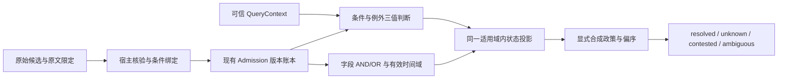

# 第二阶段：字段与时间支持、条件投影

2026-10-06；执行台账 revision 6；设计仍为 v6.1.0。对应后续实施顺序第二步 T07–T11。
本阶段实现同一授权存储范围内的条件化单值事实/偏好与完整字段支持，不宣称整个 P1 或 T11 已完成。

## 架构与职责

| 所有者 | 负责的内容 |
| --- | --- |
| `conditions.py` | QueryContext、带出处的上下文属性、受限 Condition AST、三值判断、ProjectionPolicy 与无环偏序 |
| `evidence_support.py` | EvidenceLink / FieldSupport / SupportRange；AND 时间交、OR 时间并、点证据；业务版本与独立来源检查；辅助证据擦除变换 |
| `consolidation/qualification.py` | 宿主 `ContextualMemory.qualify`；完整字段、目标指纹、原文定位、角色、scope 和版本 CAS 校验；持久审查合同 |
| `retrieval/contextual_state.py` | `ContextualMemory.query`；历史快照选择、当前来源守卫、条件先于槽内合成、适用域内替换、授权偏序、结果/原因/输入指纹 |
| SQLite / PostgreSQL Admission 存储 | 复用已有记录和版本表；辅助证据从当前及历史快照擦除、幸存分支保留、同事务回滚 |

只增加有独立责任的共享值对象、接纳编排和读取投影文件。不新增事实库、队列服务或顶层通用 manager。

## 写入与读取合同

1. 原始条件/例外仍保存在 AtomDraft，抽取器不能通过丢掉限定获得无条件接纳。
   宿主必须逐项绑定条件 AST；不支持的自由文本不猜测执行。
2. 条件 AST 支持 and/or/not、严格类型比较、集合成员及带显式时区的星期判断。
   属性不存在、类型不匹配、时区未知时返回 unknown；不执行 Python、SQL 或模型表达式。
3. QueryContext 绑定 principal、精确 scope、subject、purpose、valid_at、known_at、属性出处和 snapshot token。
   宿主负责每次调用前的当前身份/权限认证；本接口不从正文或 MCP payload 接受模型自报的权限/上下文。
4. `qualify` 仅处理尚未无条件发布的普通 fact/preference。保留候选 `PENDING_VERIFICATION` 状态，
   保存宿主核验与投影合同；显式查询只在完整字段支持和当前适用性满足时返回 resolved 投影。
   旧 resolve 入口不能把这类候选绕过字段合同写成普通 Claim。
5. 必须支持主体、谓词、值、显式有效时间及所有条件/例外，并满足已注册谓词的额外必要字段。
   EvidenceLink 绑定完整候选指纹、准确来源 span/hash、宿主授权、方法版本及支持时间。
   引文匹配只校验定位；事实语义支持由宿主批准的核验结果提供，不能据此声称自动核验现实真值。
6. FieldSupport 的每个分支是 AND，多个分支是 OR；所有必要字段再做 AND。
   AND 取时间交集；OR 保留区间并与间隙；半开区间不包含右端点；点证据不推定持续有效；未知时间不当无限区间。
7. 可要求同一 domain_revision；不同业务版本不能拼成一个证明。
   可要求每个字段有独立来源：同族转载、同一来源的多 span、未知来源族均不能凑数。
   durable 来源的来源族绑定 document ID，来源修订不增加独立来源数量。
8. 先判断条件，再在同适用域按现实边界选解释，最后合成不同适用域。
   同槽项目 A/B 不提前互相覆盖。支持 single_exclusive 和宿主批准的 ordered_override；拒绝循环偏序。
   不可比较异值返回 ambiguous；同域冲突返回 contested；高优先项争议、未知或到期不回退成确定旧值。
   例外只排除自己的解释。当前政策与所选历史解释政策不符时返回 history_unavailable。
9. 普通无上下文 Atom 状态读取对涉及上述合同的槽返回 context_required，不输出丢失限定的 Claim。
   显式查询返回政策/上下文/输入快照指纹、解释 ID、有效支持域、证据 link ID 和诊断。
   没有结果缓存；若以后缓存，仍必须重做当前读取与擦除守卫。

## 删除与修订

辅助证据擦除时，从当前和历史 qualification 移除其 link、引文和包含该 link 的整个 AND 分支。
完整 OR 幸存分支继续可用；AND 缺项或所有分支失效则投影 unknown。清理和版本更新与现有 forget 在同一个事务中。
读取遇到删除竞态会重新检查当前源；主候选被删时拒绝过时快照；辅助证据被删时重新计算证明。

来源修订使用第一阶段 document 谱系选择 known_at 可见的版本：过去认知可使用当时版本，当前认知不使用旧版本支持。
物理擦除仍按当前状态约束历史读取。复杂多来源候选的解释重处理保持显式拒绝，避免旧路径误升级为普通 ACCEPT。

主候选删除仍沿用原有保守槽撤回策略；跨槽及细粒度 transition 更正属于第三步，未借本次辅助证据清理提前开放。

## 使用与能力边界

运行 `python examples/contextual_memory.py`：项目 A 得到 English；项目 B/未知项目为 unknown；普通状态读取不返回该条件偏好。
宿主 API 从 `consolidation.qualification` 导入 ContextualMemory；条件/证据值对象从各自所有者模块导入。
本次没有新增模型可调用的核验授权接口，没有接入外部模型或扩大 SDK/MCP 的 scope 权限。

条件树最多 64 节点、8 层；每个候选最多 64 个 evidence link；每字段最多 8 个 OR 分支和 8 个 AND 项；
完整证明组合最多 256，超过明确失败，不能截断后当完整支持。历史来源修订遍历上限 256。
查询沿用现有有界 Admission 快照，未做大规模性能或吞吐承诺。

尚未启用：跨存储 scope 的授权路由与动态 ACL 注册、通用政策/实体历史注册表、constraint_conjunction、成员集合、
否定状态、复杂更正/终止、只核验部分字段后持久发布新断言、任意自然语言条件自动编译。
对应组合显式拒绝或保持待决；宿主不能把自由文本/条件未知视作 true。

## 验证与迁移

无需新增 SQL 表：复用 Admission payload/version；SQLite 和 PostgreSQL 使用相同纯证据计算与擦除规则。
混合部署前需先停止旧写入/删除进程，再更新 core 与 PostgreSQL provider，避免旧删除逻辑绕过分支合同。

全量结果：**1039 passed，5 skipped**；跳过项均为可选 tiktoken 未安装。
验证记录见 [validation-stage-02.json](validation-stage-02.json)：全量回归、双后端专项、架构依赖、示例及 core/PostgreSQL wheel。
本阶段新增 27 项专项用例和 2 项架构检查。真实领域抽取质量、外部核验和真实进程强杀不属于本次测试证据。
