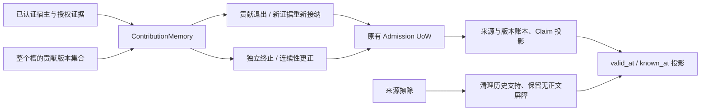

# 第三阶段：贡献级更正、撤回与独立状态终止

2026-10-06；执行台账 revision 7；设计仍为 v6.1.0。对应第三步 T10/T12 的同 scope、同槽、普通单值事实/偏好切片。
跨槽更正继续明确拒绝，T10/T12 保持 IN_PROGRESS，不把本次切片等同完整 B05 或 M1 验收。

## 架构与职责

| 所有者 | 职责 |
| --- | --- |
| `consolidation/contributions.py` | 宿主 facade、精确 scope、整个槽 CAS、幂等命令、同槽 add/correct/withdraw、幸存贡献重新核验 |
| `consolidation/transitions.py` | 显式 transition 及 correct_transition；终止依据与起始依据分开、独立连续性核验 |
| `contribution_state.py` | 无数据库依赖的贡献登记、身份屏障、证据清理与连续性授权变换 |
| `retrieval/atom_state.py` / `contextual_state.py` | 版本选择后的投影、屏障和明确连续性授权；标量与显式上下文查询遵守相同擦除约束 |
| SQLite / PostgreSQL Admission 适配器 | 复用现有事务、锁、记录/版本表；读取身份屏障、当前/历史支持清理、同事务回滚 |

没有新增队列、事实数据库或调度服务。普通 Claim 表仍是投影，Admission 账本定义当前解释。

## 宿主操作合同

通过 `ContributionMemory(engine, exact_scope, principal=...)` 绑定已认证宿主。正文和模型输出不能授予 principal 或 SourceAuthority。
`source_quote` 的定位检查仅证明引文存在；事实语义和变更意图仍由可信宿主核验。本接口不声称自动判断现实真值。

1. `snapshot(candidate_id)` 返回同槽全部存活贡献及擦除屏障的版本集合。
   每次变更必须携带完整 `expected_versions`，事务内重新读取并比较；行版本变化、遗漏/新增贡献均失败。
2. `withdraw` 只撤回指定贡献；其他独立来源不自动撤回。剩余合格争议贡献可在本次宿主政策下重新接纳。
3. `correct` 原子执行指定贡献退出和新来源接纳；新值重新经过策略与冲突判断，不继承旧证据。
   如果 E2 仍支持旧值，纠正 E1 不移除 E2；新值保持 CONTESTED，默认读取不给出确定事实。
4. `add` 为已经托管的槽添加新来源，也必须使用完整版本集合。
   新来源、候选、Claim/index 发布、旧贡献变化和操作回执共用一个 UoW；任一步失败全部回滚。
5. 首次操作将整个合格槽登记为贡献托管。原 `admit/resolve/retract` 与整来源重处理不能绕过新合同。
   未登记的旧槽保持既有保守撤回行为；不静默改变旧 API 的删除语义。
6. 每个命令具有来源身份、幂等键与输入指纹；重复调用返回首次身份回执，不再写入。
   指纹涵盖宿主、目标、版本集合、政策、证据和新候选。同一键不同输入失败；结果擦除后旧回执不能用于重建。
7. 同槽更正使用两个事件：宿主操作依据与新值来源。跨槽/跨 scope、条件候选、多来源合成、临时覆盖、
   原有复杂 correction、整来源重处理贡献等组合明确拒绝，失败不会先撤掉旧贡献。

## 终止与连续性

`transition` 要求新值已在指定边界接纳，前值在边界之前可确定，并完整列出同一旧值的所有仍有效独立贡献。
记录包含 predecessor IDs、successor ID、valid boundary、宿主/政策，以及分开的 `end_support`、`start_support`；
系统时间由数据库的 Admission 版本提供。终止证据作为独立来源保存，不把新值事实成立当作唯一终止依据。

撤回或擦除 B 的支持之后：

- A 的终止边界保留；边界之后为 unknown，不能自动回填 A。
- 擦除终止证据只清理其正文/引文并标记 unavailable；仍不能无依据延长 A。
- 边界之前仍可读取未被擦除的 A，其他完整独立贡献仍可提供支持。

`correct_transition` 是独立的宿主动作：携带 transition ID、整个槽版本、新连续性证据及修正后的 valid_to。
仅当相反值的有效支持已退出，且旧贡献本身仍被接纳时，才可从原终止边界重新核验连续性。
可以有限延长或取消错误终止；不移动旧事实起点、不改变主体/谓词、不自动恢复已撤回/擦除的旧贡献。
新的版本记录明确哪些身份屏障被该证据覆盖；过去的 known_at 不获得新的连续性认知。
连续性证据被擦除时，当前和历史版本都移除该证据及授权，重新执行原终止边界。
新的相反证据仍由普通冲突/替换规则处理，连续性更正不是永久忽略未来证据的授权。

## 物理擦除与读取

托管贡献被删除时，仅清除其候选正文、版本和对应 Claim；保留槽/候选身份、现实边界与被阻止回填的候选 ID。
屏障不保存事实值、引文或授权正文。新值删除不会连带清除独立旧值的整条时间线。
已擦除记录的公开单条读取/历史读取仍为空；内部快照在同一 SQL snapshot 中读取必要身份屏障。

擦除是当前隐私约束，不能通过早期 known_at 绕过。逻辑撤回则保留当时认知；
如果某个独立贡献在所查 known_at 仍有效且未被物理擦除，历史查询仍可以返回它。
辅助终止/连续性支持从当前及历史快照一并清除，不把其失效误判成旧值原始支持被删除。

物理擦除后，普通回溯写入不能绕过屏障；早于擦除边界的新增贡献明确要求连续性审查。
所有候选都已擦除、没有存活 anchor 的槽暂不支持重新初始化。显式连续性更正只能延展仍存活的前值。

## 能力边界、部署与恢复

- 启用范围：宿主、精确 scope、同槽、单主来源、普通非否定 fact/preference；每槽最多 64 个存活贡献。
- 未启用：跨槽迁移、跨隔离域原子更正、条件/字段合成贡献更正、移动 transition 起点、自动核验正文真假、通用权限历史。
- 擦除不自行使用过期政策自动核验争议；宿主下一次 add/withdraw/correct 可带当前政策重新核验幸存争议。
- 无新增 SQL schema，使用现有 JSON payload/版本和 tombstone 记录；新增 UoW 屏障读取端口。
- 部署时停止旧写入/删除进程，成组更新 core 与 PostgreSQL provider。托管槽存在后不能混用不认识屏障的旧二进制；
  回滚必须恢复与旧程序匹配的部署前备份，不能仅降级包后继续处理数据。
- 读取沿用 1024 条快照上限，超限明确失败；未验证大规模吞吐、外部 ACL、真实进程强杀或多设备 purge。

## 验证

专项测试覆盖 SQLite 和真实 PostgreSQL：独立支持幸存、逻辑与物理撤回、半开有效区间、
历史认知、单独终止支持、显式连续性更正及其证据擦除、来源重放拒绝、版本集合与并发竞争、
越权/跨槽整体拒绝、发布后异常回滚、默认检索与上下文读取守卫。

可运行示例：`python examples/contribution_memory.py`。删除上海证据后，10 月 2 日为 Hangzhou，10 月 6 日为 unknown。
全量结果：**1081 passed，5 skipped**；跳过项均为可选 tiktoken 未安装。新增 40 项双后端专项和 2 项架构检查。
core/PostgreSQL wheel 已构建并逐文件核对最终源码；详细结果和指纹见 [validation-stage-03.json](validation-stage-03.json)。
