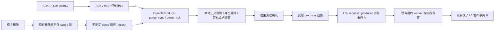

# 第四阶段：运行恢复与离线删除同步切片

2026-10-06；执行台账 revision 8；设计保持 v6.1.0。本次推进 T16/T17/T18/T23/T24：
多 producer 竞争、真实进程 SIGKILL 恢复、离线 outbox 删除同步。以上任务保持 IN_PROGRESS；
有限目标/多发布 manifest、索引 outbox、通用资源刷新及完整备份恢复仍未完成，M0/M1 不作整体验收声明。

## 架构与职责

| 所有者 | 职责 |
| --- | --- |
| `capture/producer.py` | 原有会话身份、连续接收游标、严格同步启用门；追加前检查删除水位 |
| `capture/purge.py` | 同 scope 控制协议、分页与确认、缺失日志/倒退水位拒绝；撤销会话仍可领取清理指令 |
| `operations/sqlite_purge.py` / PostgreSQL `purge.py` | 同删除事务内记录身份日志、分页、未知离线来源身份阻断 |
| SDK `durable.py` | 宿主本地队列、迁移、追加/投递与在途清理守卫 |
| SDK `durable_purge.py` | 响应校验、本地多会话清理与游标事务、失败重试；不持有服务端写入权限 |
| `ports.py` 与双后端 UoW | 复用原事务与 scope 锁，增加 purge head/page/source identity 端口 |

不新增服务或任务队列。宿主会话注册仍是可信代码接口，不向模型提供注册、换 epoch 或重新标记旧输入的工具。
`memory_durable` 沿用 SDK/MCP 可信 scope/actor 解析，新增 `purge_sync` 和 `purge_ack` 操作。

## 协议与数据边界

1. 宿主注册 `DurableProducer.open(..., sync_purges=True)`，并使用 `DurableOutbox(..., sync_purges=True)`。
   两端都显式启用；旧模式默认不变，旧会话不能用相同 producer ID 静默改变配置。
2. 对象删除记录指定来源身份，包含尚未接收到的离线身份；scope 删除增加 epoch 并记录整域标记。
   日志仅含 scope 分区键、cursor、身份、epoch、mode，不含正文或引文。archive 同样阻断原身份再次捕获。
3. `producer-purge/1` 每页最多 128 项；返回会话/当前 epoch、scope key、after/through/head、closed 与 entries。
   scope/actor/token 不匹配拒绝；已经撤销的会话仅可进行清理控制，追加权限仍被撤销。
4. SDK 在读取待传正文前同步到 closed；每页的正文清理、身份 hash 屏障、会话撤销和本地 cursor 同事务提交，
   然后发清理确认。确认丢失时重启从本地已提交 cursor 继续确认，不重新发送已清理来源。
5. 同一文件中已经认证绑定该 scope 的旧会话一起清理。新 epoch 同步收到整域日志也清理更早 epoch，
   不删除同 epoch 的新授权输入。未绑定的旧会话在自身重连时完成绑定与清理。
6. 本地 purged 身份 hash 在整个 outbox 文件内生效，复制到新会话不能恢复原 event ID。
   这是保守的宿主身份约束：同文件中不同 scope 也不复用已清理的 event ID。
7. 严格 producer 在确认水位落后于当前删除 head 时拒绝追加。未知但已被日志指向的来源不能获得接收 ticket。
   SDK 对响应身份、scope、epoch、连续 cursor、closed 与确认水位逐项校验，异常不派发正文。
8. 日志有缺口、请求/已确认 cursor 超过 head 时返回 `purge_history_unavailable`。
   这能检测有已知水位的倒退或缺失；不能识别所有状态一起回退且没有外部对照的旧备份。
9. 默认单次同步最多 32 页，可显式设置 1–1000；超限报错并停止投递。既有 pending 容量和 producer gap 上限保留。
   清理掉但从未接收的 sequence 仍是接收缺口，不伪造 ack；例如 sequence 2 成功仍可显示 acked_through=0。
   长期缺口的显式取消处置/流滚动仍待后续合同，不能把旧正文改身份或换 epoch 自动重传。

清理确认是可信宿主对本地清理的声明，不是磁盘删除的密码学证明。保证范围是服务端日志与参与同步的本地 outbox；
外部复制、其他缓存、磁盘快照、未接入客户端和外部模型缓存不在本切片的完整擦除证明内。
并发删除在同步后发生时，服务端事务中的水位/来源/epoch 检查仍阻止接收；已经开始的网络传输无法被追溯撤销。

## 真实进程终止恢复

测试子进程使用独立数据库连接，父进程在明确边界发送 SIGKILL，随后打开新执行路径恢复：

| 强杀边界 | 已验证结果 |
| --- | --- |
| 事务 A 更新 producer 游标但尚未提交 | L0、request、游标全部回滚；原输入可接收一次 |
| 事务 A 提交后、响应前 | L0/request/cursor 全部保留；重传返回原重复回执 |
| worker 领取并提交租约后 | 未到期不能重复领取，到期恢复；只生成一次 |
| 阶段结果保存后 | 恢复复用阶段，不再次生成 |
| L1 发布事务尚未提交 | 整个发布回滚；用保存阶段恢复原子发布 |
| L1 发布事务提交后、worker 完成确认前 | 已完成结果可查，不再次生成或发布 |
| 保存阶段后强杀，恢复前删除来源 | request 取消，阶段正文清除，不再领取或发布 |

这是应用进程强杀和真实双后端测试，不声明数据库服务器断电、主机断电、供应商网络派发或完整备份回放已验证。

## 迁移、启用与回滚

- SQLite 初始化增量创建 purge 表；PostgreSQL 新增 `009_purge_journal.sql`，初始化执行既有迁移流程。
  SDK 本地表增量增加 purge_cursor/scope_key/epoch 与身份 hash 表；旧会话 hash 和原 sequence 身份不变。
- 成组更新 core、PostgreSQL provider、SDK；先停旧删除/写入进程，防止旧代码删除正文却未写新日志。
  未启用严格模式的宿主保持原兼容行为，不因此宣称完整多设备删除同步。
- 新日志不回填升级前的对象删除历史。已有已知 source/ticket tombstone 继续守卫服务器，
  但旧版本未记录的未知离线对象删除不能从现有表凭空重建。严格同步保证从日志部署后开始；
  接入历史设备前需宿主回放其权威删除记录，缺记录时不宣称该历史范围已完成同步。
- 保留 purge 日志，不做未经验证的日志裁剪。备份恢复后，在恢复生产读取/上传前回放外部权威最新删除事实；
  完整备份 replay 工具与验收仍待开发。仅检测 cursor 回退不能替代该流程。
- 回滚使用与旧程序匹配的部署前备份和清理记录，不单独降级程序继续使用新状态；
  不删除本地 tombstone 或将旧 session 强行标为可用。

## 验证与后续

专项：双后端 6 producer 跨连接竞争、乱序与重复接收；对象/scope 删除前同步、MCP 通道、分页绑定、
清理确认丢失、本地/服务端事务回滚、清理期间上传确认、同文件多 epoch 会话、缺失日志和响应拒绝。
可运行示例：`python examples/durable_purge.py`，旧离线正文清理后只接收新 sequence 2，真实缺口仍保留。

全量 **1129 passed，5 skipped**；跳过项为可选 tiktoken 未安装。新增 34 项删除/竞争测试和 14 项真实进程恢复测试。
core、PostgreSQL provider、SDK wheel 已逐文件核对最终源码，且 migration 009 已入包。
最终结果、构建包和源码指纹见 [validation-stage-04.json](validation-stage-04.json)。
下一步先补有限目标与多发布 manifest、显式取消 sequence 处置及就绪合同，再接索引/派生 outbox 与备份删除日志回放。
真实领域 gold/校准继续按 [next-steps.md](next-steps.md) 推进，不能用上述可靠性测试替代抽取质量。
