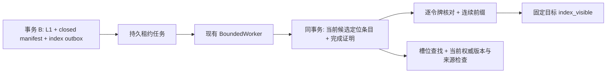

# 第六阶段：本地候选索引 outbox 与连续发布覆盖

2026-10-06；执行台账 revision 10；设计保持 v6.1.0。本次推进 T16/T18/T22 的索引切片。
启用范围是可信宿主显式选择的 `candidate-locator/1` 本地身份索引；T16/T18/T22 保持 IN_PROGRESS。
正文全文索引、向量索引、外部供应商、派生知识与通用刷新调度不因此启用。
按用户要求仅运行新增专项和受影响接口回归，不执行全量测试。

## 架构和事务

| 所有者 | 职责 |
| --- | --- |
| `operations/extraction_worker.py` | 把索引通道加入处理配置指纹；事务 B 内一起发布 L1、闭合清单、登记索引任务 |
| `operations/indexing.py` | 通道身份、幂等入队、租约/重试、候选定位索引、完成证明和连续覆盖；复用 BoundedWorker |
| `operations/readiness.py` | 冻结目标时绑定索引通道；检查现有来源、epoch、修订与清单后委托索引阶段判断 |
| `capture/producer.py` | 宿主选择通道与合同发现；SDK/MCP 沿用既有 finite target/status/wait 接口 |
| `ports.py` 的 `CandidateIndexUnitOfWork` | 独立可选索引端口，继承既有来源/接纳事务合同；不导入存储实现 |
| SQLite `operations/sqlite_index.py` / PostgreSQL `index.py` | 同连接保存任务与身份条目，按 scope/channel/epoch 隔离，按槽位建立真实数据库索引 |
| 两后端 retention/admission 删除路径 | 在原删除事务中移除来源、候选/Claim 及同槽连带失效的定位条目、任务和证明 |

任务幂等键为 publication token，另外在同一 namespace 锁内分配 scope/channel/epoch 的提交序号。
该序号属于索引发布流，不能当作 producer 接收序号或全库提交顺序。事务 B 任一步失败，L1、
清单和索引任务一起回滚；已保存抽取阶段保留用于重试。未启用通道时旧处理指纹保持不变。

消费者在有效租约下重新读取当前权威候选，而不复制入队时的旧正文/版本。
索引只保存 `candidate_id/event_id/slot_key/record_version`。已拒绝、撤回或来源不再可用的候选移除定位条目；
待核验/争议候选可以有身份条目，但不能据此成为事实。调用者仍通过已有资格、条件和双时态投影取得事实。
`lookup` 返回身份候选，重新核对当前版本和当前来源，不返回正文或 Claim；超出指定上限明确失败，不能静默截断。

条目更新与完成证明一起提交。证明是发布坐标、处置和实际应用条目的完整性摘要，
不是授权签名，也不允许仅凭 job.status=completed 宣称就绪。每次 readiness 仍检查实际条目与当前权威记录。
原任务晚于新解释执行时会应用当前版本，不回写旧版本。通用非发布更新尚无自动刷新，过期条目由读取守卫过滤，
就绪查询阻断；需要宿主后续受支持发布/重处理或未来刷新合同修复。

## 有限目标与连续覆盖

宿主使用同一 `CandidateIndexChannel("local")` 配置 producer、处理指纹与 DurableAtomHandler。
通道名称、schema/version 构成稳定身份，变更通道会改变处理配置和有限目标 ID。
目标中的通道保存在服务端不可变记录中，后续更换宿主配置不能把另一通道的完成记录用于旧目标。
合同发现返回所选通道；未配置通道、旧历史缺索引清单或不认识的通道版本明确 unsupported。

`durable_readiness(..., stage="index_visible")` / `durable_wait_until` 沿用原认证和等待边界：

- 目标所有 publication manifest 必须闭合；空未闭合清单是 processing。
- 所有目标令牌必须有绑定一致的持久任务、有效完成证明和实际可用的当前定位条目。
- `continuous_visible_through` 只跨过逐项核验的连续前缀；`target_visible_through` 是目标发布的固定序号上界。
  只有目标令牌全部进入该连续前缀才 reached，不能用完成的最大序号替代。
- `applied_publication_ids` 报告已实际应用的目标令牌；`covered_publication_ids` 只报告进入连续覆盖的目标令牌；
  返回未覆盖集合、阻断序号和索引状态/尝试次数。序号 2 先完成而 1 未完成时，连续水位仍为 0，
  即使有限目标只选择 2，也不能提前 reached。
- 失败/取消的前缀不能伪装为索引可见：目标需要跨越该位置时 failed；完成证明或实际条目不一致时 blocked。
  本切片没有等价权威回退或跳过处置协议；旧取消位置可能阻断该流后续目标，不能自动换 epoch/身份绕过。
- 确实闭合零发布且通道绑定有效时，明确 `no_outputs=true/no_indexable_outputs=true`，无需虚构索引任务。
  全部待决/拒绝的处置仍有 publication token，要完成相应索引处置；`no_indexable_outputs` 指没有新 Claim，
  不等于没有候选身份条目，也不证明有新的合格事实可查。
- 后来的独立 append/reprocess 不加入原目标，也不提高其固定上界；连续水位可以额外报告后来已完成的进度。
  原来源被删除/修订时旧目标 blocked；scope erase 撤销旧 producer session。

旧 `durable_status` 和 extraction queue.status 保留兼容字段，不用于认证新索引阶段；应使用新的有限目标 readiness。
observation_covered/view_covered 仍 unsupported。多个请求可汇总多个发布令牌；单请求多次物理发布和显式 reprocess
目标入口仍待实现。

## 运行、迁移与恢复

SQLite initialize 增量创建 `index_jobs/index_documents`；PostgreSQL 增加 `011_candidate_index.sql`。
成组升级 core 与 PostgreSQL provider，执行 initialize，再显式配置通道及匹配处理指纹；停止不认识该合同的旧写入进程。
不为旧已完成请求猜测回填完成证明；需要新受支持的处理发布。SDK/MCP 无新增传输协议或后台调度服务。

任务领取原子化，租约至少 5 秒，默认失败重试 2 秒、最多 3 次；索引写入失败重试不重复抽取。
每 scope/channel/epoch 最多 128 个活跃索引任务、100000 个任务账本记录；超限阻断整个事务 B，留下可恢复的抽取阶段。
槽位 lookup 默认为 128 个候选，支持 1–128；超限明确返回 index_lookup_capacity。
历史扫描和逐项证明有明确边界，但尚未声称大规模恒定成本；增量水位、压缩和空间迁移留给 T40。

来源、候选或 Claim 删除在同事务中清除定位条目并取消相关任务；同槽连带失效也清理其他来源任务中的 applied/proof。
删除后旧 lease 无法提交；清理失败整笔删除事务回滚；scope 删除另外提升 epoch。
最小任务身份/处置保留用于恢复，applied/proof/lease_token 被清理，不保留正文。
数据库备份恢复仍须配合权威最新删除日志，完整回放工具待后续 T23/T24；禁止直接恢复旧备份后重跑旧任务。
索引完成确认丢失可以重查/重复确认；进程在提交前被杀时等待旧租约到期再领取，提交后被杀不重复创建条目/任务。

回滚必须使用匹配二进制、配置和权威删除记录的部署前备份，不能在新通道写入后单独降级旧 worker 继续执行。

## 验证与后续

新增 50 项双后端行为测试，包含 SQLite 和真实 PostgreSQL 的事务回滚、连续缺口、配置隔离、背压、
等待/失败、删除、旧租约、完成证明损坏、当前权威版本守卫，以及真实 SIGKILL 的索引提交前后恢复。
这些只证明受控本地合同，不替代实际领域 gold、外部 ACL 或模型质量验收。
最终相关回归 **283 passed，0 skipped**；新增 50 项行为测试和 1 项架构检查，
重复专项不另加计数。core/PostgreSQL wheel 逐文件匹配最终源码，migration 011 已入包。
相关回归范围、源码/构建指纹见 [validation-stage-06.json](validation-stage-06.json)。
示例：仓库虚拟环境执行 `python examples/index_readiness.py`。

下一步继续 T17/T18/T22 的显式 reprocess 目标入口、单请求多发布/运行中新工作与刷新合同，
以及终止缺口的显式修复/rollover；随后完成 T23/T24 权威删除日志备份回放。详见 [next-steps.md](next-steps.md)。
