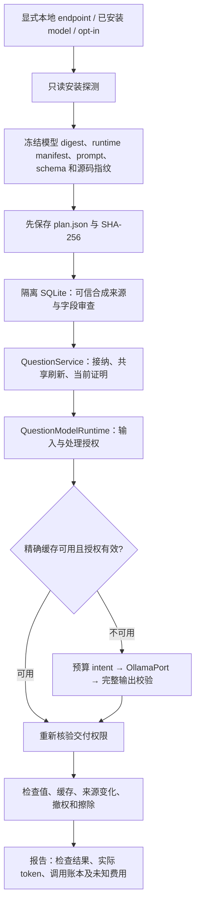

# 本地真实 Ollama 验证入口 — 2026-10-09

本轮完成 AM70-T12 的**真实本地模型运行验证切片**：增加独立验证命令，使用实际
`OllamaPort`、接纳账本、问题刷新、处理授权、精确缓存和费用账本。输入为作者编写的
合成事实，不能替代许可留出数据、真实业务质量、A9 全成本比较或 Q7-32 发布验收。
T02/T12/T13/T15 仍为 IN_PROGRESS；其他 11 项保持原有已声明范围的 DONE。

## 模块和数据流

唯一新增运行模块为 `evaluation/ollama_smoke.py`。生产代码不导入评测模块，普通问题回答
仍无需模型；没有新数据库表、生产 API、自动启用开关或另一套记忆存储。



验证顺序固定为九组：

1. 负责人、状态、承诺、风险四类结构化问题读取，生成调用为零；空集检查完整候选范围。
2. 首次模型回答；同时请求负责人，共享一次生成，各有独立交付授权。
3. 四类问题重复读取，命中精确缓存。
4. 使用同一数据库重建 repository/service/model runtime，仍复用原缓存与 call ID。
5. 撤回 Alice 的资格并加入 Carol；旧视图拒绝读取，重建后新生成。
6. 更新授权证明、业务值保持 Carol；视图走 proof_reuse，模型缓存键改变并新生成。
7. 撤销模型接收方处理授权；拒绝缓存交付，不产生新调用。
8. 恢复处理授权；按新版本重新生成。
9. 物理擦除 Carol 来源；依赖模型缓存正文被清除，后续交付拒绝且没有新调用。

## 运行命令

要求 Python 3.13+、已经安装且运行的本地 Ollama，以及指定的已安装模型。命令不会下载模型。
endpoint 必须显式带端口且为 loopback；不接受凭据、路径、query、fragment、远程地址、代理或重定向。
每次使用新的输出文件名，已有 plan/report 不覆盖。

```sh
python -m agent_memory.evaluation.ollama_smoke \
  --endpoint http://127.0.0.1:11434 \
  --model qwen3.5:9b \
  --output /tmp/ollama-smoke.json \
  --allow-real-model --timeout-seconds 60
```

CLI 先只读探测并保存 `/tmp/ollama-smoke.plan.json`，再创建临时数据库和执行调用。
返回码 0 仅表示 `passed_synthetic_runtime_smoke`；冻结配置改变、供应商失败、输出错误或检查失败
返回非零。失败报告保留已记录调用/费用责任，异常正文不进入报告。数据库在正常结束或已捕获的
失败后清理；进程强杀、操作系统崩溃与取消不是本入口的恢复验收，既有持久模型恢复另见 B5。

## 实际证据

前序整合代码为 `cdca16eef72bca4b38346acb6c168e91c196daf0`；本轮新增源码的精确指纹由
[执行前计划](validation-ollama-smoke-2026-10-09.plan.json)记录，不把旧 B6 全量成绩当作本轮全量测试。
模型安装 digest 为 `6488c96fa5faab64bb65cbd30d4289e20e6130ef535a93ef9a49f42eda893ea7`，
Ollama 服务版本 `0.32.14`。实际服务器、模型、上下文上限、模板和运行配置均绑定在计划中，
每次生成沿用生产端口的前后安装核验。

- [本地真实生成报告](validation-ollama-smoke-2026-10-09.json)：9 组检查通过，实际 7 次生成。
- [专项及受影响回归](validation-ollama-smoke-regression.json)：SQLite、隔离 PostgreSQL 17.11、
  HTTP 协议、模型治理、token/费用合同、架构及台账一致性；371 通过、零 skip/失败/错误，无全量测试。
  核心 wheel 构建、新入口逐字节核对和全新无依赖安装/CLI help 检查通过。
- 模型返回的 token 数和 duration 只证明本次调用的供应商计数；不能据此推断 GPU 能耗、
  真实费用、总成本或业务质量。全部实际账目保持 `reconciliation_pending`，金额为未知。

模型收到的输入包含本轮合成来源和完整问题证明；模板不修改事实权威。输出有严格 JSON 形状校验，
另用固定合成预期检查值。没有运行真实原文抽取、条件/例外质量评测、时间边界真实模型矩阵、
全套对抗样本、外部裁判或多模型比较。byte bound 不代表精确 tokenizer 上限；Ollama tag 核验
也不提供原子不可变服务器执行。这些仍按现有 B5 合同声明。

## 后续顺序

1. 项目页面后台维护后续已由[运行时修复](runtime-repairs.md)接入共享调度、父依赖、租约和统一预算；该修复有独立证据，不计入本次模型 smoke。
2. 按许可数据、冻结 gold/裁判/阈值准备真实 A9 对照；接入本机观测及有凭据的资源费率。
3. 分别验收 T02/T12/T13/T15；只有质量、全请求/有效回答两种成本分母及安全门全部满足时，
   才讨论效果和发布。没有资料的外部门继续显式开放。

移除或不调用这个评测入口即可停止新增验证调用；生产能力和默认行为保持现有合同。
设计正文和 44 项 AM61 状态保持原样，版本索引只同步当前执行进度。
